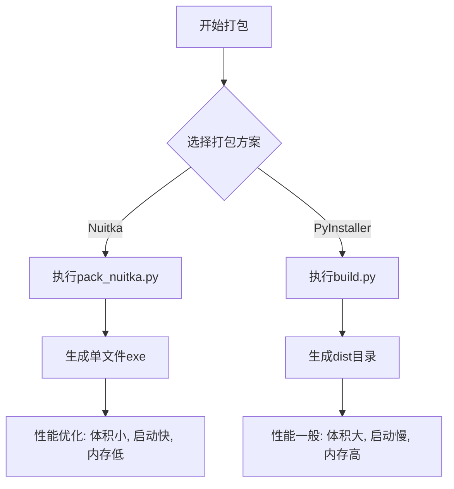
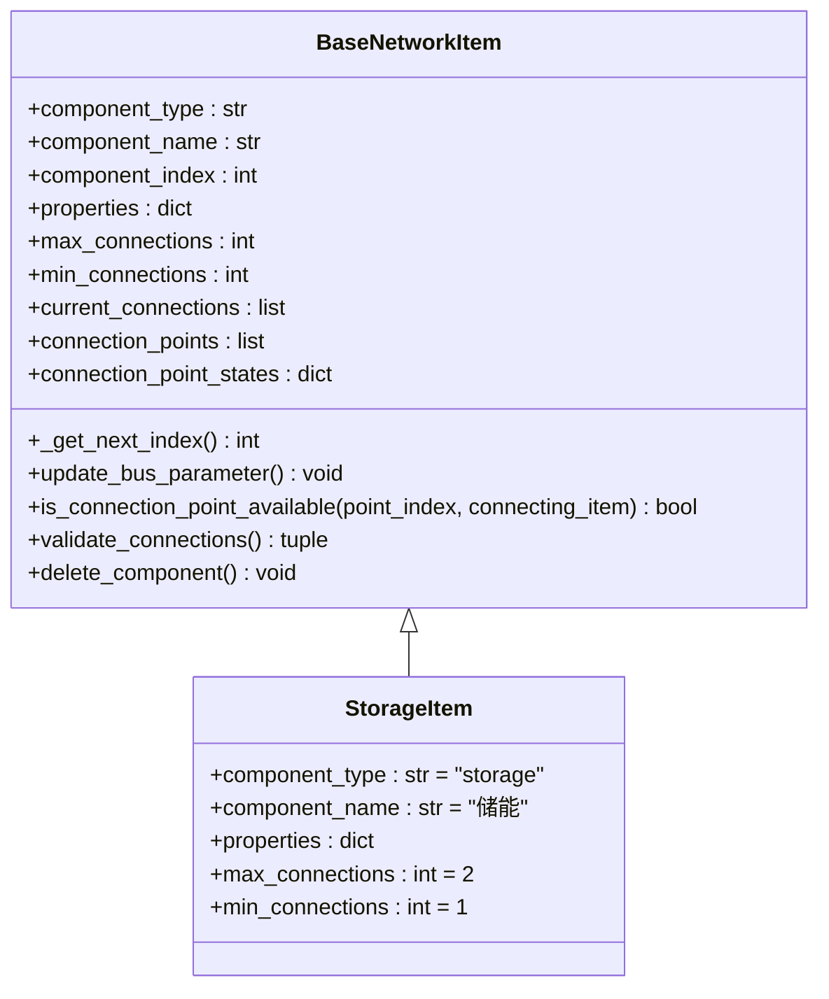

# 开发指南

<cite>
**本文档中引用的文件**  
- [README.md](file://README.md)
- [create_connections.py](file://create_connections.py)
- [performance_report.md](file://performance_report.md)
- [network_items.py](file://src/components/network_items.py)
- [component_palette.py](file://src/components/component_palette.py)
- [app_config.toml](file://src/app_config.toml)
- [requirements.txt](file://requirements.txt)
- [grid_connect_test.py](file://tests/grid_connect_test.py)
- [build.py](file://build.py)
- [pack_nuitka.py](file://pack_nuitka.py)
</cite>

## 目录
1. [简介](#简介)
2. [测试用例运行指南](#测试用例运行指南)
3. [开发辅助工具：create_connections.py](#开发辅助工具create_connectionspy)
4. [代码风格与提交规范](#代码风格与提交规范)
5. [性能优化建议](#性能优化建议)
6. [添加新的电网元件类型](#添加新的电网元件类型)
7. [测试覆盖率的重要性](#测试覆盖率的重要性)

## 简介

本开发指南旨在为贡献者提供全面的开发支持，涵盖测试运行、工具使用、代码规范、性能优化以及功能扩展等方面。项目基于PySide6和pandapower构建，提供拖拽式电网拓扑图构建功能，支持电网建模、分析与仿真。

**Section sources**
- [README.md](file://README.md#L1-L48)

## 测试用例运行指南

要验证核心功能，开发者应运行项目中的测试用例。虽然`test_simple.py`文件未在当前环境中找到，但存在其他测试文件如`grid_connect_test.py`，可用于验证pandapower核心功能。

`grid_connect_test.py`测试文件展示了如何使用pandapower创建电网网络、添加母线、外部电网、发电机和负载，并执行潮流计算。该测试验证了在启用和禁用外部电网时系统的功率分配情况。

要运行测试，请确保已安装所有依赖项，然后执行：
```bash
python tests/grid_connect_test.py
```

此测试将输出发电机和负载的功率值，验证仿真逻辑的正确性。

**Section sources**
- [grid_connect_test.py](file://tests/grid_connect_test.py#L1-L19)

## 开发辅助工具：create_connections.py

`create_connections.py`脚本是一个自动化工具，用于根据拓扑数据文件生成组件间的连接关系。该脚本读取`topology_test.json`文件，分析其中的开关、变压器、线路、负载、光伏、储能、充电桩和电表等设备，并自动生成相应的连接关系，最终将结果保存到`topology_one_level_with_connections.json`文件中。

脚本的主要功能包括：
- **开关连接处理**：根据开关的`et`字段（设备类型）和`element`字段（设备索引），生成开关与母线、线路、变压器等设备的连接。
- **变压器连接处理**：生成高压侧和低压侧母线与变压器的连接。
- **线路连接处理**：生成起始和终止母线与线路的连接。
- **负载类设备连接处理**：为负载、光伏、储能、充电桩等设备生成与母线的连接。
- **电表连接处理**：根据电表的测量对象类型（如母线、线路、变压器等），生成电表与相应设备的连接。

该脚本作为开发辅助工具，可帮助开发者快速构建复杂的电网拓扑结构，减少手动配置的工作量。

**Section sources**
- [create_connections.py](file://create_connections.py#L1-L198)

## 代码风格与提交规范

开发者应遵循以下代码风格和提交规范以确保代码质量和一致性：

1. **代码格式化**：使用`black`进行代码格式化，确保代码风格统一。相关依赖已在`requirements.txt`中声明。
2. **类型注解**：使用Python类型注解提高代码可读性和可维护性。
3. **文档字符串**：为所有模块、类和函数提供清晰的文档字符串，说明其功能、参数和返回值。
4. **提交信息**：提交信息应简洁明了，遵循"类型: 描述"的格式，例如"feat: 添加储能组件"、"fix: 修复连接点状态管理"、"docs: 更新开发指南"。
5. **分支管理**：使用功能分支进行开发，完成开发后通过Pull Request合并到主分支。
6. **依赖管理**：使用`conda`环境进行依赖管理，确保开发环境的一致性。环境配置文件为`environment.yml`。

**Section sources**
- [requirements.txt](file://requirements.txt#L1-L27)
- [app_config.toml](file://src/app_config.toml#L1-L13)

## 性能优化建议

根据`performance_report.md`中的性能对比报告，Nuitka打包方案在文件体积、启动速度和内存占用方面均优于PyInstaller方案。建议采用Nuitka进行打包以提升应用性能。

具体优化建议如下：
- **打包方案**：使用`pack_nuitka.py`脚本进行打包，生成单文件可执行程序，显著减小文件体积（预计从736MB降至200MB以下）。
- **启动时间**：Nuitka方案可将冷启动时间从5.0秒缩短至3.0秒，热启动时间从2.5秒缩短至1.5秒，提升约40%。
- **内存占用**：Nuitka方案可将静态内存占用从120MB降低至90MB，降低约25%。
- **代码保护**：Nuitka将Python字节码编译为机器码，提供天然的代码混淆和保护。

开发者在发布版本时应使用`pack_nuitka.py`脚本进行构建，以获得最佳性能表现。



**Diagram sources**
- [performance_report.md](file://performance_report.md#L1-L39)
- [pack_nuitka.py](file://pack_nuitka.py#L1-L291)
- [build.py](file://build.py#L1-L277)

## 添加新的电网元件类型

开发者可以通过以下步骤添加新的电网元件类型：

1. **定义新类**：在`src/components/network_items.py`文件中，继承`BaseNetworkItem`基类定义新的电网元件类。例如，`StorageItem`类的实现展示了如何定义储能组件。
2. **设置组件属性**：在新类的构造函数中设置`component_type`、`component_name`、`properties`等属性，并调用`_get_next_index()`获取唯一索引。
3. **配置连接约束**：设置`max_connections`和`min_connections`属性以定义连接数量限制。
4. **加载SVG图标**：使用`load_svg()`方法加载组件的SVG图标文件，确保图标文件位于`src/assets`目录下。
5. **添加到组件面板**：在`src/components/component_palette.py`文件的`add_components()`方法中，将新组件添加到组件列表中，指定其名称、类型和图标文件。
6. **处理pandapower表示**：在模型中实现新组件与pandapower的映射关系，确保可以在pandapower网络中创建相应的元件。

通过以上步骤，开发者可以轻松扩展电网元件类型，丰富应用的功能。



**Diagram sources**
- [network_items.py](file://src/components/network_items.py#L1-L800)
- [component_palette.py](file://src/components/component_palette.py#L1-L168)

## 测试覆盖率的重要性

测试覆盖率是衡量代码质量的重要指标。高测试覆盖率可以确保核心功能的稳定性和可靠性，减少回归错误的发生。开发者在添加新功能或修改现有代码时，应同步更新或添加相应的测试用例。

本项目中的测试用例（如`grid_connect_test.py`）验证了pandapower核心功能的正确性。开发者应确保所有关键路径都有相应的测试覆盖，特别是电网连接、潮流计算、设备参数更新等核心逻辑。

建议使用`pytest`框架进行测试，并结合代码覆盖率工具（如`coverage.py`）来评估测试覆盖率。目标是达到90%以上的代码覆盖率，确保代码的健壮性和可维护性。

**Section sources**
- [grid_connect_test.py](file://tests/grid_connect_test.py#L1-L19)
- [requirements.txt](file://requirements.txt#L20-L22)