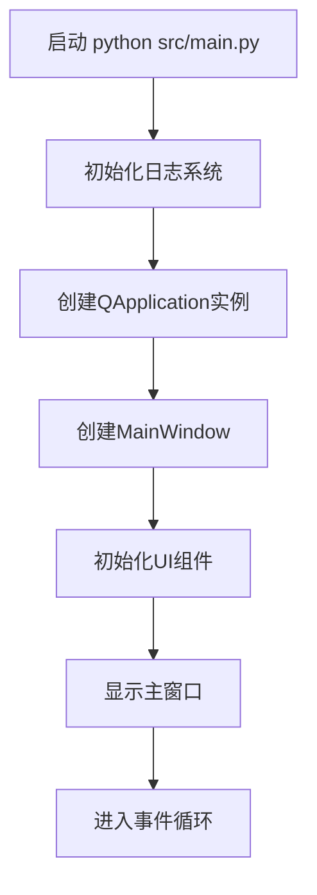
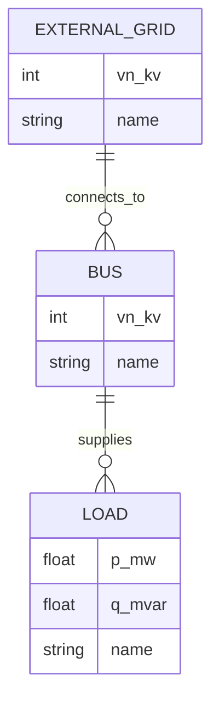

# 快速入门

<cite>
**本文档引用的文件**  
- [README.md](file://README.md)
- [requirements.txt](file://requirements.txt)
- [src/main.py](file://src/main.py)
- [src/config.py](file://src/config.py)
- [src/components/main_window.py](file://src/components/main_window.py)
- [BUILD_README.md](file://BUILD_README.md)
</cite>

## 目录
1. [简介](#简介)
2. [环境搭建](#环境搭建)
3. [依赖安装](#依赖安装)
4. [启动应用](#启动应用)
5. [首次运行界面行为](#首次运行界面行为)
6. [常见问题排查](#常见问题排查)
7. [Hello World 示例：最小电网拓扑](#hello-world-示例最小电网拓扑)
8. [总结](#总结)

## 简介

本指南旨在帮助新用户快速上手PandaPower仿真工具。该工具基于PySide6和pandapower库，提供直观的拖拽式界面来构建和分析电网拓扑。通过本指南，您将学习如何设置开发环境、安装依赖、启动应用，并完成一次简单的潮流计算。

**Section sources**
- [README.md](file://README.md#L1-L48)

## 环境搭建

为了确保项目稳定运行，推荐使用conda创建隔离的Python环境。以下是详细的环境搭建步骤：

### 使用 Conda 创建环境

根据项目文档，建议使用`environment.yml`文件来创建一致的开发环境。虽然该文件无法直接读取，但可以从`BUILD_README.md`和`requirements.txt`中推断其内容。

```bash
# 使用 environment.yml 创建环境（推荐）
conda env create -f environment.yml

# 激活 pandapower_sim 环境
conda activate pandapower_sim
```

如果`environment.yml`文件不可用，您可以手动创建环境：

```bash
# 手动创建环境
conda create -n pandapower_sim python=3.10
conda activate pandapower_sim
conda install -c conda-forge pyside6 pandapower numpy pandas matplotlib pyinstaller
```

**Section sources**
- [README.md](file://README.md#L22-L28)
- [BUILD_README.md](file://BUILD_README.md#L13-L20)

## 依赖安装

项目依赖分为conda安装的主依赖和pip安装的精确版本依赖。`requirements.txt`文件提供了所有依赖的精确版本号，确保环境一致性。

### 安装 requirements.txt 中的依赖

在激活的conda环境中，使用pip安装`requirements.txt`中的依赖：

```bash
# 激活环境
conda activate pandapower_sim

# 安装项目依赖
pip install -r requirements.txt
```

`requirements.txt`中包含以下关键依赖：
- **python==3.10.18**: Python解释器版本
- **pyside6==6.9.1**: GUI框架
- **pandapower==3.1.2**: 电网建模与分析核心库
- **numpy==2.2.6, pandas==2.3.1**: 数据处理基础库
- **pyinstaller==6.15.0**: 打包可执行文件

**Section sources**
- [requirements.txt](file://requirements.txt#L1-L27)
- [README.md](file://README.md#L47)

## 启动应用

完成环境配置和依赖安装后，即可启动应用。

### 启动命令

在项目根目录下执行以下命令：

```bash
python src/main.py
```

此命令将启动PandaPower仿真工具的主程序。`src/main.py`是应用的入口文件，负责初始化日志、创建Qt应用实例和主窗口。

**Section sources**
- [README.md](file://README.md#L33-L35)
- [src/main.py](file://src/main.py#L20-L72)

## 首次运行界面行为

启动应用后，您将看到一个完整的图形化界面，包含以下主要组件：

- **主窗口标题**: "PandaPower 仿真工具"
- **中央画布**: 用于拖拽和放置电网组件
- **左侧组件面板**: 包含各种电网元件（母线、线路、变压器、负载等）
- **右侧属性面板**: 显示选中组件的属性并允许编辑
- **菜单栏**: 提供文件操作（新建、打开、保存）等功能
- **状态栏**: 显示当前状态信息，如"就绪"

应用启动时会记录详细的日志信息，包括Python版本、工作目录和可执行文件路径。这些信息有助于调试和问题排查。



**Diagram sources**
- [src/main.py](file://src/main.py#L20-L72)
- [src/components/main_window.py](file://src/components/main_window.py#L98-L200)

**Section sources**
- [src/main.py](file://src/main.py#L20-L72)
- [src/components/main_window.py](file://src/components/main_window.py#L98-L200)

## 常见问题排查

在环境搭建和运行过程中，可能会遇到一些常见问题。以下是解决方案：

### 依赖版本冲突

**问题**: conda和pip安装的包版本冲突。

**解决方案**: 
1. 优先使用conda安装主要依赖（如PySide6、pandapower）
2. 使用pip安装conda无法提供的包或特定版本
3. 避免重复安装同一包

```bash
# 检查已安装的包
conda list pyside6
pip show pandapower
```

### PySide6 导入错误

**问题**: 启动时出现`ModuleNotFoundError: No module named 'PySide6'`。

**解决方案**:
1. 确认已激活正确的conda环境
2. 重新安装PySide6

```bash
conda activate pandapower_sim
conda install -c conda-forge pyside6
```

### 配置文件创建失败

**问题**: 启动时提示"创建配置文件失败"。

**解决方案**: 
- 此问题不影响程序运行，只是无法持久化配置
- 确保`tomli_w`模块已安装
- 检查程序是否有写入权限

### 打包相关问题

**问题**: 使用PyInstaller打包时失败。

**解决方案**:
1. 确保在`pandapower_sim`环境中
2. 检查PyInstaller是否已安装
3. 使用提供的`build.py`或`build.ps1`脚本

```bash
# 检查环境
conda activate pandapower_sim
conda list pyinstaller
```

**Section sources**
- [config.py](file://src/config.py#L46-L151)
- [BUILD_README.md](file://BUILD_README.md#L94-L107)

## Hello World 示例：最小电网拓扑

让我们创建一个最简单的电网示例，包含外部电网、母线和负载，并运行一次潮流计算。

### 创建最小拓扑

1. 启动应用后，在左侧组件面板中选择"外部电网"
2. 在中央画布上点击放置外部电网
3. 从组件面板选择"母线"，放置在画布上
4. 选择"负载"，放置在画布上
5. 使用连接工具将外部电网连接到母线，再将母线连接到负载

### 运行潮流计算

虽然UI层面的连接功能在`create_connections.py`中定义，但核心的潮流计算由pandapower库执行。以下是程序内部的逻辑流程：



**Diagram sources**
- [src/components/main_window.py](file://src/components/main_window.py#L113-L115)
- [src/config.py](file://src/config.py#L23-L36)

### 代码层面的实现

在代码中，这个过程通过`NetworkModel`类管理。当用户在UI上创建组件时，会调用pandapower的API创建相应的网络元素：

```python
# 伪代码示例：创建最小电网
import pandapower as pp

# 创建空网络
net = pp.create_empty_network()

# 创建母线
bus = pp.create_bus(net, vn_kv=20.0, name="Bus1")

# 创建外部电网连接到母线
pp.create_ext_grid(net, bus=bus, vm_pu=1.0, name="Grid Connection")

# 在母线上创建负载
pp.create_load(net, bus=bus, p_mw=1.0, q_mvar=0.5, name="Load1")

# 运行潮流计算
pp.runpp(net)

# 输出结果
print(net.res_bus)
print(net.res_ext_grid)
print(net.res_load)
```

**Section sources**
- [src/components/main_window.py](file://src/components/main_window.py#L23-L25)
- [src/config.py](file://src/config.py#L23-L36)

## 总结

本指南详细介绍了PandaPower仿真工具的快速入门流程。您已经学习了如何：
- 使用conda创建隔离的Python环境
- 安装项目依赖
- 启动应用并理解界面布局
- 排查常见问题
- 创建最小电网拓扑并理解其工作原理

现在您已经具备了使用该工具的基础知识，可以开始构建更复杂的电网模型并进行分析。建议参考项目中的JSON拓扑文件（如`topology.json`）来了解更复杂的电网结构。

**Section sources**
- [README.md](file://README.md#L1-L48)
- [requirements.txt](file://requirements.txt#L1-L27)