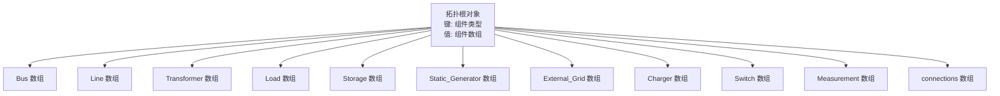
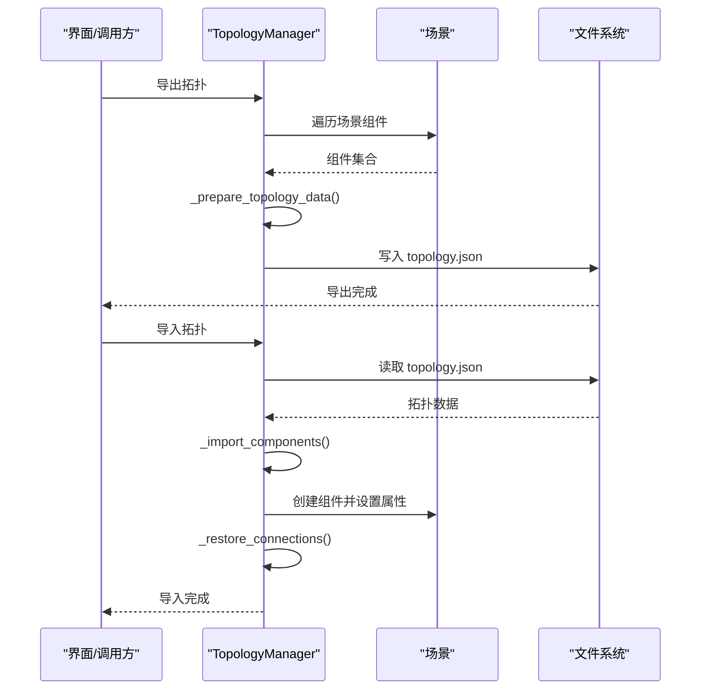
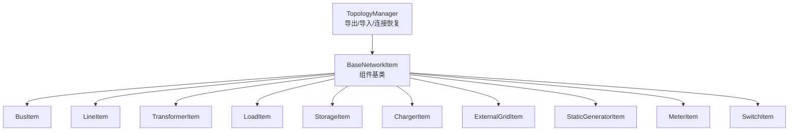

# 文件格式参考

<cite>
**本文引用的文件**
- [topology.json](file://topology.json)
- [topology_one_level.json](file://topology_one_level.json)
- [topology_one_level_with_connections.json](file://topology_one_level_with_connections.json)
- [topology_test.json](file://topology_test.json)
- [chuzhou_topology.json](file://chuzhou_topology.json)
- [network.json](file://network.json)
- [topology_utils.py](file://src/components/topology_utils.py)
- [network_items.py](file://src/components/network_items.py)
- [meter_dock_design.md](file://doc/meter_dock_design.md)
</cite>

## 目录
1. [简介](#简介)
2. [项目结构](#项目结构)
3. [核心组件](#核心组件)
4. [架构概览](#架构概览)
5. [详细组件分析](#详细组件分析)
6. [依赖分析](#依赖分析)
7. [性能考虑](#性能考虑)
8. [故障排查指南](#故障排查指南)
9. [结论](#结论)
10. [附录：JSON 结构规范与字段说明](#附录json-结构规范与字段说明)

## 简介
本文件为 pp_tool 的“拓扑 JSON 文件格式参考”，面向开发者与外部系统集成人员，系统性说明 topology.json 的结构与语义，包括根对象、各类型组件数组、以及组件之间的连接关系。文档以仓库中的示例文件与序列化/反序列化实现为依据，提供权威的结构化参考，并给出 JSON Schema 风格的表格化字段说明，便于快速对照与集成。

## 项目结构
pp_tool 的拓扑 JSON 文件用于描述电网拓扑结构，包含多种组件类型（母线、线路、变压器、负载、储能、静态发电机、外部电网、充电站、开关、电表等），以及它们之间的物理连接关系。拓扑 JSON 的根对象为一个对象，键为组件类型（如 "Bus"、"Line"、"Transformer" 等），值为该类型的组件数组；此外，某些示例文件还包含 "connections" 数组，用于显式声明组件之间的连接关系。

图表来源
- [topology.json](file://topology.json#L1-L524)
- [topology_one_level_with_connections.json](file://topology_one_level_with_connections.json#L1-L800)

章节来源
- [topology.json](file://topology.json#L1-L524)
- [topology_one_level_with_connections.json](file://topology_one_level_with_connections.json#L1-L800)

## 核心组件
- 根对象：键为组件类型字符串（如 "Bus"、"Line"、"Transformer" 等），值为该类型的组件对象数组。
- 组件对象：包含通用属性（如 geodata、name、index 等）与特定于组件类型的属性（如 bus、from_bus、to_bus、hv_bus、lv_bus 等）。
- 连接关系：在部分示例中，通过 "connections" 数组显式声明两个组件之间的连接；在其他示例中，连接关系由组件对象的 bus/from_bus/to_bus/hv_bus/lv_bus 等属性隐式表达。

章节来源
- [topology.json](file://topology.json#L1-L524)
- [topology_one_level_with_connections.json](file://topology_one_level_with_connections.json#L738-L800)

## 架构概览
拓扑 JSON 的导入/导出流程由 TopologyManager 实现，负责：
- 导出：遍历场景中的网络组件，按类型聚合为拓扑数据，写入 JSON 文件。
- 导入：读取 JSON 文件，按类型创建组件，恢复母线索引映射，再恢复组件间连接关系（含开关、线路、变压器、负载、电表等）。

图表来源
- [topology_utils.py](file://src/components/topology_utils.py#L193-L293)
- [topology_utils.py](file://src/components/topology_utils.py#L294-L460)
- [topology_utils.py](file://src/components/topology_utils.py#L461-L656)

章节来源
- [topology_utils.py](file://src/components/topology_utils.py#L193-L293)
- [topology_utils.py](file://src/components/topology_utils.py#L294-L460)
- [topology_utils.py](file://src/components/topology_utils.py#L461-L656)

## 详细组件分析

### 根对象与组件数组
- 根对象为一个 JSON 对象，键为组件类型字符串（例如 "Bus"、"Line"、"Transformer"、"Load"、"Storage"、"Static_Generator"、"External_Grid"、"Charger"、"Switch"、"Measurement"），值为该类型的组件对象数组。
- 示例文件展示了多种组件类型，且部分示例包含 "connections" 数组用于显式连接。

章节来源
- [topology.json](file://topology.json#L1-L524)
- [topology_one_level_with_connections.json](file://topology_one_level_with_connections.json#L1-L800)

### 节点（Bus）对象
- 属性要点
  - index：组件索引，通常为整数，用于唯一标识母线。
  - vn_kv：母线电压等级（kV）。
  - geodata：位置坐标数组 [x, y]。
  - name：母线名称。
  - custom_fields：扩展字段（可选）。
- 示例参考
  - [topology.json](file://topology.json#L466-L523)
  - [topology_one_level.json](file://topology_one_level.json#L223-L244)
  - [chuzhou_topology.json](file://chuzhou_topology.json#L162-L173)

章节来源
- [topology.json](file://topology.json#L466-L523)
- [topology_one_level.json](file://topology_one_level.json#L223-L244)
- [chuzhou_topology.json](file://chuzhou_topology.json#L162-L173)

### 线路（Line）对象
- 属性要点
  - index：线路索引。
  - geodata：位置坐标数组 [x, y]。
  - length_km、use_standard_type、std_type：线路长度与标准类型。
  - r_ohm_per_km、x_ohm_per_km、c_nf_per_km、r0_ohm_per_km、x0_ohm_per_km、c0_nf_per_km、max_i_ka：线路参数。
  - from_bus、to_bus：连接的两个母线索引。
  - name：线路名称。
  - custom_fields：扩展字段（可选）。
- 示例参考
  - [topology_test.json](file://topology_test.json#L140-L182)
  - [topology_one_level_with_connections.json](file://topology_one_level_with_connections.json#L140-L182)

章节来源
- [topology_test.json](file://topology_test.json#L140-L182)
- [topology_one_level_with_connections.json](file://topology_one_level_with_connections.json#L140-L182)

### 变压器（Transformer）对象
- 属性要点
  - index：变压器索引。
  - geodata：位置坐标数组 [x, y]。
  - use_standard_type、std_type：是否使用标准类型及类型名称。
  - sn_mva、vn_hv_kv、vn_lv_kv、vkr_percent、vk_percent、pfe_kw、i0_percent、vector_group：变压器参数。
  - hv_bus、lv_bus：高压侧与低压侧母线索引。
  - name：变压器名称。
  - custom_fields：扩展字段（可选）。
- 示例参考
  - [topology.json](file://topology.json#L329-L433)
  - [topology_test.json](file://topology_test.json#L228-L358)

章节来源
- [topology.json](file://topology.json#L329-L433)
- [topology_test.json](file://topology_test.json#L228-L358)

### 负载（Load）对象
- 属性要点
  - index：负载索引。
  - geodata：位置坐标数组 [x, y]。
  - p_mw、q_mvar：有功/无功功率。
  - name：负载名称。
  - bus：连接的母线索引。
  - custom_fields：扩展字段（可选）。
- 示例参考
  - [topology.json](file://topology.json#L453-L465)
  - [topology_test.json](file://topology_test.json#L1-L49)

章节来源
- [topology.json](file://topology.json#L453-L465)
- [topology_test.json](file://topology_test.json#L1-L49)

### 储能（Storage）对象
- 属性要点
  - index：储能索引。
  - geodata：位置坐标数组 [x, y]。
  - p_mw、max_e_mwh、soc_percent：功率、最大能量、SOC 百分比。
  - name：储能名称。
  - bus：连接的母线索引。
  - custom_fields：扩展字段（可选）。
- 示例参考
  - [topology.json](file://topology.json#L259-L328)
  - [topology_test.json](file://topology_test.json#L638-L719)

章节来源
- [topology.json](file://topology.json#L259-L328)
- [topology_test.json](file://topology_test.json#L638-L719)

### 静态发电机（Static_Generator）对象
- 属性要点
  - index：静态发电机索引。
  - geodata：位置坐标数组 [x, y]。
  - use_power_factor、p_mw、q_mvar、sn_mva、cos_phi、mode、scaling、type、in_service：发电参数与模式。
  - name：静态发电机名称。
  - bus：连接的母线索引。
  - custom_fields：扩展字段（可选）。
- 示例参考
  - [topology.json](file://topology.json#L169-L258)
  - [topology_test.json](file://topology_test.json#L536-L636)

章节来源
- [topology.json](file://topology.json#L169-L258)
- [topology_test.json](file://topology_test.json#L536-L636)

### 外部电网（External_Grid）对象
- 属性要点
  - index：外部电网索引（通常为 0）。
  - geodata：位置坐标数组 [x, y]。
  - vm_pu、va_degree：电压幅值与相角。
  - s_sc_max_mva、s_sc_min_mva、rx_max、rx_min：短路容量与阻抗参数。
  - bus：连接的母线索引。
  - custom_fields：扩展字段（可选）。
- 示例参考
  - [topology.json](file://topology.json#L435-L452)
  - [topology_test.json](file://topology_test.json#L720-L737)

章节来源
- [topology.json](file://topology.json#L435-L452)
- [topology_test.json](file://topology_test.json#L720-L737)

### 充电站（Charger）对象
- 属性要点
  - index：充电站索引。
  - geodata：位置坐标数组 [x, y]。
  - sn_mva、p_mw、efficiency：容量、功率与效率。
  - name：充电站名称。
  - bus：连接的母线索引。
  - custom_fields：扩展字段（可选）。
- 示例参考
  - [topology.json](file://topology.json#L103-L168)
  - [topology_test.json](file://topology_test.json#L458-L535)

章节来源
- [topology.json](file://topology.json#L103-L168)
- [topology_test.json](file://topology_test.json#L458-L535)

### 开关（Switch）对象
- 属性要点
  - index：开关索引。
  - geodata：位置坐标数组 [x, y]。
  - bus：连接的母线索引。
  - name：开关名称。
  - element、et、closed、in_ka：连接目标索引与类型、状态与额定电流。
  - custom_fields：扩展字段（可选）。
- 示例参考
  - [topology_test.json](file://topology_test.json#L184-L227)
  - [topology_one_level.json](file://topology_one_level.json#L189-L204)

章节来源
- [topology_test.json](file://topology_test.json#L184-L227)
- [topology_one_level.json](file://topology_one_level.json#L189-L204)

### 电表（Measurement）对象
- 属性要点
  - index：电表索引。
  - geodata：位置坐标数组 [x, y]。
  - meas_type：测量类型（如 "p" 表示有功功率）。
  - element_type：测量元件类型（如 "bus"、"ext_grid" 等）。
  - value、std_dev：测量值与标准偏差。
  - element：测量元件索引。
  - side：测量侧（可选）。
  - in_service：运行状态。
  - name、sn、brand、ip、port、protocol、baud_rate、parity：设备标识与通信参数。
  - bus：连接的母线索引（可选）。
  - custom_fields：扩展字段（可选）。
- 示例参考
  - [topology.json](file://topology.json#L1-L87)
  - [topology_test.json](file://topology_test.json#L360-L457)
  - [chuzhou_topology.json](file://chuzhou_topology.json#L1-L44)

章节来源
- [topology.json](file://topology.json#L1-L87)
- [topology_test.json](file://topology_test.json#L360-L457)
- [chuzhou_topology.json](file://chuzhou_topology.json#L1-L44)
- [meter_dock_design.md](file://doc/meter_dock_design.md#L56-L79)

### 连接关系（connections 数组）
- 用途：显式声明两个组件之间的连接关系，格式为包含 item1 与 item2 的对象。
- 命名约定：item1 与 item2 的值通常采用 "组件类型_索引" 的形式，如 "Bus_6"、"Switch_1" 等。
- 示例参考
  - [topology_one_level_with_connections.json](file://topology_one_level_with_connections.json#L738-L800)

章节来源
- [topology_one_level_with_connections.json](file://topology_one_level_with_connections.json#L738-L800)

## 依赖分析
拓扑 JSON 的导入/导出依赖于以下模块与类：
- TopologyManager：负责导出与导入、数据准备、索引映射、连接恢复。
- BaseNetworkItem/MeterItem 等：组件基类与具体组件类，提供属性结构与连接逻辑。
- network_items：包含各类组件类的定义与连接参数更新逻辑。
- topology_utils：提供拓扑管理与序列化/反序列化能力。

图表来源
- [topology_utils.py](file://src/components/topology_utils.py#L105-L185)
- [network_items.py](file://src/components/network_items.py#L1-L120)
- [network_items.py](file://src/components/network_items.py#L1230-L1282)

章节来源
- [topology_utils.py](file://src/components/topology_utils.py#L105-L185)
- [network_items.py](file://src/components/network_items.py#L1-L120)
- [network_items.py](file://src/components/network_items.py#L1230-L1282)

## 性能考虑
- 导入时的索引映射与连接恢复会遍历组件与连接关系，建议在大规模拓扑中：
  - 控制组件数量与连接密度，避免过长的连接恢复链。
  - 合理组织组件类型顺序，先创建母线，再创建其他组件，有助于减少连接恢复复杂度。
- 导出时的 JSON 写入为一次性操作，注意磁盘 I/O 与文件权限。

## 故障排查指南
- IP/端口唯一性校验
  - 导入/导出前会验证组件的 IP 与端口组合是否唯一，若重复或仅有单个字段有效，将弹窗提示并阻止继续。
  - 参考实现：[topology_utils.py](file://src/components/topology_utils.py#L21-L104)
- 连接关系异常
  - 若连接关系缺失或不正确，可通过 connections 数组补充，或在组件属性中修正 bus/from_bus/to_bus/hv_bus/lv_bus 等字段。
  - 参考连接恢复逻辑：[topology_utils.py](file://src/components/topology_utils.py#L461-L656)
- 组件类型与属性不匹配
  - 确保组件类型键与组件对象属性一致，避免遗漏必要字段（如 bus、from_bus、to_bus、hv_bus、lv_bus 等）。

章节来源
- [topology_utils.py](file://src/components/topology_utils.py#L21-L104)
- [topology_utils.py](file://src/components/topology_utils.py#L461-L656)

## 结论
拓扑 JSON 是 pp_tool 描述与交换电网拓扑的核心载体。通过明确的根对象结构、组件数组规范与连接关系表达方式，结合 TopologyManager 的序列化/反序列化实现，开发者可以稳定地导入/导出拓扑，并在外部系统中进行解析与集成。建议在实际使用中遵循本文档的字段规范与命名约定，确保兼容性与一致性。

## 附录：JSON 结构规范与字段说明

### 根对象
- 类型：对象
- 键：组件类型字符串（如 "Bus"、"Line"、"Transformer"、"Load"、"Storage"、"Static_Generator"、"External_Grid"、"Charger"、"Switch"、"Measurement"、"connections"）
- 值：数组（组件数组）或对象（连接关系数组）

章节来源
- [topology.json](file://topology.json#L1-L524)
- [topology_one_level_with_connections.json](file://topology_one_level_with_connections.json#L1-L800)

### 组件通用字段
- index：组件索引（整数或字符串，视组件类型而定）
- geodata：位置坐标数组 [x, y]
- name：组件名称
- custom_fields：扩展字段（可选）

章节来源
- [topology.json](file://topology.json#L1-L524)
- [topology_test.json](file://topology_test.json#L1-L738)

### 组件类型字段说明（按类型）

- Bus
  - 字段：index、vn_kv、geodata、name、custom_fields
  - 示例参考：[topology.json](file://topology.json#L466-L523)

- Line
  - 字段：index、geodata、length_km、use_standard_type、std_type、r_ohm_per_km、x_ohm_per_km、c_nf_per_km、r0_ohm_per_km、x0_ohm_per_km、c0_nf_per_km、max_i_ka、from_bus、to_bus、name、custom_fields
  - 示例参考：[topology_test.json](file://topology_test.json#L140-L182)

- Transformer
  - 字段：index、geodata、use_standard_type、std_type、sn_mva、vn_hv_kv、vn_lv_kv、vkr_percent、vk_percent、pfe_kw、i0_percent、vector_group、hv_bus、lv_bus、name、custom_fields
  - 示例参考：[topology.json](file://topology.json#L329-L433)

- Load
  - 字段：index、geodata、p_mw、q_mvar、name、bus、custom_fields
  - 示例参考：[topology.json](file://topology.json#L453-L465)

- Storage
  - 字段：index、geodata、p_mw、max_e_mwh、soc_percent、name、bus、custom_fields
  - 示例参考：[topology.json](file://topology.json#L259-L328)

- Static_Generator
  - 字段：index、geodata、use_power_factor、p_mw、q_mvar、sn_mva、cos_phi、mode、scaling、type、in_service、name、bus、custom_fields
  - 示例参考：[topology.json](file://topology.json#L169-L258)

- External_Grid
  - 字段：index、geodata、vm_pu、va_degree、s_sc_max_mva、s_sc_min_mva、rx_max、rx_min、bus、custom_fields
  - 示例参考：[topology.json](file://topology.json#L435-L452)

- Charger
  - 字段：index、geodata、sn_mva、p_mw、efficiency、name、bus、custom_fields
  - 示例参考：[topology.json](file://topology.json#L103-L168)

- Switch
  - 字段：index、geodata、bus、name、element、et、closed、in_ka、custom_fields
  - 示例参考：[topology_test.json](file://topology_test.json#L184-L227)

- Measurement（电表）
  - 字段：index、geodata、meas_type、element_type、value、std_dev、element、side、in_service、name、sn、brand、ip、port、protocol、baud_rate、parity、bus、custom_fields
  - 示例参考：[topology.json](file://topology.json#L1-L87)

### 连接关系（connections 数组）
- 结构：数组，元素为对象，包含 item1 与 item2 两个键
- 命名约定：item1 与 item2 的值为 "组件类型_索引" 的字符串，如 "Bus_6"、"Switch_1"
- 示例参考：[topology_one_level_with_connections.json](file://topology_one_level_with_connections.json#L738-L800)

### JSON Schema 风格字段表

- 根对象
  - keys: "Bus" | "Line" | "Transformer" | "Load" | "Storage" | "Static_Generator" | "External_Grid" | "Charger" | "Switch" | "Measurement" | "connections"
  - values: 数组（组件对象数组）或对象（连接关系数组）

- Bus
  - index: integer|string
  - vn_kv: number
  - geodata: [number, number]
  - name: string
  - custom_fields: object

- Line
  - index: integer|string
  - geodata: [number, number]
  - length_km: number
  - use_standard_type: boolean
  - std_type: string
  - r_ohm_per_km: number
  - x_ohm_per_km: number
  - c_nf_per_km: number
  - r0_ohm_per_km: number
  - x0_ohm_per_km: number
  - c0_nf_per_km: number
  - max_i_ka: number
  - from_bus: integer|string
  - to_bus: integer|string
  - name: string
  - custom_fields: object

- Transformer
  - index: integer|string
  - geodata: [number, number]
  - use_standard_type: boolean
  - std_type: string
  - sn_mva: number
  - vn_hv_kv: number
  - vn_lv_kv: number
  - vkr_percent: number
  - vk_percent: number
  - pfe_kw: number
  - i0_percent: number
  - vector_group: string
  - hv_bus: integer|string
  - lv_bus: integer|string
  - name: string
  - custom_fields: object

- Load
  - index: integer|string
  - geodata: [number, number]
  - p_mw: number
  - q_mvar: number
  - name: string
  - bus: integer|string
  - custom_fields: object

- Storage
  - index: integer|string
  - geodata: [number, number]
  - p_mw: number
  - max_e_mwh: number
  - soc_percent: number
  - name: string
  - bus: integer|string
  - custom_fields: object

- Static_Generator
  - index: integer|string
  - geodata: [number, number]
  - use_power_factor: boolean
  - p_mw: number
  - q_mvar: number
  - sn_mva: number
  - cos_phi: number
  - mode: string
  - scaling: number
  - type: string
  - in_service: boolean
  - name: string
  - bus: integer|string
  - custom_fields: object

- External_Grid
  - index: integer
  - geodata: [number, number]
  - vm_pu: number
  - va_degree: number
  - s_sc_max_mva: number
  - s_sc_min_mva: number
  - rx_max: number
  - rx_min: number
  - bus: integer|string
  - custom_fields: object

- Charger
  - index: integer|string
  - geodata: [number, number]
  - sn_mva: number
  - p_mw: number
  - efficiency: number
  - name: string
  - bus: integer|string
  - custom_fields: object

- Switch
  - index: integer|string
  - geodata: [number, number]
  - bus: integer|string
  - name: string
  - element: integer|string
  - et: "b"|"l"|"t"
  - closed: boolean
  - in_ka: number
  - custom_fields: object

- Measurement（电表）
  - index: integer|string
  - geodata: [number, number]
  - meas_type: string
  - element_type: string
  - value: number
  - std_dev: number
  - element: integer|string
  - side: null|string
  - in_service: boolean
  - name: string
  - sn: string
  - brand: string
  - ip: string
  - port: string
  - protocol: string
  - baud_rate: number
  - parity: string
  - bus: integer|string
  - custom_fields: object

- connections 数组
  - item1: string
  - item2: string

章节来源
- [topology.json](file://topology.json#L1-L524)
- [topology_test.json](file://topology_test.json#L1-L738)
- [topology_one_level_with_connections.json](file://topology_one_level_with_connections.json#L738-L800)
- [topology_utils.py](file://src/components/topology_utils.py#L294-L460)
- [network_items.py](file://src/components/network_items.py#L1230-L1282)