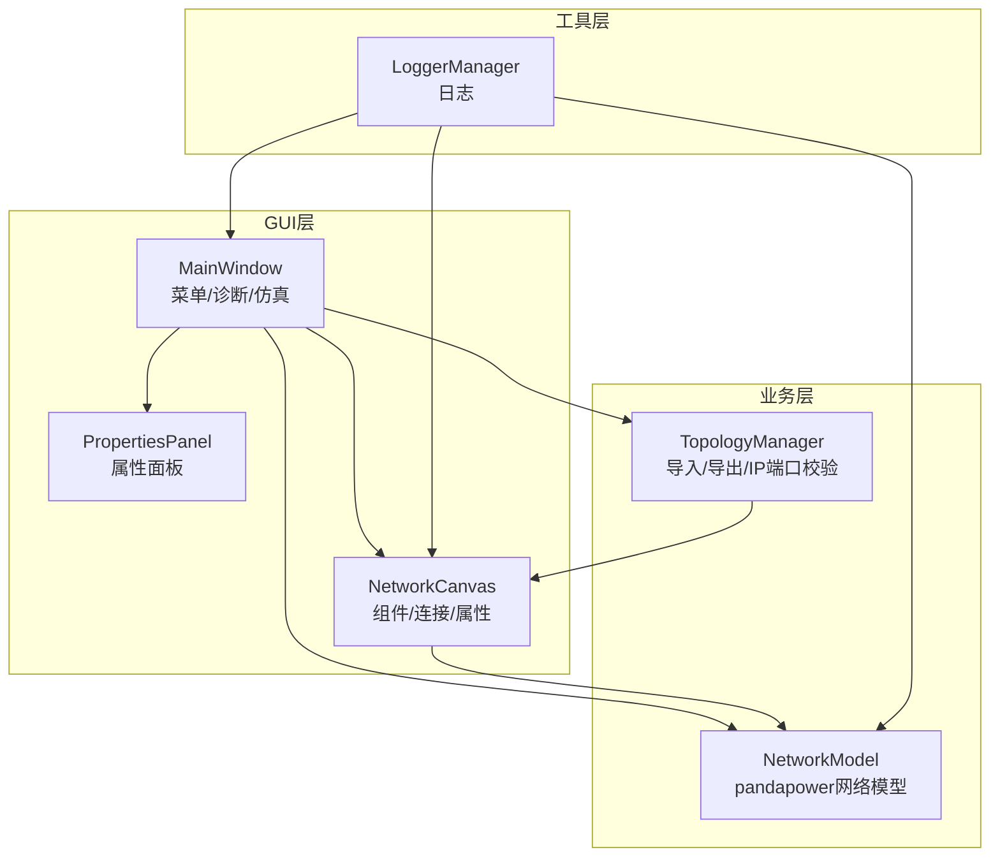
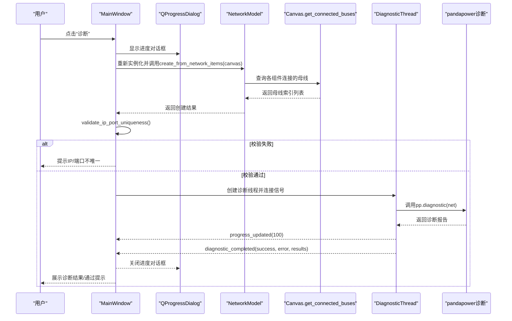
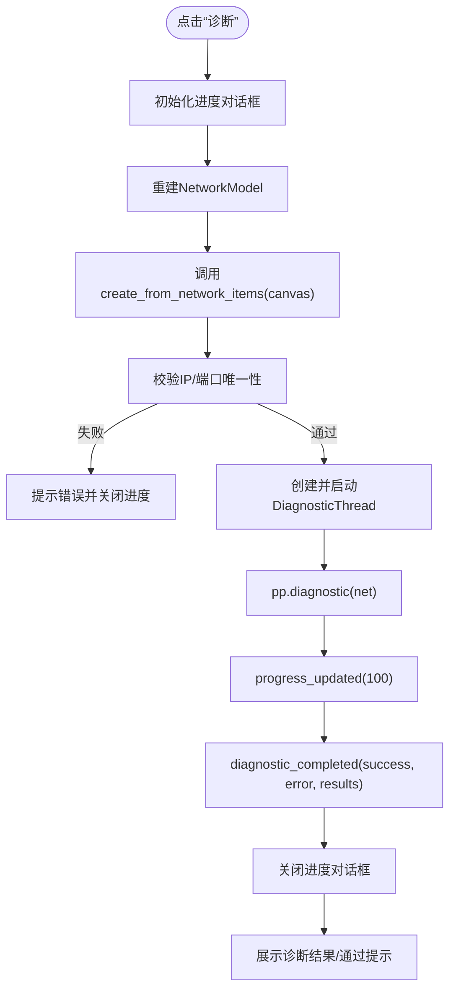
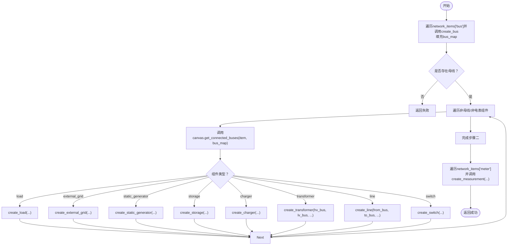
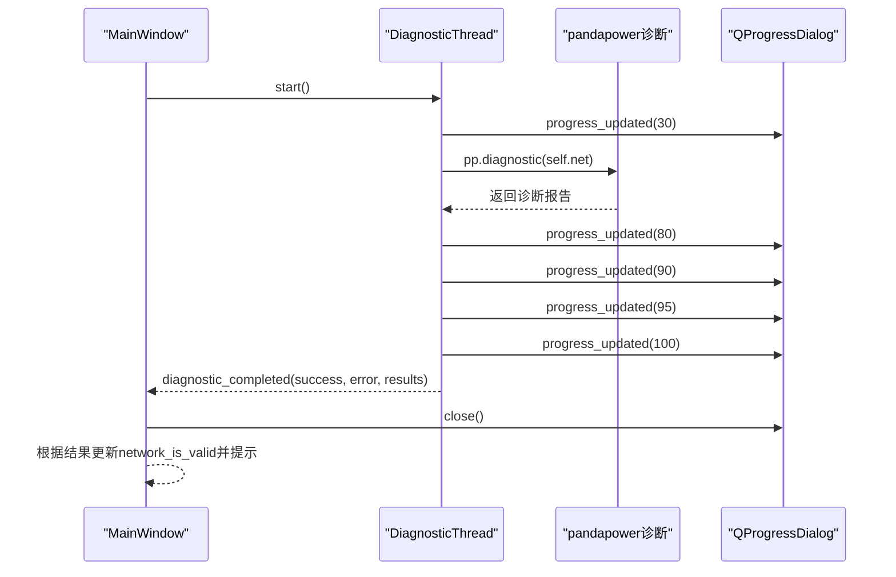
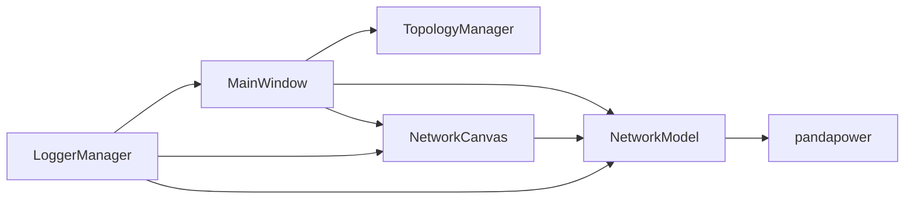

# 仿真数据流

<cite>
**本文引用的文件**
- [src/components/main_window.py](file://src/components/main_window.py)
- [src/models/network_model.py](file://src/models/network_model.py)
- [src/components/canvas.py](file://src/components/canvas.py)
- [src/components/topology_utils.py](file://src/components/topology_utils.py)
- [src/utils/logger.py](file://src/utils/logger.py)
</cite>

## 目录
1. [简介](#简介)
2. [项目结构](#项目结构)
3. [核心组件](#核心组件)
4. [架构总览](#架构总览)
5. [详细组件分析](#详细组件分析)
6. [依赖分析](#依赖分析)
7. [性能考虑](#性能考虑)
8. [故障排查指南](#故障排查指南)
9. [结论](#结论)

## 简介
本文件围绕“诊断”菜单的仿真数据流展开，系统性说明从用户点击“诊断”，到MainWindow如何启动诊断线程，再到NetworkModel如何基于画布状态创建pandapower网络模型的全过程。重点解释：
- MainWindow类的diagnostic_network方法如何组织诊断流程；
- NetworkModel类的create_from_network_items方法如何遍历network_items字典并创建pandapower网络；
- bus_map映射在组件连接中的作用；
- create_bus、create_line等创建方法如何把图形组件转换为pandapower元件；
- 诊断线程的执行序列与时序图；
- diagnostic_completed信号如何将诊断结果返回给主窗口。

## 项目结构
本项目采用分层设计：GUI层（主窗口、画布、组件面板）、业务层（拓扑管理、网络模型）、工具层（日志）。与仿真数据流直接相关的核心文件如下：
- 主窗口与诊断线程：src/components/main_window.py
- 网络模型与pandapower创建：src/models/network_model.py
- 画布与连接关系：src/components/canvas.py
- 拓扑导入导出与IP端口校验：src/components/topology_utils.py
- 日志：src/utils/logger.py

图表来源
- [src/components/main_window.py](file://src/components/main_window.py#L95-L170)
- [src/components/canvas.py](file://src/components/canvas.py#L16-L60)
- [src/components/topology_utils.py](file://src/components/topology_utils.py#L17-L40)
- [src/models/network_model.py](file://src/models/network_model.py#L1-L40)
- [src/utils/logger.py](file://src/utils/logger.py#L1-L40)

章节来源
- [src/components/main_window.py](file://src/components/main_window.py#L95-L170)
- [src/components/canvas.py](file://src/components/canvas.py#L16-L60)
- [src/components/topology_utils.py](file://src/components/topology_utils.py#L17-L40)
- [src/models/network_model.py](file://src/models/network_model.py#L1-L40)
- [src/utils/logger.py](file://src/utils/logger.py#L1-L40)

## 核心组件
- MainWindow：提供菜单入口（诊断/仿真模式），负责组织诊断流程、进度反馈、结果展示与线程生命周期管理。
- DiagnosticThread：诊断线程，封装pandapower诊断调用，通过信号向主线程汇报进度与结果。
- NetworkModel：封装pandapower网络模型创建，提供create_bus、create_line、create_transformer、create_load、create_storage、create_charger、create_external_grid、create_static_generator、create_switch、create_measurement等创建方法，并提供create_from_network_items从画布构建网络。
- NetworkCanvas：承载图形组件、维护connections连接关系，提供get_connected_buses查询某组件连接到的母线集合。
- TopologyManager：导入/导出拓扑、校验IP端口唯一性，辅助诊断前置检查。
- LoggerManager：统一日志输出，便于定位问题。

章节来源
- [src/components/main_window.py](file://src/components/main_window.py#L28-L110)
- [src/models/network_model.py](file://src/models/network_model.py#L1-L60)
- [src/components/canvas.py](file://src/components/canvas.py#L250-L272)
- [src/components/topology_utils.py](file://src/components/topology_utils.py#L21-L104)
- [src/utils/logger.py](file://src/utils/logger.py#L1-L40)

## 架构总览
下图展示了“诊断”菜单触发后的整体数据流：主窗口解析画布状态，构建NetworkModel，随后启动诊断线程，最终将诊断结果回传至主窗口并提示用户。

图表来源
- [src/components/main_window.py](file://src/components/main_window.py#L346-L415)
- [src/models/network_model.py](file://src/models/network_model.py#L407-L581)
- [src/components/canvas.py](file://src/components/canvas.py#L255-L271)
- [src/components/topology_utils.py](file://src/components/topology_utils.py#L21-L98)

## 详细组件分析

### MainWindow与诊断流程
- 菜单入口：在菜单栏添加“诊断”动作，绑定到diagnostic_network方法。
- 进度管理：使用QProgressDialog显示诊断进度，逐步推进到100。
- 网络模型重建：每次诊断前重新实例化NetworkModel，确保清空旧结构。
- create_from_network_items调用：将画布上的network_items字典转换为pandapower网络。
- IP端口唯一性校验：调用TopologyManager.validate_ip_port_uniqueness进行前置检查。
- 诊断线程：创建DiagnosticThread，连接progress_updated、diagnostic_completed、error_occurred信号，启动线程。
- 结果处理：根据diagnostic_completed信号展示诊断结果或通过提示；错误时展示警告并清理线程资源。

图表来源
- [src/components/main_window.py](file://src/components/main_window.py#L346-L415)
- [src/components/topology_utils.py](file://src/components/topology_utils.py#L21-L98)

章节来源
- [src/components/main_window.py](file://src/components/main_window.py#L28-L110)
- [src/components/main_window.py](file://src/components/main_window.py#L346-L415)
- [src/components/topology_utils.py](file://src/components/topology_utils.py#L21-L98)

### NetworkModel与bus_map映射
- bus_map：在create_from_network_items中创建，用于将图形BusItem对象映射到pandapower母线索引，保证后续组件连接时能正确引用母线。
- 步骤一：遍历network_items['bus']，逐个调用create_bus创建母线，并将BusItem对象与pandapower母线索引存入bus_map。
- 步骤二：遍历非母线、非电表的组件，调用canvas.get_connected_buses(item, bus_map)获取连接的母线索引，再调用对应创建方法（如create_load、create_transformer、create_line等）。
- 步骤三：最后创建电表，确保所有其他设备已创建完毕。

图表来源
- [src/models/network_model.py](file://src/models/network_model.py#L407-L581)
- [src/components/canvas.py](file://src/components/canvas.py#L255-L271)

章节来源
- [src/models/network_model.py](file://src/models/network_model.py#L407-L581)
- [src/components/canvas.py](file://src/components/canvas.py#L255-L271)

### create_bus、create_line等创建方法
- create_bus：根据properties创建pandapower母线，返回母线索引。
- create_line：根据properties中的from_bus、to_bus与std_type或自定义参数创建pandapower线路。
- create_transformer：根据hv_bus、lv_bus与std_type或自定义参数创建pandapower变压器。
- create_load：根据use_power_factor选择create_load_from_cosphi或create_load。
- create_storage：创建储能设备。
- create_charger：创建充电站（作为可控负载，索引与负载区分）。
- create_external_grid：创建外部电网。
- create_static_generator：创建静态发电机（光伏）。
- create_switch：创建开关。
- create_measurement：创建电表测量。

章节来源
- [src/models/network_model.py](file://src/models/network_model.py#L19-L409)

### 诊断线程与信号交互
- DiagnosticThread.run：执行pp.diagnostic(net)，期间通过progress_updated发射进度，最终通过diagnostic_completed或error_occurred返回结果。
- MainWindow.diagnostic_network：连接线程信号，更新进度对话框，处理完成与错误回调，清理线程资源。
- 诊断结果：若诊断报告包含错误字段，主窗口以警告形式提示；若无错误，标记network_is_valid为True。

图表来源
- [src/components/main_window.py](file://src/components/main_window.py#L28-L110)
- [src/components/main_window.py](file://src/components/main_window.py#L346-L415)
- [src/models/network_model.py](file://src/models/network_model.py#L1-L40)

章节来源
- [src/components/main_window.py](file://src/components/main_window.py#L28-L110)
- [src/components/main_window.py](file://src/components/main_window.py#L346-L415)
- [src/models/network_model.py](file://src/models/network_model.py#L1-L40)

## 依赖分析
- MainWindow依赖NetworkModel、TopologyManager、NetworkCanvas、QProgressDialog、QMessageBox等。
- NetworkModel依赖pandapower接口，内部封装各类create_*方法。
- NetworkCanvas维护connections与连接点，提供get_connected_buses查询母线索引。
- TopologyManager提供IP/端口唯一性校验，辅助诊断前置检查。
- LoggerManager贯穿各模块，统一日志输出。

图表来源
- [src/components/main_window.py](file://src/components/main_window.py#L95-L170)
- [src/models/network_model.py](file://src/models/network_model.py#L1-L40)
- [src/components/canvas.py](file://src/components/canvas.py#L16-L60)
- [src/components/topology_utils.py](file://src/components/topology_utils.py#L21-L98)
- [src/utils/logger.py](file://src/utils/logger.py#L1-L40)

章节来源
- [src/components/main_window.py](file://src/components/main_window.py#L95-L170)
- [src/models/network_model.py](file://src/models/network_model.py#L1-L40)
- [src/components/canvas.py](file://src/components/canvas.py#L16-L60)
- [src/components/topology_utils.py](file://src/components/topology_utils.py#L21-L98)
- [src/utils/logger.py](file://src/utils/logger.py#L1-L40)

## 性能考虑
- 线程安全：诊断线程使用Python原生threading模块，守护线程避免阻塞主线程；主线程通过信号更新UI，避免直接共享可变状态。
- 网络模型重建：每次诊断前重建NetworkModel，确保旧网络结构被清空，避免历史数据干扰。
- 连接查询：canvas.get_connected_buses通过bus_map快速定位母线索引，减少遍历成本。
- 日志：统一日志输出，便于定位性能瓶颈与异常。

[本节为通用指导，无需特定文件引用]

## 故障排查指南
- 诊断未通过：检查diagnostic_completed回调中的results，若包含“error”键，按提示修复网络连接或参数。
- IP/端口不唯一：TopologyManager.validate_ip_port_uniqueness会在导入/导出或诊断前校验，出现重复或不完整配置时会弹窗提示。
- 线程资源泄露：MainWindow在错误或完成时均断开信号连接并停止线程，确保资源回收。
- 日志定位：查看日志文件（按日期命名），关注create_from_network_items、create_*方法调用与异常堆栈。

章节来源
- [src/components/main_window.py](file://src/components/main_window.py#L416-L466)
- [src/components/topology_utils.py](file://src/components/topology_utils.py#L21-L98)
- [src/utils/logger.py](file://src/utils/logger.py#L1-L108)

## 结论
本文从用户操作“诊断”出发，梳理了MainWindow组织诊断流程、NetworkModel基于画布状态创建pandapower网络、DiagnosticThread执行诊断并回传结果的完整数据流。bus_map映射确保图形组件与pandapower元件的正确关联，create_*系列方法将图形属性转换为pandapower参数。通过信号驱动与日志体系，系统实现了清晰、可追踪、可扩展的仿真数据流。