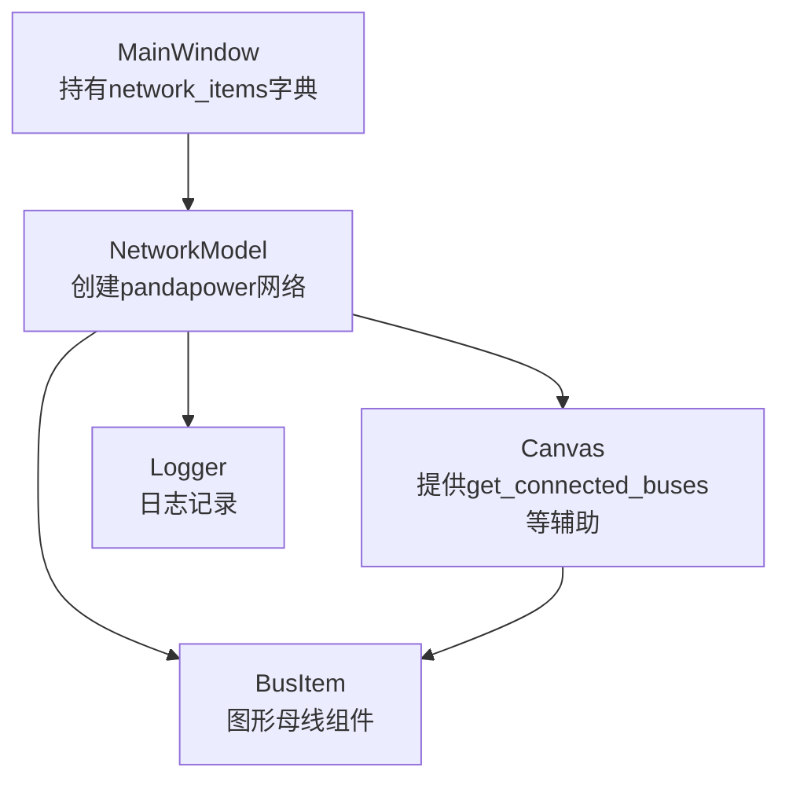
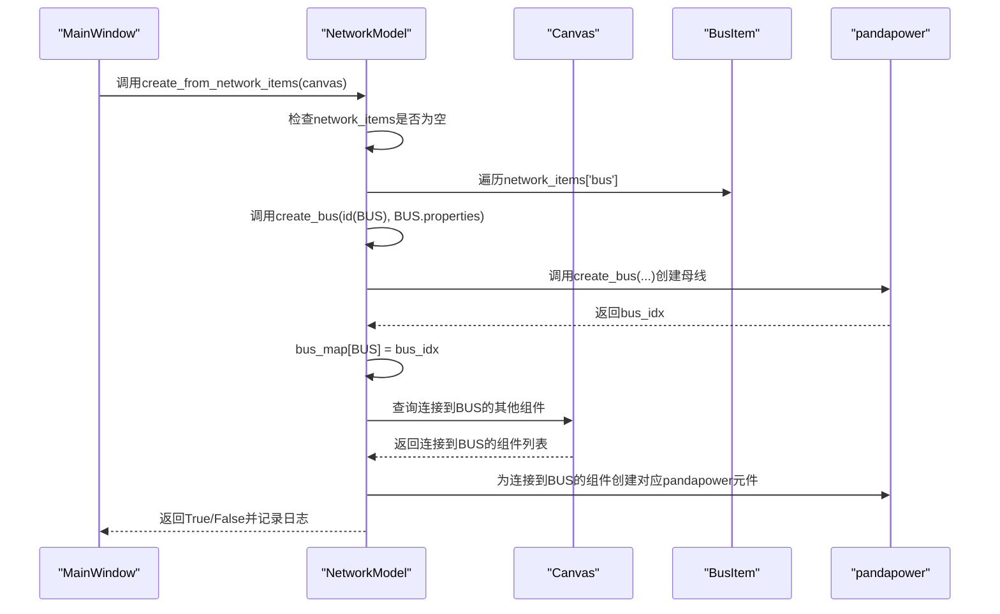
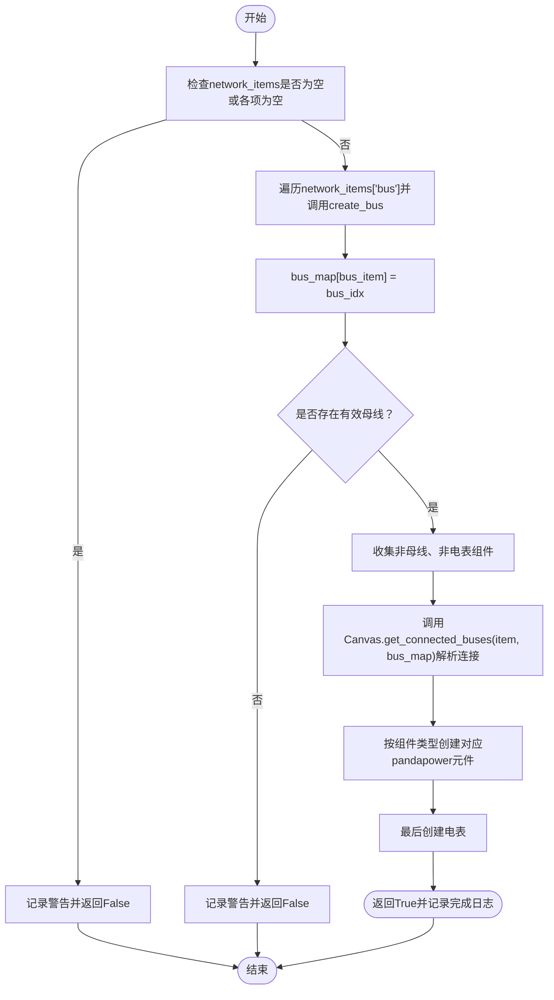
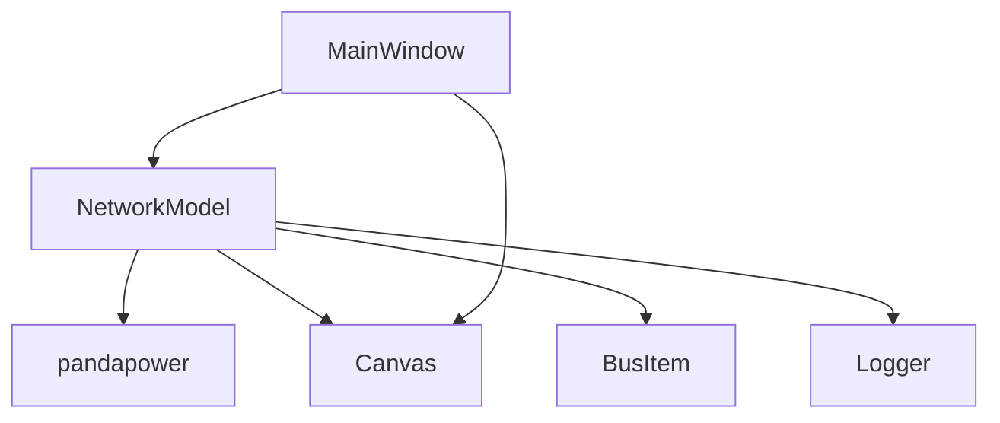

# 母线创建流程

<cite>
**本文引用的文件**
- [src/models/network_model.py](file://src/models/network_model.py)
- [src/components/network_items.py](file://src/components/network_items.py)
- [src/components/canvas.py](file://src/components/canvas.py)
- [src/components/main_window.py](file://src/components/main_window.py)
- [src/utils/logger.py](file://src/utils/logger.py)
</cite>

## 目录
1. [简介](#简介)
2. [项目结构](#项目结构)
3. [核心组件](#核心组件)
4. [架构总览](#架构总览)
5. [详细组件分析](#详细组件分析)
6. [依赖关系分析](#依赖关系分析)
7. [性能考量](#性能考量)
8. [故障排查指南](#故障排查指南)
9. [结论](#结论)

## 简介
本文件聚焦于pp_tool中“母线创建流程”的完整实现，围绕NetworkModel类的create_from_network_items方法展开，详细说明：
- 如何遍历network_items字典中的bus组件；
- 如何调用create_bus方法创建pandapower母线；
- bus_map映射表的创建与维护机制；
- 如何通过id(bus_item)作为唯一标识符将图形界面的母线组件与pandapower母线索引进行关联；
- create_bus方法如何从母线属性中提取vn_kv、name、type等参数并调用pandapower的create_bus函数；
- 母线创建失败时的错误处理机制和日志记录方式；
- 在没有有效母线组件时的早期返回逻辑。

## 项目结构
与母线创建流程直接相关的模块与职责如下：
- src/models/network_model.py：提供NetworkModel类，负责从图形项构建pandapower网络模型，包含create_bus与create_from_network_items等关键方法。
- src/components/network_items.py：定义BusItem等图形组件类，提供component_type、component_index、properties等属性，以及连接点管理逻辑。
- src/components/canvas.py：提供NetworkCanvas类，负责组件创建、连接管理、以及get_connected_buses等辅助方法，支撑create_from_network_items的连接解析。
- src/components/main_window.py：主窗口管理类，持有network_items字典并初始化NetworkModel，触发网络诊断与仿真流程。
- src/utils/logger.py：提供统一的日志记录接口，贯穿各模块的错误与信息记录。

图表来源
- [src/components/main_window.py](file://src/components/main_window.py#L94-L116)
- [src/models/network_model.py](file://src/models/network_model.py#L407-L582)
- [src/components/canvas.py](file://src/components/canvas.py#L255-L271)
- [src/components/network_items.py](file://src/components/network_items.py#L909-L939)
- [src/utils/logger.py](file://src/utils/logger.py#L1-L108)

章节来源
- [src/components/main_window.py](file://src/components/main_window.py#L94-L116)
- [src/models/network_model.py](file://src/models/network_model.py#L407-L582)
- [src/components/canvas.py](file://src/components/canvas.py#L255-L271)
- [src/components/network_items.py](file://src/components/network_items.py#L909-L939)
- [src/utils/logger.py](file://src/utils/logger.py#L1-L108)

## 核心组件
- NetworkModel.create_from_network_items(canvas)
  - 作用：从图形项集合network_items中创建pandapower网络模型，分阶段处理母线、连接到母线的组件、以及电表。
  - 关键步骤：
    - 早期返回：若network_items为空或各项均为空，记录警告并返回False。
    - 第一步：遍历network_items['bus']，逐个调用create_bus，建立bus_map映射（图形BusItem对象到pandapower母线索引）。
    - 第二步：收集非母线、非电表组件，查询Canvas的连接关系，按组件类型调用相应创建方法。
    - 第三步：最后创建电表，确保所有其他设备已创建。
  - 错误处理：任一环节捕获异常并记录错误日志，返回False；个别组件创建失败时继续处理其他组件，避免中断整体流程。
  - 日志记录：使用logger.info/warning/error记录关键步骤与异常。

- NetworkModel.create_bus(item_id, properties)
  - 作用：从母线属性中提取vn_kv、name、type等参数，调用pandapower的create_bus函数创建母线，并返回pandapower母线索引。
  - 参数说明：
    - item_id：图形项的唯一标识符，使用id(bus_item)保证跨生命周期稳定。
    - properties：包含vn_kv、name、type、index、in_service、max_vm_pu、min_vm_pu等键。
  - 返回：pandapower母线索引。

- Canvas.get_connected_buses(item, bus_map)
  - 作用：根据Canvas的connections与bus_map，返回与指定组件相连的母线索引列表，供后续组件创建时定位母线。

- BusItem
  - 作用：图形母线组件，提供component_type="bus"、component_index（自增索引）、properties（含vn_kv、name、index等）。
  - 连接点：定义在原点处，便于与其他组件连接。

章节来源
- [src/models/network_model.py](file://src/models/network_model.py#L19-L41)
- [src/models/network_model.py](file://src/models/network_model.py#L407-L582)
- [src/components/canvas.py](file://src/components/canvas.py#L255-L271)
- [src/components/network_items.py](file://src/components/network_items.py#L909-L939)

## 架构总览
下图展示从图形界面到pandapower网络模型的创建路径，重点标注母线创建阶段与bus_map映射关系。

图表来源
- [src/components/main_window.py](file://src/components/main_window.py#L370-L410)
- [src/models/network_model.py](file://src/models/network_model.py#L407-L582)
- [src/components/canvas.py](file://src/components/canvas.py#L255-L271)
- [src/components/network_items.py](file://src/components/network_items.py#L909-L939)

## 详细组件分析

### 母线创建流程（create_from_network_items）
- 早期返回逻辑
  - 若network_items为空或任意键对应的字典为空，记录警告日志并返回False，避免无意义的创建过程。
- bus_map映射表
  - 在第一步创建母线前初始化空字典，用于记录“图形BusItem对象 -> pandapower母线索引”的映射。
  - 在每次成功创建母线后，将bus_map[bus_item] = bus_idx写入映射表。
  - 若没有任何母线被创建，记录警告并返回False，确保后续流程不会在无母线的情况下继续。
- create_bus调用链
  - 遍历network_items['bus']，对每个BusItem调用create_bus(id(bus_item), bus_item.properties)。
  - create_bus内部从properties中读取vn_kv、name、type、index、in_service、max_vm_pu、min_vm_pu等参数，调用pandapower的create_bus函数创建母线并返回bus_idx。
- 连接解析与组件创建
  - 第二步收集非母线、非电表组件，调用Canvas.get_connected_buses(item, bus_map)获取连接到母线的索引列表，再按组件类型调用相应创建方法（如create_load、create_external_grid、create_static_generator、create_storage、create_charger、create_transformer、create_line、create_switch）。
- 电表创建
  - 第三步最后创建电表，确保所有其他设备已创建，避免测量对象指向未知索引。
- 错误处理与日志
  - 任一环节捕获异常并记录错误日志，返回False；个别组件创建失败时继续处理其他组件，避免中断整体流程。

图表来源
- [src/models/network_model.py](file://src/models/network_model.py#L407-L582)
- [src/components/canvas.py](file://src/components/canvas.py#L255-L271)

章节来源
- [src/models/network_model.py](file://src/models/network_model.py#L407-L582)
- [src/components/canvas.py](file://src/components/canvas.py#L255-L271)

### bus_map映射表的创建与维护机制
- 创建时机
  - 在第一步创建母线时即时建立映射，键为BusItem对象，值为pandapower母线索引。
- 维护要点
  - 使用BusItem对象作为键，确保即使BusItem的属性发生变化，只要对象本身未销毁，映射仍有效。
  - 使用id(bus_item)作为create_bus的item_id参数，保证图形项与pandapower母线之间的稳定关联。
- 使用场景
  - 在第二步解析连接时，通过Canvas.get_connected_buses(item, bus_map)获取连接到母线的pandapower母线索引，用于后续组件创建（如负载、外部电网、静态发电等）。

章节来源
- [src/models/network_model.py](file://src/models/network_model.py#L407-L582)
- [src/components/canvas.py](file://src/components/canvas.py#L255-L271)

### create_bus方法的参数提取与pandapower调用
- 参数来源
  - 从BusItem.properties中读取vn_kv、name、type、index、in_service、max_vm_pu、min_vm_pu等键，未提供的键使用默认值。
- 调用目标
  - 调用pandapower的create_bus函数创建母线，返回pandapower母线索引。
- 返回值
  - 返回bus_idx，供后续bus_map映射与组件创建使用。

章节来源
- [src/models/network_model.py](file://src/models/network_model.py#L19-L41)
- [src/components/network_items.py](file://src/components/network_items.py#L909-L939)

### 错误处理与日志记录
- 早期返回
  - 当network_items为空或无有效母线时，记录warning并返回False。
- 单个组件创建失败
  - 捕获异常并记录error，继续处理其他组件，避免中断整体流程。
- 成功完成
  - 记录info，包含母线数量等信息，便于确认创建结果。

章节来源
- [src/models/network_model.py](file://src/models/network_model.py#L407-L582)
- [src/utils/logger.py](file://src/utils/logger.py#L1-L108)

## 依赖关系分析
- NetworkModel依赖
  - pandapower：用于创建母线与各类元件。
  - Canvas：提供get_connected_buses等连接解析能力。
  - BusItem：提供component_type、component_index、properties等属性。
  - Logger：统一记录日志。
- 主窗口集成
  - MainWindow持有network_items字典并在诊断流程中调用NetworkModel.create_from_network_items，驱动整个创建流程。

图表来源
- [src/models/network_model.py](file://src/models/network_model.py#L407-L582)
- [src/components/canvas.py](file://src/components/canvas.py#L255-L271)
- [src/components/network_items.py](file://src/components/network_items.py#L909-L939)
- [src/components/main_window.py](file://src/components/main_window.py#L370-L410)

章节来源
- [src/models/network_model.py](file://src/models/network_model.py#L407-L582)
- [src/components/canvas.py](file://src/components/canvas.py#L255-L271)
- [src/components/network_items.py](file://src/components/network_items.py#L909-L939)
- [src/components/main_window.py](file://src/components/main_window.py#L370-L410)

## 性能考量
- 母线创建阶段的时间复杂度近似为O(N)，N为母线数量；后续组件创建阶段与连接解析相关，整体受连接数量影响。
- 使用bus_map避免重复查询连接，提升连接解析效率。
- 采用异常捕获与局部失败不中断策略，提高流程鲁棒性。

## 故障排查指南
- 现象：创建网络模型返回False且无日志提示
  - 排查：确认network_items是否为空或各项为空；检查BusItem.properties是否包含必需键（如vn_kv、name等）。
- 现象：母线创建失败
  - 排查：查看日志中的error信息，确认create_bus调用参数是否正确；检查pandapower版本与参数兼容性。
- 现象：连接到母线的组件未创建
  - 排查：确认Canvas的connections是否正确建立；检查Canvas.get_connected_buses返回的母线索引是否存在于bus_map中。

章节来源
- [src/models/network_model.py](file://src/models/network_model.py#L407-L582)
- [src/utils/logger.py](file://src/utils/logger.py#L1-L108)

## 结论
pp_tool的母线创建流程通过NetworkModel的create_from_network_items方法实现，采用“先母线、后连接组件、最后电表”的分阶段策略，并以bus_map为核心映射表将图形界面的BusItem与pandapower母线索引关联。create_bus方法从BusItem.properties中提取必要参数并调用pandapower创建母线，配合完善的错误处理与日志记录，确保流程的稳定性与可观测性。在没有有效母线组件时的早期返回逻辑，避免了无效的后续处理，提升了整体健壮性。