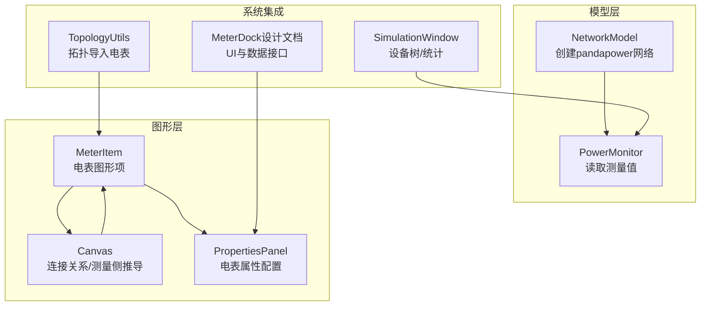
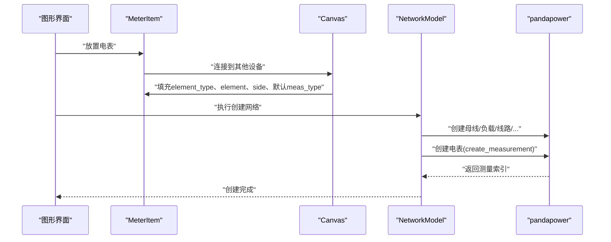
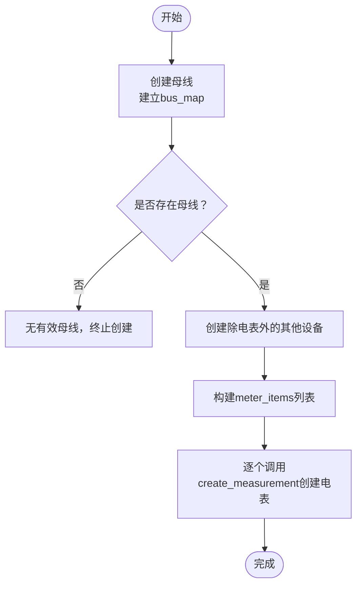
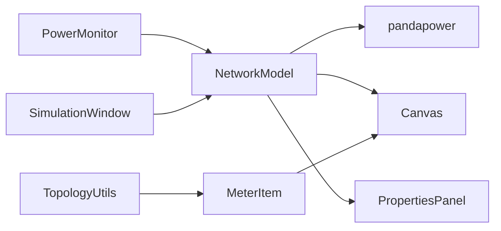

# 电表创建流程

<cite>
**本文引用的文件**
- [network_model.py](file://src/models/network_model.py)
- [network_items.py](file://src/components/network_items.py)
- [canvas.py](file://src/components/canvas.py)
- [power_monitor.py](file://src/components/power_monitor.py)
- [properties_panel.py](file://src/components/properties_panel.py)
- [simulation_window.py](file://src/components/simulation_window.py)
- [topology_utils.py](file://src/components/topology_utils.py)
- [meter_dock_design.md](file://doc/meter_dock_design.md)
</cite>

## 目录
1. [简介](#简介)
2. [项目结构](#项目结构)
3. [核心组件](#核心组件)
4. [架构总览](#架构总览)
5. [详细组件分析](#详细组件分析)
6. [依赖关系分析](#依赖关系分析)
7. [性能考量](#性能考量)
8. [故障排查指南](#故障排查指南)
9. [结论](#结论)

## 简介
本文件聚焦pp_tool中“电表创建流程”的实现与设计，围绕NetworkModel类的create_from_network_items方法，系统阐述电表在最后阶段创建的原因、meter_items列表的构建方式，以及create_measurement方法如何从电表属性中提取meas_type、element_type、value、std_dev等参数并调用pandapower的create_measurement函数。同时说明电表可测量的元件类型及其element_type参数值，以及在双端测量中side参数的应用。

## 项目结构
- 电表创建流程的核心逻辑集中在NetworkModel类中，涉及属性来源（network_items）与连接关系（canvas）。
- 电表图形项定义在network_items中，连接关系与测量侧推导在canvas中完成。
- 电表属性在属性面板中可配置，测量类型与元件类型在properties_panel中定义。
- 电表的实时测量值读取在power_monitor中实现，支持有功/无功功率、电压、电流等。

图表来源
- [network_model.py](file://src/models/network_model.py#L407-L578)
- [network_items.py](file://src/components/network_items.py#L1230-L1282)
- [canvas.py](file://src/components/canvas.py#L504-L595)
- [power_monitor.py](file://src/components/power_monitor.py#L496-L643)
- [properties_panel.py](file://src/components/properties_panel.py#L727-L758)
- [simulation_window.py](file://src/components/simulation_window.py#L1560-L1759)
- [topology_utils.py](file://src/components/topology_utils.py#L433-L457)
- [meter_dock_design.md](file://doc/meter_dock_design.md#L1-L286)

章节来源
- [network_model.py](file://src/models/network_model.py#L407-L578)
- [network_items.py](file://src/components/network_items.py#L1230-L1282)
- [canvas.py](file://src/components/canvas.py#L504-L595)
- [power_monitor.py](file://src/components/power_monitor.py#L496-L643)
- [properties_panel.py](file://src/components/properties_panel.py#L727-L758)
- [simulation_window.py](file://src/components/simulation_window.py#L1560-L1759)
- [topology_utils.py](file://src/components/topology_utils.py#L433-L457)
- [meter_dock_design.md](file://doc/meter_dock_design.md#L1-L286)

## 核心组件
- NetworkModel.create_from_network_items：按阶段创建pandapower网络，其中第三阶段专门负责电表创建，确保所有其他设备已就绪。
- NetworkModel.create_measurement：从电表属性提取参数并调用pandapower的create_measurement。
- MeterItem：电表图形项，包含meas_type、element_type、element、side、value、std_dev等属性。
- Canvas：在连接建立时自动填充电表的element_type、element、side，并设置默认测量类型。
- PowerMonitor：基于电表属性读取网络结果，支持有功/无功功率、电压、电流等。
- PropertiesPanel：提供电表属性配置界面，定义可选的element_type与side。
- SimulationWindow：设备树与统计信息，便于查看电表创建结果。
- TopologyUtils：从拓扑导入时创建电表图形项并写入属性。
- MeterDock设计文档：定义电表DockWidget的数据接口与UI布局。

章节来源
- [network_model.py](file://src/models/network_model.py#L237-L260)
- [network_model.py](file://src/models/network_model.py#L407-L578)
- [network_items.py](file://src/components/network_items.py#L1230-L1282)
- [canvas.py](file://src/components/canvas.py#L504-L595)
- [power_monitor.py](file://src/components/power_monitor.py#L496-L643)
- [properties_panel.py](file://src/components/properties_panel.py#L727-L758)
- [simulation_window.py](file://src/components/simulation_window.py#L1560-L1759)
- [topology_utils.py](file://src/components/topology_utils.py#L433-L457)
- [meter_dock_design.md](file://doc/meter_dock_design.md#L1-L286)

## 架构总览
电表创建流程遵循“先构建网络主体，再挂载测量”的策略：
- 第一步：创建母线，建立网络拓扑骨架。
- 第二步：创建除电表外的其他设备（负载、线路、变压器、光伏、储能、外部电网、开关等），确保所有测量对象均已存在。
- 第三步：最后创建电表测量设备，此时所有element_type对应的元件索引均有效，避免后续测量读取失败。

图表来源
- [network_model.py](file://src/models/network_model.py#L407-L578)
- [network_items.py](file://src/components/network_items.py#L1230-L1282)
- [canvas.py](file://src/components/canvas.py#L504-L595)

## 详细组件分析

### NetworkModel.create_from_network_items：电表最后创建的流程
- 第一步：创建母线，建立bus_map映射，若无母线则无法继续。
- 第二步：遍历除bus与meter之外的所有设备，创建负载、外部电网、静态发电机、储能、充电站、开关、线路、变压器等，确保所有测量对象已存在。
- 第三步：构建meter_items列表（遍历network_items['meter']），最后逐个调用create_measurement创建电表测量设备。

图表来源
- [network_model.py](file://src/models/network_model.py#L407-L578)

章节来源
- [network_model.py](file://src/models/network_model.py#L407-L578)

### meter_items列表的构建方式
- 从network_items字典中读取'meter'键，遍历其嵌套字典，将每个电表对象加入meter_items列表。
- 该列表用于在第三阶段集中创建电表，保证所有测量对象已存在。

章节来源
- [network_model.py](file://src/models/network_model.py#L549-L566)

### 为什么电表创建必须在所有其他设备创建完成后进行
- 电表的element_type与element属性指向具体的pandapower元件索引；若在电表创建之前，这些元件尚未创建，会导致测量对象不存在，后续读取测量值时会失败。
- 在第二步创建完所有设备后，第三步再创建电表，确保create_measurement调用时，pandapower网络中已有对应元件，从而测量索引有效。

章节来源
- [network_model.py](file://src/models/network_model.py#L443-L568)

### create_measurement方法：参数提取与pandapower调用
- 从电表属性中提取：
  - meas_type：测量类型（如p/q/i/va/ia等）
  - element_type：测量元件类型（如bus、line、trafo、load、gen、sgen、ext_grid、storage、charger等）
  - element：测量对象的pandapower索引
  - side：测量侧（如line的from/to，trafo的hv/lv）
  - value/std_dev：初始测量值与标准偏差
  - name/index：命名与索引
- 调用pandapower的create_measurement函数创建测量设备，并返回测量索引。

章节来源
- [network_model.py](file://src/models/network_model.py#L237-L260)

### 电表可测量的元件类型与element_type参数值
- 在属性面板中，element_type支持多种类型，包括但不限于：
  - bus、line、trafo、trafo3w、load、gen、sgen、ext_grid、storage、charger、shunt、ward、xward等。
- Canvas在连接建立时会将图形组件类型映射为pandapower的element_type（如static_generator映射为sgen，external_grid映射为ext_grid等）。

章节来源
- [properties_panel.py](file://src/components/properties_panel.py#L727-L758)
- [canvas.py](file://src/components/canvas.py#L524-L541)

### 测量侧(side)参数在双端测量中的应用
- Canvas根据连接点索引推导测量侧：
  - 线路(line)：第一个连接点(索引0)通常为from侧，第二个连接点(索引1)为to侧。
  - 变压器(transformer)：第一个连接点(索引0)通常为hv侧，第二个连接点(索引1)为lv侧。
- PowerMonitor在读取测量值时，会依据element_type与side选择正确的结果字段（如line的p_from_mw/p_to_mw，trafo的p_hv_mw/p_lv_mw）。

章节来源
- [canvas.py](file://src/components/canvas.py#L562-L595)
- [power_monitor.py](file://src/components/power_monitor.py#L544-L643)

### 电表属性的来源与持久化
- MeterItem在构造时初始化默认属性（meas_type、element_type、element、side、value、std_dev、name、sn、ip/port等）。
- Canvas在连接建立时更新element_type、element、side与默认meas_type。
- TopologyUtils在导入拓扑时创建MeterItem并写入属性，必要时进行索引映射。

章节来源
- [network_items.py](file://src/components/network_items.py#L1230-L1282)
- [canvas.py](file://src/components/canvas.py#L504-L561)
- [topology_utils.py](file://src/components/topology_utils.py#L433-L457)

### 电表创建流程的UI与数据接口
- MeterDock设计文档定义了电表DockWidget的界面布局与数据接口，强调基于电表设备自身的meas_type属性获取测量值，并与UI组件联动。
- PowerMonitor提供基于meas_type的测量值读取方法，支持有功/无功功率、电压、电流等。

章节来源
- [meter_dock_design.md](file://doc/meter_dock_design.md#L1-L286)
- [power_monitor.py](file://src/components/power_monitor.py#L496-L643)

## 依赖关系分析
- NetworkModel依赖pandapower库进行网络与测量创建。
- Canvas负责图形层的连接与属性更新，直接影响电表的element_type、element、side。
- PowerMonitor依赖NetworkModel的net结果集进行测量值读取。
- PropertiesPanel提供电表属性配置入口，影响create_measurement的参数。
- SimulationWindow提供设备树与统计信息，便于验证电表创建结果。

图表来源
- [network_model.py](file://src/models/network_model.py#L237-L260)
- [canvas.py](file://src/components/canvas.py#L504-L595)
- [power_monitor.py](file://src/components/power_monitor.py#L496-L643)
- [properties_panel.py](file://src/components/properties_panel.py#L727-L758)
- [simulation_window.py](file://src/components/simulation_window.py#L1560-L1759)
- [topology_utils.py](file://src/components/topology_utils.py#L433-L457)
- [network_items.py](file://src/components/network_items.py#L1230-L1282)

## 性能考量
- 电表创建放在最后，避免重复扫描或回填，降低复杂度。
- 通过bus_map与索引映射，减少跨组件查找成本。
- 电表属性在连接阶段即确定，避免后续运行期动态解析。

[本节为一般性建议，不直接分析具体文件]

## 故障排查指南
- 电表创建失败：检查第二步是否成功创建了所有测量对象；确认element_type与element是否有效。
- 测量值读取为0：确认网络已完成潮流计算，且结果集中存在对应索引；检查side参数是否与元件类型匹配。
- 属性不生效：确认PropertiesPanel中element_type与side配置正确；检查Canvas连接逻辑是否覆盖了默认值。

章节来源
- [network_model.py](file://src/models/network_model.py#L443-L578)
- [power_monitor.py](file://src/components/power_monitor.py#L544-L643)
- [canvas.py](file://src/components/canvas.py#L504-L595)
- [properties_panel.py](file://src/components/properties_panel.py#L727-L758)

## 结论
pp_tool的电表创建流程通过“先主体、后测量”的策略，确保电表在所有测量对象创建完成后才挂载，从而避免测量索引无效的问题。NetworkModel的create_from_network_items明确划分了三个阶段，MeterItem与Canvas共同保证了element_type、element、side等关键属性的正确性，PowerMonitor则提供了灵活的测量值读取能力。该设计既保证了仿真一致性，也便于后续UI与数据接口的扩展。