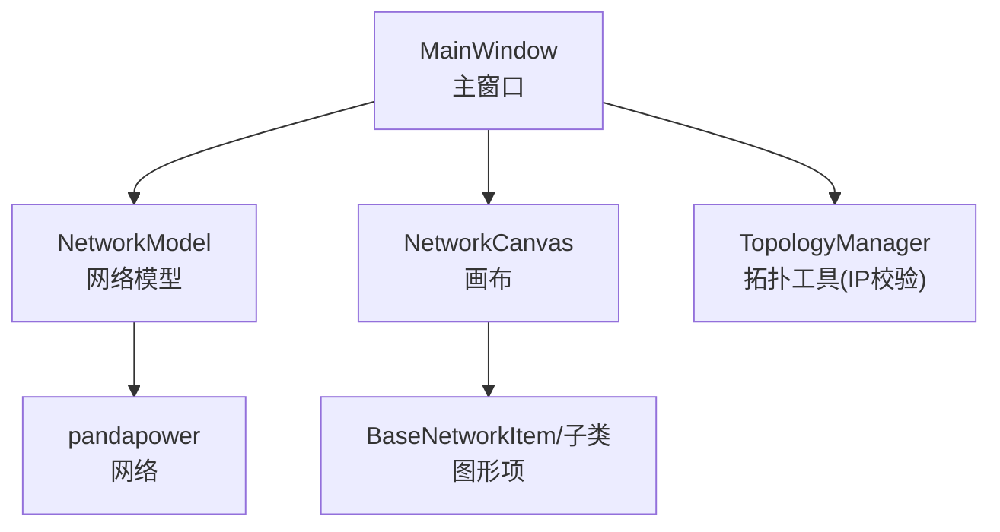
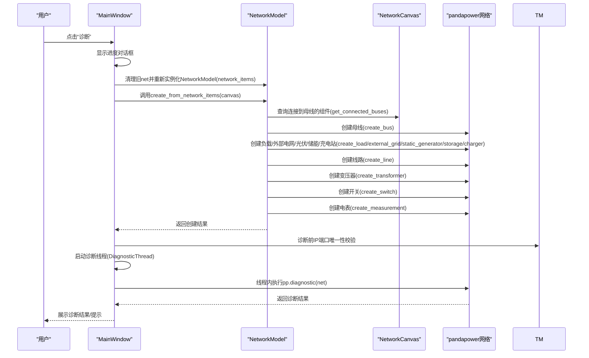
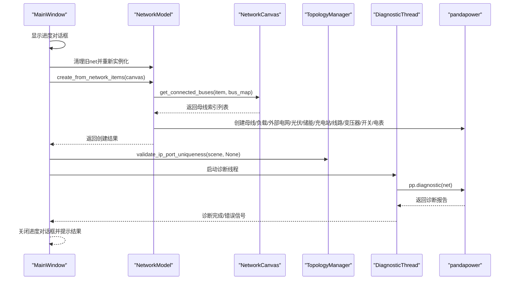
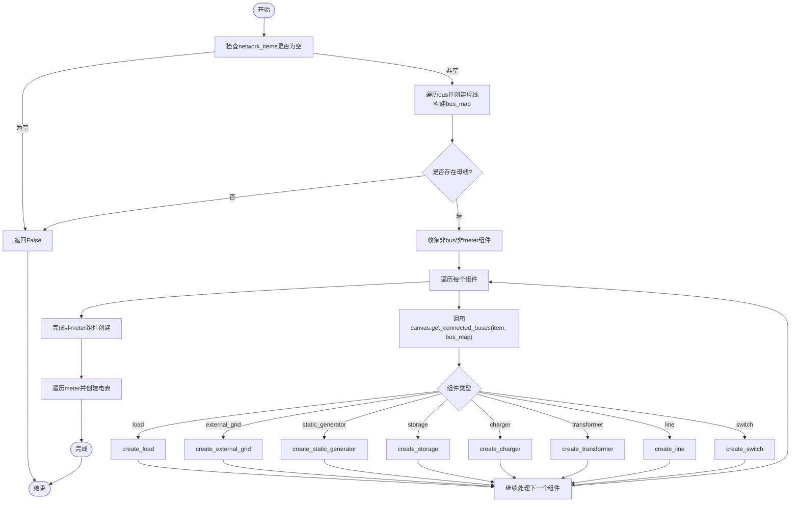
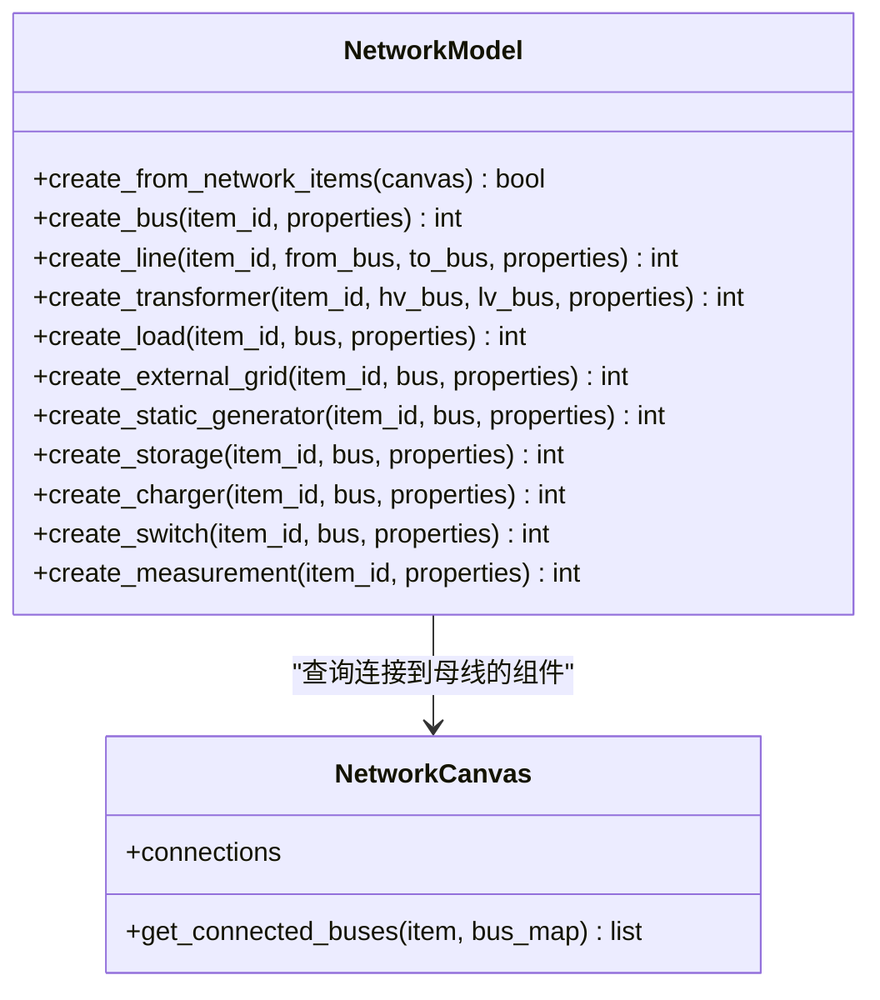
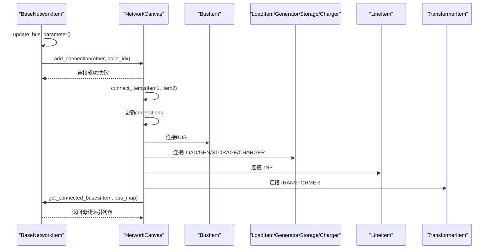
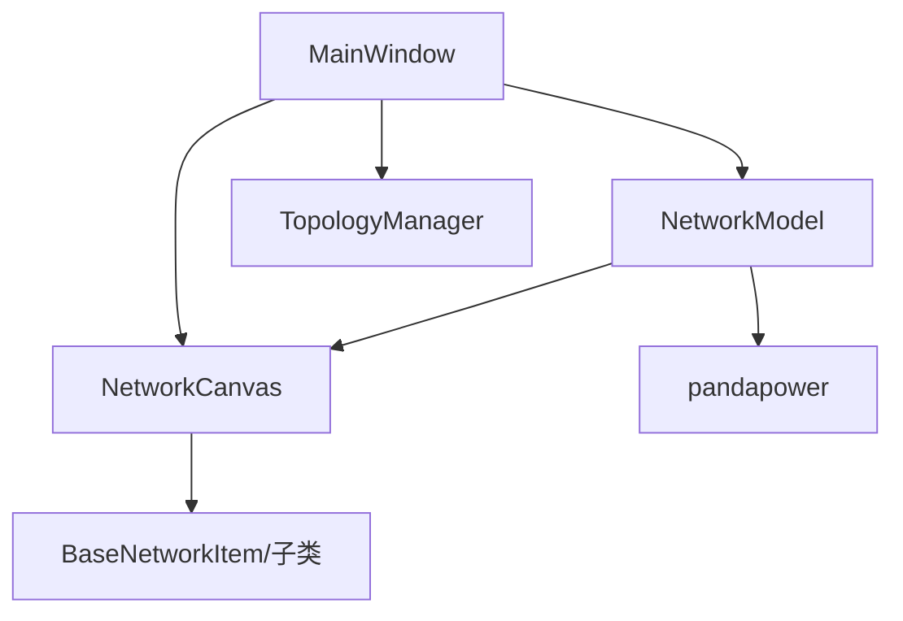

# 网络模型创建数据流

<cite>
**本文引用的文件**
- [src/components/main_window.py](file://src/components/main_window.py)
- [src/models/network_model.py](file://src/models/network_model.py)
- [src/components/canvas.py](file://src/components/canvas.py)
- [src/components/network_items.py](file://src/components/network_items.py)
- [src/components/topology_utils.py](file://src/components/topology_utils.py)
</cite>

## 目录
1. [简介](#简介)
2. [项目结构](#项目结构)
3. [核心组件](#核心组件)
4. [架构总览](#架构总览)
5. [详细组件分析](#详细组件分析)
6. [依赖分析](#依赖分析)
7. [性能考虑](#性能考虑)
8. [故障排查指南](#故障排查指南)
9. [结论](#结论)

## 简介
本文件围绕“诊断”菜单启动的网络模型创建流程，系统性梳理从用户点击“诊断”，到MainWindow在主线程中重新实例化NetworkModel对象，再到NetworkModel的create_from_network_items方法如何遍历network_items字典并创建pandapower网络的全过程。重点解释：
- bus_map映射在组件连接中的作用
- create_bus、create_line等创建方法如何把图形组件转换为pandapower元件
- 时序图展示从主窗口启动诊断到网络模型创建完成的数据流动
- 各组件（母线、线路、变压器等）的创建顺序与依赖关系

## 项目结构
- 主窗口组件负责菜单、诊断线程、与NetworkModel交互
- 网络模型负责把图形项转换为pandapower网络
- 画布负责组件连接、连接点管理、bus_map构建
- 网络项组件负责图形项的属性、连接点、连接规则
- 拓扑工具负责IP端口唯一性校验、导入导出

图表来源
- [src/components/main_window.py](file://src/components/main_window.py#L345-L413)
- [src/models/network_model.py](file://src/models/network_model.py#L406-L580)
- [src/components/canvas.py](file://src/components/canvas.py#L255-L271)
- [src/components/network_items.py](file://src/components/network_items.py#L369-L465)
- [src/components/topology_utils.py](file://src/components/topology_utils.py#L21-L98)

章节来源
- [src/components/main_window.py](file://src/components/main_window.py#L94-L115)
- [src/models/network_model.py](file://src/models/network_model.py#L10-L708)
- [src/components/canvas.py](file://src/components/canvas.py#L1-L200)
- [src/components/network_items.py](file://src/components/network_items.py#L1-L200)
- [src/components/topology_utils.py](file://src/components/topology_utils.py#L1-L120)

## 核心组件
- MainWindow：提供“诊断”菜单入口，负责在主线程中重建NetworkModel并调用create_from_network_items，随后启动诊断线程
- NetworkModel：封装pandapower网络，提供create_bus/create_line/create_transformer等创建方法，以及create_from_network_items的完整创建流程
- NetworkCanvas：维护connections、连接点、bus_map，提供get_connected_buses查询某组件连接到的母线索引
- BaseNetworkItem及其子类：定义组件属性、连接点、连接规则、bus参数更新逻辑
- TopologyManager：提供IP端口唯一性校验，诊断前的前置校验

章节来源
- [src/components/main_window.py](file://src/components/main_window.py#L345-L413)
- [src/models/network_model.py](file://src/models/network_model.py#L10-L708)
- [src/components/canvas.py](file://src/components/canvas.py#L255-L271)
- [src/components/network_items.py](file://src/components/network_items.py#L369-L465)
- [src/components/topology_utils.py](file://src/components/topology_utils.py#L21-L98)

## 架构总览
下图展示了从“诊断”菜单到网络模型创建完成的端到端数据流，包括主线程中的重建与创建、诊断线程中的诊断执行。

图表来源
- [src/components/main_window.py](file://src/components/main_window.py#L345-L413)
- [src/models/network_model.py](file://src/models/network_model.py#L406-L580)
- [src/components/canvas.py](file://src/components/canvas.py#L255-L271)
- [src/components/topology_utils.py](file://src/components/topology_utils.py#L21-L98)

## 详细组件分析

### MainWindow诊断流程与主线程重建
- 用户点击“诊断”菜单项，MainWindow创建进度对话框并重置诊断线程
- 在主线程中，MainWindow显式清理旧NetworkModel的net引用，然后重新实例化NetworkModel并将当前network_items字典传入
- 调用NetworkModel.create_from_network_items(canvas)，传入画布以查询连接关系
- 诊断前进行IP端口唯一性校验，再启动DiagnosticThread在线程中执行pp.diagnostic(net)

图表来源
- [src/components/main_window.py](file://src/components/main_window.py#L345-L413)
- [src/models/network_model.py](file://src/models/network_model.py#L406-L580)
- [src/components/canvas.py](file://src/components/canvas.py#L255-L271)
- [src/components/topology_utils.py](file://src/components/topology_utils.py#L21-L98)

章节来源
- [src/components/main_window.py](file://src/components/main_window.py#L345-L413)

### NetworkModel.create_from_network_items创建流程
- 输入：MainWindow传入的NetworkCanvas对象，内部持有connections与network_items
- 步骤：
  1) 遍历network_items['bus']，逐个调用create_bus，构建bus_map（图形项对象到pandapower母线索引的映射）
  2) 遍历除bus与meter外的其他组件，调用canvas.get_connected_buses(item, bus_map)获取连接到的母线索引，再调用对应创建方法
  3) 最后遍历network_items['meter']，调用create_measurement创建电表
- 返回：创建成功返回True，否则返回False

图表来源
- [src/models/network_model.py](file://src/models/network_model.py#L406-L580)
- [src/components/canvas.py](file://src/components/canvas.py#L255-L271)

章节来源
- [src/models/network_model.py](file://src/models/network_model.py#L406-L580)

### bus_map映射与连接查询
- bus_map：在NetworkModel中由create_bus阶段构建，键为图形项对象，值为pandapower母线索引
- get_connected_buses：NetworkCanvas根据connections列表，将item与bus_map中的母线对象匹配，返回pandapower母线索引列表
- 作用：使create_load/create_line/create_transformer等方法能够将图形项属性（如from_bus/lv_bus等）转换为pandapower索引

图表来源
- [src/models/network_model.py](file://src/models/network_model.py#L406-L580)
- [src/components/canvas.py](file://src/components/canvas.py#L255-L271)

章节来源
- [src/components/canvas.py](file://src/components/canvas.py#L255-L271)
- [src/models/network_model.py](file://src/models/network_model.py#L406-L580)

### 组件连接与属性更新（bus_map依赖）
- BaseNetworkItem.update_bus_parameter：当组件连接发生变化时，自动更新组件属性中的bus/hv_bus/lv_bus/from_bus/to_bus等字段
- Canvas.connect_items：建立连接后，会调用item.add_connection并更新connections列表
- Canvas.get_connected_buses：利用connections与bus_map，返回与某组件连接的母线索引列表

图表来源
- [src/components/network_items.py](file://src/components/network_items.py#L369-L465)
- [src/components/canvas.py](file://src/components/canvas.py#L406-L496)
- [src/components/canvas.py](file://src/components/canvas.py#L255-L271)

章节来源
- [src/components/network_items.py](file://src/components/network_items.py#L369-L465)
- [src/components/canvas.py](file://src/components/canvas.py#L406-L496)

### 创建方法族：从图形到pandapower
- create_bus：创建母线，返回pandapower母线索引
- create_line：根据use_standard_type选择标准类型或参数型创建线路
- create_transformer：根据use_standard_type选择标准类型或参数型创建变压器
- create_load：根据use_power_factor选择cosφ模式或直接功率模式
- create_external_grid/static_generator/storage/charger：分别创建外部电网、静态发电、储能、充电站
- create_switch：创建开关
- create_measurement：创建电表

章节来源
- [src/models/network_model.py](file://src/models/network_model.py#L18-L134)
- [src/models/network_model.py](file://src/models/network_model.py#L136-L208)
- [src/models/network_model.py](file://src/models/network_model.py#L210-L234)
- [src/models/network_model.py](file://src/models/network_model.py#L236-L259)
- [src/models/network_model.py](file://src/models/network_model.py#L261-L311)
- [src/models/network_model.py](file://src/models/network_model.py#L313-L333)
- [src/models/network_model.py](file://src/models/network_model.py#L335-L378)
- [src/models/network_model.py](file://src/models/network_model.py#L380-L404)

### 诊断线程与IP端口校验
- MainWindow在创建NetworkModel后，调用TopologyManager.validate_ip_port_uniqueness进行IP与端口唯一性校验
- 若校验失败，弹窗提示并终止诊断；若通过，启动DiagnosticThread在线程中执行pp.diagnostic(net)

章节来源
- [src/components/main_window.py](file://src/components/main_window.py#L345-L413)
- [src/components/topology_utils.py](file://src/components/topology_utils.py#L21-L98)

## 依赖分析
- MainWindow依赖NetworkModel与NetworkCanvas，负责UI与流程编排
- NetworkModel依赖pandapower创建API，依赖NetworkCanvas提供的连接查询
- NetworkCanvas依赖BaseNetworkItem及其子类，维护connections与bus_map
- BaseNetworkItem依赖自身连接点与连接规则，动态更新bus/hv_bus/lv_bus/from_bus/to_bus等属性
- TopologyManager提供IP端口唯一性校验，贯穿诊断前流程

图表来源
- [src/components/main_window.py](file://src/components/main_window.py#L345-L413)
- [src/models/network_model.py](file://src/models/network_model.py#L406-L580)
- [src/components/canvas.py](file://src/components/canvas.py#L255-L271)
- [src/components/network_items.py](file://src/components/network_items.py#L369-L465)
- [src/components/topology_utils.py](file://src/components/topology_utils.py#L21-L98)

章节来源
- [src/components/main_window.py](file://src/components/main_window.py#L345-L413)
- [src/models/network_model.py](file://src/models/network_model.py#L406-L580)
- [src/components/canvas.py](file://src/components/canvas.py#L255-L271)
- [src/components/network_items.py](file://src/components/network_items.py#L369-L465)
- [src/components/topology_utils.py](file://src/components/topology_utils.py#L21-L98)

## 性能考虑
- 创建顺序优化：先创建母线，再创建连接到母线的组件，最后创建电表，避免电表引用尚未创建的元件
- 连接查询：get_connected_buses基于connections与bus_map，复杂度与连接数线性相关
- 线程分离：诊断在独立线程执行，避免阻塞主线程UI
- 日志与容错：NetworkModel在创建失败时记录错误并继续处理其他组件，提升鲁棒性

## 故障排查指南
- “没有组件，无法创建网络模型”：检查network_items是否为空或未添加任何组件
- “缺少母线，无法创建网络模型”：确认至少有一个母线组件
- “组件连接缺失导致创建失败”：检查组件连接是否满足连接规则（如开关、线路、变压器与母线的连接约束）
- “IP端口不唯一”：根据拓扑工具的校验提示修正重复配置
- “诊断线程未响应”：确认主线程中已正确启动DiagnosticThread并连接信号槽

章节来源
- [src/models/network_model.py](file://src/models/network_model.py#L406-L580)
- [src/components/topology_utils.py](file://src/components/topology_utils.py#L21-L98)
- [src/components/main_window.py](file://src/components/main_window.py#L345-L413)

## 结论
本文从用户视角出发，完整梳理了“诊断”菜单启动后的网络模型创建数据流。核心要点包括：
- MainWindow在主线程中重建NetworkModel并调用create_from_network_items
- NetworkModel通过bus_map与canvas.get_connected_buses将图形组件转换为pandapower元件
- 组件创建遵循严格的顺序与依赖关系，确保电表等测量设备在被测元件之后创建
- 诊断前的IP端口唯一性校验与线程化的诊断执行保证了诊断流程的稳定性与用户体验