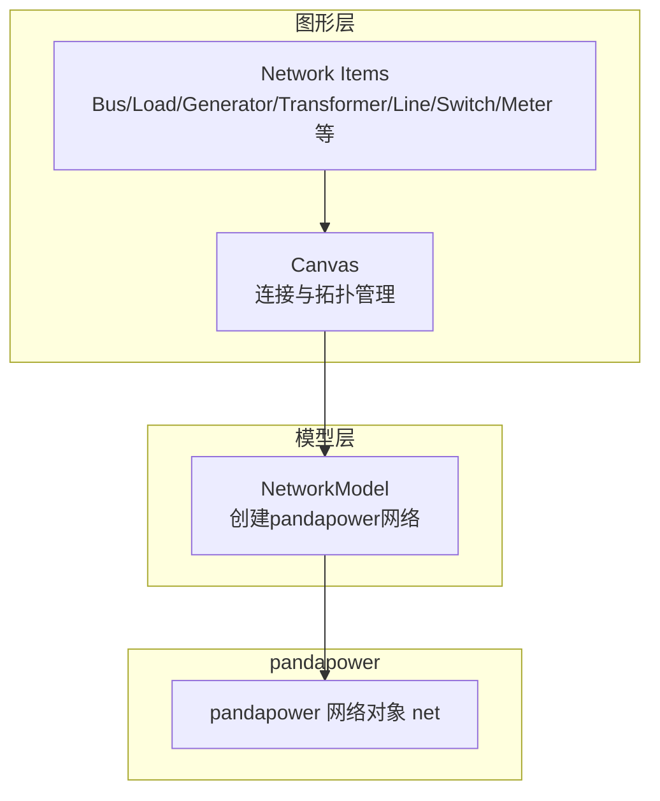
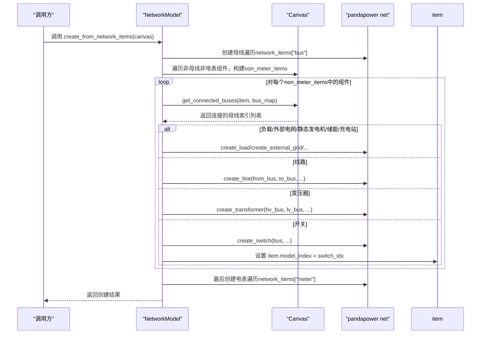
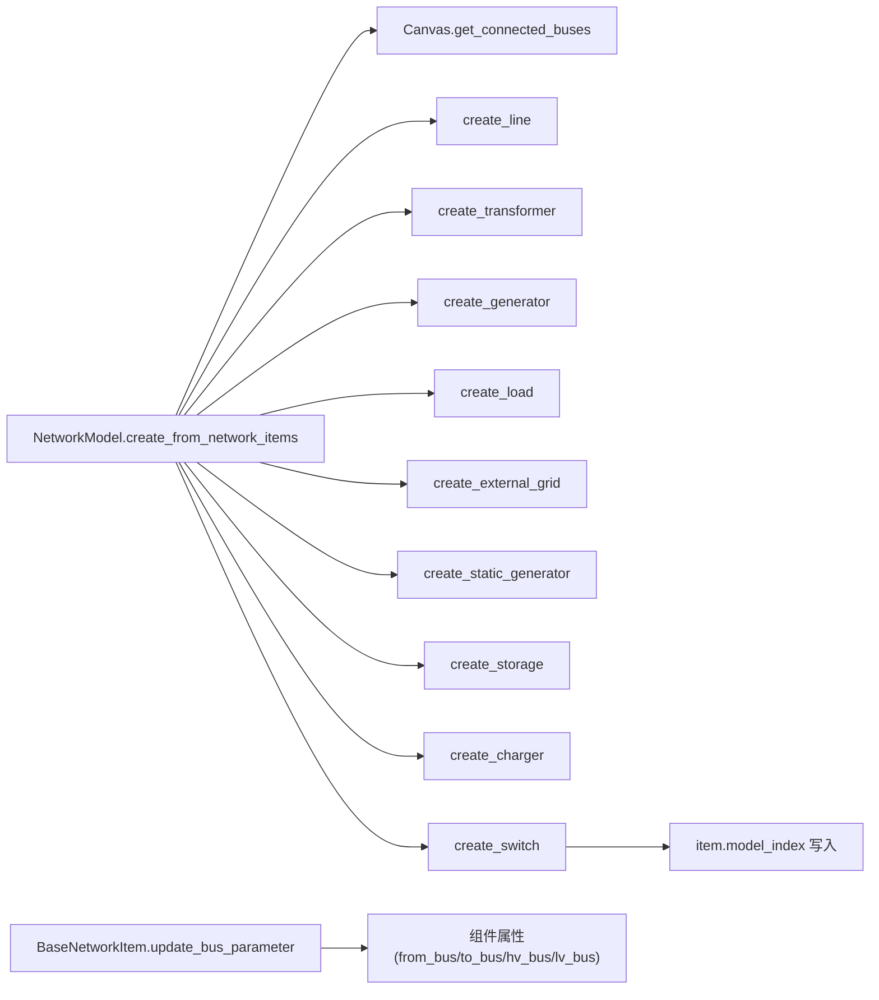

# 连接组件创建流程

<cite>
**本文引用的文件**
- [src/models/network_model.py](file://src/models/network_model.py)
- [src/components/canvas.py](file://src/components/canvas.py)
- [src/components/network_items.py](file://src/components/network_items.py)
</cite>

## 目录
1. [简介](#简介)
2. [项目结构](#项目结构)
3. [核心组件](#核心组件)
4. [架构总览](#架构总览)
5. [详细组件分析](#详细组件分析)
6. [依赖关系分析](#依赖关系分析)
7. [性能考量](#性能考量)
8. [故障排查指南](#故障排查指南)
9. [结论](#结论)

## 简介
本文件聚焦于pp_tool中“连接组件”的创建流程，围绕NetworkModel类的create_from_network_items方法，系统阐述如何从图形画布的网络项集合中，构建pandapower网络模型。重点覆盖：
- non_meter_items列表的构建逻辑
- 通过canvas.get_connected_buses方法查找组件连接的母线
- 不同组件类型（负载、外部电网、静态发电机、储能、充电站、开关、线路、变压器等）的创建分支与差异
- 变压器与线路组件如何从属性中读取hv_bus/lv_bus与from_bus/to_bus
- 开关组件创建时如何设置model_index以建立图形组件与pandapower模型的关联

## 项目结构
pp_tool采用分层设计：图形层（components）负责组件绘制与拓扑连接；模型层（models）负责将图形拓扑映射为pandapower网络。核心入口位于NetworkModel，它接收来自画布的network_items，按步骤创建母线、连接组件与电表。

图表来源
- [src/components/canvas.py](file://src/components/canvas.py#L255-L271)
- [src/models/network_model.py](file://src/models/network_model.py#L407-L578)

章节来源
- [src/models/network_model.py](file://src/models/network_model.py#L407-L578)
- [src/components/canvas.py](file://src/components/canvas.py#L255-L271)

## 核心组件
- NetworkModel：负责将图形项映射为pandapower网络，提供create_from_network_items主流程与各类create_*方法。
- Canvas：维护connections、组件间连接关系，提供get_connected_buses查询某组件连接的母线索引。
- Network Items：BusItem、LoadItem、ExternalGridItem、StaticGeneratorItem、StorageItem、ChargerItem、SwitchItem、LineItem、TransformerItem、MeterItem等，承载属性与连接点信息。

章节来源
- [src/models/network_model.py](file://src/models/network_model.py#L1-L120)
- [src/components/canvas.py](file://src/components/canvas.py#L255-L271)
- [src/components/network_items.py](file://src/components/network_items.py#L369-L549)

## 架构总览
NetworkModel.create_from_network_items的总体流程分为三步：
1) 创建所有母线，建立“图形项→pandapower母线索引”的映射；
2) 遍历除母线与电表之外的所有组件，基于canvas.get_connected_buses获取连接母线，按组件类型分支创建；
3) 最后创建电表，确保所有其他设备已就绪。

图表来源
- [src/models/network_model.py](file://src/models/network_model.py#L407-L578)
- [src/components/canvas.py](file://src/components/canvas.py#L255-L271)

## 详细组件分析

### 1) non_meter_items列表的构建
- 遍历self.network_items字典，跳过键为“bus”和“meter”的条目，将其他类型组件逐一加入non_meter_items列表。
- 该列表随后被逐个处理，先通过canvas.get_connected_buses获取连接母线，再按组件类型分支创建。

章节来源
- [src/models/network_model.py](file://src/models/network_model.py#L444-L449)

### 2) 通过canvas.get_connected_buses查找母线
- Canvas维护connections列表，get_connected_buses遍历该列表，若某条连接的两端分别为item与某个bus，则将bus_map中对应的pandapower母线索引加入结果列表。
- 返回值为该组件连接到的所有母线索引列表（顺序取决于连接顺序）。

章节来源
- [src/components/canvas.py](file://src/components/canvas.py#L255-L271)

### 3) 组件类型分支与创建逻辑

#### 3.1 负载（load）
- 分支条件：item.component_type == 'load'
- 连接要求：需至少连接到一个母线（connected_buses非空）
- 创建方式：调用create_load，传入bus=connected_buses[0]与属性字典
- 属性模式：支持两种模式（功率因数模式与直接有功功率模式），具体由属性决定

章节来源
- [src/models/network_model.py](file://src/models/network_model.py#L456-L465)
- [src/models/network_model.py](file://src/models/network_model.py#L162-L209)

#### 3.2 外部电网（external_grid）
- 分支条件：item.component_type == 'external_grid'
- 连接要求：需至少连接到一个母线
- 创建方式：调用create_external_grid，传入bus=connected_buses[0]

章节来源
- [src/models/network_model.py](file://src/models/network_model.py#L466-L475)
- [src/models/network_model.py](file://src/models/network_model.py#L314-L334)

#### 3.3 静态发电机（static_generator）
- 分支条件：item.component_type == 'static_generator'
- 连接要求：需至少连接到一个母线
- 创建方式：调用create_static_generator，传入bus=connected_buses[0]

章节来源
- [src/models/network_model.py](file://src/models/network_model.py#L476-L485)
- [src/models/network_model.py](file://src/models/network_model.py#L336-L379)

#### 3.4 储能（storage）
- 分支条件：item.component_type == 'storage'
- 连接要求：需至少连接到一个母线
- 创建方式：调用create_storage，传入bus=connected_buses[0]

章节来源
- [src/models/network_model.py](file://src/models/network_model.py#L486-L495)
- [src/models/network_model.py](file://src/models/network_model.py#L211-L235)

#### 3.5 充电站（charger）
- 分支条件：item.component_type == 'charger'
- 连接要求：需至少连接到一个母线
- 创建方式：调用create_charger，传入bus=connected_buses[0]
- 索引策略：charger使用独立索引（与负载冲突避免），创建时会将索引写入属性，便于后续识别

章节来源
- [src/models/network_model.py](file://src/models/network_model.py#L496-L505)
- [src/models/network_model.py](file://src/models/network_model.py#L262-L313)

#### 3.6 线路（line）
- 分支条件：item.component_type == 'line'
- 连接要求：需具备from_bus与to_bus属性
- 属性来源：from_bus=item.properties.get('from_bus'), to_bus=item.properties.get('to_bus')
- 创建方式：调用create_line，传入from_bus、to_bus与属性字典
- 属性缺失处理：若缺少任一端母线，记录错误并跳过该组件

章节来源
- [src/models/network_model.py](file://src/models/network_model.py#L520-L533)
- [src/models/network_model.py](file://src/models/network_model.py#L42-L90)

#### 3.7 变压器（transformer）
- 分支条件：item.component_type == 'transformer'
- 连接要求：需具备hv_bus与lv_bus属性
- 属性来源：hv_bus=item.properties.get('hv_bus'), lv_bus=item.properties.get('lv_bus')
- 创建方式：调用create_transformer，传入hv_bus、lv_bus与属性字典
- 属性缺失处理：若缺少任一侧母线，记录错误并跳过该组件

章节来源
- [src/models/network_model.py](file://src/models/network_model.py#L506-L519)
- [src/models/network_model.py](file://src/models/network_model.py#L91-L136)

#### 3.8 开关（switch）
- 分支条件：item.component_type == 'switch'
- 连接要求：需至少连接到一个母线
- 创建方式：调用create_switch，传入bus=connected_buses[0]与属性字典
- 关联建立：创建完成后，将pandapower开关索引写入item.model_index，用于图形与模型的双向关联

章节来源
- [src/models/network_model.py](file://src/models/network_model.py#L534-L544)
- [src/models/network_model.py](file://src/models/network_model.py#L381-L406)

### 4) 母线与电表的特殊处理
- 母线：先于其他组件创建，建立bus_map映射，供后续组件查询连接母线。
- 电表：最后创建，确保所有其他设备已就绪，避免测量对象指向未知索引。

章节来源
- [src/models/network_model.py](file://src/models/network_model.py#L422-L441)
- [src/models/network_model.py](file://src/models/network_model.py#L549-L566)

### 5) 属性与连接点的关系（以线路与变压器为例）
- 线路：属性中包含from_bus与to_bus，分别对应连接点0与1；Canvas在连接母线时，会根据连接点索引设置这些属性，从而保证create_line能正确读取两端母线。
- 变压器：属性中包含hv_bus与lv_bus，分别对应连接点0与1；Canvas在连接母线时同样会设置这些属性。

章节来源
- [src/components/canvas.py](file://src/components/canvas.py#L365-L392)
- [src/components/network_items.py](file://src/components/network_items.py#L429-L459)

## 依赖关系分析
- NetworkModel依赖Canvas提供的连接信息与get_connected_buses查询能力。
- 各组件的属性（如from_bus/to_bus、hv_bus/lv_bus）由BaseNetworkItem.update_bus_parameter在连接建立时自动填充，确保create_*方法能直接读取。
- 开关创建后通过item.model_index与pandapower开关索引绑定，便于后续状态同步与可视化。

图表来源
- [src/models/network_model.py](file://src/models/network_model.py#L407-L578)
- [src/components/canvas.py](file://src/components/canvas.py#L255-L271)
- [src/components/network_items.py](file://src/components/network_items.py#L369-L549)

章节来源
- [src/models/network_model.py](file://src/models/network_model.py#L407-L578)
- [src/components/canvas.py](file://src/components/canvas.py#L255-L271)
- [src/components/network_items.py](file://src/components/network_items.py#L369-L549)

## 性能考量
- 遍历与查询：non_meter_items构建与get_connected_buses均为线性复杂度，整体受组件数量与连接数影响。
- 错误处理：各分支均包含异常捕获与日志记录，避免单个组件失败导致整体中断。
- 电表延后创建：确保所有其他设备索引已生成，减少测量对象的无效索引查找。

[本节为通用建议，无需特定文件引用]

## 故障排查指南
- 母线缺失：若未创建任何母线，流程会提前返回失败。请确认至少存在一个BusItem。
- 连接不完整：对于线路与变压器，若from_bus/lv_bus等关键属性缺失，将记录错误并跳过该组件。请检查连接点设置与Canvas的连接逻辑。
- 开关未关联：若开关创建后未设置model_index，请检查create_switch分支是否被执行，以及item.model_index赋值逻辑。

章节来源
- [src/models/network_model.py](file://src/models/network_model.py#L439-L441)
- [src/models/network_model.py](file://src/models/network_model.py#L520-L533)
- [src/models/network_model.py](file://src/models/network_model.py#L506-L519)
- [src/models/network_model.py](file://src/models/network_model.py#L534-L544)

## 结论
NetworkModel.create_from_network_items通过清晰的三步法，将图形拓扑稳定地映射为pandapower网络。其关键在于：
- 正确构建non_meter_items并过滤掉母线与电表；
- 通过canvas.get_connected_buses可靠地获取连接母线；
- 针对不同组件类型采用差异化分支，确保属性（from_bus/to_bus、hv_bus/lv_bus）与连接点一一对应；
- 开关创建后通过model_index建立图形与模型的直接关联，便于后续状态同步。