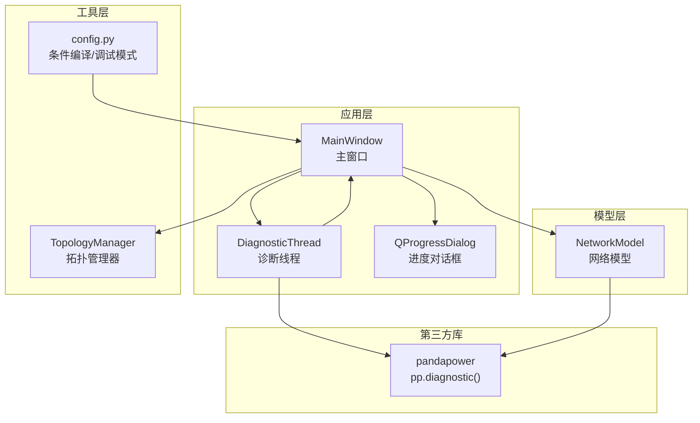
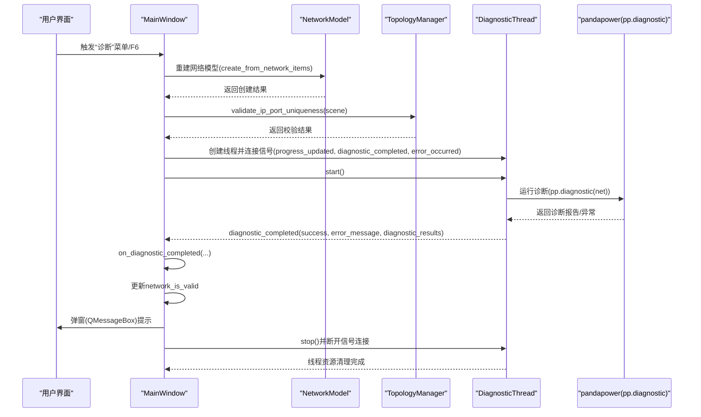
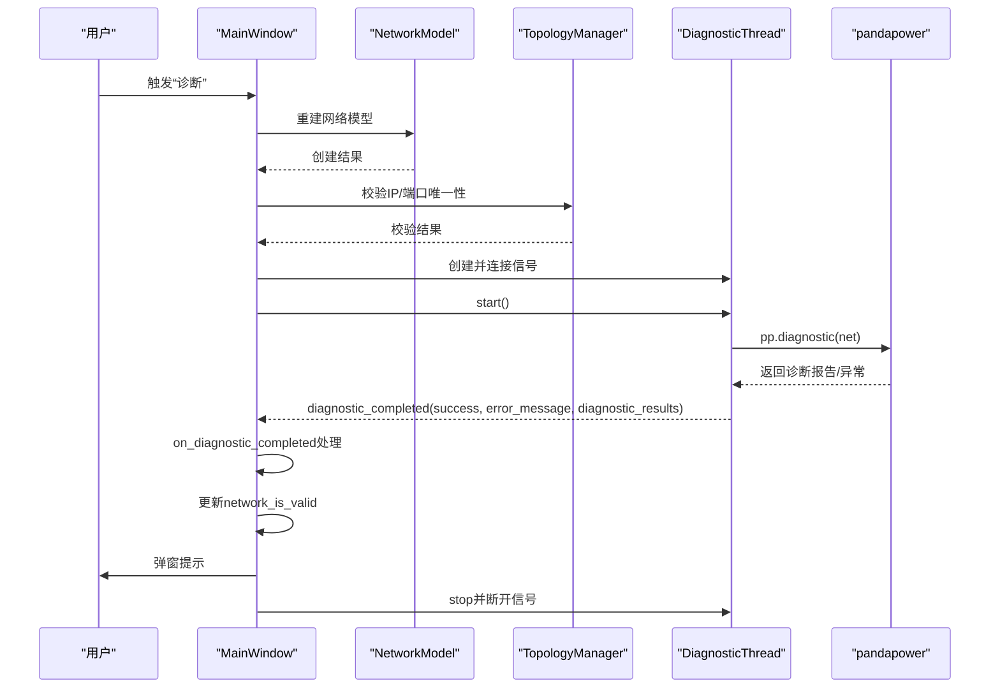
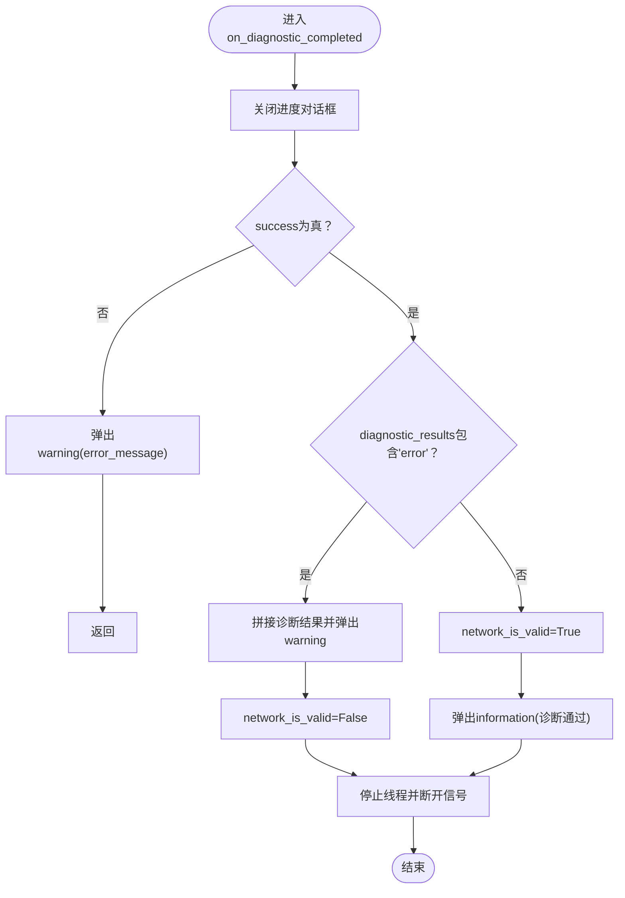
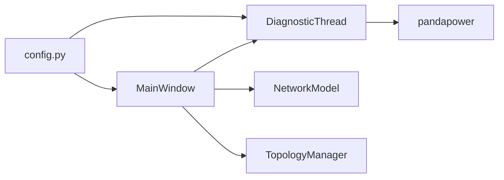

# 诊断结果处理数据流

<cite>
**本文引用的文件**
- [src/components/main_window.py](file://src/components/main_window.py)
- [src/models/network_model.py](file://src/models/network_model.py)
- [src/components/topology_utils.py](file://src/components/topology_utils.py)
- [src/config.py](file://src/config.py)
</cite>

## 目录
1. [简介](#简介)
2. [项目结构](#项目结构)
3. [核心组件](#核心组件)
4. [架构总览](#架构总览)
5. [详细组件分析](#详细组件分析)
6. [依赖分析](#依赖分析)
7. [性能考虑](#性能考虑)
8. [故障排查指南](#故障排查指南)
9. [结论](#结论)

## 简介
本文件聚焦于pp_tool中“诊断结果处理数据流”的完整链路，围绕DiagnosticThread线程执行完成后，diagnostic_completed信号如何触发MainWindow类的on_diagnostic_completed方法，进而根据诊断结果(success, error_message, diagnostic_results)更新网络状态标志位network_is_valid、显示相应QMessageBox消息，并清理诊断线程资源。同时解释当诊断发现错误时通过QMessageBox.warning显示具体问题，以及诊断通过时将network_is_valid设置为True以允许进入仿真模式。文档提供时序图，直观展示信号触发、结果处理与资源清理的全过程。

## 项目结构
- 诊断流程涉及的关键模块：
  - 主窗口与诊断线程：src/components/main_window.py
  - 网络模型构建：src/models/network_model.py
  - 拓扑校验（IP/端口唯一性）：src/components/topology_utils.py
  - 条件编译与调试模式：src/config.py

图表来源
- [src/components/main_window.py](file://src/components/main_window.py#L28-L94)
- [src/models/network_model.py](file://src/models/network_model.py#L1-L120)
- [src/components/topology_utils.py](file://src/components/topology_utils.py#L21-L104)
- [src/config.py](file://src/config.py#L153-L192)

章节来源
- [src/components/main_window.py](file://src/components/main_window.py#L28-L94)
- [src/models/network_model.py](file://src/models/network_model.py#L1-L120)
- [src/components/topology_utils.py](file://src/components/topology_utils.py#L21-L104)
- [src/config.py](file://src/config.py#L153-L192)

## 核心组件
- DiagnosticThread：使用Python原生threading模块实现的诊断线程，发出progress_updated、diagnostic_completed、error_occurred三个信号；在run中调用pandapower诊断函数pp.diagnostic(net)，并将诊断结果通过diagnostic_completed信号传递给主线程。
- MainWindow：主窗口类，负责发起诊断、接收诊断结果、更新network_is_valid、弹窗提示、清理线程资源；同时在进入仿真模式前检查network_is_valid。
- NetworkModel：封装pandapower网络模型的创建与运行，为诊断提供net对象。
- TopologyManager：提供IP/端口唯一性校验，诊断前先进行校验，避免后续仿真阶段出现通信冲突。
- config.py：提供条件编译装饰器conditional_compile与DEBUG_MODE，影响诊断行为与功能开关。

章节来源
- [src/components/main_window.py](file://src/components/main_window.py#L28-L94)
- [src/components/main_window.py](file://src/components/main_window.py#L344-L456)
- [src/models/network_model.py](file://src/models/network_model.py#L1-L120)
- [src/components/topology_utils.py](file://src/components/topology_utils.py#L21-L104)
- [src/config.py](file://src/config.py#L153-L192)

## 架构总览
诊断流程采用“主线程发起+子线程执行+信号回调”的异步模式：
- 主线程创建NetworkModel并从画布构建net；
- 主线程调用TopologyManager.validate_ip_port_uniqueness进行前置校验；
- 主线程创建DiagnosticThread并连接其信号；
- 子线程执行pp.diagnostic(net)，通过diagnostic_completed信号回传结果；
- 主线程在on_diagnostic_completed中解析结果，更新network_is_valid并弹窗提示；
- 主线程清理线程资源，断开信号连接，释放引用。

图表来源
- [src/components/main_window.py](file://src/components/main_window.py#L344-L456)
- [src/models/network_model.py](file://src/models/network_model.py#L407-L581)
- [src/components/topology_utils.py](file://src/components/topology_utils.py#L21-L104)

## 详细组件分析

### 诊断线程与信号机制
- DiagnosticThread.run：
  - 发出progress_updated(30%)；
  - 调用pp.diagnostic(net)收集诊断报告，若异常则将错误信息写入diagnostic_results['error']；
  - 进度推进至80%、90%、95%；
  - 若running为真，发出progress_updated(100%)并emit diagnostic_completed(True, None, diagnostic_results)。
- DiagnosticThread.start/stop：
  - start创建守护线程并启动；
  - stop将running置False并join最多1秒，避免主线程阻塞。

章节来源
- [src/components/main_window.py](file://src/components/main_window.py#L28-L94)

### 主窗口发起诊断与结果处理
- MainWindow.diagnostic_network：
  - 创建QProgressDialog并禁用取消按钮；
  - 清理旧线程与信号连接，防止重复连接导致内存泄漏；
  - 重建NetworkModel并从画布创建net；
  - 调用TopologyManager.validate_ip_port_uniqueness进行前置校验；
  - 创建DiagnosticThread并连接progress_updated、diagnostic_completed、error_occurred；
  - 启动线程并exec_显示进度对话框。
- MainWindow.on_diagnostic_completed：
  - 关闭进度对话框；
  - 若success为False，弹出warning并返回；
  - 若diagnostic_results包含'error'键，弹出warning并设置network_is_valid=False；
  - 否则设置network_is_valid=True并弹出information；
  - 停止线程、断开所有信号连接、将引用置None，允许垃圾回收。
- MainWindow.on_diagnostic_error：
  - 关闭进度对话框，弹出critical错误；
  - 停止线程、断开信号连接、将引用置None。

章节来源
- [src/components/main_window.py](file://src/components/main_window.py#L344-L456)

### 网络模型与诊断输入
- NetworkModel.create_from_network_items：
  - 从画布场景按类型创建母线、线路、变压器、负载、外部电网、静态发电机、储能、充电站、开关、电表等；
  - 返回创建结果，供诊断前校验与诊断使用；
  - 诊断线程通过self.network_model.net访问pandapower网络对象。

章节来源
- [src/models/network_model.py](file://src/models/network_model.py#L407-L581)

### 拓扑校验（IP/端口唯一性）
- TopologyManager.validate_ip_port_uniqueness：
  - 收集场景中带ip/port属性的组件，检测重复与不完整配置；
  - 返回(is_valid, error_message)，若存在错误则弹窗warning；
  - 诊断前调用，确保后续仿真阶段通信配置正确。

章节来源
- [src/components/topology_utils.py](file://src/components/topology_utils.py#L21-L104)

### 条件编译与调试模式
- config.py提供conditional_compile装饰器与DEBUG_MODE：
  - 当FEATURE_SIMULATION为True时，仿真相关方法才可执行；
  - 当DEBUG_MODE为True时，诊断线程跳过pp.diagnostic调用，便于开发调试；
  - 诊断线程在DEBUG_MODE下仍会发出progress_updated与diagnostic_completed信号，但diagnostic_results可能为空或仅含错误信息。

章节来源
- [src/config.py](file://src/config.py#L153-L192)
- [src/components/main_window.py](file://src/components/main_window.py#L28-L94)

### 时序图：诊断结果处理全流程

图表来源
- [src/components/main_window.py](file://src/components/main_window.py#L344-L456)
- [src/models/network_model.py](file://src/models/network_model.py#L407-L581)
- [src/components/topology_utils.py](file://src/components/topology_utils.py#L21-L104)

### 流程图：on_diagnostic_completed处理逻辑

图表来源
- [src/components/main_window.py](file://src/components/main_window.py#L416-L447)

## 依赖分析
- 组件耦合关系：
  - MainWindow依赖NetworkModel与TopologyManager进行诊断前准备；
  - MainWindow通过DiagnosticThread的信号与主线程解耦；
  - DiagnosticThread依赖pandapower进行诊断；
  - config.py通过conditional_compile控制功能可用性。
- 潜在风险点：
  - 信号连接重复：diagnostic_network中显式断开旧连接，避免多次连接导致的内存泄漏；
  - 线程生命周期：stop()设置running并join，避免长时间阻塞；
  - DEBUG_MODE下的行为差异：诊断线程仍发出progress_updated与diagnostic_completed，但diagnostic_results可能为空或仅含错误信息。

图表来源
- [src/components/main_window.py](file://src/components/main_window.py#L344-L456)
- [src/models/network_model.py](file://src/models/network_model.py#L1-L120)
- [src/components/topology_utils.py](file://src/components/topology_utils.py#L21-L104)
- [src/config.py](file://src/config.py#L153-L192)

章节来源
- [src/components/main_window.py](file://src/components/main_window.py#L344-L456)
- [src/models/network_model.py](file://src/models/network_model.py#L1-L120)
- [src/components/topology_utils.py](file://src/components/topology_utils.py#L21-L104)
- [src/config.py](file://src/config.py#L153-L192)

## 性能考虑
- 诊断线程为守护线程，避免主线程退出后线程悬挂；
- 诊断过程分阶段推进进度，提升用户体验；
- 诊断完成后立即断开信号连接，避免后续事件堆积；
- DEBUG_MODE下跳过pp.diagnostic，减少不必要的计算。

## 故障排查指南
- 诊断未通过：
  - 检查diagnostic_results中是否包含'error'键，若有则根据warning提示修复网络配置；
  - 确认network_is_valid为False，无法进入仿真模式。
- 线程资源未释放：
  - 确认on_diagnostic_completed/on_diagnostic_error中已调用stop()并断开信号；
  - 确认将diagnostic_thread引用置None，允许垃圾回收。
- IP/端口冲突：
  - 诊断前TopologyManager.validate_ip_port_uniqueness会弹窗提示重复或不完整配置，需修正后再诊断。
- 调试模式：
  - 若DEBUG_MODE为True，诊断线程不会调用pp.diagnostic，diagnostic_results可能为空，属预期行为。

章节来源
- [src/components/main_window.py](file://src/components/main_window.py#L416-L466)
- [src/components/topology_utils.py](file://src/components/topology_utils.py#L21-L104)
- [src/config.py](file://src/config.py#L153-L192)

## 结论
本数据流文档完整梳理了pp_tool中“诊断结果处理”的端到端流程：主线程发起诊断、子线程执行pp.diagnostic、通过diagnostic_completed信号回传结果、主线程解析并更新network_is_valid、弹窗提示、最终清理线程资源。该设计通过信号与槽解耦、条件编译与调试模式增强可维护性，并在关键路径上采取断开信号连接与线程安全停止等措施，确保稳定性与可扩展性。