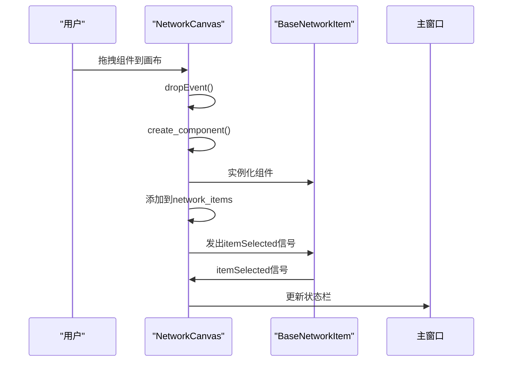
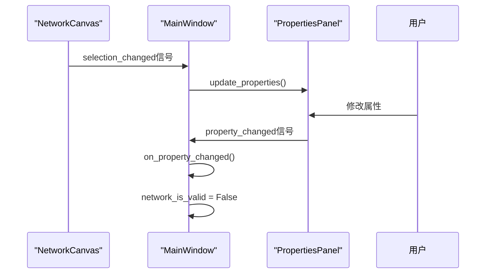
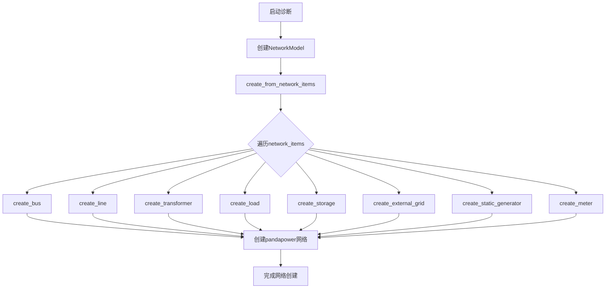
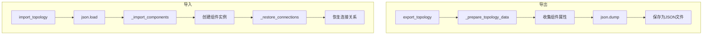
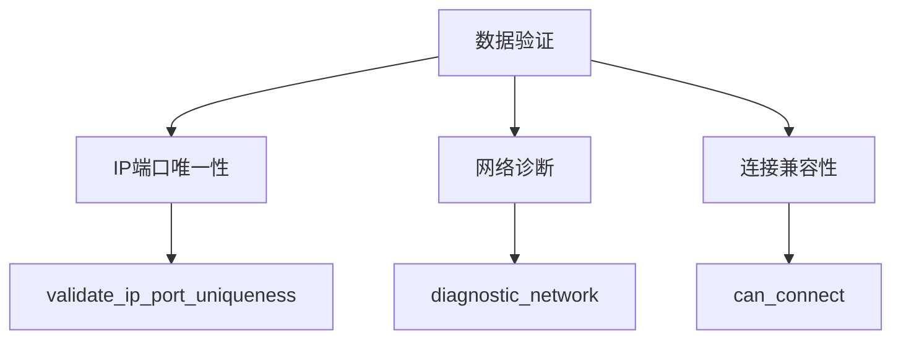
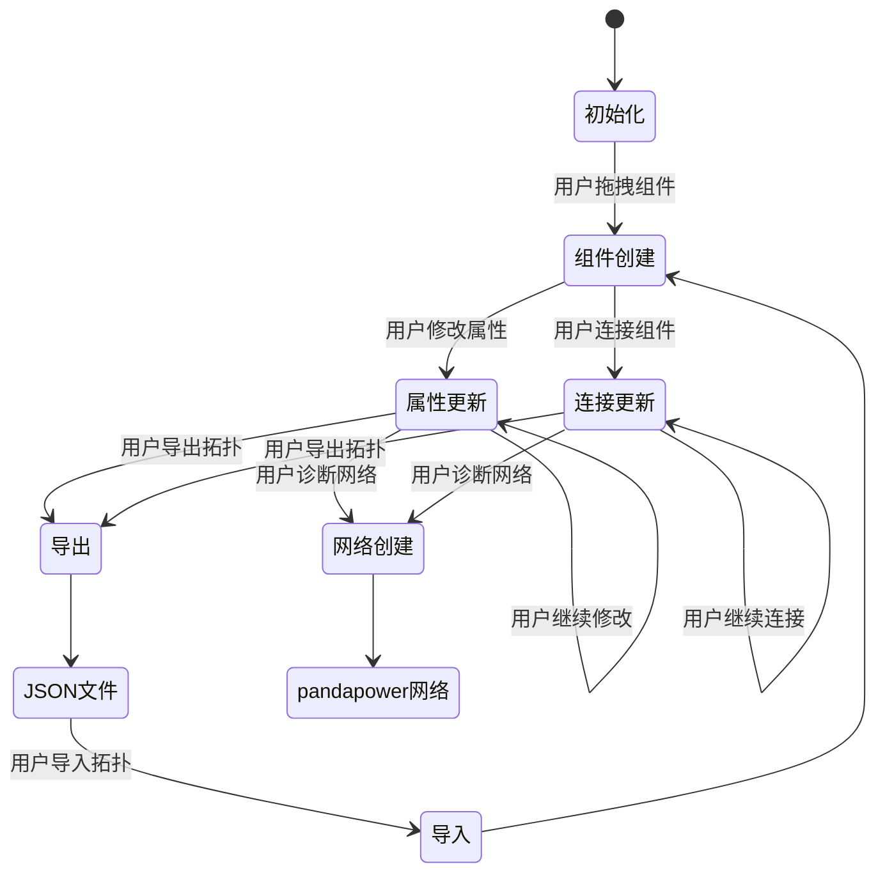

# 数据流

<cite>
**本文档引用的文件**   
- [canvas.py](file://src/components/canvas.py)
- [main_window.py](file://src/components/main_window.py)
- [network_items.py](file://src/components/network_items.py)
- [topology_utils.py](file://src/components/topology_utils.py)
- [network_model.py](file://src/models/network_model.py)
</cite>

## 目录
1. [引言](#引言)
2. [数据流概述](#数据流概述)
3. [画布组件拖拽与信号传递](#画布组件拖拽与信号传递)
4. [主窗口的数据处理](#主窗口的数据处理)
5. [网络模型创建](#网络模型创建)
6. [拓扑工具的数据序列化与反序列化](#拓扑工具的数据序列化与反序列化)
7. [数据验证](#数据验证)
8. [关键数据模型生命周期](#关键数据模型生命周期)
9. [结论](#结论)

## 引言
本文档详细阐述了pp_tool系统中从用户在画布上拖拽组件开始，到数据如何通过信号传递给主窗口，再到网络模型如何根据画布状态创建pandapower网络的完整数据流。重点描述了拓扑工具（topology_utils.py）在导入/导出JSON文件时的数据序列化和反序列化过程，使用数据流图说明关键数据模型（如network_items字典）的生命周期和流转，并解释数据验证（如diagnostic_network方法）在数据流中的位置和作用。

## 数据流概述
pp_tool系统的数据流始于用户在画布上的交互操作，如拖拽组件、连接设备等。这些操作触发信号，将数据传递给主窗口进行处理。主窗口负责协调各个组件，管理全局数据状态，并在需要时调用网络模型和拓扑工具。网络模型根据画布状态创建pandapower网络，而拓扑工具则负责将画布状态序列化为JSON文件或从JSON文件反序列化恢复画布状态。在整个数据流中，数据验证机制确保网络的正确性和一致性。

## 画布组件拖拽与信号传递
当用户在画布上拖拽组件时，`NetworkCanvas`类的`dropEvent`方法被触发。该方法获取组件类型和放置位置，然后调用`create_component`方法创建对应的电网组件。`create_component`方法根据组件类型实例化相应的图形项（如`BusItem`、`LineItem`等），并将其添加到全局`network_items`字典中。组件创建后，通过`itemSelected`信号通知主窗口，主窗口的`properties_panel`更新属性面板显示。

**Diagram sources**
- [canvas.py](file://src/components/canvas.py#L142-L227)

**Section sources**
- [canvas.py](file://src/components/canvas.py#L142-L227)

## 主窗口的数据处理
主窗口（`MainWindow`）是系统的核心协调者。它初始化`network_items`字典，用于存储所有组件实例。当画布发出信号时，主窗口的`properties_panel`接收`selection_changed`信号并更新属性面板。用户在属性面板中修改组件属性时，`property_changed`信号被触发，主窗口的`on_property_changed`方法处理该信号，更新`network_is_valid`标志位，表示网络状态已改变。

**Diagram sources**
- [main_window.py](file://src/components/main_window.py#L101-L112)
- [main_window.py](file://src/components/main_window.py#L175-L179)

**Section sources**
- [main_window.py](file://src/components/main_window.py#L101-L112)
- [main_window.py](file://src/components/main_window.py#L175-L179)

## 网络模型创建
当用户执行仿真操作时，主窗口调用`diagnostic_network`方法启动网络诊断线程。该方法首先创建`NetworkModel`实例，然后调用`create_from_network_items`方法从`network_items`字典创建pandapower网络模型。`create_from_network_items`方法遍历`network_items`，根据组件类型和连接关系调用相应的`create_*`方法（如`create_bus`、`create_line`等）在pandapower网络中创建对应元件。

**Diagram sources**
- [main_window.py](file://src/components/main_window.py#L346-L408)
- [network_model.py](file://src/models/network_model.py#L407-L582)

**Section sources**
- [main_window.py](file://src/components/main_window.py#L346-L408)
- [network_model.py](file://src/models/network_model.py#L407-L582)

## 拓扑工具的数据序列化与反序列化
`TopologyManager`类负责处理网络拓扑结构的导入导出。导出时，`export_topology`方法遍历画布中的所有组件，调用`_prepare_topology_data`方法将组件属性收集到`topology_data`字典中，然后使用`json.dump`将数据序列化为JSON文件。导入时，`import_topology`方法使用`json.load`从JSON文件反序列化数据，调用`_import_components`方法创建组件实例，并通过`_restore_connections`方法恢复组件间的连接关系。

**Diagram sources**
- [topology_utils.py](file://src/components/topology_utils.py#L193-L245)
- [topology_utils.py](file://src/components/topology_utils.py#L246-L292)

**Section sources**
- [topology_utils.py](file://src/components/topology_utils.py#L193-L292)

## 数据验证
数据验证在多个环节进行。在导入/导出拓扑时，`validate_ip_port_uniqueness`方法检查所有组件的IP地址和端口号的唯一性，防止通信冲突。在网络诊断时，`diagnostic_network`方法调用pandapower的`diagnostic`函数检查网络的拓扑和电气特性，确保网络的正确性和可解性。此外，组件连接时，`can_connect`方法检查连接的兼容性，防止无效连接。

**Diagram sources**
- [topology_utils.py](file://src/components/topology_utils.py#L21-L104)
- [main_window.py](file://src/components/main_window.py#L346-L447)

**Section sources**
- [topology_utils.py](file://src/components/topology_utils.py#L21-L104)
- [main_window.py](file://src/components/main_window.py#L346-L447)

## 关键数据模型生命周期
`network_items`字典是系统的核心数据模型，其生命周期贯穿整个应用。初始化时，主窗口创建空的`network_items`字典。用户在画布上创建组件时，组件实例被添加到`network_items`中。当用户修改组件属性或连接组件时，`network_items`中的数据被更新。导入/导出拓扑时，`network_items`与JSON文件进行序列化和反序列化。最后，当用户创建网络模型时，`network_items`中的数据被转换为pandapower网络。

**Diagram sources**
- [main_window.py](file://src/components/main_window.py#L101-L112)
- [canvas.py](file://src/components/canvas.py#L193-L227)
- [topology_utils.py](file://src/components/topology_utils.py#L193-L292)
- [network_model.py](file://src/models/network_model.py#L407-L582)

**Section sources**
- [main_window.py](file://src/components/main_window.py#L101-L112)
- [canvas.py](file://src/components/canvas.py#L193-L227)
- [topology_utils.py](file://src/components/topology_utils.py#L193-L292)
- [network_model.py](file://src/models/network_model.py#L407-L582)

## 结论
pp_tool系统的数据流设计清晰，从用户交互到数据处理，再到网络模型创建和验证，形成了一个完整的闭环。`network_items`字典作为核心数据模型，贯穿整个生命周期，确保了数据的一致性和完整性。拓扑工具的序列化和反序列化机制使得网络状态可以持久化存储和恢复。数据验证机制在多个环节发挥作用，保证了网络的正确性和可靠性。整体架构合理，易于维护和扩展。