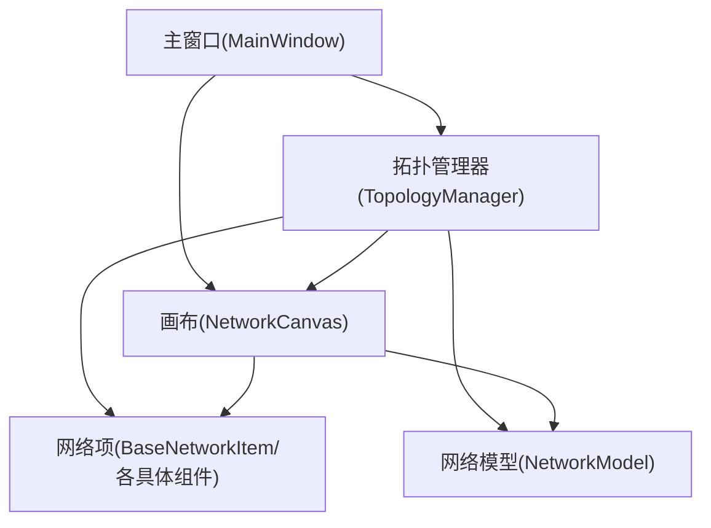
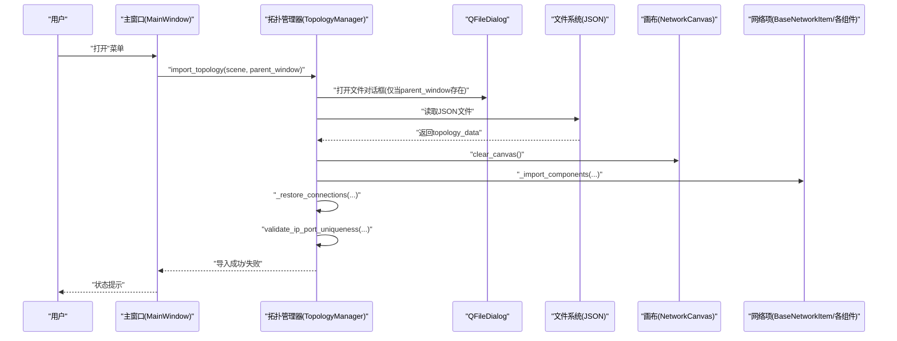
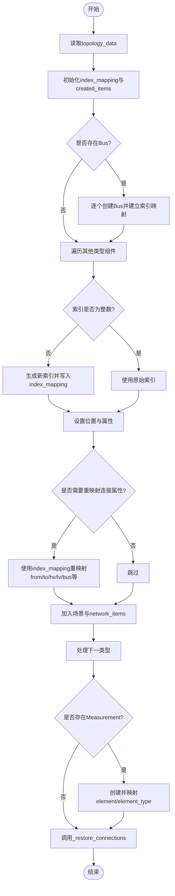
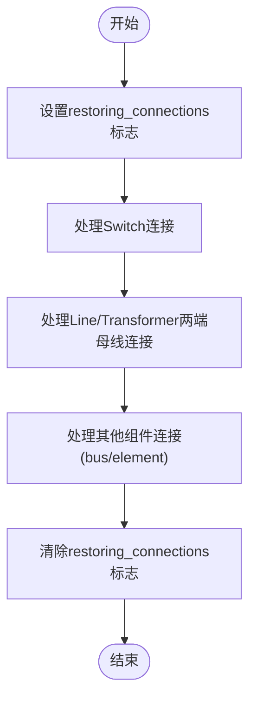
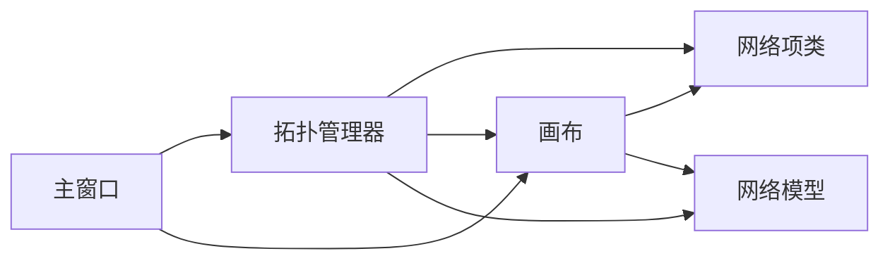

# 拓扑导入数据流

<cite>
**本文引用的文件**
- [src/components/topology_utils.py](file://src/components/topology_utils.py)
- [src/components/canvas.py](file://src/components/canvas.py)
- [src/components/main_window.py](file://src/components/main_window.py)
- [src/components/network_items.py](file://src/components/network_items.py)
- [src/models/network_model.py](file://src/models/network_model.py)
- [topology.json](file://topology.json)
- [topology_one_level_with_connections.json](file://topology_one_level_with_connections.json)
</cite>

## 目录
1. [简介](#简介)
2. [项目结构](#项目结构)
3. [核心组件](#核心组件)
4. [架构总览](#架构总览)
5. [详细组件分析](#详细组件分析)
6. [依赖关系分析](#依赖关系分析)
7. [性能考量](#性能考量)
8. [故障排查指南](#故障排查指南)
9. [结论](#结论)
10. [附录](#附录)

## 简介
本文件围绕pp_tool的“拓扑导入”能力，系统梳理TopologyManager类的import_topology方法执行流程，重点解释：
- 如何通过QFileDialog获取JSON文件路径
- 使用json.load进行反序列化
- 调用canvas.clear_canvas清空当前画布
- _import_components如何根据component_type动态实例化组件并重建index_mapping以处理非连续索引
- _restore_connections如何分阶段恢复开关、线路、变压器及其他组件的连接关系
- validate_ip_port_uniqueness在导入后验证中的作用
- 数据流图展示从文件读取到场景重建的全过程

## 项目结构
pp_tool采用分层设计：
- 主窗口负责菜单与交互入口
- 拓扑管理器负责导入/导出与校验
- 画布负责场景与连接
- 网络项提供组件基类与索引分配
- 网络模型负责将图形拓扑映射为pandapower网络

图表来源
- [src/components/main_window.py](file://src/components/main_window.py#L95-L120)
- [src/components/topology_utils.py](file://src/components/topology_utils.py#L246-L293)
- [src/components/canvas.py](file://src/components/canvas.py#L1105-L1119)
- [src/components/network_items.py](file://src/components/network_items.py#L24-L103)
- [src/models/network_model.py](file://src/models/network_model.py#L1-L40)

章节来源
- [src/components/main_window.py](file://src/components/main_window.py#L95-L120)
- [src/components/topology_utils.py](file://src/components/topology_utils.py#L246-L293)
- [src/components/canvas.py](file://src/components/canvas.py#L1105-L1119)
- [src/components/network_items.py](file://src/components/network_items.py#L24-L103)
- [src/models/network_model.py](file://src/models/network_model.py#L1-L40)

## 核心组件
- TopologyManager：负责导入/导出拓扑、IP端口唯一性校验、组件实例化与连接恢复
- NetworkCanvas：负责场景清空、组件连接、网格绘制等
- BaseNetworkItem：提供组件基类、索引分配与连接点管理
- NetworkModel：将图形拓扑映射为pandapower网络（导入后可进一步仿真）

章节来源
- [src/components/topology_utils.py](file://src/components/topology_utils.py#L17-L120)
- [src/components/canvas.py](file://src/components/canvas.py#L1105-L1119)
- [src/components/network_items.py](file://src/components/network_items.py#L24-L103)
- [src/models/network_model.py](file://src/models/network_model.py#L1-L40)

## 架构总览
拓扑导入的关键调用链如下：
- 主窗口触发open_topology
- TopologyManager.import_topology读取JSON并反序列化
- 清空画布
- 实例化组件并重建索引映射
- 分阶段恢复连接
- 导入后进行IP端口唯一性校验

图表来源
- [src/components/main_window.py](file://src/components/main_window.py#L477-L496)
- [src/components/topology_utils.py](file://src/components/topology_utils.py#L246-L293)
- [src/components/canvas.py](file://src/components/canvas.py#L1105-L1119)

## 详细组件分析

### TopologyManager.import_topology执行流程
- 文件选择与读取
  - 若parent_window为None，默认使用默认文件名；否则弹出QFileDialog选择JSON文件
  - 使用json.load读取文件内容为topology_data
- 清空画布
  - 调用parent_window.canvas.clear_canvas()清空场景与全局network_items字典
- 组件导入
  - 调用_import_components，按拓扑类型遍历并实例化组件
  - 为母线建立index_mapping，处理非连续索引
  - 其他组件根据类型设置位置与属性，更新network_items字典
- 连接恢复
  - 调用_restore_connections，分阶段恢复连接关系
- 导入后校验
  - 调用validate_ip_port_uniqueness进行IP端口唯一性校验

章节来源
- [src/components/topology_utils.py](file://src/components/topology_utils.py#L246-L293)
- [src/components/canvas.py](file://src/components/canvas.py#L1105-L1119)

### _import_components：动态实例化与index_mapping重建
- 母线优先处理
  - 读取Bus数据，若索引为整数则直接使用；否则自动生成索引并设置geodata
  - 更新network_items['bus']映射
- 其他组件
  - 根据component_type映射到具体类，设置位置与属性
  - 非连续索引处理：为不同类型的设备维护power_dev_index，生成连续的新索引并写入index_mapping
  - 线路/变压器/负载等连接属性使用index_mapping进行重映射
- 电表处理
  - Measurement类型特殊处理element/element_type，通过index_mapping映射到目标设备
- 连接信号绑定
  - 将组件选中信号连接到画布handle_item_selected

图表来源
- [src/components/topology_utils.py](file://src/components/topology_utils.py#L309-L460)

章节来源
- [src/components/topology_utils.py](file://src/components/topology_utils.py#L309-L460)

### _restore_connections：分阶段恢复连接关系
- 设置导入标志
  - 对所有已创建组件设置restoring_connections标志，避免在恢复连接过程中更新与开关相连设备的母线参数
- 第一步：开关连接
  - 先连接到bus，再连接到element（根据et属性确定目标类型：b=母线、l=线路、t=变压器）
- 第二步：线路与变压器
  - 分别根据from_bus/to_bus与hv_bus/lv_bus连接到两端母线
- 第三步：其他组件
  - 负载/光伏/储能/充电站/外部电网等优先按bus连接
  - 电表优先按bus连接，否则按element/element_type映射到目标设备
- 清理标志
  - 恢复完成后清除restoring_connections标志

图表来源
- [src/components/topology_utils.py](file://src/components/topology_utils.py#L461-L619)

章节来源
- [src/components/topology_utils.py](file://src/components/topology_utils.py#L461-L619)

### validate_ip_port_uniqueness：导入后验证
- 遍历场景中所有组件，收集具有ip/port属性的设备
- 统计重复的(ip, port)组合，以及仅有单个字段有效的设备
- 生成错误消息并在parent_window存在时弹窗警告
- 返回校验结果与错误信息

章节来源
- [src/components/topology_utils.py](file://src/components/topology_utils.py#L21-L104)

### 画布清空：clear_canvas
- 清空场景items
- 清空全局network_items字典
- 重置组件计数器，避免多次导入导致索引累积
- 重新绘制网格

章节来源
- [src/components/canvas.py](file://src/components/canvas.py#L1105-L1119)

### 索引分配与连接点管理
- BaseNetworkItem提供组件类型级的索引计数器与回收池，保证索引连续性
- 连接点管理与连接约束在画布connect_items中体现，导入时通过_restore_connections按拓扑数据恢复

章节来源
- [src/components/network_items.py](file://src/components/network_items.py#L24-L103)
- [src/components/canvas.py](file://src/components/canvas.py#L406-L495)

## 依赖关系分析
- 主窗口依赖拓扑管理器与画布
- 拓扑管理器依赖网络项类、画布、日志
- 画布依赖网络项类、连接点管理
- 网络模型依赖pandapower，用于将图形拓扑映射为pandapower网络

图表来源
- [src/components/main_window.py](file://src/components/main_window.py#L95-L120)
- [src/components/topology_utils.py](file://src/components/topology_utils.py#L17-L120)
- [src/components/canvas.py](file://src/components/canvas.py#L1-L60)
- [src/models/network_model.py](file://src/models/network_model.py#L1-L40)

章节来源
- [src/components/main_window.py](file://src/components/main_window.py#L95-L120)
- [src/components/topology_utils.py](file://src/components/topology_utils.py#L17-L120)
- [src/components/canvas.py](file://src/components/canvas.py#L1-L60)
- [src/models/network_model.py](file://src/models/network_model.py#L1-L40)

## 性能考量
- 导入流程涉及大量组件创建与连接，建议：
  - 控制单次导入规模，避免一次性创建过多组件
  - 在导入前尽量减少不必要的组件与连接，降低_restore_connections复杂度
  - 使用index_mapping避免重复映射计算
  - 导入完成后及时调用fit_in_view以优化视图渲染

## 故障排查指南
- 导入失败
  - 检查JSON文件路径与格式是否正确
  - 确认文件存在且可读
  - 关注导入异常弹窗与日志输出
- 连接异常
  - 检查from/to/hv/lv/bus等连接属性是否在index_mapping范围内
  - 确认et属性与element_type映射正确
- IP端口冲突
  - validate_ip_port_uniqueness会提示重复或不完整配置
  - 修改组件属性后重新导入

章节来源
- [src/components/topology_utils.py](file://src/components/topology_utils.py#L246-L293)
- [src/components/topology_utils.py](file://src/components/topology_utils.py#L21-L104)

## 结论
pp_tool的拓扑导入流程通过TopologyManager统一调度，结合QFileDialog与json.load完成文件读取，借助canvas.clear_canvas清空旧场景，随后在_import_components中动态实例化组件并重建索引映射，最终在_restore_connections中分阶段恢复各类连接关系。validate_ip_port_uniqueness贯穿导入前后，确保网络配置的完整性与一致性。整体流程清晰、职责明确，适合扩展至更复杂的拓扑场景。

## 附录
- 示例拓扑文件
  - topology.json：基础拓扑示例
  - topology_one_level_with_connections.json：包含连接关系的示例

章节来源
- [topology.json](file://topology.json)
- [topology_one_level_with_connections.json](file://topology_one_level_with_connections.json)