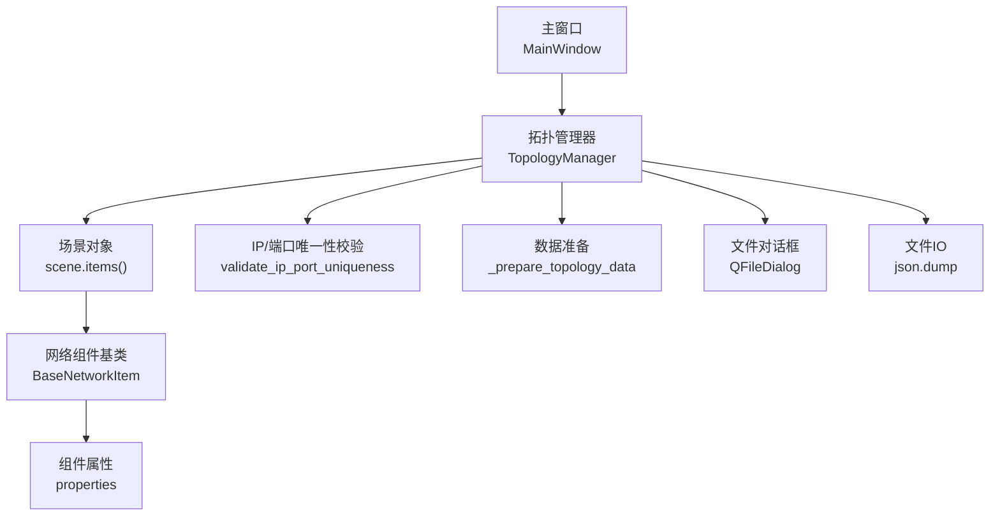
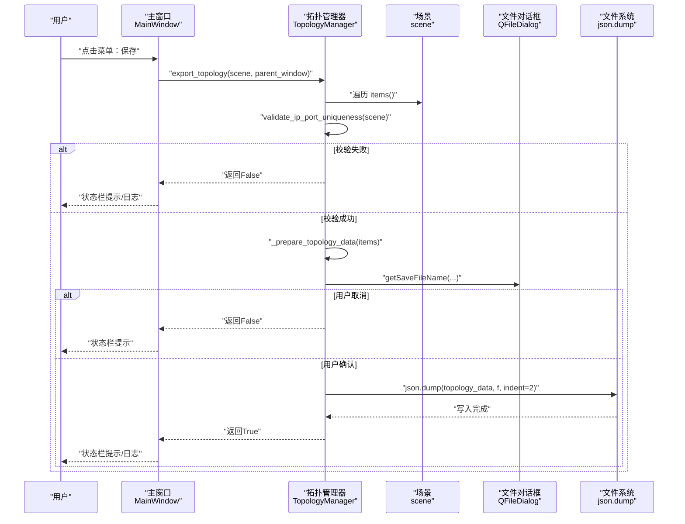
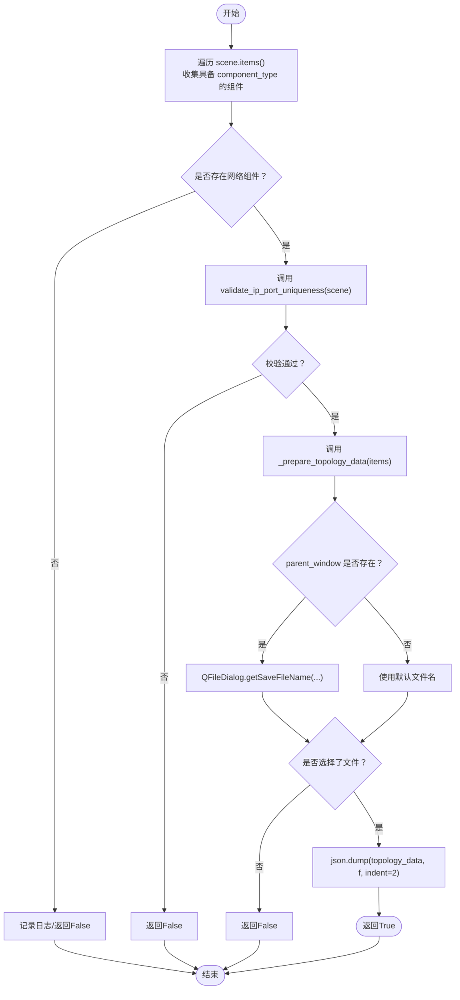
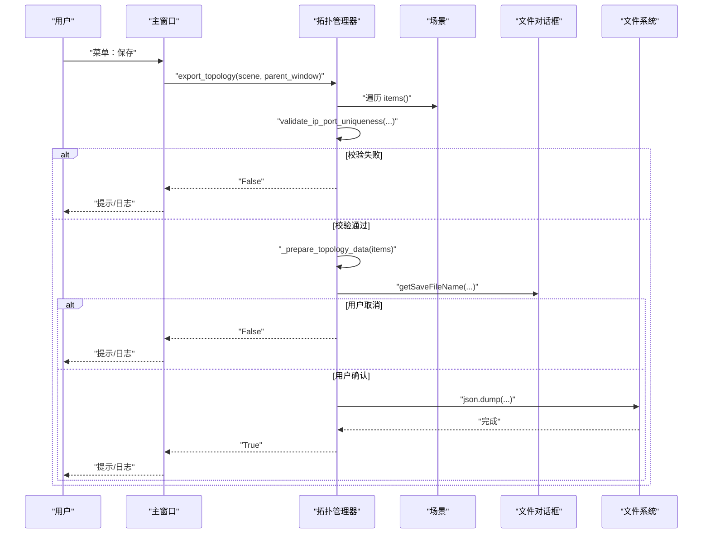
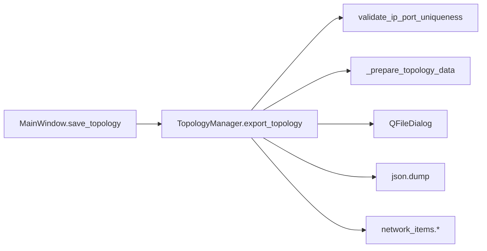

# 拓扑导出数据流

<cite>
**本文引用的文件**
- [src/components/topology_utils.py](file://src/components/topology_utils.py)
- [src/components/main_window.py](file://src/components/main_window.py)
- [src/components/network_items.py](file://src/components/network_items.py)
- [topology.json](file://topology.json)
</cite>

## 目录
1. [简介](#简介)
2. [项目结构](#项目结构)
3. [核心组件](#核心组件)
4. [架构总览](#架构总览)
5. [详细组件分析](#详细组件分析)
6. [依赖关系分析](#依赖关系分析)
7. [性能考量](#性能考量)
8. [故障排查指南](#故障排查指南)
9. [结论](#结论)

## 简介
本文件聚焦于pp_tool的拓扑导出能力，系统性梳理TopologyManager类的export_topology方法执行流程，涵盖：
- 如何遍历场景中的所有网络组件
- 如何调用_validate_ip_port_uniqueness进行数据完整性验证
- 如何通过_prepare_topology_data将组件属性转换为JSON可序列化格式
- topology_data字典的结构设计及按组件类型分类存储的策略
- QFileDialog如何处理文件保存对话框的交互逻辑
- json.dump如何实现数据持久化
- 使用时序图展示从用户触发导出操作到文件写入完成的完整流程
- 异常处理机制与错误提示策略

## 项目结构
与拓扑导出相关的代码主要分布在以下模块：
- 主窗口负责菜单触发与UI反馈：[src/components/main_window.py](file://src/components/main_window.py)
- 拓扑管理器负责导出/导入、数据准备与校验：[src/components/topology_utils.py](file://src/components/topology_utils.py)
- 网络组件基类提供组件属性接口（properties）：[src/components/network_items.py](file://src/components/network_items.py)
- 示例拓扑文件用于对照理解输出结构：[topology.json](file://topology.json)

图表来源
- [src/components/main_window.py](file://src/components/main_window.py#L497-L516)
- [src/components/topology_utils.py](file://src/components/topology_utils.py#L193-L244)
- [src/components/network_items.py](file://src/components/network_items.py#L45-L56)

章节来源
- [src/components/main_window.py](file://src/components/main_window.py#L497-L516)
- [src/components/topology_utils.py](file://src/components/topology_utils.py#L193-L244)
- [src/components/network_items.py](file://src/components/network_items.py#L45-L56)

## 核心组件
- TopologyManager.export_topology：导出入口，串联遍历、校验、准备、对话框与写盘流程
- TopologyManager.validate_ip_port_uniqueness：对场景中具备ip/port属性的组件进行唯一性校验
- TopologyManager._prepare_topology_data：将组件属性按拓扑类型分组，构建可序列化的字典结构
- MainWindow.save_topology：菜单触发的导出入口，向上层提供UI反馈
- BaseNetworkItem.properties：组件属性容器，作为导出数据源

章节来源
- [src/components/topology_utils.py](file://src/components/topology_utils.py#L193-L244)
- [src/components/topology_utils.py](file://src/components/topology_utils.py#L20-L103)
- [src/components/topology_utils.py](file://src/components/topology_utils.py#L294-L306)
- [src/components/main_window.py](file://src/components/main_window.py#L497-L516)
- [src/components/network_items.py](file://src/components/network_items.py#L45-L56)

## 架构总览
拓扑导出采用“控制器-服务-模型”分层：
- 控制器：MainWindow.save_topology负责响应菜单事件
- 服务：TopologyManager.export_topology封装导出业务逻辑
- 模型：BaseNetworkItem.properties承载组件属性，scene.items()提供遍历入口

图表来源
- [src/components/main_window.py](file://src/components/main_window.py#L497-L516)
- [src/components/topology_utils.py](file://src/components/topology_utils.py#L193-L244)

## 详细组件分析

### TopologyManager.export_topology 执行流程
- 遍历场景：从scene.items()收集具备component_type属性的网络组件
- 数据完整性校验：调用validate_ip_port_uniqueness，检测IP与端口组合重复、单边缺失等情况
- 数据准备：调用_prepare_topology_data，按拓扑类型（如Bus、Line、Transformer等）分组，将item.properties作为字典条目
- 交互与持久化：若parent_window存在，弹出QFileDialog；否则使用默认文件名；写入json.dump，缩进美化
- 异常处理：捕获顶层异常，记录日志并返回False；对话框异常回退为默认文件名

图表来源
- [src/components/topology_utils.py](file://src/components/topology_utils.py#L193-L244)

章节来源
- [src/components/topology_utils.py](file://src/components/topology_utils.py#L193-L244)

### _prepare_topology_data 数据结构设计
- 输入：组件列表（来自scene.items()）
- 输出：字典，键为“拓扑类型”，值为该类型的组件属性列表
- 拓扑类型映射：通过内部映射表将组件类型转换为拓扑类型键，例如：
  - bus → Bus
  - line → Line
  - transformer → Transformer
  - static_generator → Static_Generator
  - external_grid → External_Grid
  - meter → Measurement
  - charger → Charger
  - switch → Switch
- 结果样例（与示例文件一致）：
  - "Bus": [...]
  - "Line": [...]
  - "Transformer": [...]
  - "Load": [...]
  - "Storage": [...]
  - "Static_Generator": [...]
  - "External_Grid": [...]
  - "Charger": [...]
  - "Switch": [...]
  - "Measurement": [...]

章节来源
- [src/components/topology_utils.py](file://src/components/topology_utils.py#L294-L306)
- [src/components/topology_utils.py](file://src/components/topology_utils.py#L134-L146)
- [topology.json](file://topology.json#L1-L524)

### _validate_ip_port_uniqueness 数据完整性验证
- 适用范围：仅对具备properties且包含'ip'和'port'字段的组件生效
- 处理规则：
  - 将None与'None'字符串转换为空字符串，便于统一比较
  - 对于同时拥有有效IP与端口的组件，以(ip, port)为键聚合设备标识
  - 对于仅有单边有效（IP或端口之一为空）的组件，记录为“配置不完整”
  - 对于重复的(ip, port)组合，记录为“重复配置”
- 错误提示：当存在重复或不完整配置时，弹出警告框并返回False，阻止导出
- 异常兜底：捕获异常并提示“验证错误”

章节来源
- [src/components/topology_utils.py](file://src/components/topology_utils.py#L20-L103)

### QFileDialog 交互逻辑
- 若parent_window存在：调用QFileDialog.getSaveFileName(parent_window, "导出拓扑结构", "topology.json", "JSON文件 (*.json)")
- 若抛出异常：记录错误日志并回退到默认文件名"topology.json"
- 若用户取消：返回False，不进行写入
- 若用户确认：继续写入流程

章节来源
- [src/components/topology_utils.py](file://src/components/topology_utils.py#L216-L233)

### json.dump 数据持久化
- 使用open(file_path, 'w', encoding='utf-8')以UTF-8编码写入
- 通过json.dump(topology_data, f, ensure_ascii=False, indent=2)实现：
  - ensure_ascii=False：保留中文字符
  - indent=2：美化输出，提升可读性
- 成功后记录日志并返回True

章节来源
- [src/components/topology_utils.py](file://src/components/topology_utils.py#L234-L238)

### 从用户触发到文件写入的时序图

图表来源
- [src/components/main_window.py](file://src/components/main_window.py#L497-L516)
- [src/components/topology_utils.py](file://src/components/topology_utils.py#L193-L244)

## 依赖关系分析
- TopologyManager依赖：
  - PySide6的QFileDialog、QMessageBox用于对话框与提示
  - utils/logger用于日志记录
  - components/network_items中的各类组件类（BusItem、LineItem、TransformerItem等）用于类型映射与连接关系
- MainWindow依赖：
  - 通过self.topology_manager.export_topology实现菜单保存功能
  - 通过self.canvas.scene提供场景对象

图表来源
- [src/components/main_window.py](file://src/components/main_window.py#L497-L516)
- [src/components/topology_utils.py](file://src/components/topology_utils.py#L193-L244)

章节来源
- [src/components/main_window.py](file://src/components/main_window.py#L497-L516)
- [src/components/topology_utils.py](file://src/components/topology_utils.py#L193-L244)

## 性能考量
- 遍历场景：对scene.items()的线性扫描，复杂度O(N)，N为场景中组件数量
- 校验阶段：对具备ip/port属性的组件进行哈希映射与二次扫描，整体近似O(M)，M为含ip/port属性的组件数
- 数据准备：按拓扑类型分组，复杂度O(M)
- 文件写入：json.dump的复杂度与数据量成正比，indent美化会增加I/O与字符串处理开销
- 建议：
  - 大规模场景下，尽量减少不必要的属性冗余
  - 导出前可先进行轻量预检，避免重复校验
  - 对于超大拓扑，考虑分批导出或异步写入

## 故障排查指南
- “无网络组件”：当场景中不含具备component_type的组件时，导出会返回False并记录警告
- “IP/端口不唯一”：出现重复或单边缺失配置时，会弹窗警告并阻止导出
- “文件对话框失败”：捕获异常后回退到默认文件名，同时记录错误日志
- “保存失败”：顶层异常被捕获并记录日志，主窗口给出错误提示
- “中文乱码”：json.dump已启用ensure_ascii=False，确保中文正常显示

章节来源
- [src/components/topology_utils.py](file://src/components/topology_utils.py#L202-L244)
- [src/components/topology_utils.py](file://src/components/topology_utils.py#L221-L233)
- [src/components/topology_utils.py](file://src/components/topology_utils.py#L234-L238)
- [src/components/main_window.py](file://src/components/main_window.py#L497-L516)

## 结论
TopologyManager.export_topology通过清晰的职责划分与稳健的异常处理，实现了从场景到JSON文件的可靠导出。其关键特性包括：
- 严格的IP/端口唯一性校验，保障数据完整性
- 以拓扑类型为键的结构化输出，便于后续导入与解析
- 与QFileDialog的无缝集成，提供友好的用户交互
- 完善的日志与错误提示，便于定位问题