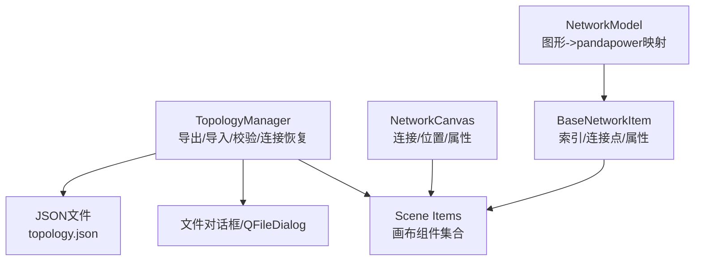
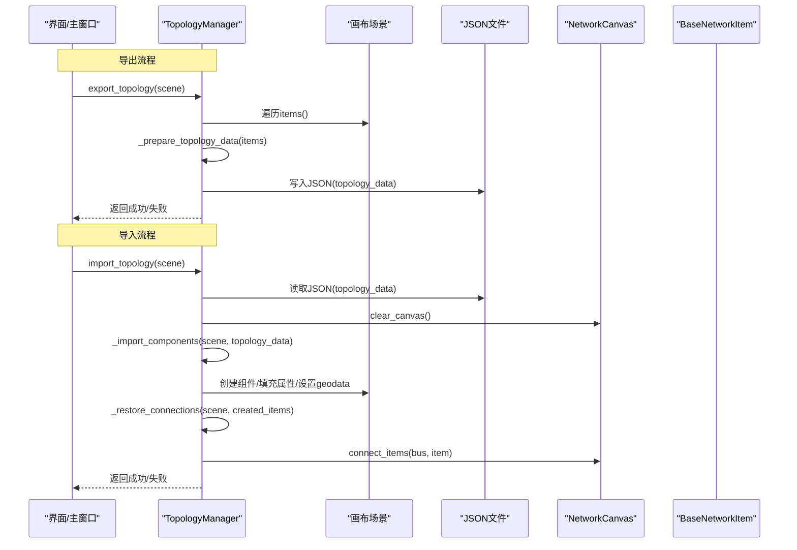
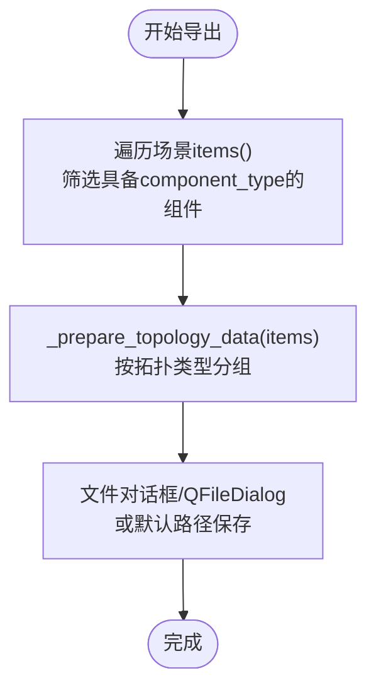
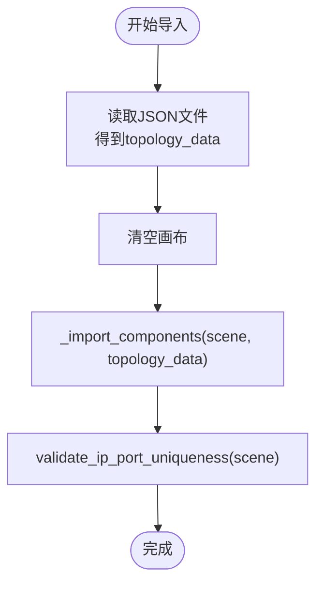
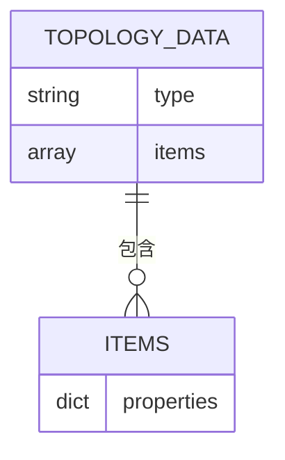
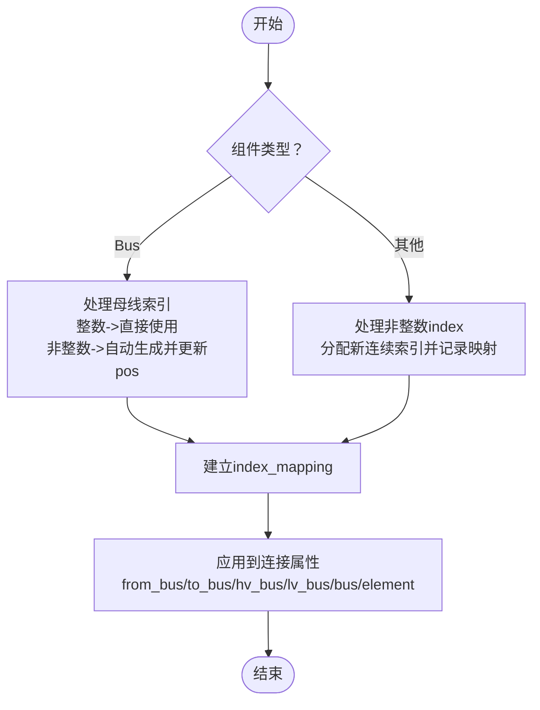
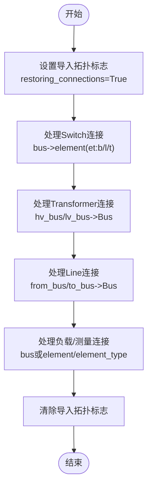
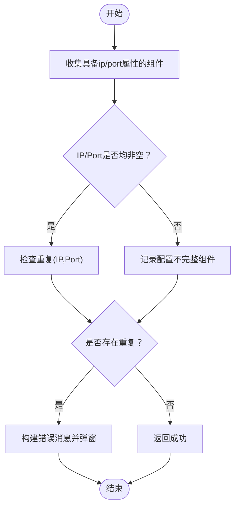
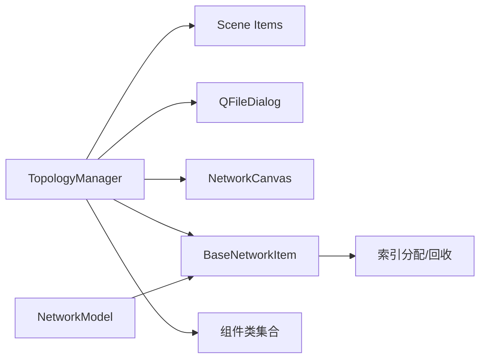

# 文件导入导出数据流

<cite>
**本文引用的文件**
- [src/components/topology_utils.py](file://src/components/topology_utils.py)
- [src/components/canvas.py](file://src/components/canvas.py)
- [src/components/network_items.py](file://src/components/network_items.py)
- [src/models/network_model.py](file://src/models/network_model.py)
- [topology.json](file://topology.json)
- [topology_test.json](file://topology_test.json)
</cite>

## 目录
1. [简介](#简介)
2. [项目结构](#项目结构)
3. [核心组件](#核心组件)
4. [架构总览](#架构总览)
5. [详细组件分析](#详细组件分析)
6. [依赖关系分析](#依赖关系分析)
7. [性能考量](#性能考量)
8. [故障排查指南](#故障排查指南)
9. [结论](#结论)

## 简介
本文件聚焦pp_tool的“文件导入导出”数据流，围绕TopologyManager类展开，系统阐述：
- 导出：遍历画布组件，将属性序列化为JSON结构；
- 导入：解析JSON，重建组件与连接关系；
- 关键机制：index_mapping在处理非连续索引时的作用；
- 连接恢复：_restore_connections如何按类型恢复连接；
- 数据完整性：validate_ip_port_uniqueness在导入/导出前后执行的校验；
- 数据结构：topology_data的组织形式与转换过程。

## 项目结构
与导入导出密切相关的模块与文件：
- 导入导出核心：TopologyManager（导出/导入/校验/连接恢复）
- 画布与组件：NetworkCanvas（连接、位置、属性）、BaseNetworkItem（索引、连接点、属性）
- 模型层：NetworkModel（将图形组件映射为pandapower网络模型，便于后续仿真）

图表来源
- [src/components/topology_utils.py](file://src/components/topology_utils.py#L193-L293)
- [src/components/canvas.py](file://src/components/canvas.py#L1-L220)
- [src/components/network_items.py](file://src/components/network_items.py#L1-L120)
- [src/models/network_model.py](file://src/models/network_model.py#L407-L581)

章节来源
- [src/components/topology_utils.py](file://src/components/topology_utils.py#L193-L293)
- [src/components/canvas.py](file://src/components/canvas.py#L1-L220)
- [src/components/network_items.py](file://src/components/network_items.py#L1-L120)
- [src/models/network_model.py](file://src/models/network_model.py#L407-L581)

## 核心组件
- TopologyManager
  - export_topology：遍历场景组件，调用_prepare_topology_data生成topology_data，再写入JSON文件。
  - import_topology：读取JSON，清空画布，调用_import_components重建组件，随后执行validate_ip_port_uniqueness校验。
  - validate_ip_port_uniqueness：收集具备ip/port属性的组件，校验唯一性与完整性。
  - _import_components：建立index_mapping，按类型创建组件，填充属性，设置geodata位置，最后调用_restore_connections。
  - _restore_connections：分阶段恢复连接（开关、变压器/线路、其他负载/测量），使用created_items字典定位目标组件。
- NetworkCanvas
  - 提供connect_items、get_connected_buses等能力，导入后通过canvas.connect_items恢复连接。
- BaseNetworkItem
  - 统一的索引分配机制（_get_next_index），支持回收池，保证索引连续性。
- NetworkModel
  - 从图形组件创建pandapower网络模型，提供create_from_network_items等方法，便于后续仿真。

章节来源
- [src/components/topology_utils.py](file://src/components/topology_utils.py#L193-L656)
- [src/components/canvas.py](file://src/components/canvas.py#L406-L561)
- [src/components/network_items.py](file://src/components/network_items.py#L87-L120)
- [src/models/network_model.py](file://src/models/network_model.py#L407-L581)

## 架构总览
下图展示从导出到导入的端到端数据流，以及关键参与方之间的交互。

图表来源
- [src/components/topology_utils.py](file://src/components/topology_utils.py#L193-L293)
- [src/components/topology_utils.py](file://src/components/topology_utils.py#L294-L460)
- [src/components/topology_utils.py](file://src/components/topology_utils.py#L461-L619)
- [src/components/canvas.py](file://src/components/canvas.py#L406-L561)

## 详细组件分析

### 导出流程：export_topology
- 步骤概览
  - 遍历场景中的网络组件（具备component_type属性）。
  - 调用_prepare_topology_data将组件属性聚合为topology_data。
  - 通过文件对话框或默认路径保存为JSON。
- 数据结构
  - topology_data为字典，键为“拓扑类型”（如Bus、Line、Transformer等），值为该类型的组件属性列表。
  - 每个组件属性字典来自item.properties，包含geodata、连接属性（如from_bus/to_bus、hv_bus/lv_bus、bus等）及业务字段（如name、p_mw等）。

图表来源
- [src/components/topology_utils.py](file://src/components/topology_utils.py#L193-L245)
- [src/components/topology_utils.py](file://src/components/topology_utils.py#L294-L307)

章节来源
- [src/components/topology_utils.py](file://src/components/topology_utils.py#L193-L245)
- [src/components/topology_utils.py](file://src/components/topology_utils.py#L294-L307)

### 导入流程：import_topology
- 步骤概览
  - 读取JSON文件为topology_data。
  - 清空画布，调用_import_components按类型创建组件。
  - 导入后再次执行validate_ip_port_uniqueness校验。
- 数据结构
  - topology_data与导出时一致，键为拓扑类型，值为组件属性列表。
  - 导入时会根据index字段创建组件，若index为非整数，将通过index_mapping映射到新索引。

图表来源
- [src/components/topology_utils.py](file://src/components/topology_utils.py#L246-L293)
- [src/components/topology_utils.py](file://src/components/topology_utils.py#L294-L460)
- [src/components/topology_utils.py](file://src/components/topology_utils.py#L207-L211)

章节来源
- [src/components/topology_utils.py](file://src/components/topology_utils.py#L246-L293)
- [src/components/topology_utils.py](file://src/components/topology_utils.py#L294-L460)
- [src/components/topology_utils.py](file://src/components/topology_utils.py#L207-L211)

### topology_data结构与转换
- 结构
  - 键：拓扑类型（如Bus、Line、Transformer、Load、Storage、Static_Generator、External_Grid、Measurement、Charger、Switch）。
  - 值：该类型的组件属性列表，每个元素为字典，包含geodata、连接属性、业务字段等。
- 转换过程
  - 导出：_prepare_topology_data将items按拓扑类型分组，写入JSON。
  - 导入：_import_components按类型遍历topology_data，创建组件并填充属性，同时维护index_mapping。

图表来源
- [src/components/topology_utils.py](file://src/components/topology_utils.py#L294-L307)
- [src/components/topology_utils.py](file://src/components/topology_utils.py#L294-L460)

章节来源
- [src/components/topology_utils.py](file://src/components/topology_utils.py#L294-L307)
- [src/components/topology_utils.py](file://src/components/topology_utils.py#L294-L460)

### index_mapping在处理非连续索引中的作用
- 背景
  - 导入时，某些组件的index可能为字符串或非整数，或与现有索引冲突。
- 机制
  - _import_components在处理非整数index时，使用power_dev_index为该类型组件分配新的连续整数索引，并建立old_index -> new_index的映射。
  - 对于母线（Bus），若导入index为整数则直接使用；若为非整数，则创建后自动分配新索引，并更新pos与index_mapping。
  - 对于其他组件（如Line/Transformer/Load/Storage/Static_Generator/Charger/Switch/Measurement），在导入时根据index_mapping将连接属性（如from_bus/to_bus、hv_bus/lv_bus、bus、element等）从旧索引映射到新索引。
- 影响
  - 确保导入后组件索引连续且唯一，避免连接属性指向不存在的索引。

图表来源
- [src/components/topology_utils.py](file://src/components/topology_utils.py#L312-L460)

章节来源
- [src/components/topology_utils.py](file://src/components/topology_utils.py#L312-L460)

### _restore_connections：恢复组件间连接
- 分阶段恢复
  - 开关（Switch）：先连接到bus，再连接到element（由et指示类型，b/l/t）。
  - 变压器（Transformer）与线路（Line）：分别连接到hv_bus/lv_bus与from_bus/to_bus对应的母线。
  - 其他组件（Load/Storage/Static_Generator/Charger/External_Grid/Measurement）：优先通过bus连接，Measurement也可通过element/element_type连接。
- 机制
  - 使用created_items字典（类型+索引 -> 组件实例）定位目标组件。
  - 通过canvas.connect_items(item1, item2)建立连接线与连接关系。
  - 导入期间设置restoring_connections标志，避免在恢复连接过程中误触发与开关相连设备的母线参数更新。

图表来源
- [src/components/topology_utils.py](file://src/components/topology_utils.py#L461-L619)
- [src/components/topology_utils.py](file://src/components/topology_utils.py#L470-L517)
- [src/components/topology_utils.py](file://src/components/topology_utils.py#L518-L581)
- [src/components/topology_utils.py](file://src/components/topology_utils.py#L582-L619)

章节来源
- [src/components/topology_utils.py](file://src/components/topology_utils.py#L461-L619)

### validate_ip_port_uniqueness：数据完整性验证
- 功能
  - 收集具备ip/port属性的组件，检查：
    - IP与端口均为空：视为有效（忽略）。
    - 仅IP或端口之一为空：记录为配置不完整。
    - IP与端口均非空：检查重复，重复则记录。
  - 若存在错误，弹窗提示并返回False；否则返回True。
- 时机
  - 导出前：export_topology调用validate_ip_port_uniqueness，确保导出数据满足唯一性。
  - 导入后：import_topology调用validate_ip_port_uniqueness，确保导入数据满足唯一性。

图表来源
- [src/components/topology_utils.py](file://src/components/topology_utils.py#L21-L104)

章节来源
- [src/components/topology_utils.py](file://src/components/topology_utils.py#L21-L104)

### 示例JSON参考
- topology.json：包含Bus、Line、Transformer、Load、Storage、Static_Generator、External_Grid、Measurement、Charger、Switch等类型的组件属性与连接关系。
- topology_test.json：包含更多Bus、Line、Switch、Transformer、Measurement、Charger、Static_Generator、Storage、External_Grid等，且部分组件带有ip/port等网络通信字段，便于验证validate_ip_port_uniqueness。

章节来源
- [topology.json](file://topology.json#L1-L524)
- [topology_test.json](file://topology_test.json#L1-L738)

## 依赖关系分析
- TopologyManager依赖
  - 画布场景：scene.items()用于遍历组件。
  - 文件对话框：QFileDialog用于保存/打开JSON。
  - 组件类：BusItem、LineItem、TransformerItem、LoadItem、StorageItem、ChargerItem、ExternalGridItem、StaticGeneratorItem、MeterItem、SwitchItem。
  - NetworkCanvas：connect_items用于恢复连接。
- BaseNetworkItem
  - 提供统一的索引分配与回收机制，影响导入时index_mapping的建立。
- NetworkModel
  - 与TopologyManager互补：TopologyManager负责图形拓扑的导入导出，NetworkModel负责将图形映射为pandapower网络模型，便于后续仿真。

图表来源
- [src/components/topology_utils.py](file://src/components/topology_utils.py#L193-L293)
- [src/components/canvas.py](file://src/components/canvas.py#L406-L561)
- [src/components/network_items.py](file://src/components/network_items.py#L87-L120)
- [src/models/network_model.py](file://src/models/network_model.py#L407-L581)

章节来源
- [src/components/topology_utils.py](file://src/components/topology_utils.py#L193-L293)
- [src/components/canvas.py](file://src/components/canvas.py#L406-L561)
- [src/components/network_items.py](file://src/components/network_items.py#L87-L120)
- [src/models/network_model.py](file://src/models/network_model.py#L407-L581)

## 性能考量
- 导出/导入复杂度
  - 导出：O(N)，遍历场景组件并聚合为topology_data。
  - 导入：O(N)创建组件，O(M)恢复连接（M为连接数），整体近似O(N+M)。
- 索引映射
  - 使用字典建立old_index -> new_index映射，查询为O(1)，避免多次扫描。
- 连接恢复
  - created_items字典按类型+索引快速定位组件，减少重复查找成本。
- I/O
  - JSON读写为I/O瓶颈，建议在批量导入时一次性读取，避免频繁文件操作。

## 故障排查指南
- 导入后连接异常
  - 检查index_mapping是否正确建立（非整数index是否映射到新索引）。
  - 确认连接属性（from_bus/to_bus、hv_bus/lv_bus、bus、element等）是否已映射。
  - 确认Restore阶段的顺序：先处理Switch，再处理Transformer/Line，最后处理其他组件。
- IP/端口冲突
  - validate_ip_port_uniqueness会报告重复与不完整配置，需修正重复或补齐缺失字段。
- 画布清理
  - import_topology会清空画布后再导入，确保不会残留旧组件导致索引冲突。

章节来源
- [src/components/topology_utils.py](file://src/components/topology_utils.py#L246-L293)
- [src/components/topology_utils.py](file://src/components/topology_utils.py#L207-L211)
- [src/components/topology_utils.py](file://src/components/topology_utils.py#L461-L619)

## 结论
TopologyManager通过标准化的topology_data结构，实现了拓扑数据在图形与JSON之间的双向转换。index_mapping确保了非连续索引的正确映射，_restore_connections按类型分阶段恢复连接，validate_ip_port_uniqueness保障了数据完整性。结合NetworkCanvas与BaseNetworkItem的索引与连接机制，pp_tool形成了稳定、可扩展的导入导出数据流。