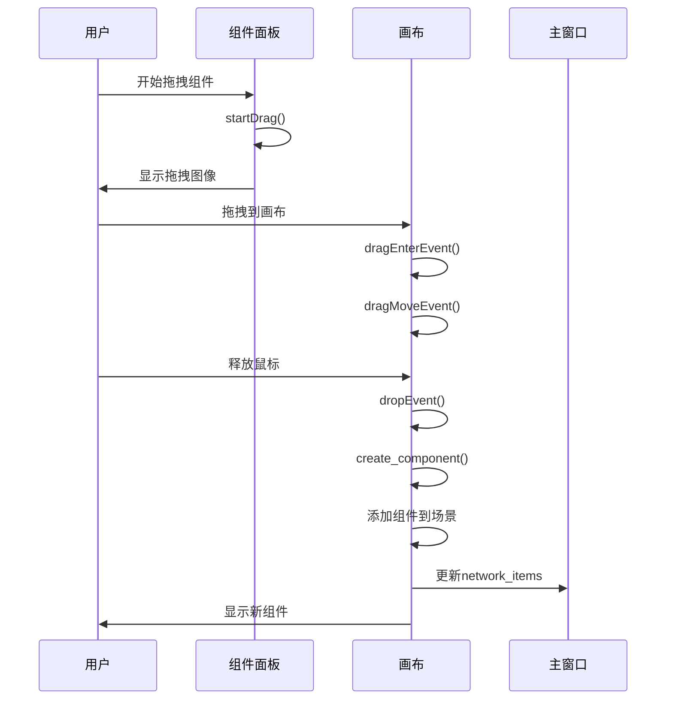

# 用户交互数据流

<cite>
**本文档引用的文件**   
- [canvas.py](file://src/components/canvas.py)
- [network_items.py](file://src/components/network_items.py)
- [main_window.py](file://src/components/main_window.py)
- [component_palette.py](file://src/components/component_palette.py)
- [properties_panel.py](file://src/components/properties_panel.py)
</cite>

## 目录
1. [用户交互事件处理流程](#用户交互事件处理流程)
2. [组件创建与信号通信机制](#组件创建与信号通信机制)
3. [组件连接与状态管理](#组件连接与状态管理)
4. [数据流序列图](#数据流序列图)

## 用户交互事件处理流程

当用户在画布上拖拽组件时，系统通过一系列事件处理机制来响应用户操作。首先，组件面板（ComponentPalette）作为可拖拽源，当用户开始拖拽某个组件时，`startDrag`方法被触发。该方法获取被拖拽组件的类型，并将其作为MIME数据的一部分，通过`QMimeData`对象传递。拖拽过程中，`dragEnterEvent`和`dragMoveEvent`事件被触发，检查是否有文本数据（即组件类型），并接受拖拽动作。

当用户在画布上释放鼠标时，`dropEvent`事件被触发。该事件获取放置位置的场景坐标，并调用`create_component`方法创建对应的图形项。这一过程确保了用户拖拽的组件能够正确地在画布上实例化。

**Section sources**
- [component_palette.py](file://src/components/component_palette.py#L129-L168)
- [canvas.py](file://src/components/canvas.py#L132-L154)

## 组件创建与信号通信机制

`create_component`方法根据拖拽的组件类型创建相应的图形项。例如，当组件类型为"bus"时，创建`BusItem`实例；当类型为"line"时，创建`LineItem`实例。每个组件在初始化时都会分配一个唯一的索引，并生成与系统索引同步的名称。

创建的组件通过信号与主窗口通信。每个组件都包含一个`ItemSignals`对象，当组件被选中时，会发出`itemSelected`信号。该信号连接到`NetworkCanvas`的`handle_item_selected`方法，从而实现组件与画布之间的交互。此外，组件的属性变化也会通过`property_changed`信号通知主窗口，确保UI状态的同步更新。

组件创建后，其状态信息被存储在`network_items`字典中。该字典采用嵌套结构，以组件类型为键，索引为子键，组件实例为值。例如，`network_items["bus"][1]`表示索引为1的母线组件。这种结构便于快速查找和管理组件。

**Section sources**
- [canvas.py](file://src/components/canvas.py#L156-L227)
- [network_items.py](file://src/components/network_items.py#L24-L85)
- [main_window.py](file://src/components/main_window.py#L101-L112)

## 组件连接与状态管理

组件连接机制通过`first_selected_item`变量实现。当用户选中一个组件时，该组件被记录为`first_selected_item`。如果用户随后选中另一个组件，系统会检查这两个组件是否可以连接。连接的兼容性由`_check_component_type_compatibility`方法决定，该方法根据组件类型和连接规则判断是否允许连接。

连接建立后，系统会更新`connections`列表，记录连接的两个组件、连接线以及连接点信息。同时，`network_items`字典也会被更新，以反映组件之间的连接关系。例如，当一个负载组件连接到母线时，负载的`bus`属性会被设置为母线的索引。

组件的连接状态还通过`current_connections`列表维护，该列表记录了每个组件当前连接的其他组件。当组件被删除时，系统会自动断开其所有连接，并从`network_items`字典中移除该组件。

**Section sources**
- [canvas.py](file://src/components/canvas.py#L229-L495)
- [network_items.py](file://src/components/network_items.py#L84-L85)

## 数据流序列图

以下序列图展示了用户交互事件的处理流程：

**Diagram sources**
- [component_palette.py](file://src/components/component_palette.py#L129-L168)
- [canvas.py](file://src/components/canvas.py#L132-L154)
- [canvas.py](file://src/components/canvas.py#L156-L227)