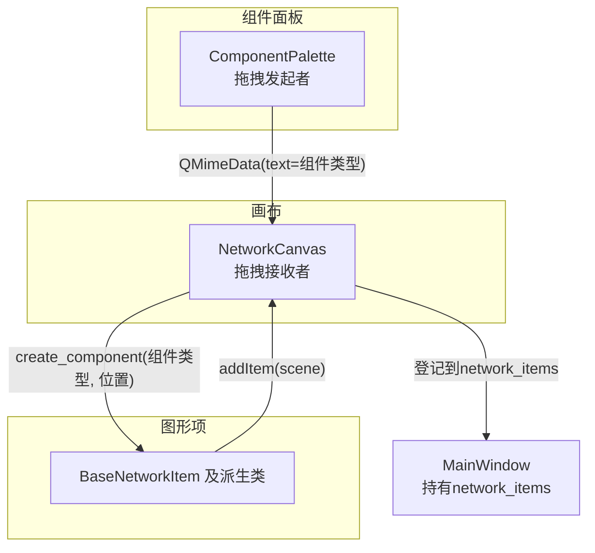
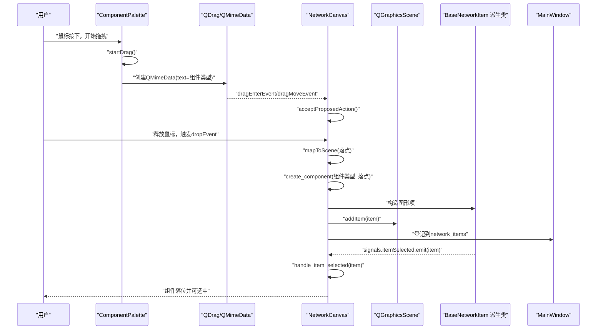
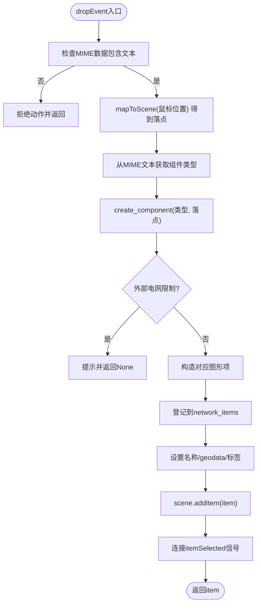
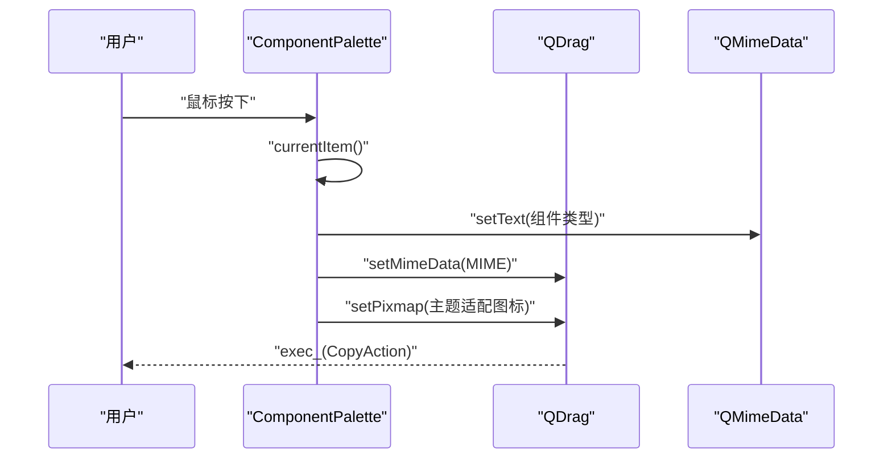
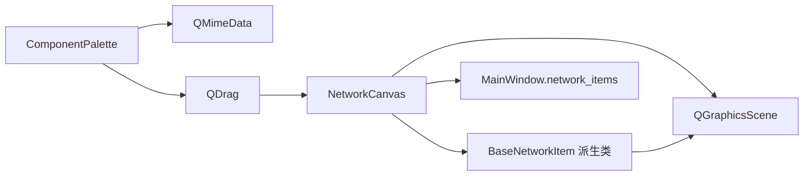

# 组件拖拽数据流

<cite>
**本文引用的文件**
- [src/components/canvas.py](file://src/components/canvas.py)
- [src/components/component_palette.py](file://src/components/component_palette.py)
- [src/components/network_items.py](file://src/components/network_items.py)
- [src/components/main_window.py](file://src/components/main_window.py)
</cite>

## 目录
1. [简介](#简介)
2. [项目结构](#项目结构)
3. [核心组件](#核心组件)
4. [架构总览](#架构总览)
5. [详细组件分析](#详细组件分析)
6. [依赖关系分析](#依赖关系分析)
7. [性能考量](#性能考量)
8. [故障排查指南](#故障排查指南)
9. [结论](#结论)

## 简介
本文件聚焦于pp_tool中“组件从组件面板拖拽到画布”的完整数据流，围绕NetworkCanvas类的拖拽事件处理机制展开，解释dragEnterEvent、dragMoveEvent与dropEvent如何协同工作，使组件面板中的组件类型信息通过QMimeData携带并在画布上创建对应的图形项，最终加入场景并参与后续的连接与属性联动。同时，文档说明信号与槽在跨组件通信中的作用，并结合代码路径给出关键流程的可视化图示。

## 项目结构
- 组件面板：ComponentPalette负责展示可拖拽的电网组件，并在拖拽开始时创建QMimeData携带组件类型字符串。
- 画布：NetworkCanvas作为QGraphicsView的子类，启用setAcceptDrops并重写拖拽事件，dropEvent中解析MIME数据，将组件类型转换为具体的图形项并添加到场景。
- 图形项：BaseNetworkItem及其派生类（如BusItem、LineItem、TransformerItem等）定义组件的连接点、属性、旋转与更新逻辑，支撑拖放落位后的交互与连接。
- 主窗口：MainWindow持有network_items字典，作为全局网络组件索引容器，供画布在创建图形项时登记。

图表来源
- [src/components/component_palette.py](file://src/components/component_palette.py#L129-L168)
- [src/components/canvas.py](file://src/components/canvas.py#L132-L155)
- [src/components/network_items.py](file://src/components/network_items.py#L192-L259)
- [src/components/main_window.py](file://src/components/main_window.py#L101-L116)

章节来源
- [src/components/component_palette.py](file://src/components/component_palette.py#L129-L168)
- [src/components/canvas.py](file://src/components/canvas.py#L132-L227)
- [src/components/network_items.py](file://src/components/network_items.py#L192-L259)
- [src/components/main_window.py](file://src/components/main_window.py#L101-L116)

## 核心组件
- ComponentPalette：在startDrag中创建QMimeData并将组件类型字符串作为文本数据，同时设置拖拽图标，执行QDrag.exec_。
- NetworkCanvas：
  - setAcceptDrops(True)开启拖拽接收。
  - 重写dragEnterEvent/dragMoveEvent：当MIME数据包含文本时接受动作。
  - 重写dropEvent：解析MIME文本得到组件类型，mapToScene获取落点，调用create_component创建图形项并添加到场景。
  - create_component：根据组件类型构造对应图形项，登记到network_items，设置名称、geodata，连接itemSelected信号，返回图形项。
- BaseNetworkItem及派生类：定义连接点、最大/最小连接数、旋转与更新逻辑，支撑连接与属性联动。
- MainWindow：维护network_items字典，作为全局索引容器，供画布登记新创建的图形项。

章节来源
- [src/components/component_palette.py](file://src/components/component_palette.py#L129-L168)
- [src/components/canvas.py](file://src/components/canvas.py#L132-L227)
- [src/components/network_items.py](file://src/components/network_items.py#L192-L259)
- [src/components/main_window.py](file://src/components/main_window.py#L101-L116)

## 架构总览
下图展示了从鼠标按下到组件落位的完整事件链，以及信号与槽在跨组件通信中的作用。

图表来源
- [src/components/component_palette.py](file://src/components/component_palette.py#L129-L168)
- [src/components/canvas.py](file://src/components/canvas.py#L132-L227)
- [src/components/network_items.py](file://src/components/network_items.py#L192-L259)
- [src/components/main_window.py](file://src/components/main_window.py#L101-L116)

## 详细组件分析

### NetworkCanvas 的拖拽事件处理
- dragEnterEvent：当MIME数据包含文本时，接受提议动作，允许拖拽进入。
- dragMoveEvent：同上，维持拖拽悬停状态。
- dropEvent：当MIME数据包含文本时，解析组件类型，mapToScene获取落点，调用create_component创建图形项，最后接受动作。
- create_component：
  - 外部电网类型限制：若场景中已有外部电网，阻止重复创建并提示。
  - 根据组件类型构造对应图形项（BusItem、LineItem、TransformerItem、LoadItem、StorageItem、ChargerItem、ExternalGridItem、StaticGeneratorItem、MeterItem、SwitchItem）。
  - 登记到network_items：按组件类型与索引登记。
  - 设置名称与geodata：生成自动命名并更新properties与标签。
  - 连接itemSelected信号：用于后续选中与连接逻辑。
  - 返回图形项。

图表来源
- [src/components/canvas.py](file://src/components/canvas.py#L132-L227)

章节来源
- [src/components/canvas.py](file://src/components/canvas.py#L132-L227)

### ComponentPalette 的拖拽初始化
- setDragEnabled(True)启用拖拽。
- add_components：将组件名称、类型与图标加入列表项，类型通过Qt.UserRole存储。
- startDrag：
  - 获取当前项的组件类型（Qt.UserRole）。
  - 创建QMimeData并setText为组件类型字符串。
  - 创建QDrag并设置拖拽图标（主题适配的SVG）。
  - 执行drag.exec_(CopyAction)。

图表来源
- [src/components/component_palette.py](file://src/components/component_palette.py#L95-L168)

章节来源
- [src/components/component_palette.py](file://src/components/component_palette.py#L95-L168)

### MIME数据与组件类型传递
- MIME数据通过QMimeData的setText携带组件类型字符串，NetworkCanvas在dropEvent中读取该字符串，作为create_component的输入，从而决定构造哪种图形项。
- 这种设计使得拖拽过程与具体图形项类型解耦，便于扩展新的组件类型。

章节来源
- [src/components/component_palette.py](file://src/components/component_palette.py#L136-L145)
- [src/components/canvas.py](file://src/components/canvas.py#L142-L155)

### create_component 的实例化与登记
- 外部电网限制：遍历场景中已存在的外部电网，若存在则阻止创建并提示。
- 构造图形项：根据组件类型分支构造对应类实例，传入落点。
- 索引登记：将item按component_type与component_index登记到network_items。
- 属性与标签：生成自动名称，更新properties['name']与标签文本。
- geodata：将落点坐标写入properties['geodata']。
- 场景添加：scene.addItem(item)。
- 信号连接：item.signals.itemSelected.connect(handle_item_selected)。
- 返回图形项。

章节来源
- [src/components/canvas.py](file://src/components/canvas.py#L156-L227)
- [src/components/network_items.py](file://src/components/network_items.py#L192-L259)

### QGraphicsScene 与 QGraphicsItem 的交互
- QGraphicsView（NetworkCanvas继承自QGraphicsView）承载QGraphicsScene。
- dropEvent中通过mapToScene获得场景坐标，create_component中构造图形项并调用scene.addItem(item)将其加入场景。
- BaseNetworkItem在itemChange中处理位置变化，更新geodata并通知属性面板；在isSelected变化时发出signals.itemSelected，驱动画布handle_item_selected以实现连接逻辑。
- 画布在dropEvent后连接itemSelected信号，形成从图形项到画布的跨组件通信。

章节来源
- [src/components/canvas.py](file://src/components/canvas.py#L132-L227)
- [src/components/network_items.py](file://src/components/network_items.py#L223-L259)

### 信号与槽在跨组件通信中的作用
- BaseNetworkItem.signals.itemSelected：当图形项被选中时发出，NetworkCanvas在create_component中连接该信号，回调handle_item_selected以实现“双击选中一个组件，再选中另一个组件即尝试连接”的逻辑。
- MainWindow与画布的selection_changed：MainWindow将画布的selection_changed连接到属性面板，实现属性面板随选中变化而更新。
- 画布内部信号：selection_changed用于更新状态栏与属性面板；itemSelected用于连接逻辑。

章节来源
- [src/components/network_items.py](file://src/components/network_items.py#L19-23)
- [src/components/canvas.py](file://src/components/canvas.py#L19-L22)
- [src/components/main_window.py](file://src/components/main_window.py#L174-L179)

## 依赖关系分析
- ComponentPalette依赖QMimeData与QDrag，负责拖拽发起与MIME数据封装。
- NetworkCanvas依赖QGraphicsScene与BaseNetworkItem派生类，负责拖拽接收、落点转换与图形项创建。
- BaseNetworkItem提供连接点、旋转、连接管理与属性更新能力，支撑连接与属性联动。
- MainWindow持有network_items，作为全局索引容器，供画布登记新图形项。

图表来源
- [src/components/component_palette.py](file://src/components/component_palette.py#L129-L168)
- [src/components/canvas.py](file://src/components/canvas.py#L132-L227)
- [src/components/network_items.py](file://src/components/network_items.py#L192-L259)
- [src/components/main_window.py](file://src/components/main_window.py#L101-L116)

章节来源
- [src/components/component_palette.py](file://src/components/component_palette.py#L129-L168)
- [src/components/canvas.py](file://src/components/canvas.py#L132-L227)
- [src/components/network_items.py](file://src/components/network_items.py#L192-L259)
- [src/components/main_window.py](file://src/components/main_window.py#L101-L116)

## 性能考量
- 拖拽事件处理：NetworkCanvas仅在dropEvent中进行类型解析与图形项创建，逻辑简单，性能开销低。
- 场景添加：addItem为O(1)操作，但大量组件创建时建议批量操作或延迟创建以减少UI抖动。
- 连接点计算：find_nearest_connection_point在组件移动或旋转时调用，复杂度与连接点数量成正比，建议在组件数量较多时优化连接点布局或缓存最近点。
- 属性面板刷新：BaseNetworkItem在位置变化时触发属性面板更新，注意避免频繁刷新导致的性能问题。

## 故障排查指南
- 拖拽无效：确认NetworkCanvas已setAcceptDrops(True)，且dragEnterEvent/dragMoveEvent中MIME数据包含文本。
- 组件无法创建：检查dropEvent中组件类型是否在create_component的分支中，以及外部电网限制逻辑。
- 名称或geodata未更新：确认create_component中已设置properties['name']、标签文本与geodata。
- 选中无反应：确认BaseNetworkItem.signals.itemSelected已连接到NetworkCanvas.handle_item_selected。
- 连接失败：检查can_connect与连接点可用性，关注连接点状态与组件类型兼容性。

章节来源
- [src/components/canvas.py](file://src/components/canvas.py#L132-L227)
- [src/components/network_items.py](file://src/components/network_items.py#L223-L259)

## 结论
pp_tool通过ComponentPalette与NetworkCanvas的协作，实现了从组件面板到画布的平滑拖拽体验。MIME数据以组件类型字符串的形式在拖拽过程中传递，NetworkCanvas在dropEvent中解析并创建对应图形项，随后登记到全局network_items并接入场景。信号与槽机制贯穿于选中、属性更新与连接逻辑，保证了跨组件通信的清晰与稳定。整体设计简洁、扩展性强，便于新增组件类型与增强连接规则。