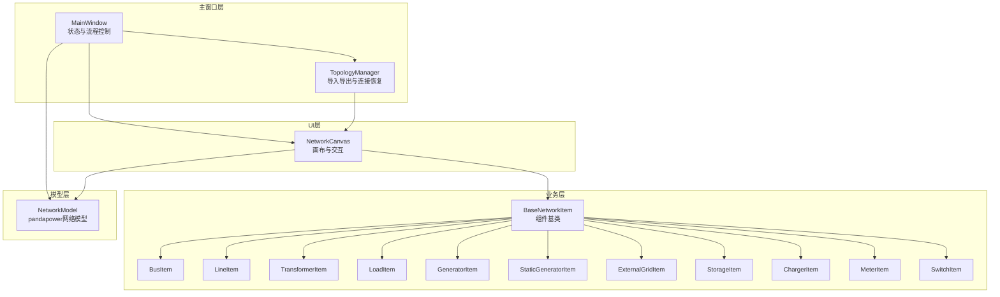
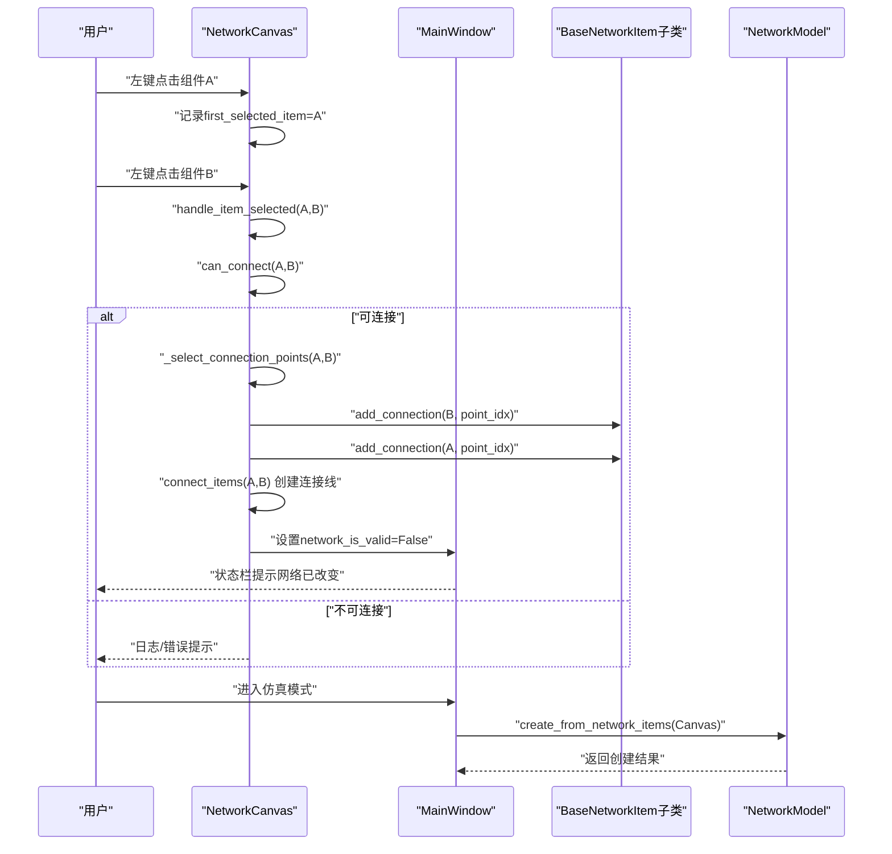
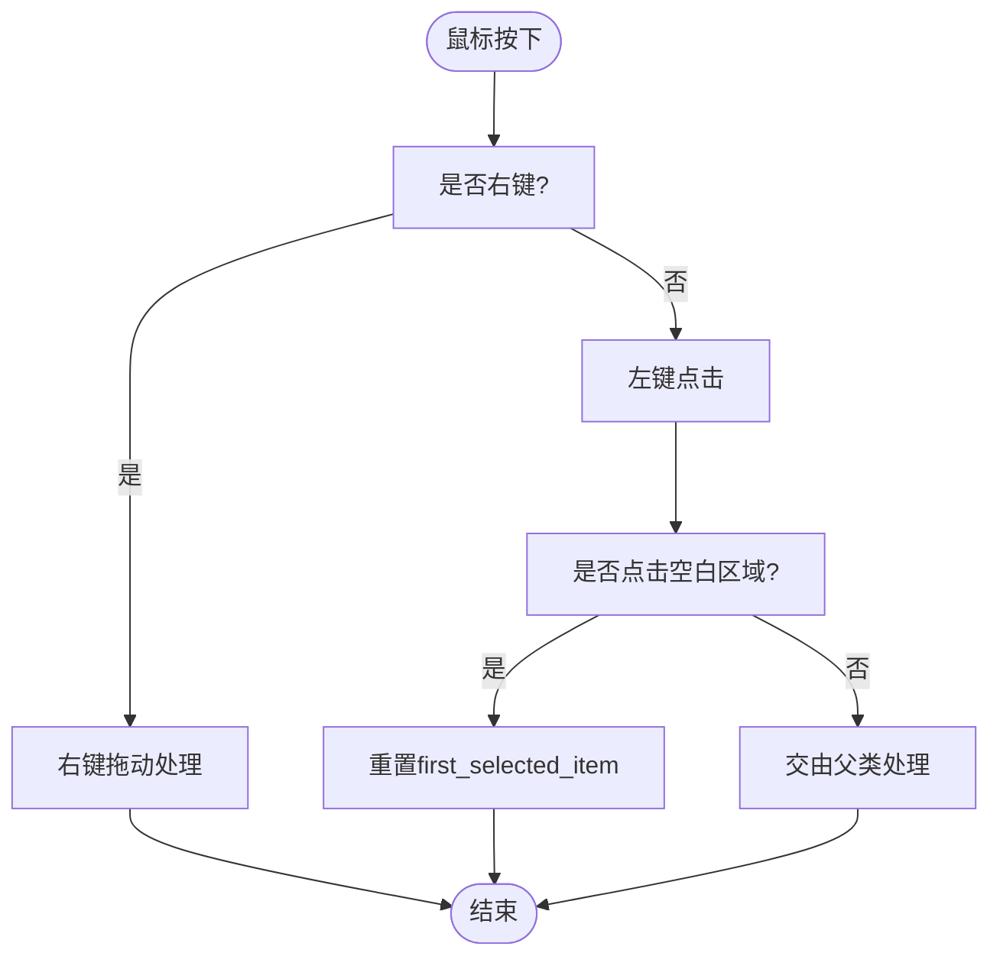
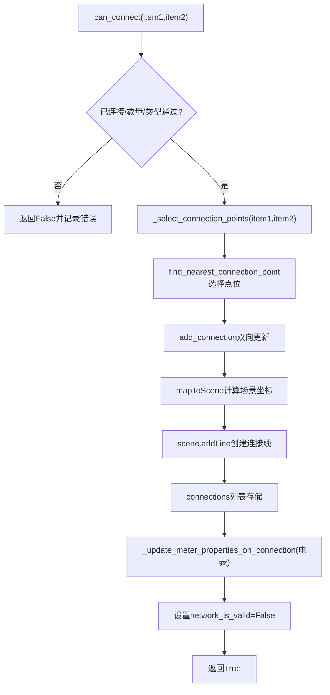
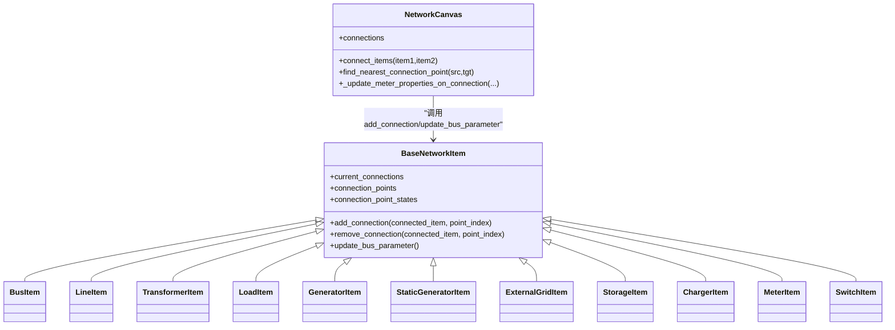
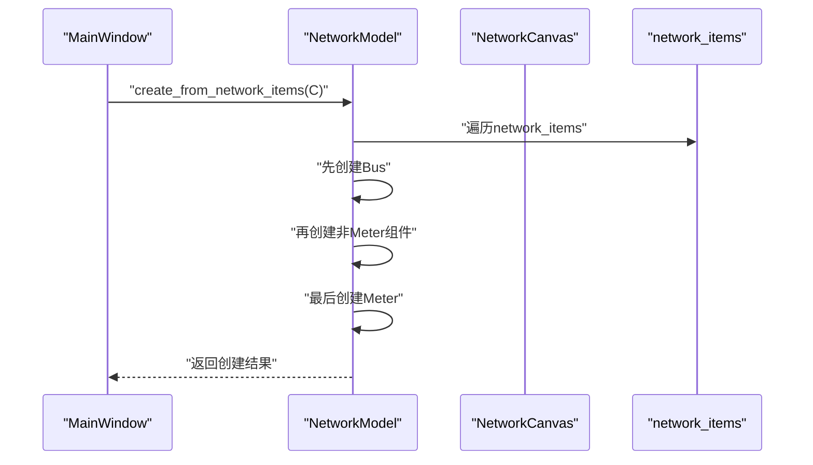
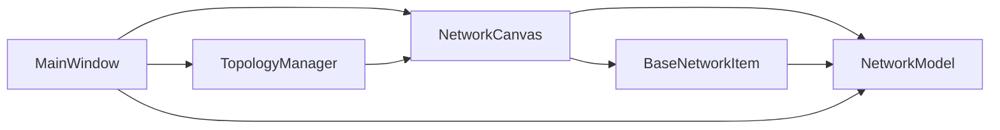

# 组件连接数据流

<cite>
**本文引用的文件**
- [src/components/canvas.py](file://src/components/canvas.py)
- [src/components/network_items.py](file://src/components/network_items.py)
- [src/models/network_model.py](file://src/models/network_model.py)
- [src/components/main_window.py](file://src/components/main_window.py)
- [src/components/topology_utils.py](file://src/components/topology_utils.py)
</cite>

## 目录
1. [简介](#简介)
2. [项目结构](#项目结构)
3. [核心组件](#核心组件)
4. [架构总览](#架构总览)
5. [详细组件分析](#详细组件分析)
6. [依赖分析](#依赖分析)
7. [性能考虑](#性能考虑)
8. [故障排查指南](#故障排查指南)
9. [结论](#结论)

## 简介
本文件聚焦于pp_tool中“组件连接”的数据流实现，围绕以下目标展开：
- first_selected_item变量在连接过程中的状态管理作用
- mousePressEvent如何识别两个待连接的组件端点
- 连接线的创建与与NetworkItem的关联机制
- 连接建立后如何更新network_items字典以维护拓扑关系，并触发network_model同步更新pandapower网络结构
- 通过时序图展示从首次点击组件到完成连接的全过程，包括视觉反馈（如虚线引导）的实现逻辑
- 连接验证规则（如电压等级匹配）的执行时机和错误处理机制

## 项目结构
pp_tool采用分层设计：
- UI层：NetworkCanvas负责画布交互、组件拖放、连接线绘制与状态管理
- 业务层：BaseNetworkItem及各子类（BusItem、LineItem、TransformerItem、LoadItem、GeneratorItem、StaticGeneratorItem、ExternalGridItem、StorageItem、ChargerItem、MeterItem、SwitchItem）负责组件属性、连接点、约束与bus参数更新
- 模型层：NetworkModel负责将network_items中的拓扑映射为pandapower网络并提供运行与诊断能力
- 主窗口层：MainWindow协调UI、拓扑管理与仿真流程，维护network_is_valid标志位

图表来源
- [src/components/canvas.py](file://src/components/canvas.py#L1-L120)
- [src/components/network_items.py](file://src/components/network_items.py#L1-L120)
- [src/models/network_model.py](file://src/models/network_model.py#L1-L60)
- [src/components/main_window.py](file://src/components/main_window.py#L90-L140)
- [src/components/topology_utils.py](file://src/components/topology_utils.py#L1-L60)

章节来源
- [src/components/canvas.py](file://src/components/canvas.py#L1-L120)
- [src/components/network_items.py](file://src/components/network_items.py#L1-L120)
- [src/models/network_model.py](file://src/models/network_model.py#L1-L60)
- [src/components/main_window.py](file://src/components/main_window.py#L90-L140)
- [src/components/topology_utils.py](file://src/components/topology_utils.py#L1-L60)

## 核心组件
- NetworkCanvas：负责组件选择、连接判定、连接点选择、连接线绘制、与MainWindow的状态联动
- BaseNetworkItem及其子类：负责组件属性、连接点、连接约束、bus参数更新、旋转与连接点重算
- NetworkModel：负责从network_items构建pandapower网络、运行潮流、保存/加载网络
- MainWindow：维护network_items字典、network_is_valid标志位、仿真入口与诊断流程
- TopologyManager：负责拓扑导入导出、连接恢复、IP端口唯一性验证

章节来源
- [src/components/canvas.py](file://src/components/canvas.py#L229-L360)
- [src/components/network_items.py](file://src/components/network_items.py#L327-L468)
- [src/models/network_model.py](file://src/models/network_model.py#L407-L582)
- [src/components/main_window.py](file://src/components/main_window.py#L96-L117)
- [src/components/topology_utils.py](file://src/components/topology_utils.py#L1-L120)

## 架构总览
连接数据流的关键路径：
- 用户在画布上选择组件，first_selected_item记录首个选中项
- 当第二次选择不同组件时，Canvas调用can_connect进行类型与约束校验
- 若可连接，Canvas选择连接点并调用connect_items创建连接线，同时更新network_items与组件连接状态
- 连接变更后，MainWindow的network_is_valid置为False，提示后续需重新诊断
- 仿真模式下，MainWindow调用NetworkModel.create_from_network_items，将network_items映射为pandapower网络

图表来源
- [src/components/canvas.py](file://src/components/canvas.py#L229-L360)
- [src/components/canvas.py](file://src/components/canvas.py#L406-L496)
- [src/components/network_items.py](file://src/components/network_items.py#L333-L368)
- [src/components/main_window.py](file://src/components/main_window.py#L320-L341)
- [src/models/network_model.py](file://src/models/network_model.py#L407-L582)

## 详细组件分析

### first_selected_item状态管理与mousePressEvent识别
- first_selected_item由NetworkCanvas在handle_item_selected中维护：
  - 首次选择：记录first_selected_item
  - 第二次选择：若与first_selected_item不同，尝试连接
- mousePressEvent在空白区域点击时重置first_selected_item，避免误连
- 连接成功后重置first_selected_item，保证下一次连接的正确性

图表来源
- [src/components/canvas.py](file://src/components/canvas.py#L646-L714)

章节来源
- [src/components/canvas.py](file://src/components/canvas.py#L229-L254)
- [src/components/canvas.py](file://src/components/canvas.py#L646-L714)

### 连接点选择与连接建立
- can_connect：综合“是否已连接”“连接数量约束”“组件类型兼容性”进行判定
- _select_connection_points：针对特定组合（如Transformer/Line与Bus）按属性匹配优先选择连接点，否则就近选择
- connect_items：计算场景坐标、创建QGraphicsLine、存储连接信息、更新电表测量属性、重置诊断标志位

图表来源
- [src/components/canvas.py](file://src/components/canvas.py#L341-L496)
- [src/components/canvas.py](file://src/components/canvas.py#L497-L595)
- [src/components/canvas.py](file://src/components/canvas.py#L596-L645)

章节来源
- [src/components/canvas.py](file://src/components/canvas.py#L341-L496)
- [src/components/canvas.py](file://src/components/canvas.py#L497-L595)
- [src/components/canvas.py](file://src/components/canvas.py#L596-L645)

### 连接线创建与与NetworkItem的关联
- 连接线由QGraphicsScene.addLine创建，存储在Canvas.connections中，包含item1/item2、point1/point2、point_index1/point_index2
- 连接成功后，BaseNetworkItem.add_connection更新current_connections与连接点占用状态（除Bus外）
- 连接建立后，BaseNetworkItem.update_bus_parameter根据连接关系更新bus/hv_bus/lv_bus/from_bus/to_bus等属性

图表来源
- [src/components/canvas.py](file://src/components/canvas.py#L406-L496)
- [src/components/network_items.py](file://src/components/network_items.py#L333-L468)
- [src/components/network_items.py](file://src/components/network_items.py#L369-L549)

章节来源
- [src/components/canvas.py](file://src/components/canvas.py#L406-L496)
- [src/components/network_items.py](file://src/components/network_items.py#L333-L468)
- [src/components/network_items.py](file://src/components/network_items.py#L369-L549)

### network_items字典维护与拓扑关系
- Canvas.create_component在创建组件后将其加入MainWindow.network_items（嵌套字典：component_type -> index -> item）
- 连接建立后，BaseNetworkItem.update_bus_parameter根据连接关系更新各组件的bus/hv_bus/lv_bus/from_bus/to_bus属性
- TopologyManager在导入拓扑时，先建立Bus索引映射，再恢复各组件连接，期间通过set_restoring_connections_flag抑制中间态更新

章节来源
- [src/components/canvas.py](file://src/components/canvas.py#L156-L227)
- [src/components/network_items.py](file://src/components/network_items.py#L369-L549)
- [src/components/topology_utils.py](file://src/components/topology_utils.py#L310-L460)

### 与pandapower网络模型的同步
- MainWindow进入仿真模式时，调用NetworkModel.create_from_network_items(Canvas)
- NetworkModel遍历network_items，先创建Bus，再创建其他组件（除Meter），最后创建Meter
- create_from_network_items调用各组件的create_*方法，将属性映射为pandapower网络参数

图表来源
- [src/components/main_window.py](file://src/components/main_window.py#L320-L341)
- [src/models/network_model.py](file://src/models/network_model.py#L407-L582)

章节来源
- [src/components/main_window.py](file://src/components/main_window.py#L320-L341)
- [src/models/network_model.py](file://src/models/network_model.py#L407-L582)

### 连接验证规则与错误处理
- 组件类型兼容性：相同类型组件不能直接连接；Bus/Meter可连接任意组件；Switch一端为Bus时另一端可为Bus/Line/Transformer；Transformer/Line必须连接到Bus或Meter；负载类组件可连接到Bus或Meter
- 连接数量约束：各组件max_connections/min_connections限制；连接点占用状态（除Bus）；连接点可用性is_connection_point_available
- 错误处理：can_connect失败时记录日志；validate_connections返回具体约束错误；连接失败时返回False并记录原因

章节来源
- [src/components/canvas.py](file://src/components/canvas.py#L276-L340)
- [src/components/network_items.py](file://src/components/network_items.py#L550-L623)
- [src/components/network_items.py](file://src/components/network_items.py#L632-L639)

## 依赖分析
- NetworkCanvas依赖BaseNetworkItem的连接点与约束接口
- BaseNetworkItem依赖network_items字典中的组件索引与属性
- NetworkModel依赖Canvas提供的connections与get_connected_buses
- MainWindow持有network_items与network_is_valid，协调仿真与诊断

图表来源
- [src/components/canvas.py](file://src/components/canvas.py#L1-L120)
- [src/components/network_items.py](file://src/components/network_items.py#L1-L120)
- [src/models/network_model.py](file://src/models/network_model.py#L1-L60)
- [src/components/main_window.py](file://src/components/main_window.py#L90-L140)
- [src/components/topology_utils.py](file://src/components/topology_utils.py#L1-L60)

章节来源
- [src/components/canvas.py](file://src/components/canvas.py#L1-L120)
- [src/components/network_items.py](file://src/components/network_items.py#L1-L120)
- [src/models/network_model.py](file://src/models/network_model.py#L1-L60)
- [src/components/main_window.py](file://src/components/main_window.py#L90-L140)
- [src/components/topology_utils.py](file://src/components/topology_utils.py#L1-L60)

## 性能考虑
- 连接点选择使用就近算法，复杂度与连接点数量成线性关系
- 连接建立后更新连接线位置时，仅遍历与该组件相关的连接，避免全量扫描
- 旋转与移动时批量更新连接线，减少重复计算
- 仿真模式下，NetworkModel按Bus优先创建，避免Meter依赖未创建导致的失败

[本节为一般性指导，无需具体文件引用]

## 故障排查指南
- 连接失败
  - 检查组件类型是否允许连接（参考can_connect与_check_component_type_compatibility）
  - 检查连接点是否可用（参考is_connection_point_available与get_available_connection_points）
  - 检查连接数量是否超限（参考validate_connections）
- 电表测量属性未更新
  - 确认连接后是否触发_update_meter_properties_on_connection
  - 检查element_type与side推断逻辑
- 仿真模式无法通过诊断
  - 确认network_is_valid为True后再进入仿真
  - 使用diagnostic_network查看诊断报告
- 拓扑导入后连接异常
  - 检查ToplogyManager的索引映射与连接恢复逻辑

章节来源
- [src/components/canvas.py](file://src/components/canvas.py#L341-L496)
- [src/components/canvas.py](file://src/components/canvas.py#L497-L595)
- [src/components/network_items.py](file://src/components/network_items.py#L550-L639)
- [src/components/topology_utils.py](file://src/components/topology_utils.py#L459-L619)
- [src/components/main_window.py](file://src/components/main_window.py#L345-L447)

## 结论
pp_tool的组件连接数据流通过NetworkCanvas的状态机与BaseNetworkItem的约束机制协同工作：first_selected_item确保连接序列的正确性；can_connect与_select_connection_points保障连接合法性与最优端点；connect_items完成连接线创建与network_items更新；随后MainWindow与NetworkModel共同维护拓扑一致性并在仿真模式下将拓扑映射为pandapower网络。验证规则与错误处理贯穿连接全流程，确保拓扑结构的合理性与可诊断性。