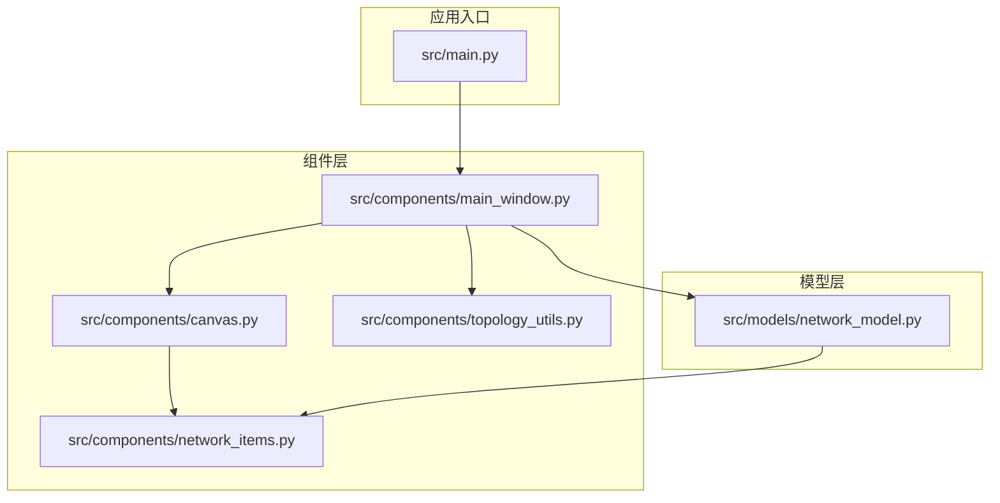
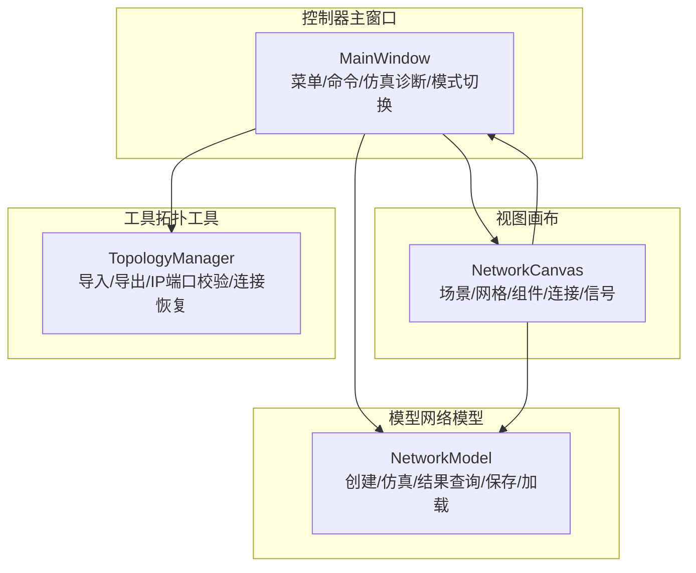
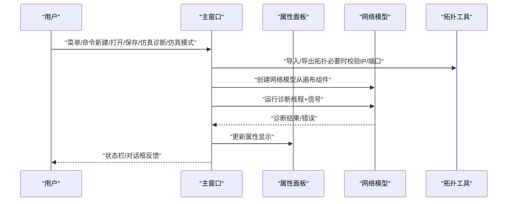
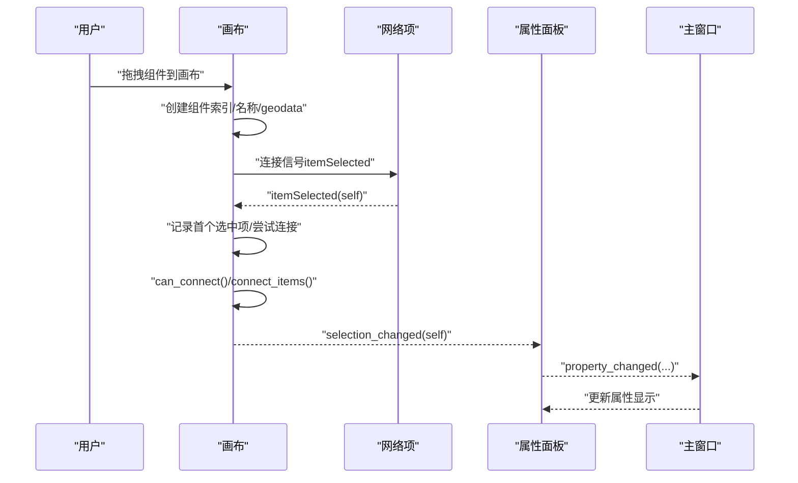
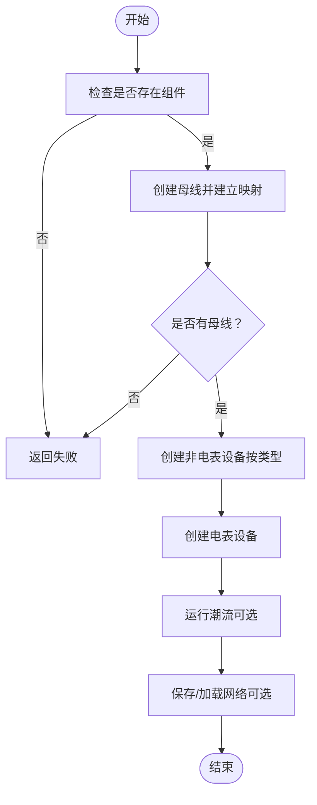
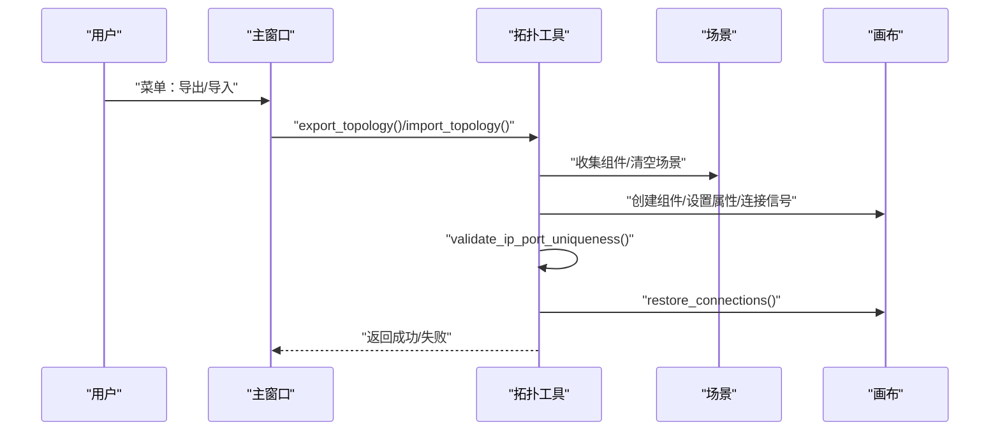
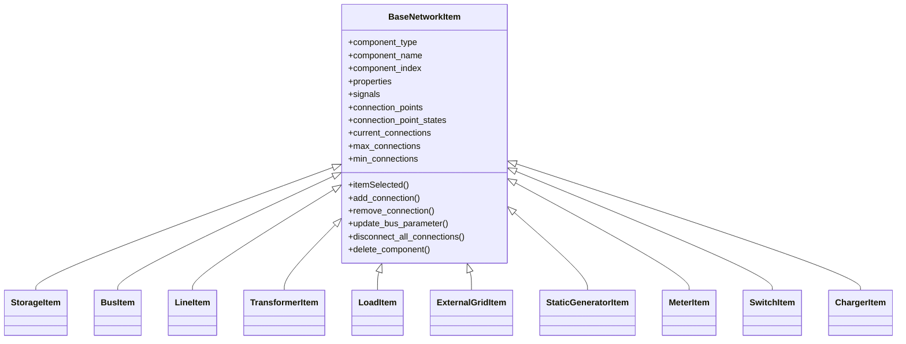
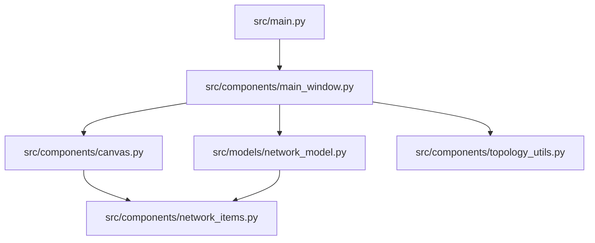

# 架构设计

<cite>
**本文引用的文件**
- [src/main.py](file://src/main.py)
- [src/components/main_window.py](file://src/components/main_window.py)
- [src/components/canvas.py](file://src/components/canvas.py)
- [src/components/network_items.py](file://src/components/network_items.py)
- [src/models/network_model.py](file://src/models/network_model.py)
- [src/components/topology_utils.py](file://src/components/topology_utils.py)
- [README.md](file://README.md)
</cite>

## 目录
1. [简介](#简介)
2. [项目结构](#项目结构)
3. [核心组件](#核心组件)
4. [架构总览](#架构总览)
5. [详细组件分析](#详细组件分析)
6. [依赖关系分析](#依赖关系分析)
7. [性能考量](#性能考量)
8. [故障排查指南](#故障排查指南)
9. [结论](#结论)
10. [附录](#附录)

## 简介
本文件面向pp_tool项目的架构设计，采用MVC（Model-View-Controller）模式组织代码：
- 控制器：主窗口组件负责协调全局流程、菜单与命令分发、仿真诊断与模式切换。
- 视图：画布组件负责渲染电网拓扑、交互与用户操作反馈。
- 模型：网络模型封装pandapower网络数据的创建、仿真与结果查询。

同时，文档解释PySide6信号与槽机制如何实现组件间松耦合通信（如画布发出的组件选中信号如何被属性面板与控制器处理），以及拓扑工具在导入/导出JSON拓扑文件时的作用。最后给出系统上下文图与组件交互图，展示“用户操作 -> UI组件 -> 信号 -> 控制器 -> 模型更新 -> 仿真计算 -> 结果反馈”的数据流。

## 项目结构
项目采用按功能域划分的目录结构，核心目录如下：
- src/components：UI组件与业务逻辑（主窗口、画布、网络项、拓扑工具等）
- src/models：数据模型（网络模型）
- src/utils：工具与日志
- src/main.py：应用入口

图表来源
- [src/main.py](file://src/main.py#L1-L72)
- [src/components/main_window.py](file://src/components/main_window.py#L1-L120)
- [src/components/canvas.py](file://src/components/canvas.py#L1-L120)
- [src/components/network_items.py](file://src/components/network_items.py#L1-L120)
- [src/models/network_model.py](file://src/models/network_model.py#L1-L60)
- [src/components/topology_utils.py](file://src/components/topology_utils.py#L1-L60)

章节来源
- [README.md](file://README.md#L1-L48)
- [src/main.py](file://src/main.py#L1-L72)

## 核心组件
- 主窗口（控制器）：负责菜单、工具栏、视图缩放、仿真模式切换、网络诊断线程与进度反馈、拓扑导入/导出、属性面板联动。
- 画布（视图）：承载场景、网格、组件渲染、拖拽放置、连接逻辑、右键菜单、缩放与平移、选择变化信号。
- 网络模型（模型）：封装pandapower网络创建、运行潮流、结果查询、保存/加载网络。
- 拓扑工具：导入/导出JSON拓扑文件，校验IP/端口唯一性，恢复连接关系。
- 网络项（组件基类与派生类）：提供信号发射、连接点管理、bus/hv_bus/lv_bus/from_bus/to_bus等参数维护、右键菜单与删除逻辑。

章节来源
- [src/components/main_window.py](file://src/components/main_window.py#L95-L200)
- [src/components/canvas.py](file://src/components/canvas.py#L16-L120)
- [src/models/network_model.py](file://src/models/network_model.py#L1-L60)
- [src/components/topology_utils.py](file://src/components/topology_utils.py#L1-L60)
- [src/components/network_items.py](file://src/components/network_items.py#L1-L120)

## 架构总览
pp_tool遵循MVC模式：
- Model（网络模型）：封装pandapower网络数据与仿真接口。
- View（画布）：渲染组件、连接线、网格与交互。
- Controller（主窗口）：协调UI、菜单、拓扑导入/导出、仿真诊断与模式切换。

图表来源
- [src/components/main_window.py](file://src/components/main_window.py#L95-L200)
- [src/components/canvas.py](file://src/components/canvas.py#L16-L120)
- [src/models/network_model.py](file://src/models/network_model.py#L1-L60)
- [src/components/topology_utils.py](file://src/components/topology_utils.py#L1-L60)

## 详细组件分析

### 主窗口（控制器）
职责：
- 初始化UI（画布、组件面板、属性面板、菜单、状态栏）
- 处理缩放、视图适配、删除/断开连接等编辑操作
- 仿真模式与诊断流程编排
- 拓扑导入/导出与IP/端口唯一性校验
- 与属性面板联动，响应属性变更

关键交互：
- 画布选择变化信号连接到属性面板更新
- 属性面板属性变化信号连接到控制器处理
- 仿真诊断通过线程与信号槽实现进度与结果反馈

图表来源
- [src/components/main_window.py](file://src/components/main_window.py#L181-L273)
- [src/components/main_window.py](file://src/components/main_window.py#L320-L466)
- [src/components/topology_utils.py](file://src/components/topology_utils.py#L193-L245)
- [src/models/network_model.py](file://src/models/network_model.py#L407-L581)

章节来源
- [src/components/main_window.py](file://src/components/main_window.py#L118-L179)
- [src/components/main_window.py](file://src/components/main_window.py#L274-L344)
- [src/components/main_window.py](file://src/components/main_window.py#L345-L466)

### 画布（视图）
职责：
- 场景管理、网格绘制、背景主题适配
- 组件拖拽放置、组件创建与索引分配
- 连接逻辑（类型兼容性、连接点选择、连接线绘制）
- 选择变化信号、右键菜单、缩放/平移、删除/断开连接
- 与主窗口联动（缩放、诊断标志位）

信号与槽：
- 组件选中信号（由网络项基类发出）连接到画布处理函数
- 画布选择变化信号连接到主窗口属性面板更新

图表来源
- [src/components/canvas.py](file://src/components/canvas.py#L132-L227)
- [src/components/canvas.py](file://src/components/canvas.py#L229-L360)
- [src/components/canvas.py](file://src/components/canvas.py#L406-L496)
- [src/components/network_items.py](file://src/components/network_items.py#L21-L40)

章节来源
- [src/components/canvas.py](file://src/components/canvas.py#L16-L120)
- [src/components/canvas.py](file://src/components/canvas.py#L120-L227)
- [src/components/canvas.py](file://src/components/canvas.py#L229-L360)
- [src/components/canvas.py](file://src/components/canvas.py#L406-L496)
- [src/components/network_items.py](file://src/components/network_items.py#L21-L40)

### 网络模型（模型）
职责：
- 从画布组件集合创建pandapower网络（母线优先，再创建其他设备，最后电表）
- 提供运行潮流、查询结果（母线电压、线路/变压器/负载/发电机功率）
- 保存/加载网络为JSON

关键流程：
- create_from_network_items：遍历network_items，按类型创建pandapower对象，维护bus映射与连接关系
- run_power_flow：调用pandapower运行潮流
- 保存/加载：使用pandapower JSON序列化

图表来源
- [src/models/network_model.py](file://src/models/network_model.py#L407-L581)
- [src/models/network_model.py](file://src/models/network_model.py#L583-L710)

章节来源
- [src/models/network_model.py](file://src/models/network_model.py#L1-L60)
- [src/models/network_model.py](file://src/models/network_model.py#L407-L581)
- [src/models/network_model.py](file://src/models/network_model.py#L583-L710)

### 拓扑工具（导入/导出与校验）
职责：
- 导出：将场景中组件属性打包为JSON拓扑
- 导入：从JSON文件重建组件、索引映射、连接关系
- 校验：IP/端口唯一性，缺失或不完整配置提示
- 连接恢复：按类型与属性恢复母线/线路/变压器/负载/电表等连接

图表来源
- [src/components/topology_utils.py](file://src/components/topology_utils.py#L193-L245)
- [src/components/topology_utils.py](file://src/components/topology_utils.py#L246-L293)
- [src/components/topology_utils.py](file://src/components/topology_utils.py#L310-L460)
- [src/components/topology_utils.py](file://src/components/topology_utils.py#L461-L620)

章节来源
- [src/components/topology_utils.py](file://src/components/topology_utils.py#L1-L120)
- [src/components/topology_utils.py](file://src/components/topology_utils.py#L193-L245)
- [src/components/topology_utils.py](file://src/components/topology_utils.py#L246-L293)
- [src/components/topology_utils.py](file://src/components/topology_utils.py#L310-L460)
- [src/components/topology_utils.py](file://src/components/topology_utils.py#L461-L620)

### 网络项（组件基类与派生类）
职责：
- 提供信号发射（itemSelected）、连接点管理、bus/hv_bus/lv_bus/from_bus/to_bus参数维护
- 右键菜单（旋转/断开/删除）、双击改名、删除时索引回收
- 与画布协作更新geodata、连接线位置与属性面板刷新

图表来源
- [src/components/network_items.py](file://src/components/network_items.py#L1-L120)
- [src/components/network_items.py](file://src/components/network_items.py#L764-L800)

章节来源
- [src/components/network_items.py](file://src/components/network_items.py#L1-L120)
- [src/components/network_items.py](file://src/components/network_items.py#L21-L40)
- [src/components/network_items.py](file://src/components/network_items.py#L327-L468)
- [src/components/network_items.py](file://src/components/network_items.py#L469-L549)
- [src/components/network_items.py](file://src/components/network_items.py#L550-L631)
- [src/components/network_items.py](file://src/components/network_items.py#L632-L649)
- [src/components/network_items.py](file://src/components/network_items.py#L640-L686)
- [src/components/network_items.py](file://src/components/network_items.py#L687-L763)
- [src/components/network_items.py](file://src/components/network_items.py#L764-L800)

## 依赖关系分析
- 主窗口依赖画布、拓扑工具、网络模型、属性面板与组件面板。
- 画布依赖网络项基类与派生类、工具日志。
- 网络模型依赖pandapower与工具日志。
- 拓扑工具依赖网络项类、文件对话框与工具日志。
- 网络项依赖PySide6信号与Qt框架。

图表来源
- [src/main.py](file://src/main.py#L1-L72)
- [src/components/main_window.py](file://src/components/main_window.py#L1-L120)
- [src/components/canvas.py](file://src/components/canvas.py#L1-L120)
- [src/components/network_items.py](file://src/components/network_items.py#L1-L120)
- [src/models/network_model.py](file://src/models/network_model.py#L1-L60)
- [src/components/topology_utils.py](file://src/components/topology_utils.py#L1-L60)

章节来源
- [src/main.py](file://src/main.py#L1-L72)
- [src/components/main_window.py](file://src/components/main_window.py#L1-L120)
- [src/components/canvas.py](file://src/components/canvas.py#L1-L120)
- [src/components/network_items.py](file://src/components/network_items.py#L1-L120)
- [src/models/network_model.py](file://src/models/network_model.py#L1-L60)
- [src/components/topology_utils.py](file://src/components/topology_utils.py#L1-L60)

## 性能考量
- 画布场景与网格绘制：网格线与连接线在主题切换时动态调整颜色，避免频繁重绘。
- 连接点与连接线更新：组件移动或旋转时批量更新连接线，减少不必要的重绘。
- 仿真诊断：使用独立线程与信号槽反馈进度，避免阻塞UI。
- 索引管理：组件删除后索引回收池保证索引连续性，降低后续分配成本。
- 拓扑导入/导出：先建立母线映射，再创建其他设备，最后电表，减少依赖不确定性。

[本节为一般性指导，无需特定文件来源]

## 故障排查指南
- 仿真诊断失败：检查网络组件是否完整（母线、连接关系、电表等），查看诊断结果与错误提示。
- IP/端口冲突：导入/导出前进行唯一性校验，修正重复配置。
- 组件连接失败：确认连接点可用性与类型兼容性（母线、线路、变压器、开关、电表等规则）。
- 属性面板不刷新：确保组件选中信号与属性变化信号链路畅通，必要时强制刷新。
- 网络模型创建失败：检查组件属性完整性与连接映射，查看日志输出定位错误。

章节来源
- [src/components/main_window.py](file://src/components/main_window.py#L345-L466)
- [src/components/topology_utils.py](file://src/components/topology_utils.py#L207-L211)
- [src/components/canvas.py](file://src/components/canvas.py#L341-L360)
- [src/components/network_items.py](file://src/components/network_items.py#L550-L631)

## 结论
pp_tool通过清晰的MVC分层与PySide6信号与槽机制实现了松耦合的组件通信。主窗口作为控制器协调UI与业务流程，画布作为视图负责渲染与交互，网络模型封装pandapower仿真能力，拓扑工具保障数据的可移植性与一致性。该架构便于扩展新组件类型与仿真功能，同时保持良好的用户体验与可维护性。

[本节为总结性内容，无需特定文件来源]

## 附录
- 技术选型权衡：
  - PySide6：跨平台、信号与槽机制成熟、与Qt生态契合，适合复杂桌面应用。
  - pandapower：成熟的电力系统仿真库，提供丰富的网络建模与分析能力，便于集成潮流计算与结果查询。
- 环境要求与安装参考README中的说明。

章节来源
- [README.md](file://README.md#L1-L48)