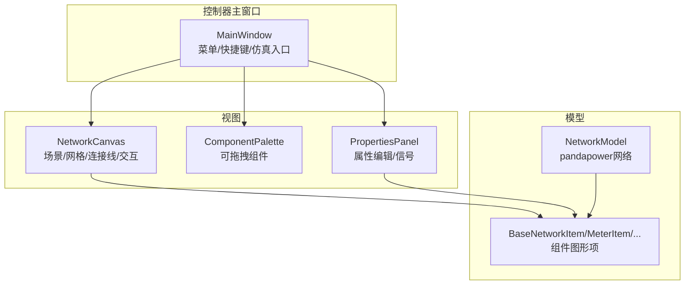
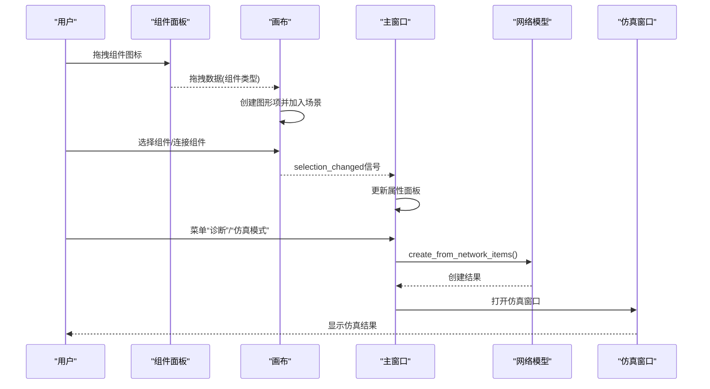
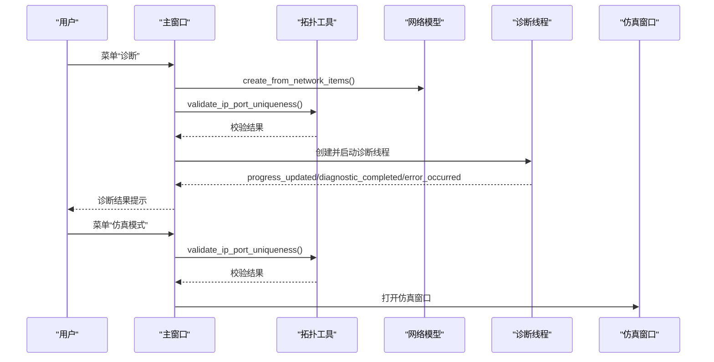
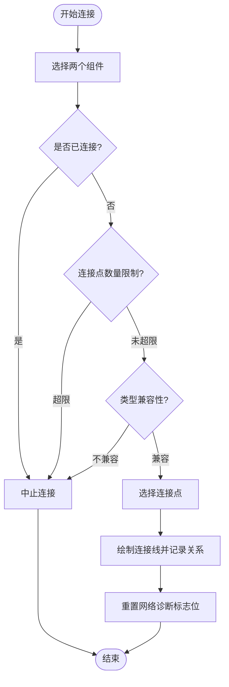
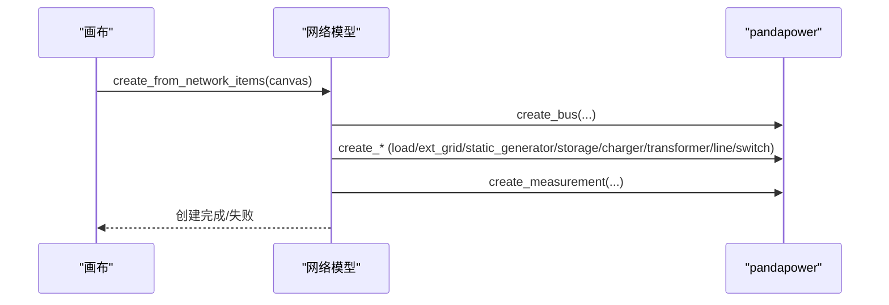
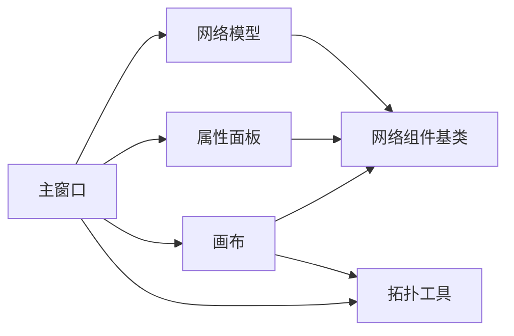

# MVC架构模式

<cite>
**本文引用的文件**
- [main_window.py](file://src/components/main_window.py)
- [canvas.py](file://src/components/canvas.py)
- [network_model.py](file://src/models/network_model.py)
- [properties_panel.py](file://src/components/properties_panel.py)
- [component_palette.py](file://src/components/component_palette.py)
- [topology_utils.py](file://src/components/topology_utils.py)
- [network_items.py](file://src/components/network_items.py)
</cite>

## 目录
1. [简介](#简介)
2. [项目结构](#项目结构)
3. [核心组件](#核心组件)
4. [架构总览](#架构总览)
5. [详细组件分析](#详细组件分析)
6. [依赖分析](#依赖分析)
7. [性能考虑](#性能考虑)
8. [故障排查指南](#故障排查指南)
9. [结论](#结论)

## 简介
本文件围绕pp_tool的MVC（Model-View-Controller）架构展开，聚焦主窗口作为控制器、画布作为视图、网络模型作为模型的三层分离设计。文档解释主窗口如何协调组件面板、属性面板与画布之间的交互；画布如何渲染电网拓扑并处理用户输入；网络模型如何管理pandapower的网络数据。同时给出类图与序列图，说明MVC各组件间的协作关系与数据流。

## 项目结构
pp_tool采用分层清晰的组件组织：
- 控制器层：主窗口负责菜单、工具栏、快捷键、对话框、仿真入口与诊断流程的编排
- 视图层：画布承载场景、网格、组件渲染、连接线绘制与交互；组件面板提供拖拽组件；属性面板展示与编辑组件属性
- 模型层：网络模型封装pandapower网络的创建、运行与查询

图表来源
- [main_window.py](file://src/components/main_window.py#L95-L170)
- [canvas.py](file://src/components/canvas.py#L16-L40)
- [properties_panel.py](file://src/components/properties_panel.py#L12-L30)
- [component_palette.py](file://src/components/component_palette.py#L16-L40)
- [network_model.py](file://src/models/network_model.py#L11-L20)
- [network_items.py](file://src/components/network_items.py#L19-L80)

章节来源
- [main_window.py](file://src/components/main_window.py#L95-L170)
- [canvas.py](file://src/components/canvas.py#L16-L40)
- [properties_panel.py](file://src/components/properties_panel.py#L12-L30)
- [component_palette.py](file://src/components/component_palette.py#L16-L40)
- [network_model.py](file://src/models/network_model.py#L11-L20)
- [network_items.py](file://src/components/network_items.py#L19-L80)

## 核心组件
- 主窗口（控制器）：负责菜单、快捷键、仿真模式入口、网络诊断流程、与画布/属性面板的信号桥接
- 画布（视图）：承载场景、网格、组件渲染、连接线绘制、鼠标/键盘交互、右键菜单、缩放/平移
- 网络模型（模型）：封装pandapower网络的创建、运行与查询，提供从图形项到pandapower对象的映射与持久化能力
- 组件面板：提供可拖拽的电网组件图标，支持主题适配
- 属性面板：根据选中组件动态生成属性编辑控件，发出属性变更信号
- 拓扑工具：导入/导出拓扑、IP/端口唯一性校验、连接恢复
- 网络组件基类：统一的组件图形项基类，提供连接点、连接状态、旋转、标签、删除等通用能力

章节来源
- [main_window.py](file://src/components/main_window.py#L95-L170)
- [canvas.py](file://src/components/canvas.py#L16-L40)
- [network_model.py](file://src/models/network_model.py#L11-L20)
- [properties_panel.py](file://src/components/properties_panel.py#L12-L30)
- [component_palette.py](file://src/components/component_palette.py#L16-L40)
- [topology_utils.py](file://src/components/topology_utils.py#L17-L40)
- [network_items.py](file://src/components/network_items.py#L19-L80)

## 架构总览
MVC协作关系如下：
- 用户在画布上拖拽组件、选择组件、连接组件、修改属性
- 画布将选择变化与连接事件通过信号通知主窗口
- 主窗口根据菜单/快捷键触发仿真模式或诊断流程
- 网络模型根据图形项集合创建pandapower网络，运行潮流并提供查询
- 属性面板监听画布选择变化与自身属性变更，驱动UI更新

图表来源
- [component_palette.py](file://src/components/component_palette.py#L129-L168)
- [canvas.py](file://src/components/canvas.py#L132-L155)
- [canvas.py](file://src/components/canvas.py#L229-L254)
- [main_window.py](file://src/components/main_window.py#L174-L179)
- [main_window.py](file://src/components/main_window.py#L345-L415)
- [network_model.py](file://src/models/network_model.py#L407-L581)

## 详细组件分析

### 主窗口（控制器）
职责边界：
- 菜单与快捷键：文件、编辑、视图、仿真、帮助
- 仿真模式入口：诊断网络、验证IP/端口唯一性、创建NetworkModel、启动仿真窗口
- 画布交互：缩放、平移、删除、断开连接
- 信号桥接：画布选择变化与属性面板联动；属性面板属性变更与画布/模型交互

关键交互流程：
- 诊断网络：创建NetworkModel、校验唯一性、启动诊断线程、更新状态
- 进入仿真模式：校验唯一性、检查网络有效性、打开仿真窗口

图表来源
- [main_window.py](file://src/components/main_window.py#L345-L466)
- [topology_utils.py](file://src/components/topology_utils.py#L21-L98)
- [network_model.py](file://src/models/network_model.py#L407-L581)

章节来源
- [main_window.py](file://src/components/main_window.py#L174-L298)
- [main_window.py](file://src/components/main_window.py#L345-L466)
- [topology_utils.py](file://src/components/topology_utils.py#L21-L98)

### 画布（视图）
职责边界：
- 场景与网格：创建场景、绘制网格背景、主题适配
- 组件创建：根据拖拽类型创建图形项，维护network_items字典
- 连接管理：选择两个组件后判定连接合法性并绘制连接线
- 交互处理：鼠标/键盘事件、右键菜单、缩放/平移、删除/断开
- 信号：selection_changed用于通知主窗口属性面板更新

连接规则与约束：
- 组件类型兼容性：母线可连接任意组件；电表可连接任意组件；开关一端为母线时另一端可连接线路/变压器；线路/变压器需连接母线或电表
- 连接点约束：每个连接点最多两个连接，其中一个必须是电表（特定设备）

图表来源
- [canvas.py](file://src/components/canvas.py#L341-L360)
- [canvas.py](file://src/components/canvas.py#L406-L495)
- [canvas.py](file://src/components/canvas.py#L276-L340)

章节来源
- [canvas.py](file://src/components/canvas.py#L115-L131)
- [canvas.py](file://src/components/canvas.py#L156-L227)
- [canvas.py](file://src/components/canvas.py#L341-L360)
- [canvas.py](file://src/components/canvas.py#L406-L495)

### 网络模型（模型）
职责边界：
- 从图形项集合创建pandapower网络：按母线、非电表设备、电表的顺序创建，保证依赖关系正确
- 提供运行潮流与查询能力：电压、功率等
- 持久化：保存/加载网络到JSON

创建流程要点：
- 母线优先：建立bus_map映射
- 非电表设备：按类型创建并连接到母线
- 电表设备：最后创建，确保其他设备已存在
- 变压器/线路：使用hv_bus/lv_bus或from_bus/to_bus属性

图表来源
- [network_model.py](file://src/models/network_model.py#L407-L581)

章节来源
- [network_model.py](file://src/models/network_model.py#L11-L20)
- [network_model.py](file://src/models/network_model.py#L407-L581)

### 属性面板（视图）
职责边界：
- 根据选中组件动态生成属性编辑控件（数值、布尔、下拉、只读等）
- 监听属性变更，进行IP/端口唯一性校验与冲突回滚
- 特殊属性联动：名称变更同步到图形项标签；线路/变压器/光伏/负载的模式切换导致面板重绘
- 发出property_changed信号，驱动主窗口更新网络有效性标志

章节来源
- [properties_panel.py](file://src/components/properties_panel.py#L12-L30)
- [properties_panel.py](file://src/components/properties_panel.py#L336-L445)
- [properties_panel.py](file://src/components/properties_panel.py#L512-L791)

### 组件面板（视图）
职责边界：
- 提供可拖拽的电网组件图标，支持主题适配
- 拖拽时携带组件类型，交由画布创建图形项

章节来源
- [component_palette.py](file://src/components/component_palette.py#L16-L40)
- [component_palette.py](file://src/components/component_palette.py#L129-L168)

### 网络组件基类（视图）
职责边界：
- 统一的组件图形项基类：索引分配与回收、SVG主题适配、标签颜色、连接点与连接状态、旋转与更新、删除与断开、右键菜单
- 通用bus/hv_bus/lv_bus/from_bus/to_bus等参数更新逻辑

章节来源
- [network_items.py](file://src/components/network_items.py#L19-L80)
- [network_items.py](file://src/components/network_items.py#L314-L368)
- [network_items.py](file://src/components/network_items.py#L369-L549)

## 依赖分析
- 主窗口依赖画布、属性面板、拓扑工具与网络模型
- 画布依赖网络组件基类与拓扑工具（导入/导出）
- 属性面板依赖主窗口以进行IP/端口唯一性校验与冲突回滚
- 网络模型依赖pandapower库与画布提供的连接信息

图表来源
- [main_window.py](file://src/components/main_window.py#L113-L170)
- [canvas.py](file://src/components/canvas.py#L16-L40)
- [properties_panel.py](file://src/components/properties_panel.py#L12-L30)
- [network_model.py](file://src/models/network_model.py#L11-L20)
- [topology_utils.py](file://src/components/topology_utils.py#L17-L40)
- [network_items.py](file://src/components/network_items.py#L19-L80)

章节来源
- [main_window.py](file://src/components/main_window.py#L113-L170)
- [canvas.py](file://src/components/canvas.py#L16-L40)
- [properties_panel.py](file://src/components/properties_panel.py#L12-L30)
- [network_model.py](file://src/models/network_model.py#L11-L20)
- [topology_utils.py](file://src/components/topology_utils.py#L17-L40)
- [network_items.py](file://src/components/network_items.py#L19-L80)

## 性能考虑
- 画布场景规模：场景尺寸较大，注意避免频繁重绘与大量连接线的实时更新
- 连接点约束：合理利用连接点状态与可用连接点缓存，减少重复计算
- 诊断线程：后台线程执行网络诊断，避免阻塞UI；使用信号/槽进行进度与结果反馈
- 属性面板：属性变更时避免不必要的面板重建，必要时延迟刷新
- 拓扑导入/导出：批量创建组件与连接时，尽量减少重复的属性写入与信号发射

## 故障排查指南
- 诊断失败或网络无效：确认已通过“诊断”流程并通过IP/端口唯一性校验；检查网络连接是否满足类型与连接点约束
- 属性冲突回滚：当修改IP/端口导致冲突时，属性面板会提示并回滚到旧值；请使用唯一组合
- 连接失败：检查组件类型兼容性与连接点数量限制；确保母线/电表/开关的连接规则满足要求
- 仿真模式无法进入：需先通过诊断且网络有效；若诊断报告提示问题，修复后再进入仿真模式

章节来源
- [main_window.py](file://src/components/main_window.py#L345-L466)
- [properties_panel.py](file://src/components/properties_panel.py#L336-L445)
- [canvas.py](file://src/components/canvas.py#L341-L360)
- [canvas.py](file://src/components/canvas.py#L406-L495)

## 结论
pp_tool的MVC架构通过明确的职责划分实现了良好的解耦：主窗口作为控制器协调视图与模型；画布作为视图负责渲染与交互；网络模型作为数据层封装pandapower网络的创建与查询。属性面板与组件面板分别承担UI编辑与拖拽入口，配合拓扑工具实现完整的电网拓扑编辑与仿真闭环。该架构便于扩展与维护，适合进一步引入更多仿真功能与可视化增强。