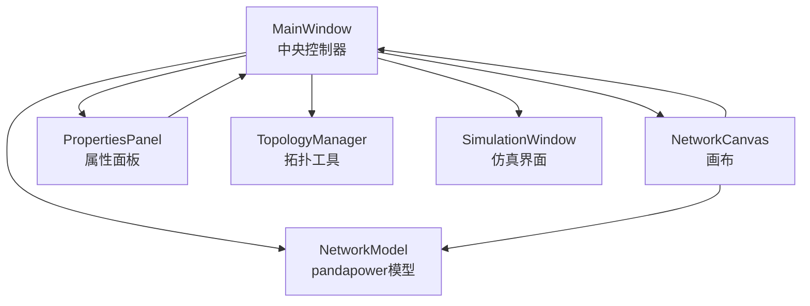
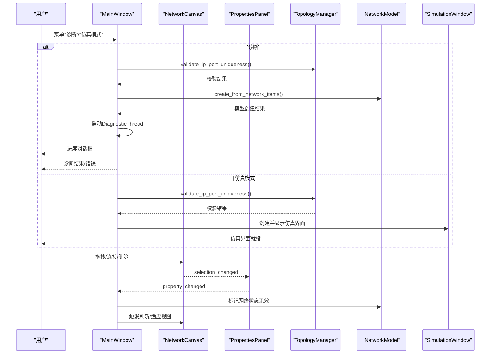
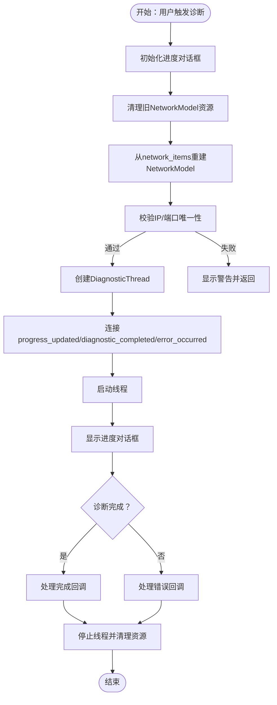
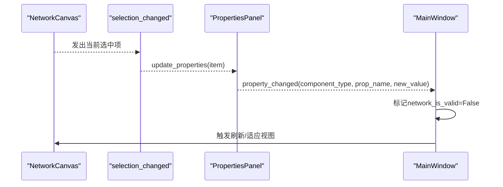
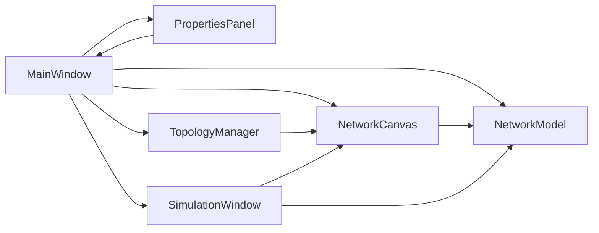

# 控制器层

<cite>
**本文引用的文件**
- [src/components/main_window.py](file://src/components/main_window.py)
- [src/models/network_model.py](file://src/models/network_model.py)
- [src/components/canvas.py](file://src/components/canvas.py)
- [src/components/properties_panel.py](file://src/components/properties_panel.py)
- [src/components/topology_utils.py](file://src/components/topology_utils.py)
- [src/components/simulation_window.py](file://src/components/simulation_window.py)
</cite>

## 目录
1. [简介](#简介)
2. [项目结构](#项目结构)
3. [核心组件](#核心组件)
4. [架构总览](#架构总览)
5. [详细组件分析](#详细组件分析)
6. [依赖分析](#依赖分析)
7. [性能考虑](#性能考虑)
8. [故障排查指南](#故障排查指南)
9. [结论](#结论)

## 简介
本文件聚焦pp_tool的控制器层，系统性解析MainWindow类作为中央控制器的职责与行为。文档围绕以下目标展开：
- 解释MainWindow如何初始化并协调组件面板、属性面板与画布等UI元素；
- 说明MainWindow如何处理菜单栏（文件操作、仿真诊断）、属性面板（property_changed信号）等用户指令；
- 描述控制器如何作为中介，将用户操作转化为对模型（NetworkModel）的更新请求，并驱动视图（NetworkCanvas）的刷新；
- 重点剖析diagnostic_network与enter_simulation_mode两大关键工作流的控制逻辑；
- 总结通过信号与槽机制实现的松耦合通信。

## 项目结构
pp_tool采用分层清晰的组件化设计：
- 控制器层：MainWindow负责UI编排、菜单与快捷键绑定、信号路由、工作流编排；
- 视图层：NetworkCanvas承载绘图与交互；PropertiesPanel负责属性编辑与变更传播；
- 模型层：NetworkModel封装pandapower网络模型的创建与查询；
- 工具层：TopologyManager负责拓扑导入导出与IP/端口唯一性校验；
- 仿真层：SimulationWindow在仿真模式下接管网络数据、Modbus服务与可视化。

图表来源
- [src/components/main_window.py](file://src/components/main_window.py#L95-L176)
- [src/components/canvas.py](file://src/components/canvas.py#L16-L23)
- [src/components/properties_panel.py](file://src/components/properties_panel.py#L12-L23)
- [src/components/topology_utils.py](file://src/components/topology_utils.py#L17-L23)
- [src/models/network_model.py](file://src/models/network_model.py#L11-L18)
- [src/components/simulation_window.py](file://src/components/simulation_window.py#L34-L67)

章节来源
- [src/components/main_window.py](file://src/components/main_window.py#L95-L176)
- [src/components/canvas.py](file://src/components/canvas.py#L16-L23)
- [src/components/properties_panel.py](file://src/components/properties_panel.py#L12-L23)
- [src/components/topology_utils.py](file://src/components/topology_utils.py#L17-L23)
- [src/models/network_model.py](file://src/models/network_model.py#L11-L18)
- [src/components/simulation_window.py](file://src/components/simulation_window.py#L34-L67)

## 核心组件
- MainWindow：中央控制器，负责UI初始化、菜单与快捷键、工作流编排、信号路由与状态管理。
- NetworkCanvas：画布，承载组件渲染、连接逻辑、缩放与右键菜单、选择变化信号。
- PropertiesPanel：属性面板，负责组件属性展示与编辑，发出property_changed信号。
- NetworkModel：pandapower网络模型封装，提供从network_items创建模型的能力与运行计算接口。
- TopologyManager：拓扑导入导出与IP/端口唯一性校验。
- SimulationWindow：仿真模式界面，管理Modbus、数据生成、功率监控与UI组件。

章节来源
- [src/components/main_window.py](file://src/components/main_window.py#L95-L176)
- [src/components/canvas.py](file://src/components/canvas.py#L16-L23)
- [src/components/properties_panel.py](file://src/components/properties_panel.py#L12-L23)
- [src/models/network_model.py](file://src/models/network_model.py#L11-L18)
- [src/components/topology_utils.py](file://src/components/topology_utils.py#L17-L23)
- [src/components/simulation_window.py](file://src/components/simulation_window.py#L34-L67)

## 架构总览
MainWindow作为中枢，通过信号与槽将UI事件与业务逻辑解耦：
- 画布选择变化触发属性面板更新；
- 属性面板的property_changed信号驱动网络状态标记与后续流程；
- 菜单与快捷键触发文件操作、视图缩放、仿真诊断与仿真模式切换；
- 仿真模式下，MainWindow创建并显示SimulationWindow，后者持有NetworkModel与network_items，形成完整的仿真闭环。

图表来源
- [src/components/main_window.py](file://src/components/main_window.py#L274-L344)
- [src/components/main_window.py](file://src/components/main_window.py#L346-L466)
- [src/components/canvas.py](file://src/components/canvas.py#L16-L23)
- [src/components/properties_panel.py](file://src/components/properties_panel.py#L12-L23)
- [src/components/topology_utils.py](file://src/components/topology_utils.py#L21-L44)
- [src/models/network_model.py](file://src/models/network_model.py#L407-L582)
- [src/components/simulation_window.py](file://src/components/simulation_window.py#L34-L67)

## 详细组件分析

### MainWindow：中央控制器
- 初始化与UI编排
  - 创建中央画布、组件面板与属性面板，设置停靠区域与最小宽度；
  - 连接画布selection_changed到属性面板update_properties；
  - 连接属性面板property_changed到on_property_changed。
- 菜单与快捷键
  - 文件：新建、打开、保存、退出；
  - 编辑：断开连接、删除所选、全选；
  - 视图：组件面板/属性面板可见性、缩放、适应视图；
  - 仿真：诊断、仿真模式（条件编译FEATURE_SIMULATION）。
- 视图操作
  - 放大/缩小/适应视图委托给画布scale/fit_in_view；
  - 删除所选/断开连接委托给画布。
- 属性变更处理
  - on_property_changed：记录网络状态为无效，必要时强制刷新画布显示，日志记录属性更新。
- 诊断工作流（diagnostic_network）
  - 步骤概览：进度对话框初始化→清理旧网络模型→从network_items重建NetworkModel→IP/端口唯一性校验→创建DiagnosticThread→连接信号→启动线程→显示进度→处理完成/错误回调→停止线程与资源清理。
  - 关键点：使用QProgressDialog展示进度；通过signals与槽实现异步诊断；错误与完成均关闭对话框并清理线程资源。
- 仿真模式工作流（enter_simulation_mode）
  - 步骤概览：IP/端口唯一性校验→若网络状态无效则提示→创建并显示SimulationWindow。
  - 关键点：仿真模式依赖NetworkModel与network_items，SimulationWindow持有这些引用以构建仿真环境。

图表来源
- [src/components/main_window.py](file://src/components/main_window.py#L346-L466)

章节来源
- [src/components/main_window.py](file://src/components/main_window.py#L118-L176)
- [src/components/main_window.py](file://src/components/main_window.py#L181-L273)
- [src/components/main_window.py](file://src/components/main_window.py#L274-L344)
- [src/components/main_window.py](file://src/components/main_window.py#L346-L466)

### NetworkCanvas：画布与交互
- 信号与事件
  - selection_changed：选择变化时发出当前选中项；
  - mousePressEvent/mouseMoveEvent/mouseReleaseEvent/wheelEvent：鼠标交互与缩放；
  - keyPressEvent：DEL键删除选中项，右键拖动平移视图。
- 组件创建与连接
  - 拖拽组件到画布创建图形项并写入network_items；
  - handle_item_selected：双选组件尝试连接，can_connect/_check_component_type_compatibility/_select_connection_points/connect_items实现连接规则与连线；
  - 连接关系变化后重置网络诊断标志位。
- 属性面板联动
  - selection_changed触发属性面板更新；
  - 电表连接后自动更新测量属性并刷新面板显示。

图表来源
- [src/components/canvas.py](file://src/components/canvas.py#L16-L23)
- [src/components/canvas.py](file://src/components/canvas.py#L1162-L1200)
- [src/components/properties_panel.py](file://src/components/properties_panel.py#L88-L117)
- [src/components/main_window.py](file://src/components/main_window.py#L299-L318)

章节来源
- [src/components/canvas.py](file://src/components/canvas.py#L16-L23)
- [src/components/canvas.py](file://src/components/canvas.py#L1162-L1200)
- [src/components/properties_panel.py](file://src/components/properties_panel.py#L88-L117)
- [src/components/main_window.py](file://src/components/main_window.py#L299-L318)

### PropertiesPanel：属性编辑与信号
- 属性面板根据组件类型动态生成编辑控件，支持数值、布尔、下拉与只读字段；
- on_property_changed：进行IP/端口唯一性验证（排除当前组件），更新组件属性，必要时同步更新面板显示与Modbus寄存器；
- property_changed信号：携带component_type、prop_name、new_value，供MainWindow处理。

章节来源
- [src/components/properties_panel.py](file://src/components/properties_panel.py#L336-L445)
- [src/components/properties_panel.py](file://src/components/properties_panel.py#L12-L23)

### NetworkModel：pandapower模型封装
- create_from_network_items：遍历network_items，按类型创建母线、负载、外部电网、光伏、储能、充电站、开关、线路、变压器与电表，维护bus_map与连接关系；
- run_power_flow/get_*：提供潮流计算与结果查询接口；
- save_network/load_network：网络模型的序列化与反序列化。

章节来源
- [src/models/network_model.py](file://src/models/network_model.py#L407-L582)
- [src/models/network_model.py](file://src/models/network_model.py#L583-L710)

### TopologyManager：拓扑导入导出与校验
- validate_ip_port_uniqueness：扫描场景中所有组件的IP/端口，检测重复与不完整配置，给出警告；
- import_topology/export_topology：导入/导出拓扑至JSON，恢复连接关系并进行IP/端口校验。

章节来源
- [src/components/topology_utils.py](file://src/components/topology_utils.py#L21-L44)
- [src/components/topology_utils.py](file://src/components/topology_utils.py#L193-L245)
- [src/components/topology_utils.py](file://src/components/topology_utils.py#L246-L293)

### SimulationWindow：仿真模式界面
- 持有NetworkModel与network_items，初始化ModbusManager、DataGeneratorManager、UIComponentManager与PowerMonitor；
- 提供菜单与状态指示器，支持回测与数据记录；
- 与MainWindow协作：由MainWindow创建并显示，继承网络数据与设备状态。

章节来源
- [src/components/simulation_window.py](file://src/components/simulation_window.py#L34-L67)
- [src/components/simulation_window.py](file://src/components/simulation_window.py#L126-L231)

## 依赖分析
- 组件耦合与内聚
  - MainWindow与NetworkCanvas、PropertiesPanel通过信号强内聚，弱耦合；
  - MainWindow与NetworkModel通过create_from_network_items间接耦合，便于替换底层模型；
  - TopologyManager与Canvas配合完成导入导出与连接恢复；
  - SimulationWindow依赖MainWindow提供的NetworkModel与network_items，形成仿真闭环。
- 外部依赖
  - pandapower：NetworkModel运行潮流计算与网络模型操作；
  - PySide6：GUI框架，信号槽、对话框与事件处理；
  - toml/json：配置与拓扑文件读写。

图表来源
- [src/components/main_window.py](file://src/components/main_window.py#L95-L176)
- [src/components/canvas.py](file://src/components/canvas.py#L16-L23)
- [src/components/properties_panel.py](file://src/components/properties_panel.py#L12-L23)
- [src/components/topology_utils.py](file://src/components/topology_utils.py#L17-L23)
- [src/models/network_model.py](file://src/models/network_model.py#L11-L18)
- [src/components/simulation_window.py](file://src/components/simulation_window.py#L34-L67)

章节来源
- [src/components/main_window.py](file://src/components/main_window.py#L95-L176)
- [src/components/canvas.py](file://src/components/canvas.py#L16-L23)
- [src/components/properties_panel.py](file://src/components/properties_panel.py#L12-L23)
- [src/components/topology_utils.py](file://src/components/topology_utils.py#L17-L23)
- [src/models/network_model.py](file://src/models/network_model.py#L11-L18)
- [src/components/simulation_window.py](file://src/components/simulation_window.py#L34-L67)

## 性能考虑
- 诊断线程：使用Python原生threading模块，避免阻塞UI；通过信号槽汇报进度与结果，结束后及时停止与资源清理。
- 模型重建：create_from_network_items按类型分步创建，先母线再其他组件，最后电表，减少依赖未就绪导致的失败。
- 画布刷新：属性变更后仅在必要时触发scene.update，避免频繁重绘。
- 仿真模式：SimulationWindow在初始化时清理之前仿真残留，降低内存压力。

## 故障排查指南
- 诊断失败
  - 检查IP/端口唯一性校验是否通过；
  - 确认network_items是否包含有效组件；
  - 查看DiagnosticThread错误信号与MainWindow错误回调。
- 仿真模式无法进入
  - 确认网络诊断已通过且network_is_valid为True；
  - 检查TopologyManager校验结果与MainWindow提示。
- 属性编辑冲突
  - PropertiesPanel会对IP/端口冲突进行拦截并回滚，检查冲突组件名称与索引。
- 画布连接异常
  - 检查can_connect/_check_component_type_compatibility规则；
  - 确认开关连接点与母线/线路/变压器的连接约束。

章节来源
- [src/components/main_window.py](file://src/components/main_window.py#L346-L466)
- [src/components/properties_panel.py](file://src/components/properties_panel.py#L336-L445)
- [src/components/canvas.py](file://src/components/canvas.py#L341-L496)

## 结论
MainWindow作为pp_tool的中央控制器，通过明确的职责划分与信号槽机制，实现了UI与业务逻辑的松耦合。它将用户操作转化为对NetworkModel的更新请求，并驱动NetworkCanvas的刷新与SimulationWindow的仿真能力，形成了从拓扑编辑到仿真诊断再到仿真运行的完整闭环。diagnostic_network与enter_simulation_mode两大工作流体现了控制器在复杂流程中的编排能力与健壮性。