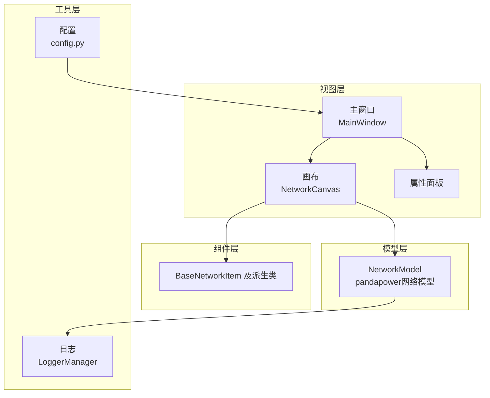
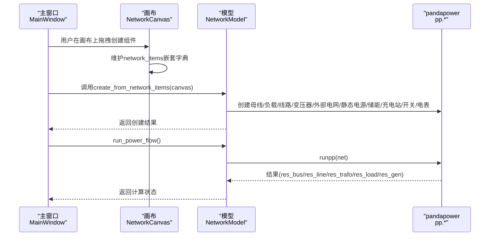
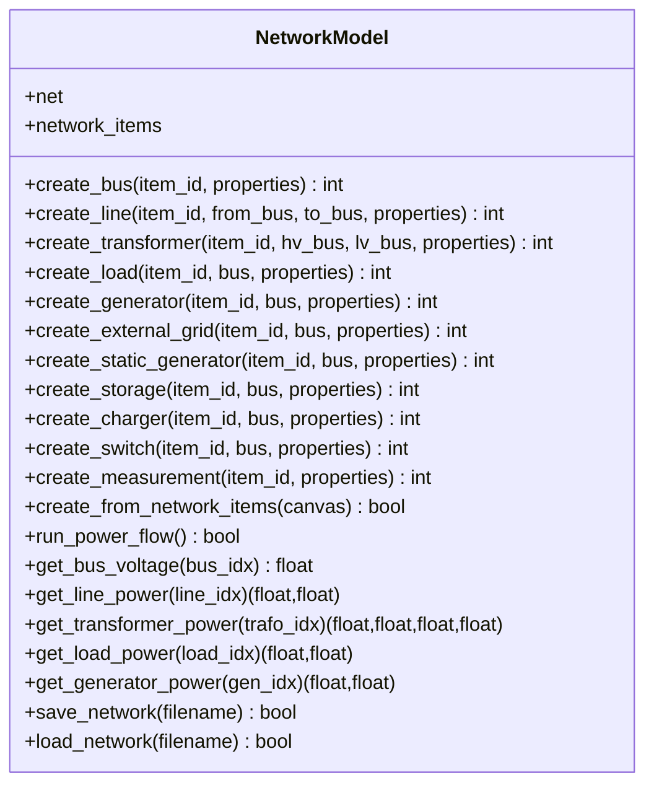
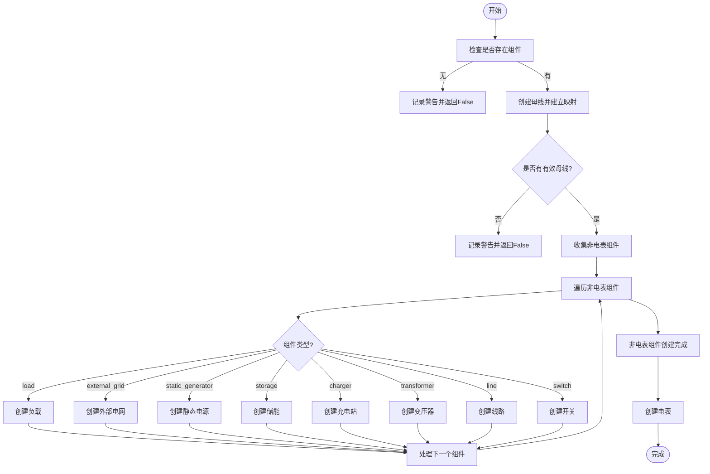
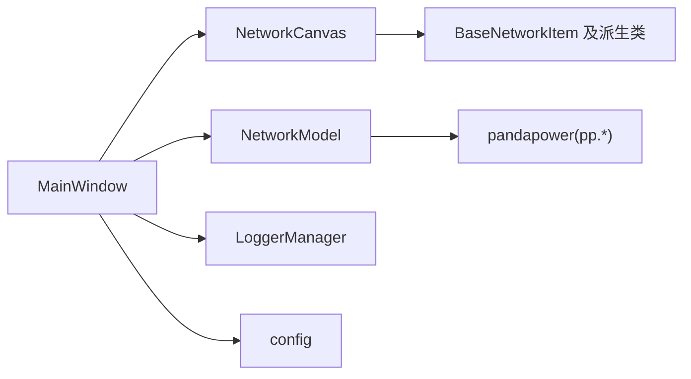

# 模型层

<cite>
**本文引用的文件**
- [src/models/network_model.py](file://src/models/network_model.py)
- [src/components/network_items.py](file://src/components/network_items.py)
- [src/components/canvas.py](file://src/components/canvas.py)
- [src/components/main_window.py](file://src/components/main_window.py)
- [src/utils/logger.py](file://src/utils/logger.py)
- [src/config.py](file://src/config.py)
- [README.md](file://README.md)
</cite>

## 目录
1. [简介](#简介)
2. [项目结构](#项目结构)
3. [核心组件](#核心组件)
4. [架构总览](#架构总览)
5. [详细组件分析](#详细组件分析)
6. [依赖分析](#依赖分析)
7. [性能考虑](#性能考虑)
8. [故障排查指南](#故障排查指南)
9. [结论](#结论)

## 简介
本文件聚焦于pp_tool的模型层，系统性阐述NetworkModel类的设计与实现，说明其如何封装pandapower网络模型、管理电网组件数据（母线、线路、变压器、负载、发电机、外部电网、静态电源、储能、充电站、开关、电表等），并通过create_from_network_items等核心方法将画布上的可视化组件转换为可计算的电力网络模型。文档还解释模型层与pandapower库的集成方式、数据验证机制、仿真诊断与模式切换过程中的生命周期管理，并结合代码示例说明模型如何响应属性变更并维护网络有效性状态，确保数据一致性。

## 项目结构
pp_tool采用分层架构：
- 视图层：UI组件（主窗口、画布、属性面板、组件面板）
- 模型层：NetworkModel负责pandapower网络模型的创建、运行与查询
- 组件层：BaseNetworkItem及其派生类负责可视化组件的属性、连接与渲染
- 工具层：日志、配置等基础设施

图表来源
- [src/components/main_window.py](file://src/components/main_window.py#L95-L170)
- [src/components/canvas.py](file://src/components/canvas.py#L1-L120)
- [src/models/network_model.py](file://src/models/network_model.py#L1-L120)
- [src/components/network_items.py](file://src/components/network_items.py#L1-L120)
- [src/utils/logger.py](file://src/utils/logger.py#L1-L108)
- [src/config.py](file://src/config.py#L1-L120)

章节来源
- [README.md](file://README.md#L1-L48)
- [src/components/main_window.py](file://src/components/main_window.py#L95-L170)
- [src/components/canvas.py](file://src/components/canvas.py#L1-L120)
- [src/models/network_model.py](file://src/models/network_model.py#L1-L120)
- [src/components/network_items.py](file://src/components/network_items.py#L1-L120)
- [src/utils/logger.py](file://src/utils/logger.py#L1-L108)
- [src/config.py](file://src/config.py#L1-L120)

## 核心组件
- NetworkModel：封装pandapower网络，提供创建各类电网元件的方法、从可视化组件批量创建网络模型、运行潮流计算、查询结果、保存/加载网络等功能。
- BaseNetworkItem及其派生类：负责组件的属性、连接点、连接规则、旋转、删除、双击编辑名称等行为。
- NetworkCanvas：负责组件的创建、连接、断开、删除、网格绘制、主题适配、电表测量属性自动填充等。
- MainWindow：负责UI组织、菜单、仿真模式入口、网络诊断流程、属性变更信号处理、网络有效性标志位管理。
- LoggerManager：统一日志输出，便于追踪模型创建、诊断、运行等关键步骤。
- config：集中管理功能开关、调试模式、资源路径等配置。

章节来源
- [src/models/network_model.py](file://src/models/network_model.py#L1-L120)
- [src/components/network_items.py](file://src/components/network_items.py#L1-L120)
- [src/components/canvas.py](file://src/components/canvas.py#L1-L120)
- [src/components/main_window.py](file://src/components/main_window.py#L95-L170)
- [src/utils/logger.py](file://src/utils/logger.py#L1-L108)
- [src/config.py](file://src/config.py#L1-L120)

## 架构总览
NetworkModel作为模型层的核心，向上承接MainWindow的诊断与仿真流程，向下对接NetworkCanvas与BaseNetworkItem的组件数据。其与pandapower的集成体现在：
- 使用pp.create_empty_network初始化空网
- 通过pp.create_*系列函数创建母线、线路、变压器、负载、发电机、外部电网、静态电源、储能、充电站、开关、电表等
- 使用pp.runpp执行潮流计算
- 使用pp.diagnostic进行网络诊断
- 使用pp.to_json/from_json进行网络模型的持久化

图表来源
- [src/components/main_window.py](file://src/components/main_window.py#L345-L466)
- [src/components/canvas.py](file://src/components/canvas.py#L156-L227)
- [src/models/network_model.py](file://src/models/network_model.py#L407-L582)

章节来源
- [src/components/main_window.py](file://src/components/main_window.py#L345-L466)
- [src/components/canvas.py](file://src/components/canvas.py#L156-L227)
- [src/models/network_model.py](file://src/models/network_model.py#L407-L582)

## 详细组件分析

### NetworkModel类设计与实现
NetworkModel以pandapower网络为核心，提供以下能力：
- 初始化：创建空网络net
- 组件创建：create_bus、create_line、create_transformer、create_load、create_generator、create_external_grid、create_static_generator、create_storage、create_charger、create_switch、create_measurement
- 网络创建：create_from_network_items，按母线→非电表组件→电表的顺序创建，确保依赖关系正确
- 运行与查询：run_power_flow、get_bus_voltage、get_line_power、get_transformer_power、get_load_power、get_generator_power
- 持久化：save_network、load_network

图表来源
- [src/models/network_model.py](file://src/models/network_model.py#L1-L710)

章节来源
- [src/models/network_model.py](file://src/models/network_model.py#L1-L710)

#### create_from_network_items流程
该方法负责将画布上的组件转换为pandapower网络：
- 步骤1：创建所有母线，建立“图形项→pandapower母线索引”的映射
- 步骤2：创建非电表组件（负载、外部电网、静态电源、储能、充电站、开关、线路、变压器），利用canvas.get_connected_buses解析连接到母线的组件
- 步骤3：最后创建电表，确保所有其他设备已创建
- 异常处理：逐项创建，遇到错误继续处理其他组件，保证流程不中断

图表来源
- [src/models/network_model.py](file://src/models/network_model.py#L407-L582)
- [src/components/canvas.py](file://src/components/canvas.py#L255-L271)

章节来源
- [src/models/network_model.py](file://src/models/network_model.py#L407-L582)
- [src/components/canvas.py](file://src/components/canvas.py#L255-L271)

#### 与pandapower的集成
- 初始化：pp.create_empty_network
- 创建：pp.create_bus、pp.create_line、pp.create_transformer、pp.create_load、pp.create_gen、pp.create_ext_grid、pp.create_sgen、pp.create_storage、pp.create_load_from_cosphi、pp.create_sgen_from_cosphi、pp.create_switch、pp.create_measurement
- 运行：pp.runpp
- 诊断：pp.diagnostic
- 持久化：pp.to_json、pp.from_json

章节来源
- [src/models/network_model.py](file://src/models/network_model.py#L1-L710)

#### 数据验证机制
- 组件连接验证：BaseNetworkItem.update_bus_parameter根据连接关系更新bus/hv_bus/lv_bus/from_bus/to_bus等属性，确保拓扑一致性
- 连接点可用性：BaseNetworkItem.is_connection_point_available依据组件类型与连接点状态判断是否可连
- 画布连接规则：NetworkCanvas.can_connect综合组件类型兼容性与连接点可用性，避免非法连接
- 属性变更：MainWindow.on_property_changed将属性变更标记为网络无效，触发后续诊断

章节来源
- [src/components/network_items.py](file://src/components/network_items.py#L369-L549)
- [src/components/canvas.py](file://src/components/canvas.py#L341-L360)
- [src/components/main_window.py](file://src/components/main_window.py#L299-L318)

#### 生命周期管理
- 仿真模式入口：MainWindow.enter_simulation_mode在进入仿真前进行网络诊断与IP/端口唯一性校验
- 诊断流程：MainWindow.diagnostic_network创建NetworkModel并调用create_from_network_items，随后启动DiagnosticThread执行pp.diagnostic，完成后更新network_is_valid标志
- 属性变更：MainWindow.on_property_changed将network_is_valid置为False，提示需要重新诊断
- 电表测量：NetworkCanvas._update_meter_properties_on_connection在连接后自动设置电表的element_type、element、side、meas_type等属性

章节来源
- [src/components/main_window.py](file://src/components/main_window.py#L299-L318)
- [src/components/main_window.py](file://src/components/main_window.py#L345-L466)
- [src/components/canvas.py](file://src/components/canvas.py#L497-L562)

#### 响应属性变更与数据一致性
- BaseNetworkItem.update_bus_parameter在组件连接状态变化时，自动更新bus/hv_bus/lv_bus/from_bus/to_bus等关键属性
- MainWindow.on_property_changed在属性面板更新时，将network_is_valid置为False，强制后续操作需重新诊断
- NetworkCanvas._update_meter_properties_on_connection在电表连接后自动填充测量对象类型、索引与测量侧，避免手工配置错误

章节来源
- [src/components/network_items.py](file://src/components/network_items.py#L369-L549)
- [src/components/main_window.py](file://src/components/main_window.py#L299-L318)
- [src/components/canvas.py](file://src/components/canvas.py#L497-L562)

### 组件与画布交互
- 组件创建：NetworkCanvas.create_component将图形项加入network_items嵌套字典，并设置名称、geodata、连接信号
- 连接建立：NetworkCanvas.connect_items根据连接点与类型规则建立连接，更新connections列表
- 断开连接：NetworkCanvas.disconnect_all_from_selected与BaseNetworkItem.remove_connection配合，清理连接并更新bus参数
- 删除组件：BaseNetworkItem.delete_component回收索引、断开连接、从network_items中移除

章节来源
- [src/components/canvas.py](file://src/components/canvas.py#L156-L227)
- [src/components/canvas.py](file://src/components/canvas.py#L406-L496)
- [src/components/network_items.py](file://src/components/network_items.py#L640-L686)

## 依赖分析
- 模块耦合
  - NetworkModel依赖pandapower API创建与运行网络
  - NetworkCanvas与BaseNetworkItem紧密耦合，前者负责连接与拓扑管理，后者负责属性与连接点
  - MainWindow协调UI、诊断、仿真模式与NetworkModel
- 外部依赖
  - pandapower：网络建模、运行与诊断
  - PySide6：UI框架
  - 日志：LoggerManager统一输出
  - 配置：config提供功能开关与资源路径

图表来源
- [src/components/main_window.py](file://src/components/main_window.py#L95-L170)
- [src/components/canvas.py](file://src/components/canvas.py#L1-L120)
- [src/models/network_model.py](file://src/models/network_model.py#L1-L120)
- [src/utils/logger.py](file://src/utils/logger.py#L1-L108)
- [src/config.py](file://src/config.py#L1-L120)

章节来源
- [src/components/main_window.py](file://src/components/main_window.py#L95-L170)
- [src/components/canvas.py](file://src/components/canvas.py#L1-L120)
- [src/models/network_model.py](file://src/models/network_model.py#L1-L120)
- [src/utils/logger.py](file://src/utils/logger.py#L1-L108)
- [src/config.py](file://src/config.py#L1-L120)

## 性能考虑
- 组件创建顺序：先母线再非电表组件，最后电表，减少依赖缺失导致的失败重试
- 连接点管理：BaseNetworkItem的连接点状态与可用性检查，避免无效连接造成多次重试
- 诊断线程：MainWindow使用独立线程执行pp.diagnostic，避免阻塞UI
- 日志输出：LoggerManager使用滚动文件处理器，避免日志过大影响性能

[本节为一般性指导，无需列出具体文件来源]

## 故障排查指南
- 创建网络失败
  - 检查是否包含有效母线：create_from_network_items在无母线时会返回False并记录警告
  - 检查组件连接：NetworkCanvas.can_connect与BaseNetworkItem.is_connection_point_available会拒绝非法连接
- 潮流计算失败
  - run_power_flow捕获异常并返回False，可在日志中查看错误原因
- 诊断未通过
  - MainWindow.diagnostic_network在诊断完成后设置network_is_valid标志，进入仿真前需确保诊断通过
- 属性变更导致网络失效
  - MainWindow.on_property_changed会将network_is_valid置为False，需重新诊断

章节来源
- [src/models/network_model.py](file://src/models/network_model.py#L583-L710)
- [src/components/canvas.py](file://src/components/canvas.py#L341-L360)
- [src/components/main_window.py](file://src/components/main_window.py#L345-L466)

## 结论
NetworkModel通过清晰的组件创建接口、严格的拓扑验证与稳健的诊断流程，实现了从可视化组件到pandapower网络模型的可靠转换。配合BaseNetworkItem与NetworkCanvas的连接与属性管理，以及MainWindow的诊断与模式切换，pp_tool在保证数据一致性的同时，提供了良好的用户体验与扩展空间。建议在复杂拓扑场景下优先使用标准类型创建线路与变压器，合理规划母线与连接点，以提升诊断效率与仿真稳定性。