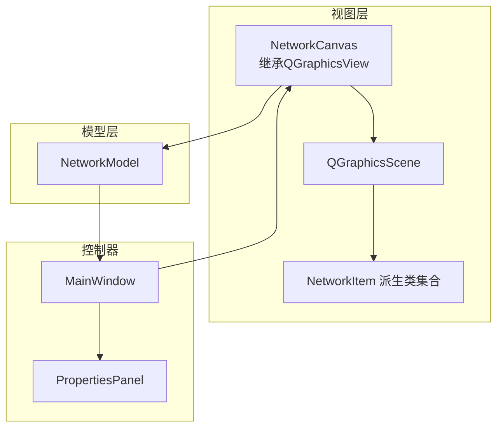
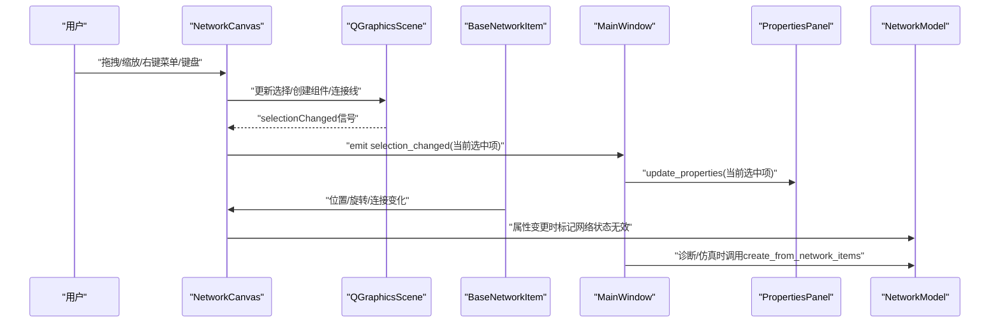
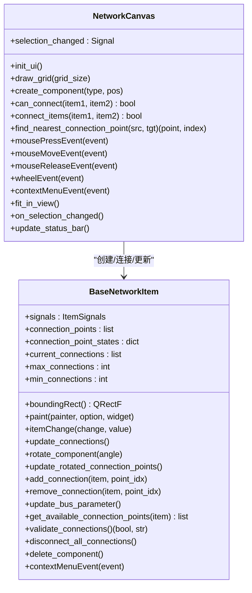
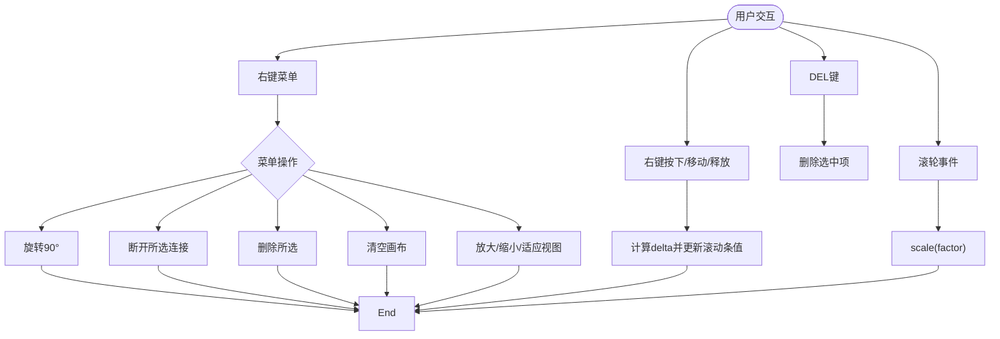
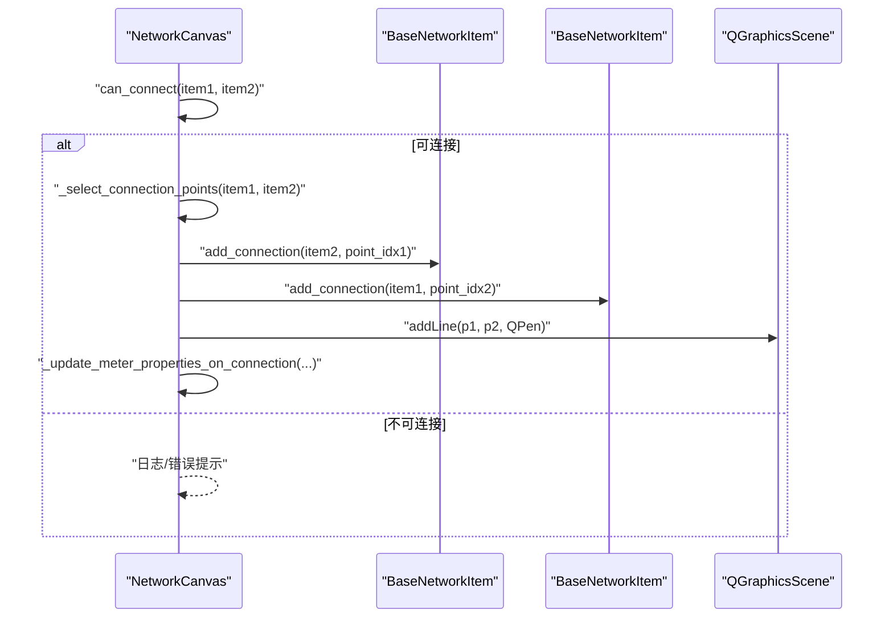
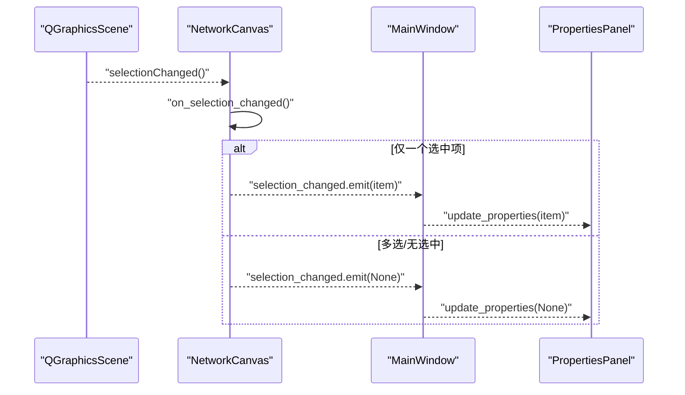
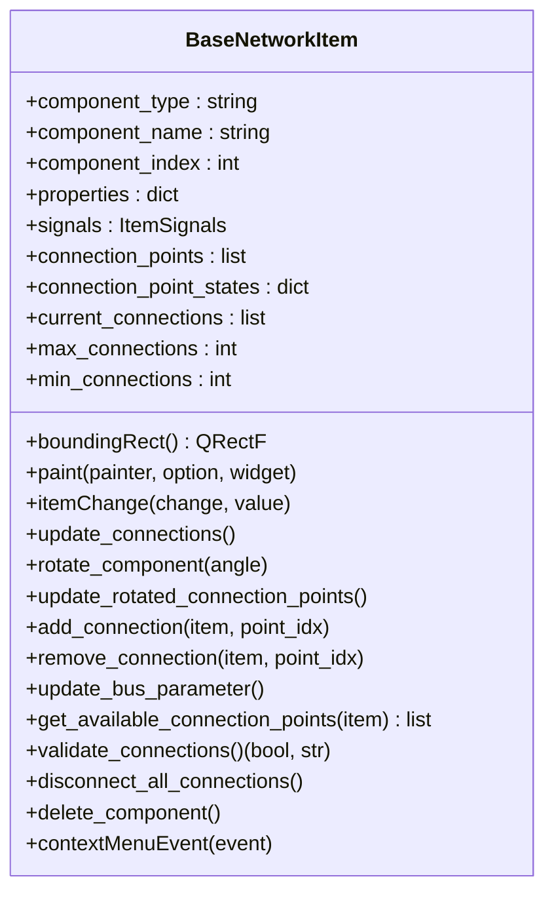
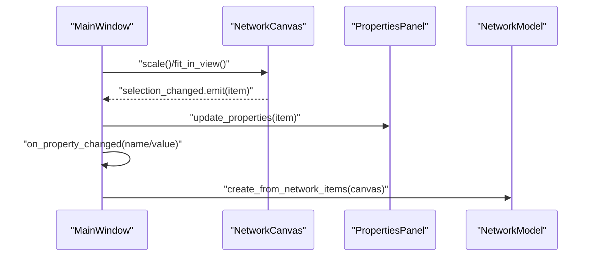
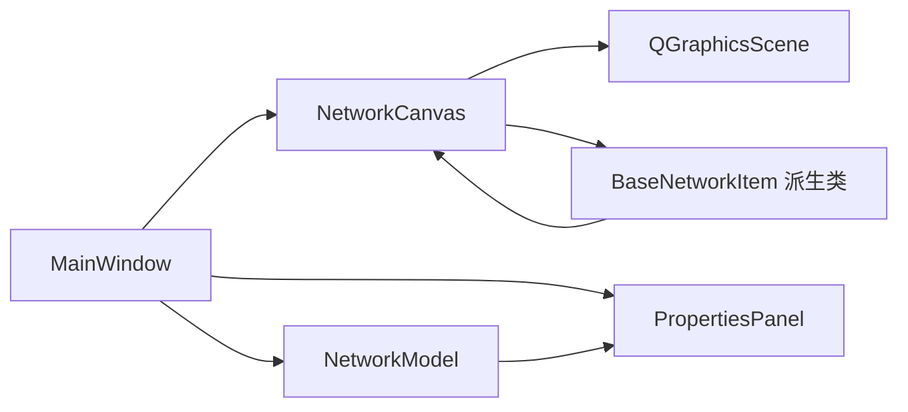

# 视图层

<cite>
**本文引用的文件**
- [src/components/canvas.py](file://src/components/canvas.py)
- [src/components/network_items.py](file://src/components/network_items.py)
- [src/models/network_model.py](file://src/models/network_model.py)
- [src/components/main_window.py](file://src/components/main_window.py)
</cite>

## 目录
1. [简介](#简介)
2. [项目结构](#项目结构)
3. [核心组件](#核心组件)
4. [架构总览](#架构总览)
5. [详细组件分析](#详细组件分析)
6. [依赖分析](#依赖分析)
7. [性能考虑](#性能考虑)
8. [故障排查指南](#故障排查指南)
9. [结论](#结论)

## 简介
本文件聚焦pp_tool的视图层，系统性解析NetworkCanvas类在MVC架构中的核心职责：作为视图，它继承自QGraphicsView，负责电网拓扑的可视化渲染、用户交互（拖拽、选择、缩放、右键菜单）、以及连接线的动态绘制与断开；同时通过selection_changed信号将选择状态通知控制器，实现与控制器的松耦合协作。本文还阐述画布如何管理场景中的各类电网组件项（NetworkItem），如何保持与模型层的数据同步，以及如何通过高效的视图更新机制（如fit_in_view、scale）提升用户体验。

## 项目结构
视图层位于src/components目录下，核心文件如下：
- canvas.py：NetworkCanvas类，视图核心，继承QGraphicsView，承载场景、网格、交互、连接管理与视图更新。
- network_items.py：各类电网组件的图形项基类与派生类，提供连接点、旋转、标签、属性同步等能力。
- main_window.py：控制器，持有NetworkCanvas实例，处理菜单、属性面板联动、仿真入口等。
- network_model.py：模型层，负责从画布的network_items构建pandapower网络模型，提供运行潮流等功能。

**章节来源**
- [src/components/canvas.py](file://src/components/canvas.py#L16-L68)
- [src/components/main_window.py](file://src/components/main_window.py#L96-L179)

## 核心组件
- NetworkCanvas：视图核心，负责场景初始化、网格绘制、主题适配、拖拽平移、缩放、右键菜单、组件创建与连接、选择变化通知等。
- BaseNetworkItem及其派生类：提供连接点、旋转、标签、属性同步、连接状态管理等，支撑画布的连接与更新。
- MainWindow：控制器，持有NetworkCanvas与PropertiesPanel，处理菜单、快捷键、视图操作、属性变更通知等。
- NetworkModel：模型层，从画布的network_items构建pandapower网络模型，提供运行潮流等能力。

**章节来源**
- [src/components/canvas.py](file://src/components/canvas.py#L16-L68)
- [src/components/network_items.py](file://src/components/network_items.py#L24-L110)
- [src/components/main_window.py](file://src/components/main_window.py#L96-L179)
- [src/models/network_model.py](file://src/models/network_model.py#L14-L20)

## 架构总览
NetworkCanvas在MVC中承担“视图”角色，通过以下方式实现与控制器和模型层的协作：
- 与控制器：通过selection_changed信号将当前选中项（或None）通知MainWindow，MainWindow将其转发至PropertiesPanel以更新属性面板。
- 与模型层：通过NetworkModel.create_from_network_items从画布的network_items构建pandapower网络模型；通过属性变更（如名称）通知控制器标记网络状态为无效，触发后续诊断与仿真流程。
- 与组件项：BaseNetworkItem在移动、旋转、连接变化时更新geodata、bus参数、连接线位置，保证视图与数据一致。

**图表来源**
- [src/components/canvas.py](file://src/components/canvas.py#L1172-L1181)
- [src/components/main_window.py](file://src/components/main_window.py#L174-L179)
- [src/models/network_model.py](file://src/models/network_model.py#L407-L582)

**章节来源**
- [src/components/canvas.py](file://src/components/canvas.py#L1172-L1200)
- [src/components/main_window.py](file://src/components/main_window.py#L299-L318)
- [src/models/network_model.py](file://src/models/network_model.py#L407-L582)

## 详细组件分析

### NetworkCanvas类：视图核心
NetworkCanvas继承QGraphicsView，承担以下关键职责：
- 场景与网格：初始化QGraphicsScene，设置场景尺寸，绘制网格背景，支持主题适配的网格与连接线颜色。
- 用户交互：支持右键拖动画布平移、滚轮缩放、键盘DEL删除、右键菜单（旋转、断开连接、删除、清空、缩放等）。
- 组件创建：通过拖放从组件面板创建组件，自动命名、同步geodata、加入场景并连接信号。
- 连接管理：实现连接规则检查、最近连接点选择、动态连接线绘制、电表连接后自动更新测量属性。
- 选择通知：通过selection_changed信号通知控制器当前选中项，支持多选或无选择场景。
- 视图更新：提供fit_in_view、scale等高效视图更新机制，配合BaseNetworkItem的连接线更新，确保视觉一致性。

**图表来源**
- [src/components/canvas.py](file://src/components/canvas.py#L16-L1200)
- [src/components/network_items.py](file://src/components/network_items.py#L24-L295)

**章节来源**
- [src/components/canvas.py](file://src/components/canvas.py#L30-L1200)
- [src/components/network_items.py](file://src/components/network_items.py#L24-L295)

#### 交互与视图更新流程
- 右键拖动画布：记录初始点与拖动增量，通过滚动条值反向调节实现平移。
- 滚轮缩放：按滚轮方向放大/缩小，保持鼠标位置为变换锚点。
- 键盘与右键菜单：DEL删除、旋转、断开连接、清空画布、缩放等。
- 选择变化：selectionChanged信号根据选中数量发出单个项或None，供控制器更新属性面板。

**图表来源**
- [src/components/canvas.py](file://src/components/canvas.py#L646-L800)
- [src/components/canvas.py](file://src/components/canvas.py#L1120-L1169)

**章节来源**
- [src/components/canvas.py](file://src/components/canvas.py#L646-L800)
- [src/components/canvas.py](file://src/components/canvas.py#L1120-L1169)

#### 连接管理与动态绘制
- 连接规则：基于组件类型与连接点状态，检查是否已连接、连接数量限制、母线/电表/开关等特殊规则。
- 连接点选择：优先按最近点，针对母线/线路/变压器等特殊组合采用属性映射选择合适连接点。
- 动态绘制：在场景中创建连接线，存储连接信息，组件移动/旋转时更新连接线两端点。
- 电表自动配置：连接后自动设置element_type、element、side、meas_type等属性，并刷新属性面板。

**图表来源**
- [src/components/canvas.py](file://src/components/canvas.py#L341-L496)
- [src/components/canvas.py](file://src/components/canvas.py#L497-L562)
- [src/components/canvas.py](file://src/components/canvas.py#L596-L645)

**章节来源**
- [src/components/canvas.py](file://src/components/canvas.py#L341-L496)
- [src/components/canvas.py](file://src/components/canvas.py#L497-L562)
- [src/components/canvas.py](file://src/components/canvas.py#L596-L645)

#### 选择变化与控制器通知
- selection_changed信号：当场景选择发生变化时，NetworkCanvas根据选中数量发出单个项或None，MainWindow将其转发至PropertiesPanel。
- 状态栏提示：根据选择状态动态更新状态栏文本，提供操作提示与快捷键说明。

**图表来源**
- [src/components/canvas.py](file://src/components/canvas.py#L1172-L1181)
- [src/components/main_window.py](file://src/components/main_window.py#L174-L179)

**章节来源**
- [src/components/canvas.py](file://src/components/canvas.py#L1172-L1200)
- [src/components/main_window.py](file://src/components/main_window.py#L174-L179)

### BaseNetworkItem：组件项基类
BaseNetworkItem提供组件的通用能力：
- 连接点与连接状态：维护connection_points、connection_point_states、current_connections，支持连接数量与类型约束。
- 旋转与更新：旋转时更新连接点位置，移动/旋转后更新连接线，同步geodata到properties。
- 属性同步：名称、bus、hv_bus/lv_bus/from_bus/to_bus等属性随连接变化自动更新，必要时延迟刷新属性面板。
- 删除与断开：删除组件前断开所有连接，回收索引，从network_items中移除引用。

**图表来源**
- [src/components/network_items.py](file://src/components/network_items.py#L24-L295)

**章节来源**
- [src/components/network_items.py](file://src/components/network_items.py#L24-L295)

### MainWindow：控制器
- 持有NetworkCanvas与PropertiesPanel，处理菜单、快捷键、视图操作（放大/缩小/适应视图）。
- 接收selection_changed信号，更新属性面板；处理属性变更，标记网络状态为无效，触发诊断与仿真。
- 与NetworkModel协作：在诊断/仿真时从画布构建pandapower网络模型。

**图表来源**
- [src/components/main_window.py](file://src/components/main_window.py#L278-L318)
- [src/components/main_window.py](file://src/components/main_window.py#L345-L466)
- [src/models/network_model.py](file://src/models/network_model.py#L407-L582)

**章节来源**
- [src/components/main_window.py](file://src/components/main_window.py#L278-L318)
- [src/components/main_window.py](file://src/components/main_window.py#L345-L466)
- [src/models/network_model.py](file://src/models/network_model.py#L407-L582)

## 依赖分析
- NetworkCanvas依赖QGraphicsView/QGraphicsScene进行渲染与交互，依赖BaseNetworkItem派生类实现组件图形与连接。
- BaseNetworkItem依赖QGraphicsItem接口，维护连接点与连接状态，与画布协同更新连接线。
- MainWindow依赖NetworkCanvas与PropertiesPanel，通过信号槽与画布交互；依赖NetworkModel进行网络构建与仿真。
- NetworkModel依赖pandapower库，从画布的network_items构建pandapower网络模型。

**图表来源**
- [src/components/canvas.py](file://src/components/canvas.py#L16-L68)
- [src/components/network_items.py](file://src/components/network_items.py#L24-L110)
- [src/components/main_window.py](file://src/components/main_window.py#L96-L179)
- [src/models/network_model.py](file://src/models/network_model.py#L14-L20)

**章节来源**
- [src/components/canvas.py](file://src/components/canvas.py#L16-L68)
- [src/components/network_items.py](file://src/components/network_items.py#L24-L110)
- [src/components/main_window.py](file://src/components/main_window.py#L96-L179)
- [src/models/network_model.py](file://src/models/network_model.py#L14-L20)

## 性能考虑
- 视图更新模式：使用FullViewportUpdate减少不必要的重绘，提高滚动与缩放时的流畅度。
- 连接线更新：组件移动/旋转时仅更新与之关联的连接线，避免全场景重绘。
- 主题适配：网格与连接线颜色按主题动态切换，减少额外绘制成本。
- 选择变化：selection_changed按需发出单个项或None，降低控制器处理负担。
- 诊断与仿真：MainWindow在属性变更时标记网络状态无效，避免重复计算；NetworkModel按步骤创建母线、非电表组件、电表，减少错误传播。

[本节为通用指导，无需特定文件引用]

## 故障排查指南
- 连接失败：检查组件类型兼容性、连接点状态、连接数量限制；查看日志输出的错误信息。
- 电表测量属性未更新：确认连接后是否触发_update_meter_properties_on_connection，检查element_type、element、side、meas_type是否正确设置。
- 选择变化未更新属性面板：确认selection_changed信号是否发出，MainWindow是否正确连接到PropertiesPanel。
- 删除组件后仍残留连接：确认BaseNetworkItem的delete_component是否调用disconnect_all_connections并从network_items移除引用。
- 视图缩放/平移异常：检查wheelEvent与mouseMoveEvent的实现，确认transform锚点设置与滚动条更新逻辑。

**章节来源**
- [src/components/canvas.py](file://src/components/canvas.py#L444-L496)
- [src/components/canvas.py](file://src/components/canvas.py#L497-L562)
- [src/components/canvas.py](file://src/components/canvas.py#L646-L800)
- [src/components/network_items.py](file://src/components/network_items.py#L641-L686)

## 结论
NetworkCanvas作为MVC架构中的视图核心，通过继承QGraphicsView实现了电网拓扑的可视化渲染与交互；通过selection_changed信号与控制器解耦协作；通过BaseNetworkItem的连接点与属性同步机制，确保视图与数据的一致性；通过高效的网格绘制、主题适配、连接线动态更新与视图缩放/平移，提供了良好的用户体验。结合MainWindow与NetworkModel，形成了从视图到控制器再到模型层的清晰分工与协作链路。