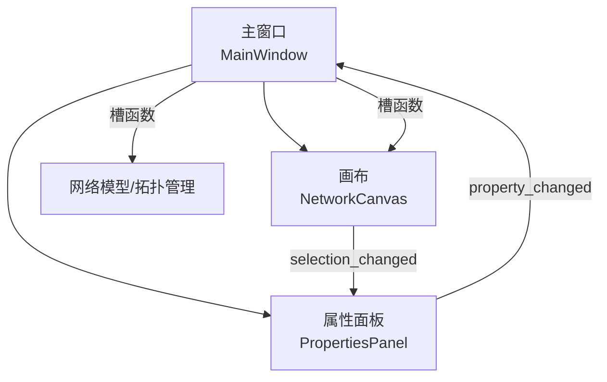
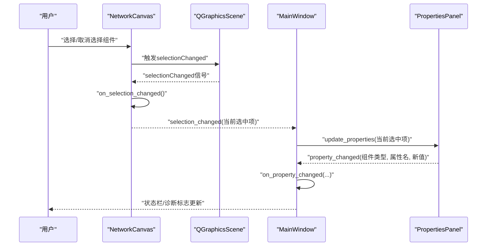
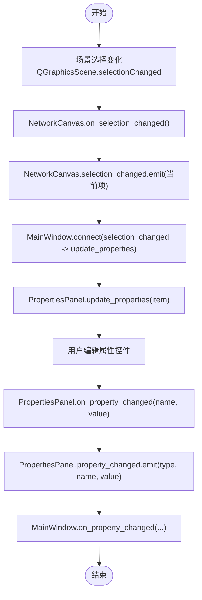
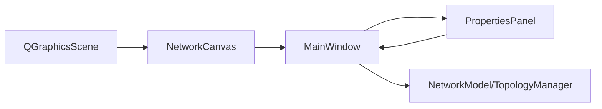

# 信号与槽通信机制

<cite>
**本文引用的文件**
- [canvas.py](file://src/components/canvas.py)
- [properties_panel.py](file://src/components/properties_panel.py)
- [main_window.py](file://src/components/main_window.py)
</cite>

## 目录
1. [简介](#简介)
2. [项目结构](#项目结构)
3. [核心组件](#核心组件)
4. [架构总览](#架构总览)
5. [详细组件分析](#详细组件分析)
6. [依赖关系分析](#依赖关系分析)
7. [性能考量](#性能考量)
8. [故障排查指南](#故障排查指南)
9. [结论](#结论)

## 简介
本文件聚焦于pp_tool中基于PySide6的信号与槽通信机制，围绕“画布（canvas.py）如何通过selection_changed信号通知主窗口组件选择变化；属性面板（properties_panel.py）如何接收该信号并更新UI显示；主窗口如何将用户操作通过槽函数传递给画布和模型”展开。我们将系统梳理信号的定义、发射与连接流程，解释组件间如何实现松耦合，并给出信号流图与线程安全、内存管理注意事项。

## 项目结构
- 顶层主窗口负责装配画布与属性面板，并建立二者之间的信号连接。
- 画布负责场景选择变化的捕获与转发，同时维护组件选择状态。
- 属性面板负责展示与编辑组件属性，并将变更通过信号回传主窗口。

图表来源
- [main_window.py](file://src/components/main_window.py#L174-L179)
- [canvas.py](file://src/components/canvas.py#L19-L21)
- [properties_panel.py](file://src/components/properties_panel.py#L15-L17)

章节来源
- [main_window.py](file://src/components/main_window.py#L118-L179)
- [canvas.py](file://src/components/canvas.py#L19-L21)
- [properties_panel.py](file://src/components/properties_panel.py#L15-L17)

## 核心组件
- NetworkCanvas（画布）
  - 定义selection_changed信号，用于通知当前选中组件变化。
  - 连接QGraphicsScene.selectionChanged到内部处理函数，再转发selection_changed。
- PropertiesPanel（属性面板）
  - 定义property_changed信号，用于通知属性变更。
  - 接收selection_changed信号以刷新UI。
- MainWindow（主窗口）
  - 连接画布selection_changed到属性面板update_properties。
  - 连接属性面板property_changed到on_property_changed槽，驱动后续业务逻辑。

章节来源
- [canvas.py](file://src/components/canvas.py#L19-L21)
- [properties_panel.py](file://src/components/properties_panel.py#L15-L17)
- [main_window.py](file://src/components/main_window.py#L174-L179)

## 架构总览
下面的序列图展示了从用户交互到数据更新的完整信号流，包括画布选择变化通知、属性面板UI更新、以及主窗口对属性变更的响应。

图表来源
- [canvas.py](file://src/components/canvas.py#L60-L61)
- [main_window.py](file://src/components/main_window.py#L174-L179)
- [properties_panel.py](file://src/components/properties_panel.py#L15-L17)

## 详细组件分析

### 画布（NetworkCanvas）的信号定义与发射
- 信号定义
  - selection_changed = Signal(object)，携带当前选中组件对象或None。
- 信号发射
  - 画布在内部处理场景选择变化时，将当前选中项通过selection_changed.emit(...)发出。
  - 在特定路径（如电表连接后）也会主动触发selection_changed，确保属性面板及时刷新。
- 关键连接
  - 画布初始化时将QGraphicsScene.selectionChanged连接到自身的update_status_bar与on_selection_changed。
  - 画布还连接组件项的itemSelected信号到handle_item_selected，用于双击选择与连接逻辑。

章节来源
- [canvas.py](file://src/components/canvas.py#L19-L21)
- [canvas.py](file://src/components/canvas.py#L60-L61)
- [canvas.py](file://src/components/canvas.py#L560-L561)

### 属性面板（PropertiesPanel）的信号定义与接收
- 信号定义
  - property_changed = Signal(str, str, object)，携带组件类型、属性名与新值。
- 信号接收
  - 主窗口将画布的selection_changed连接到属性面板的update_properties，使UI随选择变化而更新。
- 属性编辑
  - 属性面板为不同控件绑定textChanged/valueChanged/toggled等信号，统一转为on_property_changed。
  - on_property_changed中完成属性校验（如IP/端口唯一性）、更新组件属性、必要时刷新面板显示，并最终发出property_changed。

章节来源
- [properties_panel.py](file://src/components/properties_panel.py#L15-L17)
- [properties_panel.py](file://src/components/properties_panel.py#L88-L117)
- [properties_panel.py](file://src/components/properties_panel.py#L336-L445)

### 主窗口（MainWindow）的槽函数与连接
- 连接建立
  - 画布selection_changed -> 属性面板update_properties。
  - 属性面板property_changed -> MainWindow.on_property_changed。
- 槽函数职责
  - on_property_changed：记录网络状态有效性、刷新画布显示（如名称变更时），并输出日志。
  - 提供菜单/工具栏操作的槽（如断开连接、删除、缩放、诊断等），这些操作直接调用画布方法，实现用户操作到画布与模型的解耦。

章节来源
- [main_window.py](file://src/components/main_window.py#L174-L179)
- [main_window.py](file://src/components/main_window.py#L299-L318)

### 信号流图（代码级）

图表来源
- [canvas.py](file://src/components/canvas.py#L60-L61)
- [canvas.py](file://src/components/canvas.py#L19-L21)
- [main_window.py](file://src/components/main_window.py#L174-L179)
- [properties_panel.py](file://src/components/properties_panel.py#L336-L445)

## 依赖关系分析
- 组件耦合与内聚
  - 画布与属性面板通过信号解耦：画布仅发出selection_changed，不关心面板如何渲染；属性面板仅关注当前选中项，不直接依赖画布内部实现。
  - 主窗口承担协调角色：负责建立画布与面板之间的信号连接，并在属性变更时统一处理业务逻辑。
- 直接与间接依赖
  - 画布依赖QGraphicsScene的selectionChanged；属性面板依赖控件的输入信号；主窗口依赖画布与面板的信号接口。
- 潜在循环依赖
  - 未见循环依赖迹象。信号方向清晰：画布->主窗口->属性面板；属性面板->主窗口；主窗口->画布（通过槽调用）。
- 外部依赖与集成点
  - 与pandapower的集成通过主窗口的诊断线程与网络模型实现，与信号机制并行存在。

图表来源
- [canvas.py](file://src/components/canvas.py#L60-L61)
- [main_window.py](file://src/components/main_window.py#L174-L179)
- [properties_panel.py](file://src/components/properties_panel.py#L15-L17)

章节来源
- [canvas.py](file://src/components/canvas.py#L60-L61)
- [main_window.py](file://src/components/main_window.py#L174-L179)
- [properties_panel.py](file://src/components/properties_panel.py#L15-L17)

## 性能考量
- 信号发射频率
  - 场景选择变化频繁，应避免在on_selection_changed中执行昂贵操作；当前实现仅转发信号，性能开销低。
- UI刷新策略
  - 属性面板在名称变更时触发画布scene.update，属于必要刷新；其他属性变更尽量避免不必要的重绘。
- 诊断线程
  - 诊断线程使用QObject派生并在主线程外执行，进度通过信号更新UI，避免阻塞主线程。

章节来源
- [canvas.py](file://src/components/canvas.py#L60-L61)
- [main_window.py](file://src/components/main_window.py#L299-L318)

## 故障排查指南
- 信号未触发
  - 检查画布初始化是否连接QGraphicsScene.selectionChanged到on_selection_changed。
  - 确认selection_changed信号是否被主窗口连接到属性面板update_properties。
- UI不更新
  - 确认属性面板current_item是否正确设置；若为空，面板会显示“未选中”提示。
  - 若属性面板在属性变更后未刷新，检查on_property_changed是否发出property_changed。
- 内存与线程安全
  - 诊断线程结束后需断开信号连接并置空引用，防止悬挂引用导致内存泄漏。
  - 属性面板在删除控件时使用deleteLater，确保Qt对象生命周期安全。
  - 画布在连接组件itemSelected信号时，注意组件对象生命周期，避免悬挂槽连接。

章节来源
- [main_window.py](file://src/components/main_window.py#L345-L466)
- [properties_panel.py](file://src/components/properties_panel.py#L88-L117)

## 结论
pp_tool通过PySide6的信号与槽实现了清晰的组件解耦：画布仅负责选择变化的捕获与转发，属性面板专注UI渲染与编辑，主窗口承担协调与业务处理。信号流简洁高效，配合主线程与诊断线程的分离，既保证了响应性又提升了稳定性。遵循本文的连接规范与内存管理建议，可进一步提升系统的健壮性与可维护性。