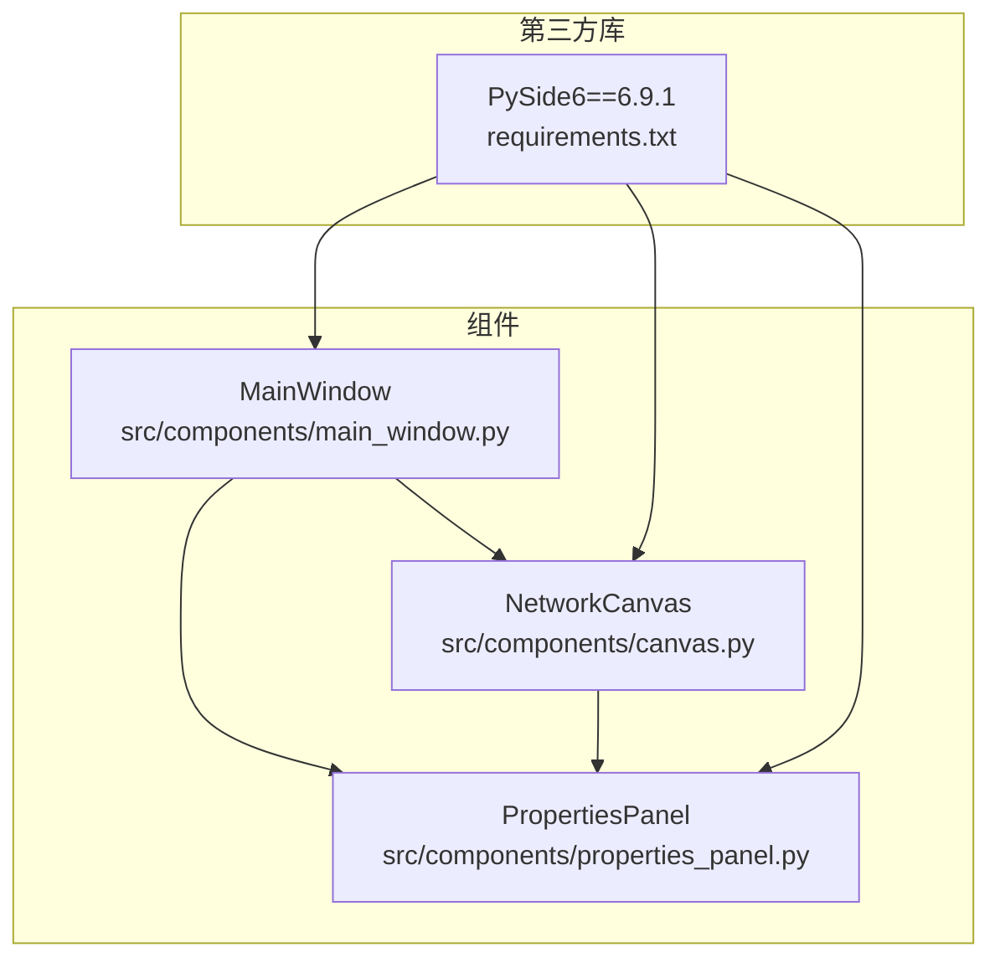
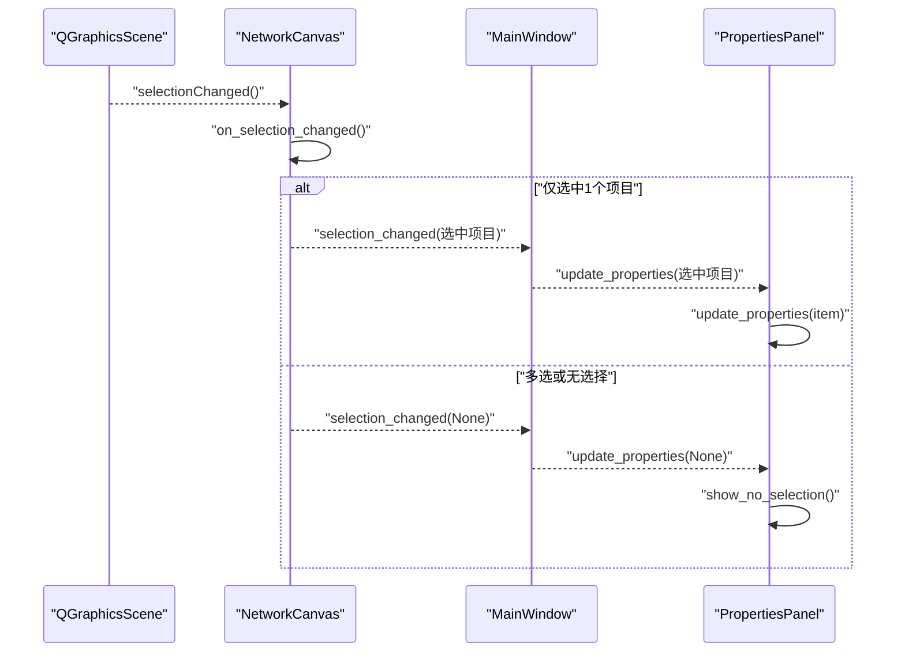
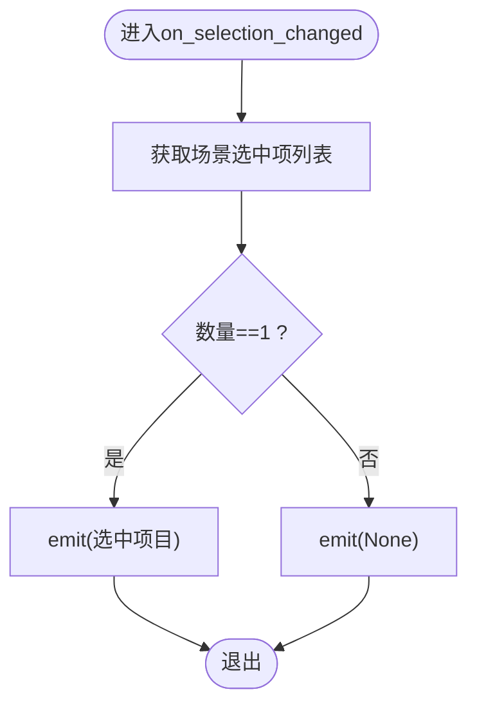
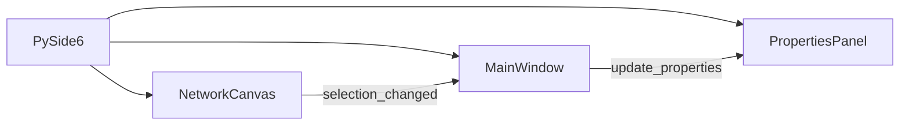

# 信号定义与发射

<cite>
**本文引用的文件**
- [src/components/canvas.py](file://src/components/canvas.py)
- [src/components/main_window.py](file://src/components/main_window.py)
- [src/components/properties_panel.py](file://src/components/properties_panel.py)
- [requirements.txt](file://requirements.txt)
</cite>

## 目录
1. [简介](#简介)
2. [项目结构](#项目结构)
3. [核心组件](#核心组件)
4. [架构总览](#架构总览)
5. [详细组件分析](#详细组件分析)
6. [依赖分析](#依赖分析)
7. [性能考虑](#性能考虑)
8. [故障排查指南](#故障排查指南)
9. [结论](#结论)

## 简介
本节聚焦于NetworkCanvas类中selection_changed信号的定义与发射机制，解释其在canvas.py第19行通过Signal(object)定义信号的方式，以及on_selection_changed方法（第1171-1180行）如何依据场景选择状态发射信号。我们将阐述信号参数设计原则（单个选中项目或None），并结合PySide6信号系统说明线程安全性和内存管理注意事项。最后给出信号发射时序图，并讨论异常处理策略。

## 项目结构
- NetworkCanvas位于src/components/canvas.py，负责画布交互、场景选择监听与信号发射。
- MainWindow位于src/components/main_window.py，负责UI组织与连接画布信号到属性面板。
- PropertiesPanel位于src/components/properties_panel.py，负责接收selection_changed并更新属性显示。
- requirements.txt声明PySide6版本，为信号系统提供基础运行环境。

图表来源
- [src/components/canvas.py](file://src/components/canvas.py#L1-L40)
- [src/components/main_window.py](file://src/components/main_window.py#L118-L180)
- [src/components/properties_panel.py](file://src/components/properties_panel.py#L1-L40)
- [requirements.txt](file://requirements.txt#L1-L10)

章节来源
- [src/components/canvas.py](file://src/components/canvas.py#L1-L40)
- [src/components/main_window.py](file://src/components/main_window.py#L118-L180)
- [src/components/properties_panel.py](file://src/components/properties_panel.py#L1-L40)
- [requirements.txt](file://requirements.txt#L1-L10)

## 核心组件
- NetworkCanvas：定义并发射selection_changed信号，监听场景选择变化并根据选择数量决定发射参数。
- MainWindow：在初始化UI时连接画布selection_changed到属性面板update_properties槽。
- PropertiesPanel：接收信号，更新当前选中组件的属性显示。

章节来源
- [src/components/canvas.py](file://src/components/canvas.py#L16-L25)
- [src/components/canvas.py](file://src/components/canvas.py#L1171-L1180)
- [src/components/main_window.py](file://src/components/main_window.py#L170-L180)
- [src/components/properties_panel.py](file://src/components/properties_panel.py#L80-L120)

## 架构总览
NetworkCanvas作为信号源，通过PySide6的Signal机制向外发布“选择变化”事件；MainWindow订阅该信号并将事件转发至PropertiesPanel，后者据此刷新UI。该流程贯穿Qt事件循环，遵循PySide6的信号-槽约定。

图表来源
- [src/components/canvas.py](file://src/components/canvas.py#L56-L66)
- [src/components/canvas.py](file://src/components/canvas.py#L1171-L1180)
- [src/components/main_window.py](file://src/components/main_window.py#L170-L180)
- [src/components/properties_panel.py](file://src/components/properties_panel.py#L80-L120)

## 详细组件分析

### NetworkCanvas信号定义与发射
- 信号定义：在类体中以Signal(object)定义selection_changed，参数类型为object，允许传递任意Python对象（此处为选中的网络组件或None）。
- 信号连接：在init_ui中连接scene.selectionChanged到两个槽：update_status_bar与on_selection_changed。
- 发射逻辑：on_selection_changed统计selectedItems数量，若为1则emit选中项目，否则emit None。

图表来源
- [src/components/canvas.py](file://src/components/canvas.py#L1171-L1180)

章节来源
- [src/components/canvas.py](file://src/components/canvas.py#L16-L25)
- [src/components/canvas.py](file://src/components/canvas.py#L56-L66)
- [src/components/canvas.py](file://src/components/canvas.py#L1171-L1180)

### MainWindow订阅与转发
- MainWindow在创建属性面板时，将canvas.selection_changed连接到properties_panel.update_properties，从而实现“选择变化”到“属性面板更新”的自动联动。
- 这种连接方式体现了Qt信号-槽的解耦优势：画布无需关心属性面板的具体实现细节。

章节来源
- [src/components/main_window.py](file://src/components/main_window.py#L170-L180)

### PropertiesPanel接收与更新
- PropertiesPanel的update_properties方法接收item参数，若为None则显示“未选中组件”的提示；若为具体组件，则根据组件类型动态构建属性控件并填充当前值。
- 该方法内部维护current_item，作为后续属性变更事件的载体。

章节来源
- [src/components/properties_panel.py](file://src/components/properties_panel.py#L80-L120)

### 信号参数设计原则
- 单一选中项目：emit(item)，便于属性面板直接渲染该组件的属性。
- 多选或无选择：emit(None)，促使属性面板回退到“无选择”提示，避免渲染错误或空指针。
- 参数类型为object：允许传递任意Python对象，便于跨组件共享引用；同时要求接收方具备类型判断能力（如None分支处理）。

章节来源
- [src/components/canvas.py](file://src/components/canvas.py#L16-L25)
- [src/components/canvas.py](file://src/components/canvas.py#L1171-L1180)
- [src/components/properties_panel.py](file://src/components/properties_panel.py#L80-L120)

### PySide6信号系统与线程安全、内存管理
- 线程安全
  - 信号发射来自Qt事件循环（场景选择变化），属于主线程上下文，因此emit本身是线程安全的。
  - 若需跨线程触发UI更新，应使用Qt的跨线程信号机制（例如通过QMetaObject.invokeMethod或使用QTimer.singleShot），但本项目中selection_changed由场景事件触发，无需额外跨线程保护。
- 内存管理
  - 信号连接采用强连接（默认），当对象生命周期结束时，PySide6会自动断开连接，避免悬挂引用。
  - 画布与属性面板之间通过信号连接，MainWindow负责建立连接，无需手动断开（除非显式断开需求）。若出现异常导致连接未断开，PySide6会在对象销毁时清理，但仍建议在合适时机显式断开以避免潜在泄漏。
  - 信号参数传递的是对象引用，不会复制大量数据；但需注意避免在emit后立即销毁被引用对象，以免槽函数收到野指针。

章节来源
- [src/components/canvas.py](file://src/components/canvas.py#L56-L66)
- [src/components/main_window.py](file://src/components/main_window.py#L170-L180)

### 异常处理策略
- 画布内部对组件有效性进行检查，例如在连接逻辑中捕获RuntimeError/AttributeError，防止对已销毁对象的操作。
- 属性面板在on_property_changed中对IP/端口等关键属性进行冲突检测，若发现冲突则恢复旧值并提示用户，避免脏数据写入。
- 信号发射本身不抛出异常；若槽函数内部发生异常，将中断当前槽链，建议在槽函数中自行try-except并记录日志，避免影响其他槽。

章节来源
- [src/components/canvas.py](file://src/components/canvas.py#L409-L430)
- [src/components/properties_panel.py](file://src/components/properties_panel.py#L336-L445)

## 依赖分析
- NetworkCanvas依赖PySide6的Signal、QGraphicsScene等；MainWindow依赖Signal与QMainWindow/QDockWidget；PropertiesPanel依赖Signal与QWidget。
- 三者通过信号-槽形成松耦合依赖：画布仅暴露信号，主窗口负责装配，属性面板仅消费信号。

图表来源
- [src/components/canvas.py](file://src/components/canvas.py#L1-L25)
- [src/components/main_window.py](file://src/components/main_window.py#L118-L180)
- [src/components/properties_panel.py](file://src/components/properties_panel.py#L1-L40)

章节来源
- [src/components/canvas.py](file://src/components/canvas.py#L1-L25)
- [src/components/main_window.py](file://src/components/main_window.py#L118-L180)
- [src/components/properties_panel.py](file://src/components/properties_panel.py#L1-L40)

## 性能考虑
- 信号发射频率：场景选择变化频繁，但emit成本低，主要开销在于属性面板重建UI。可通过减少不必要的属性面板刷新（例如在批量操作期间暂时断开连接）来优化。
- 事件循环：所有信号-槽均在Qt事件循环内执行，避免阻塞主线程。
- 参数传递：object类型参数避免了序列化开销，但需确保引用对象生命周期足够长。

## 故障排查指南
- 现象：属性面板未更新
  - 检查MainWindow是否正确连接canvas.selection_changed到properties_panel.update_properties。
  - 检查画布是否正确emit(None)或emit(item)。
- 现象：属性面板显示异常或崩溃
  - 检查属性面板update_properties对None分支的处理。
  - 检查槽函数内部是否存在未捕获异常。
- 现象：跨线程触发UI更新导致异常
  - 确认信号发射来自主线程；如需跨线程，使用Qt推荐的跨线程机制。

章节来源
- [src/components/main_window.py](file://src/components/main_window.py#L170-L180)
- [src/components/canvas.py](file://src/components/canvas.py#L1171-L1180)
- [src/components/properties_panel.py](file://src/components/properties_panel.py#L80-L120)

## 结论
NetworkCanvas的selection_changed信号以简洁明确的参数设计（单个选中项目或None）实现了画布与属性面板的高效联动。结合PySide6的信号-槽机制，项目在主线程上下文中保证了线程安全与良好的内存管理。通过合理的异常处理与连接策略，系统能够在复杂交互场景下保持稳定与高性能。