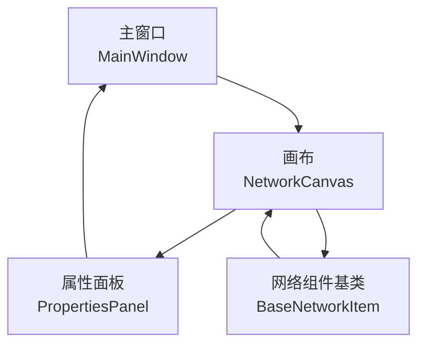
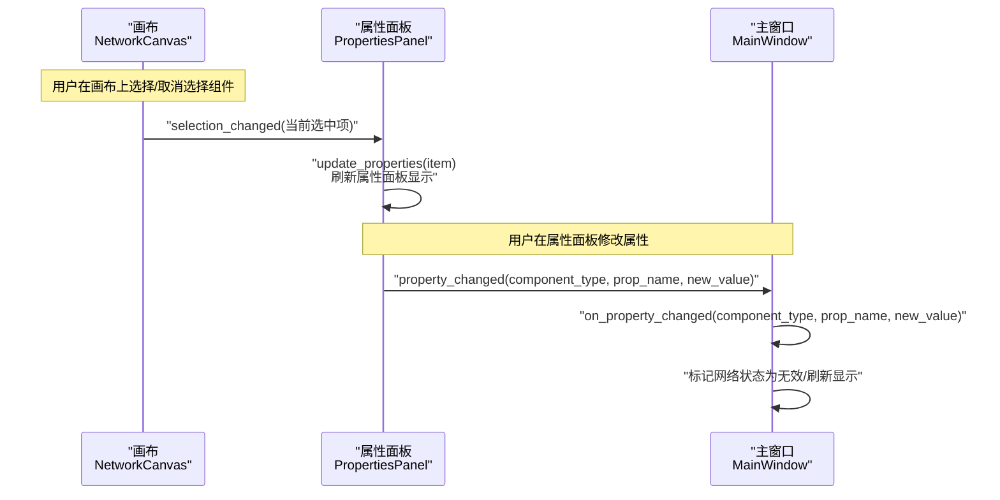

# 信号连接管理

<cite>
**本文引用的文件**
- [main_window.py](file://src/components/main_window.py)
- [canvas.py](file://src/components/canvas.py)
- [properties_panel.py](file://src/components/properties_panel.py)
- [network_items.py](file://src/components/network_items.py)
</cite>

## 目录
1. [简介](#简介)
2. [项目结构](#项目结构)
3. [核心组件](#核心组件)
4. [架构总览](#架构总览)
5. [详细组件分析](#详细组件分析)
6. [依赖分析](#依赖分析)
7. [性能考量](#性能考量)
8. [故障排查指南](#故障排查指南)
9. [结论](#结论)

## 简介
本文件聚焦于主窗口中“信号与槽”的连接管理机制，围绕以下两个关键连接展开：
- 第175行：将画布的 selection_changed 信号连接到属性面板的 update_properties 槽函数
- 第178行：将属性面板的 property_changed 信号连接到主窗口 on_property_changed 槽函数

我们将解释连接时的信号参数传递机制、连接过程中的错误处理与断开策略，并讨论多级组件间信号传递对性能的影响。

## 项目结构
本项目采用分层与按功能模块组织的结构，核心涉及主窗口、画布、属性面板及底层网络组件。信号连接主要发生在主窗口与画布、属性面板之间，形成“画布 -> 属性面板 -> 主窗口”的链式响应。

图表来源
- [main_window.py](file://src/components/main_window.py#L118-L180)
- [canvas.py](file://src/components/canvas.py#L16-L25)
- [properties_panel.py](file://src/components/properties_panel.py#L12-L23)
- [network_items.py](file://src/components/network_items.py#L19-L23)

章节来源
- [main_window.py](file://src/components/main_window.py#L118-L180)
- [canvas.py](file://src/components/canvas.py#L16-L25)
- [properties_panel.py](file://src/components/properties_panel.py#L12-L23)
- [network_items.py](file://src/components/network_items.py#L19-L23)

## 核心组件
- 主窗口 MainWindow：负责创建画布、属性面板，建立信号连接，处理属性变更回调，管理诊断线程的连接与断开。
- 画布 NetworkCanvas：提供 selection_changed 信号，用于通知当前选中项变化；内部维护场景选择变化的连接。
- 属性面板 PropertiesPanel：提供 property_changed 信号，携带组件类型、属性名与新值；提供 update_properties 方法用于刷新面板。
- 网络组件基类 BaseNetworkItem：提供 itemSelected 信号，供画布内部处理组件选中逻辑。

章节来源
- [main_window.py](file://src/components/main_window.py#L118-L180)
- [canvas.py](file://src/components/canvas.py#L16-L25)
- [properties_panel.py](file://src/components/properties_panel.py#L12-L23)
- [network_items.py](file://src/components/network_items.py#L19-L23)

## 架构总览
下面的时序图展示了两条关键信号链路的调用流程与参数传递：

图表来源
- [main_window.py](file://src/components/main_window.py#L174-L179)
- [canvas.py](file://src/components/canvas.py#L16-L25)
- [properties_panel.py](file://src/components/properties_panel.py#L12-L23)

章节来源
- [main_window.py](file://src/components/main_window.py#L174-L179)
- [canvas.py](file://src/components/canvas.py#L16-L25)
- [properties_panel.py](file://src/components/properties_panel.py#L12-L23)

## 详细组件分析

### 1. 画布 selection_changed 信号到属性面板 update_properties 槽
- 连接位置：主窗口在创建属性面板后，将画布的 selection_changed 信号连接到属性面板的 update_properties 方法。
- 信号参数：画布发出的 selection_changed 信号携带“当前选中的单个项目”作为参数；若多选或无选择则为 None。
- 参数传递机制：属性面板的 update_properties 接收该对象，据此构建属性控件并刷新显示。
- 关键点：
  - 画布内部通过场景 selectionChanged 事件触发 selection_changed 信号，确保 UI 与业务数据一致。
  - 属性面板在 update_properties 中根据组件类型动态生成控件，保证不同组件的属性可见性与交互一致性。

章节来源
- [main_window.py](file://src/components/main_window.py#L174-L176)
- [canvas.py](file://src/components/canvas.py#L16-L25)
- [properties_panel.py](file://src/components/properties_panel.py#L88-L117)

### 2. 属性面板 property_changed 信号到主窗口 on_property_changed 槽
- 连接位置：主窗口将属性面板的 property_changed 信号连接到自身的 on_property_changed 方法。
- 信号参数：property_changed 信号携带三个参数：组件类型、属性名、新值。
- 参数传递机制：主窗口 on_property_changed 接收上述参数，执行日志记录、网络有效性标记等逻辑。
- 关键点：
  - 主窗口在处理属性变更时，会根据属性名执行特定分支（如名称变更触发画布刷新）。
  - 主窗口维护 network_is_valid 标志位，属性变更会将其置为无效，提示后续需要重新诊断。

章节来源
- [main_window.py](file://src/components/main_window.py#L177-L179)
- [main_window.py](file://src/components/main_window.py#L299-L318)
- [properties_panel.py](file://src/components/properties_panel.py#L336-L445)

### 3. 信号连接的错误处理与断开策略
- 连接时的错误处理：
  - 画布与属性面板之间的连接在主窗口初始化属性面板阶段一次性建立，属于应用启动期的静态连接，一般不会出现运行期连接失败。
- 断开策略：
  - 主窗口在启动网络诊断线程前，会显式断开诊断线程的 progress_updated、diagnostic_completed、error_occurred 信号与其槽的连接，防止旧连接残留导致内存泄漏或重复触发。
  - 断开采用 try/except 捕获 TypeError（当连接已断开时），确保健壮性。
  - 诊断完成后，同样断开所有相关信号连接，并将线程引用置空，便于垃圾回收。
- 画布层面的断开：
  - 画布提供断开选中设备连接的方法，内部通过遍历 connections 列表移除连接并更新连接点状态，同时重置网络诊断标志位。

章节来源
- [main_window.py](file://src/components/main_window.py#L357-L370)
- [main_window.py](file://src/components/main_window.py#L361-L366)
- [main_window.py](file://src/components/main_window.py#L435-L447)
- [main_window.py](file://src/components/main_window.py#L453-L466)
- [canvas.py](file://src/components/canvas.py#L853-L889)

### 4. 多级组件间信号传递的性能影响
- 信号链路简述：
  - 画布 selection_changed -> 属性面板 update_properties -> 属性面板 property_changed -> 主窗口 on_property_changed
- 性能特征：
  - 画布与属性面板之间的连接为一对一信号到槽的简单转发，开销极低。
  - 属性面板在 on_property_changed 中可能触发多次 UI 刷新（如名称变更时刷新标签、面板等），但这些操作通常在主线程中进行，且规模有限。
  - 主窗口 on_property_changed 中的网络状态标记与日志记录为轻量级操作。
- 优化建议：
  - 若属性面板频繁触发 property_changed，可在主窗口层面对高频变更进行去抖或批量处理，减少不必要的网络诊断重算。
  - 对于大规模拓扑，建议在属性面板内部对某些字段变更（如只读或非关键字段）避免发出 property_changed，降低上游压力。

章节来源
- [main_window.py](file://src/components/main_window.py#L174-L179)
- [properties_panel.py](file://src/components/properties_panel.py#L336-L445)
- [canvas.py](file://src/components/canvas.py#L16-L25)

## 依赖分析
- 主窗口依赖：
  - 画布：提供 selection_changed 信号，驱动属性面板刷新。
  - 属性面板：提供 property_changed 信号，驱动主窗口处理属性变更。
- 画布依赖：
  - 网络组件基类：提供 itemSelected 信号，用于组件选中事件的内部处理。
- 属性面板依赖：
  - 组件类型定义与控件生成逻辑，动态构建属性 UI。

图表来源
- [main_window.py](file://src/components/main_window.py#L174-L179)
- [canvas.py](file://src/components/canvas.py#L16-L25)
- [properties_panel.py](file://src/components/properties_panel.py#L12-L23)
- [network_items.py](file://src/components/network_items.py#L19-L23)

章节来源
- [main_window.py](file://src/components/main_window.py#L174-L179)
- [canvas.py](file://src/components/canvas.py#L16-L25)
- [properties_panel.py](file://src/components/properties_panel.py#L12-L23)
- [network_items.py](file://src/components/network_items.py#L19-L23)

## 性能考量
- 信号连接本身为轻量级操作，主要成本在于槽函数内的业务逻辑。
- 在属性面板中，部分字段变更会触发 UI 重建或面板刷新，应避免在高频交互场景下无差别发出 property_changed。
- 主窗口 on_property_changed 中的网络状态标记与日志记录为常量级开销，不会成为瓶颈。
- 建议：
  - 对于大量组件的批量属性修改，考虑在属性面板层合并变更，减少信号发射次数。
  - 对于诊断线程等异步任务，确保连接断开与资源回收，避免后台线程持有过期连接导致额外开销。

## 故障排查指南
- 现象：属性面板不随画布选择变化而更新
  - 检查主窗口是否成功建立 canvas.selection_changed -> properties_panel.update_properties 的连接。
  - 确认画布 selection_changed 是否被触发（场景 selectionChanged 事件是否连接到 on_selection_changed）。
- 现象：修改属性后主窗口未响应
  - 检查主窗口是否成功建立 properties_panel.property_changed -> MainWindow.on_property_changed 的连接。
  - 确认属性面板 on_property_changed 是否正常发出信号（参数顺序与类型是否正确）。
- 现象：诊断线程结束后仍出现重复触发或内存占用上升
  - 检查主窗口在启动诊断前是否断开诊断线程的信号连接。
  - 确认诊断完成后是否断开并置空线程引用。
- 现象：断开连接时报错
  - 断开连接时捕获 TypeError 是预期行为，确认异常被捕获且不影响流程。

章节来源
- [main_window.py](file://src/components/main_window.py#L357-L370)
- [main_window.py](file://src/components/main_window.py#L361-L366)
- [main_window.py](file://src/components/main_window.py#L435-L447)
- [main_window.py](file://src/components/main_window.py#L453-L466)
- [canvas.py](file://src/components/canvas.py#L59-L62)
- [canvas.py](file://src/components/canvas.py#L853-L889)

## 结论
- 主窗口通过两条关键信号链路实现了“画布选择 -> 属性面板刷新 -> 属性变更处理”的闭环。
- 连接参数传递清晰：selection_changed 传递选中对象，property_changed 传递组件类型、属性名与新值。
- 错误处理与断开策略完善：主窗口在诊断线程前后均进行显式断连，避免内存泄漏与重复触发。
- 多级信号传递整体开销较低，可通过在属性面板层合并变更与去抖进一步优化高频场景下的性能表现。