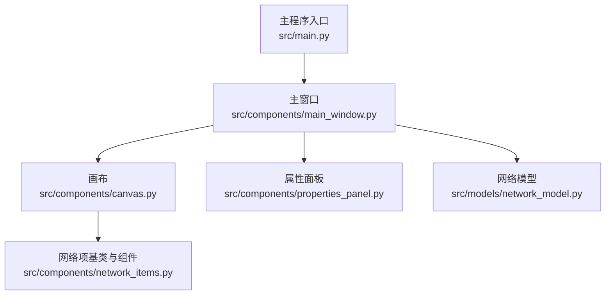
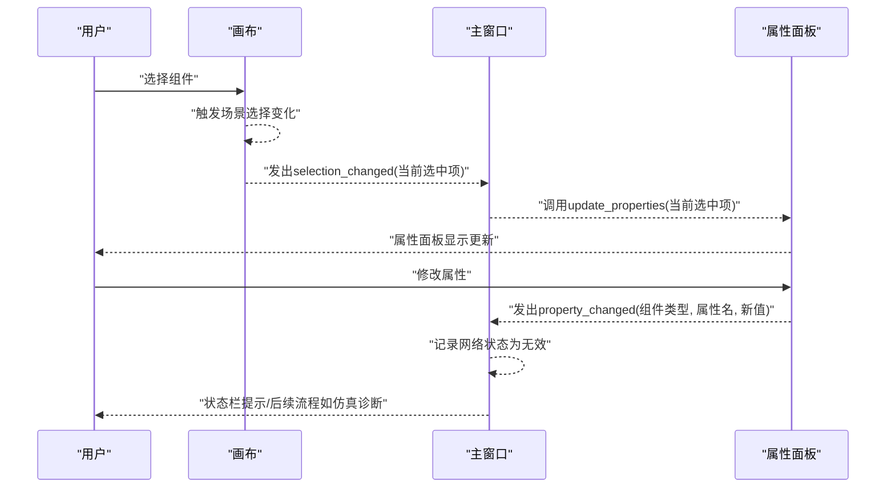
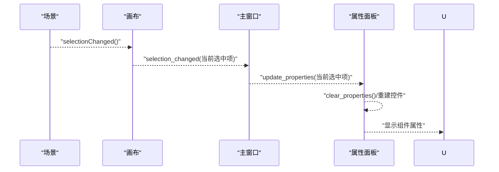
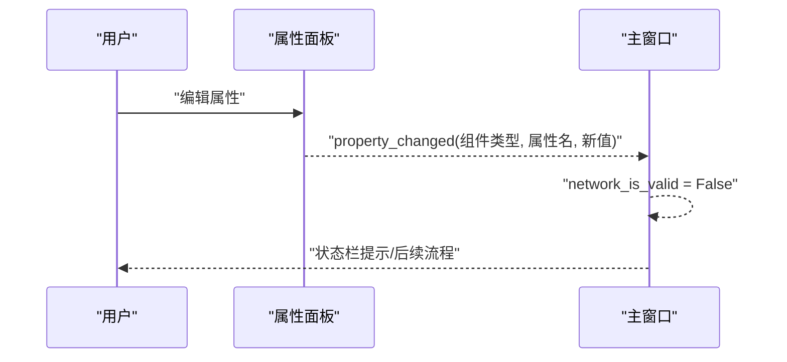
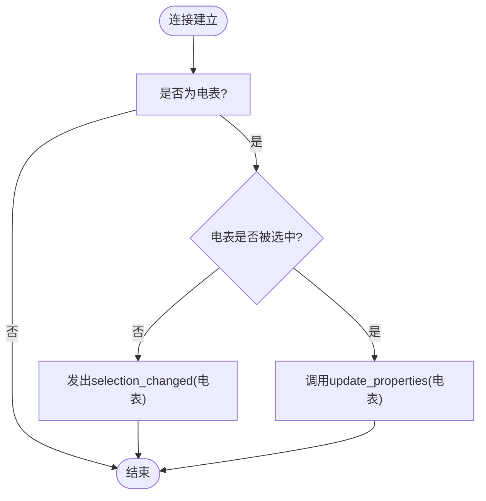
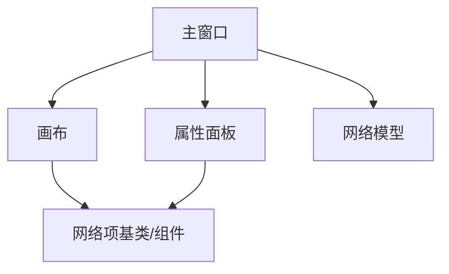

# 跨组件通信流程

<cite>
**本文引用的文件**
- [main.py](file://src/main.py)
- [main_window.py](file://src/components/main_window.py)
- [canvas.py](file://src/components/canvas.py)
- [properties_panel.py](file://src/components/properties_panel.py)
- [network_items.py](file://src/components/network_items.py)
- [network_model.py](file://src/models/network_model.py)
</cite>

## 目录
1. [简介](#简介)
2. [项目结构](#项目结构)
3. [核心组件](#核心组件)
4. [架构总览](#架构总览)
5. [详细组件分析](#详细组件分析)
6. [依赖分析](#依赖分析)
7. [性能考虑](#性能考虑)
8. [故障排查指南](#故障排查指南)
9. [结论](#结论)

## 简介
本文件围绕“从画布选择到属性更新”的完整跨组件通信流程展开，重点说明：
- 用户在画布上选择组件时，selection_changed信号如何驱动属性面板更新（通过update_properties方法）
- 用户修改属性时，property_changed信号如何经由主窗口协调模型更新
- 信号在canvas、properties_panel和main_window之间的传递路径
- 该通信模式对系统松耦合设计的贡献
- 提供完整的通信序列图与流程图

## 项目结构
- 主程序入口负责创建应用与主窗口
- 主窗口负责组织画布、属性面板、菜单与状态栏，并建立信号桥接
- 画布负责组件渲染、交互、连接与选择事件
- 属性面板负责展示与编辑组件属性，并发出属性变更信号
- 网络项基类与各具体组件负责图形项行为、连接点管理与属性同步
- 网络模型负责将图形拓扑转换为pandapower网络模型（仿真相关）

图表来源
- [main.py](file://src/main.py#L1-L72)
- [main_window.py](file://src/components/main_window.py#L1-L200)
- [canvas.py](file://src/components/canvas.py#L1-L120)
- [properties_panel.py](file://src/components/properties_panel.py#L1-L60)
- [network_items.py](file://src/components/network_items.py#L1-L120)
- [network_model.py](file://src/models/network_model.py#L1-L40)

章节来源
- [main.py](file://src/main.py#L1-L72)
- [main_window.py](file://src/components/main_window.py#L1-L200)

## 核心组件
- 画布NetworkCanvas：维护场景、组件、连接关系；发出selection_changed信号；处理组件选中、连接、右键菜单等
- 属性面板PropertiesPanel：展示组件属性，响应用户编辑，发出property_changed信号
- 主窗口MainWindow：持有画布与属性面板，建立二者信号桥接；处理属性变更事件，协调网络状态
- 网络项基类BaseNetworkItem：统一的图形项行为、连接点管理、属性同步与信号发射
- 网络模型NetworkModel：将图形拓扑转换为pandapower网络模型（仿真相关）

章节来源
- [canvas.py](file://src/components/canvas.py#L1-L120)
- [properties_panel.py](file://src/components/properties_panel.py#L1-L60)
- [main_window.py](file://src/components/main_window.py#L150-L200)
- [network_items.py](file://src/components/network_items.py#L1-L120)
- [network_model.py](file://src/models/network_model.py#L1-L40)

## 架构总览
该系统采用“信号驱动”的松耦合架构：
- 画布与属性面板之间通过信号解耦：画布发出selection_changed，属性面板订阅并更新显示
- 属性面板与主窗口之间通过信号解耦：属性面板发出property_changed，主窗口统一处理
- 主窗口不直接依赖具体组件类型，仅通过信号接口与组件交互，便于扩展新组件类型

图表来源
- [canvas.py](file://src/components/canvas.py#L55-L70)
- [main_window.py](file://src/components/main_window.py#L170-L180)
- [properties_panel.py](file://src/components/properties_panel.py#L12-L20)

## 详细组件分析

### 画布选择到属性面板更新流程
- 画布在场景选择变化时发出selection_changed信号
- 主窗口将该信号直接连接到属性面板的update_properties方法
- 属性面板根据当前选中项重建属性控件并显示

图表来源
- [canvas.py](file://src/components/canvas.py#L55-L70)
- [main_window.py](file://src/components/main_window.py#L170-L180)
- [properties_panel.py](file://src/components/properties_panel.py#L88-L120)

章节来源
- [canvas.py](file://src/components/canvas.py#L55-L70)
- [main_window.py](file://src/components/main_window.py#L170-L180)
- [properties_panel.py](file://src/components/properties_panel.py#L88-L120)

### 属性修改到主窗口协调流程
- 属性面板在用户编辑属性时发出property_changed信号
- 主窗口接收信号后记录网络状态为无效，便于后续仿真诊断
- 主窗口不直接操作模型，而是通过状态标记与后续流程（如诊断）体现影响

图表来源
- [properties_panel.py](file://src/components/properties_panel.py#L12-L20)
- [main_window.py](file://src/components/main_window.py#L299-L318)

章节来源
- [properties_panel.py](file://src/components/properties_panel.py#L336-L445)
- [main_window.py](file://src/components/main_window.py#L299-L318)

### 电表连接后属性面板强制刷新流程
- 画布在电表连接后，若电表被选中，会主动触发selection_changed，确保属性面板即时刷新
- 该机制保证属性面板显示与连接关系一致

图表来源
- [canvas.py](file://src/components/canvas.py#L555-L561)

章节来源
- [canvas.py](file://src/components/canvas.py#L555-L561)

### 组件移动/旋转/双击等事件对属性面板的影响
- 组件位置变化时，BaseNetworkItem会更新geodata并触发属性面板刷新
- 组件名称变化时，BaseNetworkItem会同步更新属性面板并发出属性变更信号
- 这些行为均通过主窗口间接影响属性面板显示，保持UI与数据的一致性

章节来源
- [network_items.py](file://src/components/network_items.py#L223-L258)
- [network_items.py](file://src/components/network_items.py#L729-L762)

### 通信模式对系统松耦合设计的贡献
- 低耦合：画布与属性面板通过信号解耦；主窗口仅承担桥接职责，不深入组件细节
- 可扩展：新增组件类型只需在画布中创建图形项并发出itemSelected信号，属性面板即可自动适配
- 可测试：信号接口清晰，便于单元测试与模拟
- 可维护：业务逻辑集中在主窗口的信号处理方法中，便于集中维护

章节来源
- [canvas.py](file://src/components/canvas.py#L220-L227)
- [properties_panel.py](file://src/components/properties_panel.py#L12-L20)
- [main_window.py](file://src/components/main_window.py#L170-L180)

## 依赖分析
- 画布依赖网络项基类与具体组件类，负责场景管理与连接
- 属性面板依赖网络项属性定义，负责UI控件生成与信号发射
- 主窗口依赖画布与属性面板，负责信号桥接与状态管理
- 网络模型在仿真模式下使用，与主窗口协作进行诊断与建模

图表来源
- [main_window.py](file://src/components/main_window.py#L1-L120)
- [canvas.py](file://src/components/canvas.py#L1-L60)
- [properties_panel.py](file://src/components/properties_panel.py#L1-L40)
- [network_model.py](file://src/models/network_model.py#L1-L40)

章节来源
- [main_window.py](file://src/components/main_window.py#L1-L120)
- [canvas.py](file://src/components/canvas.py#L1-L60)
- [properties_panel.py](file://src/components/properties_panel.py#L1-L40)
- [network_model.py](file://src/models/network_model.py#L1-L40)

## 性能考虑
- 信号发射频率：属性面板在用户输入时频繁发出property_changed，主窗口应避免在每次信号到达时执行昂贵操作
- UI刷新策略：属性面板在名称、位置等变化时触发刷新，建议使用延迟刷新或批量更新减少重绘
- 画布连接与重绘：组件移动/旋转时更新连接线，建议在批量操作完成后统一刷新，降低重绘成本

## 故障排查指南
- 信号未生效
  - 检查主窗口是否正确连接画布selection_changed与属性面板update_properties
  - 检查属性面板是否正确连接property_changed与主窗口处理方法
- 属性面板不更新
  - 确认当前选中项存在且具备properties字段
  - 确认主窗口与属性面板的父子关系正确，以便属性面板能定位主窗口
- 电表属性未随连接变化刷新
  - 检查画布在电表连接后是否发出selection_changed或调用update_properties
- 属性变更未反映到网络状态
  - 确认主窗口on_property_changed是否被调用，network_is_valid是否被置为False

章节来源
- [main_window.py](file://src/components/main_window.py#L170-L180)
- [properties_panel.py](file://src/components/properties_panel.py#L336-L445)
- [canvas.py](file://src/components/canvas.py#L555-L561)

## 结论
该系统通过“信号驱动”的跨组件通信实现了高度解耦的设计：
- 画布与属性面板通过信号桥接，彼此无需直接依赖
- 主窗口承担协调职责，集中处理属性变更与网络状态
- 网络项基类统一了图形项行为与属性同步，简化了扩展
- 该模式提升了系统的可维护性、可扩展性与可测试性