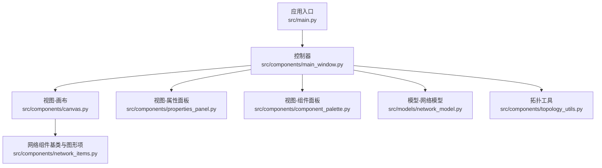
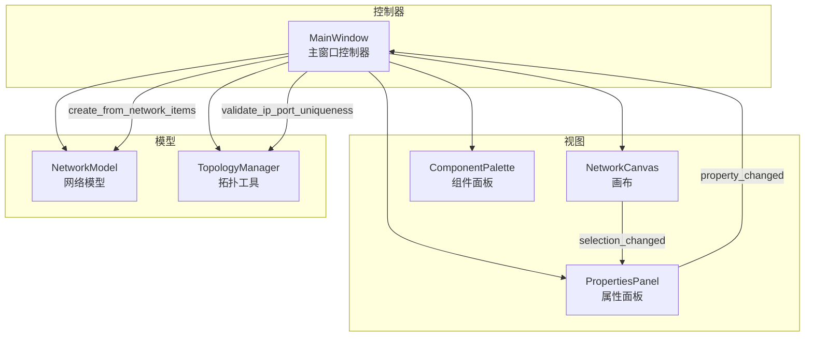
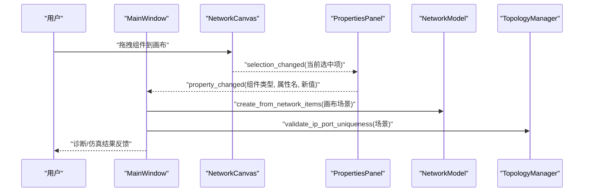
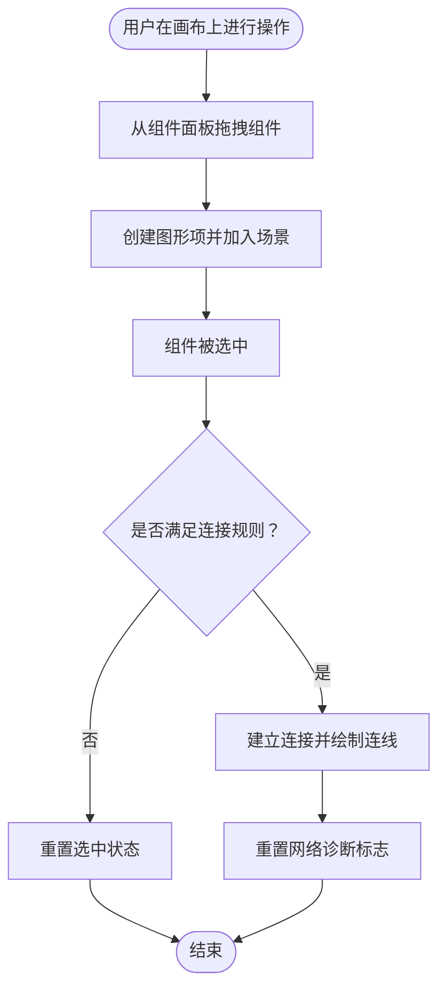
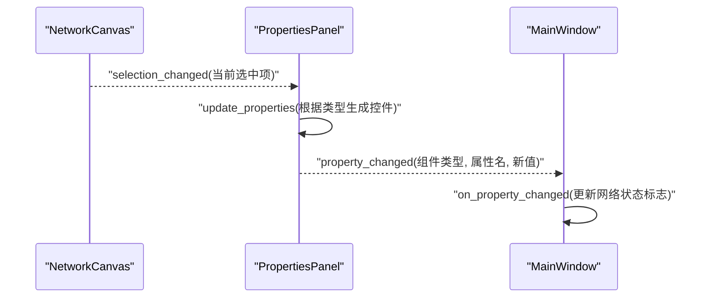
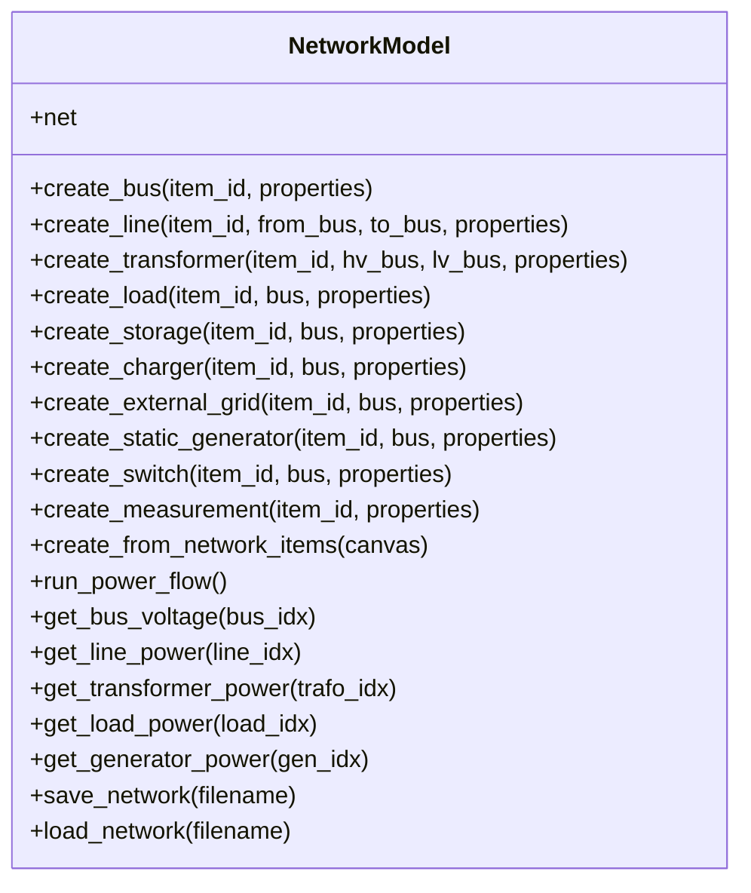
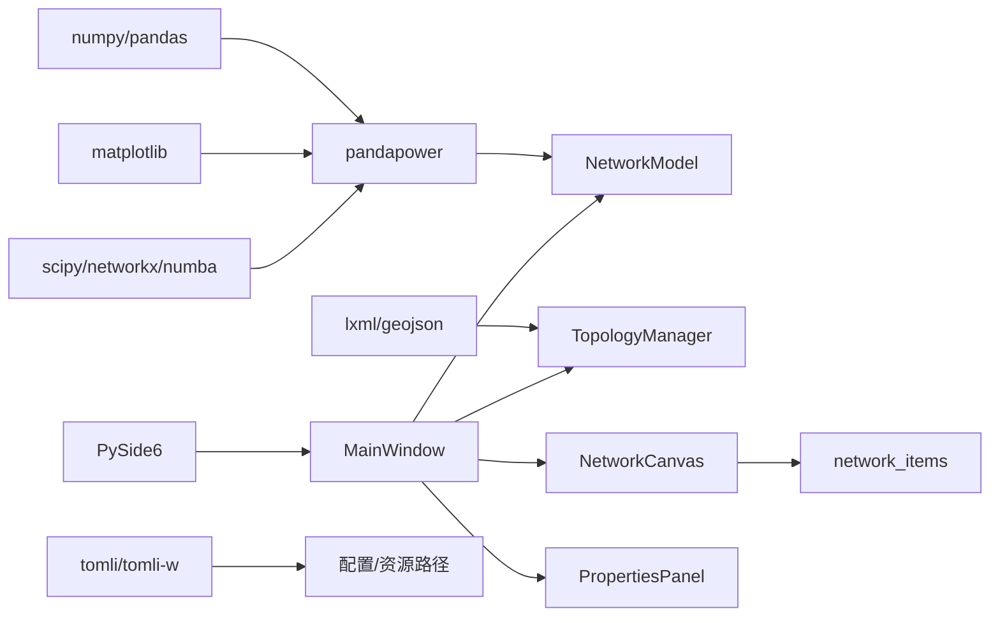

# 核心架构

<cite>
**本文引用的文件**
- [src/main.py](file://src/main.py)
- [src/components/main_window.py](file://src/components/main_window.py)
- [src/components/canvas.py](file://src/components/canvas.py)
- [src/components/properties_panel.py](file://src/components/properties_panel.py)
- [src/components/component_palette.py](file://src/components/component_palette.py)
- [src/components/topology_utils.py](file://src/components/topology_utils.py)
- [src/components/network_items.py](file://src/components/network_items.py)
- [src/models/network_model.py](file://src/models/network_model.py)
- [requirements.txt](file://requirements.txt)
</cite>

## 目录
1. [简介](#简介)
2. [项目结构](#项目结构)
3. [核心组件](#核心组件)
4. [架构总览](#架构总览)
5. [详细组件分析](#详细组件分析)
6. [依赖分析](#依赖分析)
7. [性能考虑](#性能考虑)
8. [故障排查指南](#故障排查指南)
9. [结论](#结论)
10. [附录](#附录)

## 简介
本文件面向pp_tool项目，系统化阐述其基于MVC（Model-View-Controller）设计模式的架构实现。主窗口（main_window.py）作为控制器，协调组件面板、属性面板与画布之间的交互；画布（canvas.py）作为视图，负责渲染电网拓扑与处理用户输入；网络模型（network_model.py）作为模型，封装pandapower的网络数据与仿真能力。项目采用PySide6的信号与槽机制实现松耦合通信，例如画布发出的selection_changed信号被属性面板接收并更新UI。本文还提供系统上下文图与组件交互图，展示“用户操作 -> UI组件 -> 信号 -> 控制器 -> 模型更新 -> 仿真计算 -> 结果反馈”的数据流。

## 项目结构
pp_tool采用按功能域分层的组织方式：
- 应用入口：src/main.py
- 控制器：src/components/main_window.py
- 视图：src/components/canvas.py、src/components/properties_panel.py、src/components/component_palette.py
- 模型：src/models/network_model.py
- 拓扑工具：src/components/topology_utils.py
- 网络组件基类与具体图形项：src/components/network_items.py
- 依赖声明：requirements.txt

图表来源
- [src/main.py](file://src/main.py#L1-L72)
- [src/components/main_window.py](file://src/components/main_window.py#L1-L120)
- [src/components/canvas.py](file://src/components/canvas.py#L1-L120)
- [src/components/properties_panel.py](file://src/components/properties_panel.py#L1-L80)
- [src/components/component_palette.py](file://src/components/component_palette.py#L1-L80)
- [src/components/topology_utils.py](file://src/components/topology_utils.py#L1-L80)
- [src/components/network_items.py](file://src/components/network_items.py#L1-L120)
- [src/models/network_model.py](file://src/models/network_model.py#L1-L60)

章节来源
- [src/main.py](file://src/main.py#L1-L72)
- [requirements.txt](file://requirements.txt#L1-L27)

## 核心组件
- 控制器（MainWindow）
  - 职责：创建并编排UI组件；响应菜单与快捷键；协调画布与属性面板；触发网络诊断与仿真流程；管理拓扑导入导出。
  - 关键交互：连接画布selection_changed到属性面板update_properties；连接属性面板property_changed到控制器on_property_changed；通过TopologyManager进行IP/端口唯一性校验与拓扑导入导出。
- 视图（NetworkCanvas）
  - 职责：绘制网格背景、渲染组件与连接线；处理拖拽、右键菜单、缩放与平移；维护场景选择状态；发出selection_changed信号；更新网络有效性标志。
  - 关键交互：组件拖拽放置后创建图形项并加入场景；组件选中事件触发连接逻辑；连接成功后重置网络诊断标志。
- 属性面板（PropertiesPanel）
  - 职责：根据当前选中组件动态生成属性控件；监听控件变更并通过property_changed信号通知控制器；执行IP/端口唯一性冲突检测与回滚；在特定属性变化时联动图形项标签与Modbus寄存器。
  - 关键交互：接收selection_changed信号更新UI；发出property_changed信号驱动模型与图形项同步。
- 组件面板（ComponentPalette）
  - 职责：提供可拖拽的电网组件图标；通过拖拽将组件类型传递至画布，触发创建流程。
- 网络模型（NetworkModel）
  - 职责：基于network_items构建pandapower网络；按拓扑顺序创建母线、负载/电源/储能/充电站/外部电网/开关等，最后创建电表；提供运行潮流计算与结果查询接口；支持保存/加载网络。
- 拓扑工具（TopologyManager）
  - 职责：导入/导出拓扑JSON；校验IP/端口唯一性；在导入时重建组件与连接关系；在导出前进行唯一性校验。

章节来源
- [src/components/main_window.py](file://src/components/main_window.py#L95-L180)
- [src/components/canvas.py](file://src/components/canvas.py#L16-L120)
- [src/components/properties_panel.py](file://src/components/properties_panel.py#L12-L60)
- [src/components/component_palette.py](file://src/components/component_palette.py#L16-L80)
- [src/models/network_model.py](file://src/models/network_model.py#L1-L60)
- [src/components/topology_utils.py](file://src/components/topology_utils.py#L1-L60)

## 架构总览
pp_tool采用经典的MVC分层：
- Model（网络模型）：封装pandapower网络数据与仿真能力，负责数据持久化与计算。
- View（画布/属性面板/组件面板）：负责渲染与交互，暴露信号供控制器订阅。
- Controller（主窗口）：协调各视图与模型，处理业务流程（如诊断、仿真、导入导出）。

图表来源
- [src/components/main_window.py](file://src/components/main_window.py#L170-L200)
- [src/components/canvas.py](file://src/components/canvas.py#L16-L40)
- [src/components/properties_panel.py](file://src/components/properties_panel.py#L12-L20)
- [src/models/network_model.py](file://src/models/network_model.py#L407-L582)
- [src/components/topology_utils.py](file://src/components/topology_utils.py#L20-L40)

## 详细组件分析

### 主窗口（控制器）分析
- UI初始化与布局
  - 创建中央画布、组件面板与属性面板；设置菜单栏、状态栏；连接画布选择变化到属性面板更新。
- 业务流程
  - 缩放/平移/适应视图：委托画布实现。
  - 断开连接/删除：委托画布实现。
  - 仿真模式与网络诊断：在FEATURE_SIMULATION开启时启用；诊断流程包含进度对话框、线程化诊断、结果反馈与网络有效性标记。
  - 拓扑导入/导出：通过TopologyManager执行；导入前清空画布并重建组件与连接；导出前进行IP/端口唯一性校验。
- 与模型交互
  - 诊断阶段：创建NetworkModel实例，从画布的network_items构建pandapower网络；运行pp.diagnostic进行诊断；根据结果更新UI与网络有效性标志。

图表来源
- [src/components/main_window.py](file://src/components/main_window.py#L170-L200)
- [src/components/canvas.py](file://src/components/canvas.py#L16-L40)
- [src/components/properties_panel.py](file://src/components/properties_panel.py#L12-L20)
- [src/models/network_model.py](file://src/models/network_model.py#L407-L582)
- [src/components/topology_utils.py](file://src/components/topology_utils.py#L20-L40)

章节来源
- [src/components/main_window.py](file://src/components/main_window.py#L118-L200)
- [src/components/main_window.py](file://src/components/main_window.py#L320-L466)
- [src/components/main_window.py](file://src/components/main_window.py#L477-L550)

### 画布（视图）分析
- 信号与槽
  - selection_changed：在组件选中/取消选中时发出，属性面板据此刷新UI。
- 组件创建与连接
  - 支持从组件面板拖拽创建组件；限制外部电网唯一性；根据连接规则与连接点选择算法实现可靠连接；连接成功后重置网络诊断标志。
- 用户交互
  - 右键拖拽平移、滚轮缩放、右键菜单（旋转、断开连接、删除、清空、缩放）。
- 主题与视觉
  - 根据应用主题动态调整网格线与连接线颜色；组件标签颜色随主题切换。

图表来源
- [src/components/canvas.py](file://src/components/canvas.py#L156-L227)
- [src/components/canvas.py](file://src/components/canvas.py#L341-L360)
- [src/components/canvas.py](file://src/components/canvas.py#L406-L496)

章节来源
- [src/components/canvas.py](file://src/components/canvas.py#L16-L120)
- [src/components/canvas.py](file://src/components/canvas.py#L156-L227)
- [src/components/canvas.py](file://src/components/canvas.py#L341-L360)
- [src/components/canvas.py](file://src/components/canvas.py#L406-L496)

### 属性面板（视图）分析
- 信号与槽
  - property_changed：当用户修改属性时发出，携带组件类型、属性名与新值。
- 动态UI
  - 根据组件类型与属性条件（如use_standard_type/use_power_factor）动态显示/隐藏控件。
- 冲突检测与回滚
  - 对IP/端口进行唯一性校验；若冲突，弹窗警告并回滚到旧值。
- 同步更新
  - 名称变化同步到图形项标签；部分设备的sn属性与Modbus寄存器联动更新。

图表来源
- [src/components/canvas.py](file://src/components/canvas.py#L16-L40)
- [src/components/properties_panel.py](file://src/components/properties_panel.py#L88-L140)
- [src/components/main_window.py](file://src/components/main_window.py#L299-L318)

章节来源
- [src/components/properties_panel.py](file://src/components/properties_panel.py#L88-L140)
- [src/components/properties_panel.py](file://src/components/properties_panel.py#L336-L445)
- [src/components/main_window.py](file://src/components/main_window.py#L299-L318)

### 组件面板（视图）分析
- 提供可拖拽的电网组件图标；拖拽时通过QMimeData传递组件类型；画布接收后创建对应图形项。

章节来源
- [src/components/component_palette.py](file://src/components/component_palette.py#L95-L168)

### 网络模型（模型）分析
- 数据构建
  - create_from_network_items：按母线、非电表设备、电表的顺序创建pandapower网络；映射图形项到pandapower索引。
- 仿真与查询
  - run_power_flow：运行潮流计算；提供获取母线电压、线路/变压器/负载/发电机功率的方法。
- 持久化
  - save_network/load_network：基于pandapower JSON接口保存/加载网络。

图表来源
- [src/models/network_model.py](file://src/models/network_model.py#L1-L120)
- [src/models/network_model.py](file://src/models/network_model.py#L407-L582)
- [src/models/network_model.py](file://src/models/network_model.py#L583-L710)

章节来源
- [src/models/network_model.py](file://src/models/network_model.py#L1-L120)
- [src/models/network_model.py](file://src/models/network_model.py#L407-L582)
- [src/models/network_model.py](file://src/models/network_model.py#L583-L710)

### 拓扑工具（模型辅助）分析
- 导入/导出
  - export_topology/import_topology：准备/解析拓扑JSON；导入时重建组件与连接关系。
- 唯一性校验
  - validate_ip_port_uniqueness：收集IP/端口组合，检测重复与不完整配置并给出提示。
- 连接恢复
  - _restore_connections：按开关、线路/变压器、其他设备的顺序恢复连接，避免循环与不一致。

章节来源
- [src/components/topology_utils.py](file://src/components/topology_utils.py#L193-L245)
- [src/components/topology_utils.py](file://src/components/topology_utils.py#L246-L293)
- [src/components/topology_utils.py](file://src/components/topology_utils.py#L20-L40)
- [src/components/topology_utils.py](file://src/components/topology_utils.py#L461-L620)

## 依赖分析
- 外部依赖
  - PySide6：GUI框架与信号/槽机制。
  - pandapower：电力系统仿真核心库。
  - 其他：numpy/pandas/matplotlib/scipy/networkx/numba/lxml/geojson/deepdiff/tqdm等。
- 内部耦合
  - 控制器依赖画布与属性面板的信号；画布依赖网络组件基类；属性面板依赖控制器进行IP/端口冲突检测；拓扑工具与画布配合导入/导出。
- 松耦合设计
  - 通过PySide6信号与槽解耦UI与业务逻辑；控制器集中处理业务流程，避免视图直接访问模型细节。

图表来源
- [requirements.txt](file://requirements.txt#L1-L27)
- [src/components/main_window.py](file://src/components/main_window.py#L1-L40)
- [src/models/network_model.py](file://src/models/network_model.py#L1-L20)
- [src/components/topology_utils.py](file://src/components/topology_utils.py#L1-L20)

章节来源
- [requirements.txt](file://requirements.txt#L1-L27)

## 性能考虑
- 诊断线程化
  - 使用Python原生threading模块与PySide6信号实现后台诊断，避免阻塞UI；通过QProgressDialog反馈进度，线程结束后断开信号连接并清理资源。
- 画布渲染优化
  - 抗锯齿与全视口更新；网格背景绘制一次；连接线颜色随主题动态选择，减少重绘成本。
- 拓扑导入/导出
  - 导入时先清空画布，再批量创建组件与连接；导出前进行唯一性校验，避免后续处理失败带来的重试成本。
- 模型构建顺序
  - 先母线、再非电表设备、最后电表，降低依赖缺失导致的失败概率。

章节来源
- [src/components/main_window.py](file://src/components/main_window.py#L28-L94)
- [src/components/main_window.py](file://src/components/main_window.py#L345-L466)
- [src/components/canvas.py](file://src/components/canvas.py#L34-L52)
- [src/models/network_model.py](file://src/models/network_model.py#L407-L582)

## 故障排查指南
- 诊断失败或网络无效
  - 现象：进入仿真模式前提示网络诊断未通过。
  - 排查：确认已执行诊断；检查是否存在连接限制、母线缺失、外部电网重复等问题；查看诊断结果提示并修复。
- IP/端口冲突
  - 现象：修改IP或端口时弹出冲突提示。
  - 排查：确保同一场景内IP+端口组合唯一；修改后回滚到旧值。
- 画布连接异常
  - 现象：组件无法连接或连接后无显示。
  - 排查：检查连接规则（母线可连任意、线路/变压器需连母线或电表等）；确认连接点可用；查看日志输出。
- 拓扑导入失败
  - 现象：导入后连接关系异常或设备索引不一致。
  - 排查：确认导入JSON格式正确；检查连接属性（如from_bus/to_bus、hv_bus/lv_bus、element/element_type）；导入后再次进行IP/端口唯一性校验。

章节来源
- [src/components/main_window.py](file://src/components/main_window.py#L320-L466)
- [src/components/properties_panel.py](file://src/components/properties_panel.py#L336-L445)
- [src/components/canvas.py](file://src/components/canvas.py#L341-L360)
- [src/components/topology_utils.py](file://src/components/topology_utils.py#L20-L40)

## 结论
pp_tool通过清晰的MVC分层与PySide6信号/槽机制实现了松耦合的UI与业务逻辑分离。主窗口作为控制器统一协调画布、属性面板与网络模型，结合拓扑工具与诊断线程，形成完整的“编辑-诊断-仿真”闭环。该架构便于扩展新组件与新功能，同时保证了良好的用户体验与可维护性。

## 附录
- 技术选型权衡
  - PySide6：跨平台GUI框架，信号/槽机制成熟，适合复杂桌面应用；与Qt生态契合度高。
  - pandapower：专注于电力系统仿真，API稳定，适合构建电网拓扑与运行分析。
  - 依赖矩阵：见requirements.txt，涵盖仿真、可视化、打包与通信等需求。

章节来源
- [requirements.txt](file://requirements.txt#L1-L27)