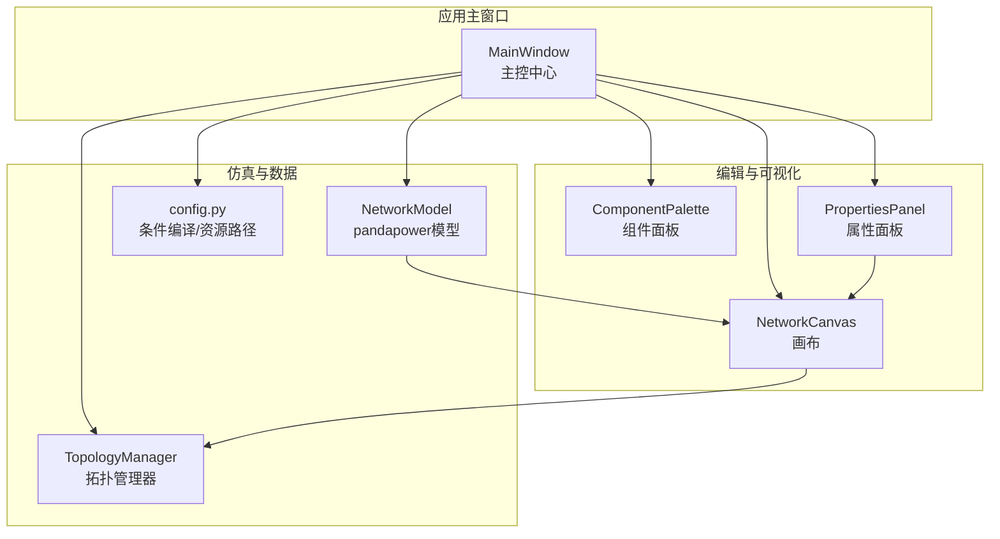
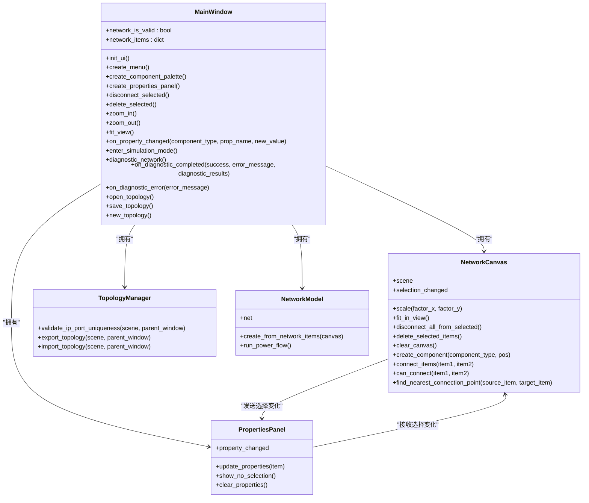
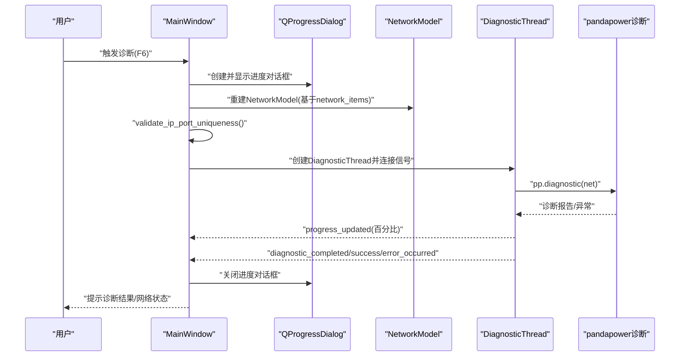
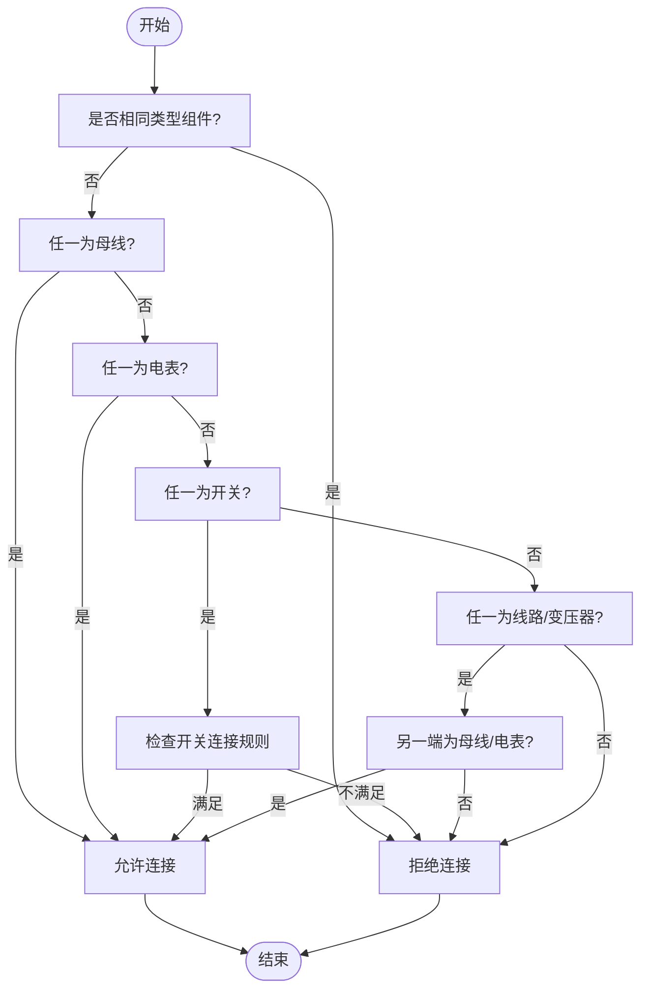
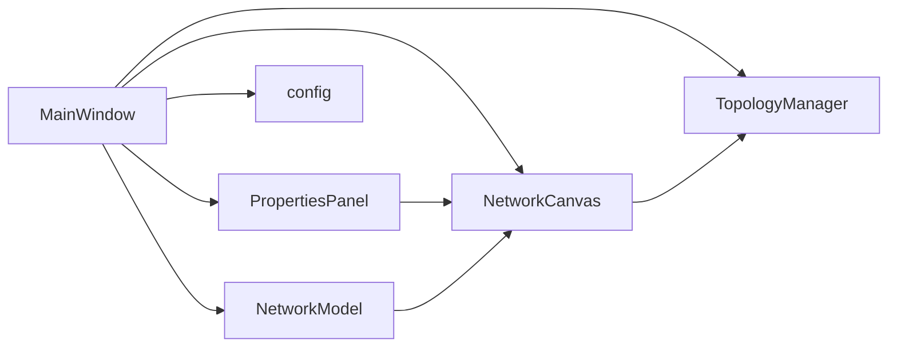

# 主窗口职责

<cite>
**本文引用的文件**
- [src/components/main_window.py](file://src/components/main_window.py)
- [src/components/canvas.py](file://src/components/canvas.py)
- [src/components/component_palette.py](file://src/components/component_palette.py)
- [src/components/properties_panel.py](file://src/components/properties_panel.py)
- [src/components/topology_utils.py](file://src/components/topology_utils.py)
- [src/models/network_model.py](file://src/models/network_model.py)
- [src/config.py](file://src/config.py)
</cite>

## 目录
1. [简介](#简介)
2. [项目结构](#项目结构)
3. [核心组件](#核心组件)
4. [架构总览](#架构总览)
5. [详细组件分析](#详细组件分析)
6. [依赖分析](#依赖分析)
7. [性能考虑](#性能考虑)
8. [故障排查指南](#故障排查指南)
9. [结论](#结论)

## 简介
本文件聚焦于pp_tool项目中的主窗口类（MainWindow），系统阐述其作为应用主控中心的职责边界与实现要点。MainWindow负责：
- UI布局与停靠窗口管理（组件面板、属性面板）
- 菜单与快捷键体系
- 全局状态维护（网络有效性标志、组件集合）
- 与画布、组件面板、属性面板等组件的协作与信号/槽对接
- 仿真诊断流程（网络模型构建、诊断线程、诊断结果反馈）
- 文件导入导出、视图缩放与适配、删除与断开连接等编辑操作

通过对代码级结构与信号流的深入分析，帮助读者理解MainWindow如何协调各子系统，以及如何通过条件编译与配置模块实现功能开关与资源路径兼容。

## 项目结构
pp_tool采用“按功能分层”的组织方式，MainWindow位于组件层，与画布、组件面板、属性面板、拓扑管理器、网络模型等模块协同工作。配置模块提供条件编译与资源路径能力。

图表来源
- [src/components/main_window.py](file://src/components/main_window.py#L95-L176)
- [src/components/canvas.py](file://src/components/canvas.py#L16-L28)
- [src/components/component_palette.py](file://src/components/component_palette.py#L16-L35)
- [src/components/properties_panel.py](file://src/components/properties_panel.py#L12-L23)
- [src/components/topology_utils.py](file://src/components/topology_utils.py#L17-L24)
- [src/models/network_model.py](file://src/models/network_model.py#L11-L18)
- [src/config.py](file://src/config.py#L15-L37)

章节来源
- [src/components/main_window.py](file://src/components/main_window.py#L95-L176)
- [src/components/canvas.py](file://src/components/canvas.py#L16-L28)
- [src/components/component_palette.py](file://src/components/component_palette.py#L16-L35)
- [src/components/properties_panel.py](file://src/components/properties_panel.py#L12-L23)
- [src/components/topology_utils.py](file://src/components/topology_utils.py#L17-L24)
- [src/models/network_model.py](file://src/models/network_model.py#L11-L18)
- [src/config.py](file://src/config.py#L15-L37)

## 核心组件
- MainWindow：主窗口类，承担UI布局、菜单、状态与流程控制职责，协调画布、面板与仿真流程。
- NetworkCanvas：画布，负责组件渲染、连接逻辑、视图缩放与右键菜单。
- ComponentPalette：组件面板，提供可拖拽的电网组件图标与主题适配。
- PropertiesPanel：属性面板，动态生成组件属性控件，监听属性变更并通过信号通知主窗口。
- TopologyManager：拓扑导入导出与IP/端口唯一性验证。
- NetworkModel：基于pandapower的网络模型构建与运行。
- config：条件编译宏与资源路径工具。

章节来源
- [src/components/main_window.py](file://src/components/main_window.py#L95-L176)
- [src/components/canvas.py](file://src/components/canvas.py#L16-L28)
- [src/components/component_palette.py](file://src/components/component_palette.py#L16-L35)
- [src/components/properties_panel.py](file://src/components/properties_panel.py#L12-L23)
- [src/components/topology_utils.py](file://src/components/topology_utils.py#L17-L24)
- [src/models/network_model.py](file://src/models/network_model.py#L11-L18)
- [src/config.py](file://src/config.py#L15-L37)

## 架构总览
MainWindow作为中枢，通过信号/槽与画布、属性面板交互；通过拓扑管理器与网络模型协作完成仿真诊断流程；通过配置模块实现功能开关与资源路径兼容。

图表来源
- [src/components/main_window.py](file://src/components/main_window.py#L95-L550)
- [src/components/canvas.py](file://src/components/canvas.py#L16-L200)
- [src/components/properties_panel.py](file://src/components/properties_panel.py#L12-L120)
- [src/components/topology_utils.py](file://src/components/topology_utils.py#L17-L120)
- [src/models/network_model.py](file://src/models/network_model.py#L11-L120)

## 详细组件分析

### MainWindow：主控中心职责
- UI布局与停靠窗口
  - 初始化窗口标题、最小尺寸与中央画布。
  - 创建组件面板与属性面板，设置停靠区域与最小宽度。
  - 将画布选择变化与属性面板更新绑定，属性面板变更通过信号回传主窗口。
- 菜单与快捷键
  - 文件：新建、打开、保存、退出。
  - 编辑：断开连接、删除所选、全选（占位）、缩放与视图适配。
  - 视图：显示/隐藏组件面板与属性面板；缩放、适应视图。
  - 仿真：诊断、进入仿真模式（条件编译启用）。
  - 帮助：关于。
- 全局状态与组件集合
  - 维护网络有效性标志与组件字典（母线、线路、变压器、负载、储能、充电站、外部电网、静态发电机、开关、电表）。
  - 仿真模式下创建NetworkModel实例，拓扑管理器负责导入导出与IP/端口唯一性验证。
- 信号与槽
  - 画布选择变化触发属性面板更新。
  - 属性面板属性变更通过信号回传主窗口，主窗口记录网络状态为无效并记录日志。
- 仿真诊断流程
  - 诊断线程封装诊断任务，进度与结果通过信号回调。
  - 主窗口在主线程中创建NetworkModel，验证IP/端口唯一性，启动诊断线程，展示进度对话框，处理完成与错误回调。
- 文件操作
  - 打开/保存拓扑：委托拓扑管理器导入/导出，成功后刷新画布并提示状态栏。
  - 新建拓扑：询问是否保存，清空画布。
- 视图控制
  - 放大/缩小/适应视图：委托画布缩放与适配。

章节来源
- [src/components/main_window.py](file://src/components/main_window.py#L95-L550)

#### 诊断流程时序图

图表来源
- [src/components/main_window.py](file://src/components/main_window.py#L346-L466)
- [src/models/network_model.py](file://src/models/network_model.py#L407-L582)

### NetworkCanvas：画布与连接逻辑
- 信号
  - selection_changed：画布选择变化时发出，携带当前选中项目。
- 交互与编辑
  - 右键拖动平移、滚轮缩放、右键菜单（旋转、断开连接、删除、清空、缩放）。
  - 框选模式RubberBandDrag，支持键盘DEL删除所选。
- 组件创建与连接
  - 支持从组件面板拖拽创建组件，自动命名与geodata注入。
  - 连接规则：母线可连接任意非同类组件；电表可连接任意组件；开关连接需满足“一端为母线”等约束；线路/变压器需连接到母线或电表。
  - 连接点选择：优先匹配属性索引，否则就近选择。
- 电表自动属性更新
  - 连接后根据连接类型与点索引自动设置element_type、element、side、meas_type等。
- 状态联动
  - 连接关系变化时重置网络诊断标志位，确保后续仿真前重新诊断。

章节来源
- [src/components/canvas.py](file://src/components/canvas.py#L16-L200)
- [src/components/canvas.py](file://src/components/canvas.py#L275-L596)
- [src/components/canvas.py](file://src/components/canvas.py#L596-L800)

#### 连接决策流程图

图表来源
- [src/components/canvas.py](file://src/components/canvas.py#L275-L340)

### ComponentPalette：组件面板
- 提供拖拽组件到画布的能力，图标根据主题自动适配（深色/浅色）。
- 组件类型与图标映射，支持从资源路径加载SVG图标。

章节来源
- [src/components/component_palette.py](file://src/components/component_palette.py#L16-L168)

### PropertiesPanel：属性面板
- 动态生成组件属性控件，支持数值、布尔、下拉选择、只读等类型。
- 属性变更通过信号回传主窗口，主窗口记录网络状态为无效。
- 特殊处理：
  - 名称变更同步更新组件标签与部分设备的sn字段。
  - 线路/变压器use_standard_type切换时刷新面板显示。
  - 通信设备（储能、充电桩、静态发电机、电表）的协议、IP、端口等属性变更时进行冲突检测与回滚提示。

章节来源
- [src/components/properties_panel.py](file://src/components/properties_panel.py#L12-L231)
- [src/components/properties_panel.py](file://src/components/properties_panel.py#L336-L445)

### TopologyManager：拓扑导入导出与验证
- 导入/导出：将场景中的组件序列化为JSON，支持索引映射与连接恢复。
- IP/端口唯一性验证：扫描场景中具备ip/port属性的设备，检测重复与不完整配置，给出警告。
- 连接恢复：按类型优先级恢复母线-开关-线路/变压器-其他负载的连接关系。

章节来源
- [src/components/topology_utils.py](file://src/components/topology_utils.py#L17-L120)
- [src/components/topology_utils.py](file://src/components/topology_utils.py#L193-L293)
- [src/components/topology_utils.py](file://src/components/topology_utils.py#L294-L656)

### NetworkModel：pandapower网络模型
- 从network_items构建pandapower网络：先创建母线，再创建连接到母线的组件（除电表），最后创建电表。
- 支持多种组件创建（母线、线路、变压器、负载、外部电网、静态发电机、储能、充电站、开关、电表）。
- 提供运行潮流计算、查询结果等接口（当前仿真入口已移除快速潮流，保留运行接口）。

章节来源
- [src/models/network_model.py](file://src/models/network_model.py#L11-L120)
- [src/models/network_model.py](file://src/models/network_model.py#L407-L582)

### config：条件编译与资源路径
- 功能开关：FEATURE_SIMULATION、FEATURE_MODBUS、FEATURE_REPORT、FEATURE_EXPORT、DEBUG_MODE、VERBOSE_LOGGING。
- 条件编译装饰器：@conditional_compile，用于按功能开关启用/禁用仿真相关方法。
- 资源路径：兼容PyInstaller/Nuitka打包，提供get_resource_path与资源目录。

章节来源
- [src/config.py](file://src/config.py#L15-L37)
- [src/config.py](file://src/config.py#L153-L192)
- [src/config.py](file://src/config.py#L214-L279)

## 依赖分析
- 组件耦合
  - MainWindow强依赖NetworkCanvas、PropertiesPanel、TopologyManager、NetworkModel、config。
  - PropertiesPanel与NetworkCanvas之间通过selection_changed信号耦合。
  - NetworkCanvas与TopologyManager通过导入/导出接口耦合。
- 信号链路
  - 画布选择变化 -> 属性面板更新
  - 属性面板属性变更 -> 主窗口记录网络状态
  - 诊断线程进度/完成/错误 -> 主窗口更新UI与状态
- 外部依赖
  - pandapower：仿真诊断与网络模型构建。
  - PySide6：GUI框架与信号/槽机制。
  - TOML：配置文件解析与写入。

图表来源
- [src/components/main_window.py](file://src/components/main_window.py#L95-L176)
- [src/components/canvas.py](file://src/components/canvas.py#L16-L28)
- [src/components/properties_panel.py](file://src/components/properties_panel.py#L12-L23)
- [src/components/topology_utils.py](file://src/components/topology_utils.py#L17-L24)
- [src/models/network_model.py](file://src/models/network_model.py#L11-L18)
- [src/config.py](file://src/config.py#L15-L37)

## 性能考虑
- 诊断线程
  - 使用Python原生threading模块，守护线程避免主线程退出后阻塞。
  - 通过信号逐步汇报进度，避免阻塞UI。
  - 结束时显式stop并断开信号连接，防止内存泄漏。
- 画布渲染
  - 抗锯齿与全视口更新提升视觉质量，注意在大量组件时的渲染成本。
  - 连接线颜色与网格颜色按主题动态选择，减少额外计算。
- 拓扑导入/导出
  - 导入前清空画布，避免重复创建导致的资源浪费。
  - 导出前统一验证IP/端口唯一性，减少后续仿真失败重试成本。
- 属性面板
  - 按组件类型动态生成控件，避免不必要的控件创建与事件绑定。

[本节为通用指导，无需具体文件引用]

## 故障排查指南
- 诊断失败或网络状态未更新
  - 检查MainWindow是否正确连接diagnostic_thread的progress_updated与diagnostic_completed信号。
  - 确认NetworkModel创建成功且network_items已填充。
- 属性变更未生效
  - 确认PropertiesPanel的property_changed信号已连接到MainWindow.on_property_changed。
  - 检查主窗口是否正确记录network_is_valid为False。
- 连接失败
  - 查看NetworkCanvas.can_connect与_check_component_type_compatibility的规则是否满足。
  - 确认连接点数量与电表约束未超限。
- 导入/导出失败
  - 检查TopologyManager.validate_ip_port_uniqueness是否返回错误。
  - 确认文件对话框返回路径非空且存在。
- 资源路径问题（打包后）
  - 使用config.get_resource_path与config.get_assets_directory确认资源路径。
  - 确认打包后资源随程序一起部署。

章节来源
- [src/components/main_window.py](file://src/components/main_window.py#L346-L466)
- [src/components/canvas.py](file://src/components/canvas.py#L275-L340)
- [src/components/properties_panel.py](file://src/components/properties_panel.py#L336-L445)
- [src/components/topology_utils.py](file://src/components/topology_utils.py#L193-L293)
- [src/config.py](file://src/config.py#L238-L279)

## 结论
MainWindow作为pp_tool的主控中心，承担着UI布局、菜单与快捷键、全局状态维护、组件间协调与仿真诊断流程控制的职责。通过清晰的信号/槽设计与模块化分工，它有效地串联了画布、组件面板、属性面板、拓扑管理器与网络模型，实现了从拓扑编辑到仿真诊断的闭环。配合config提供的条件编译与资源路径能力，MainWindow在不同部署环境下均能稳定运行。