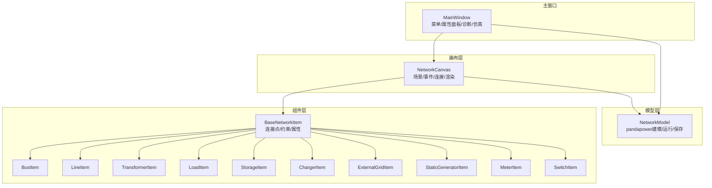
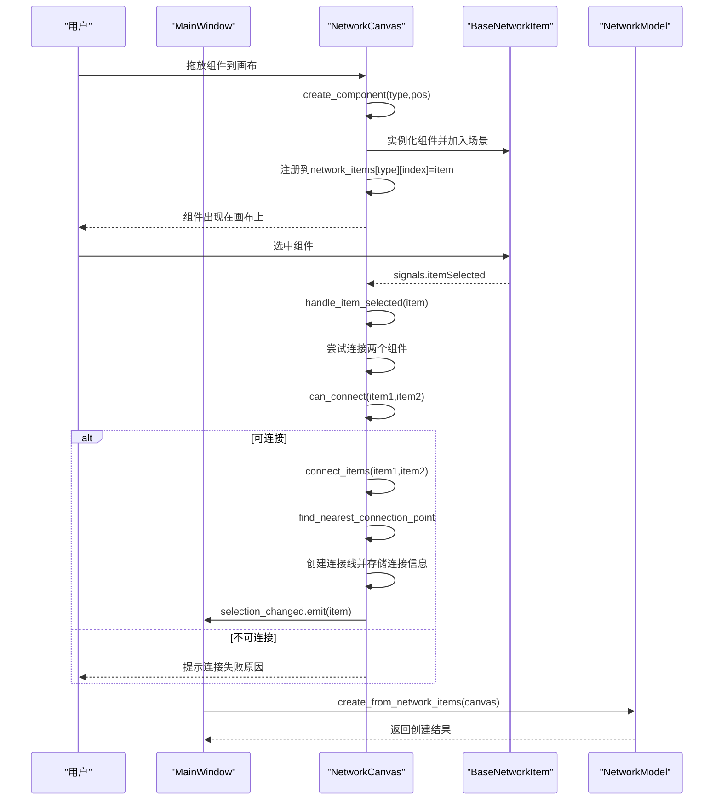
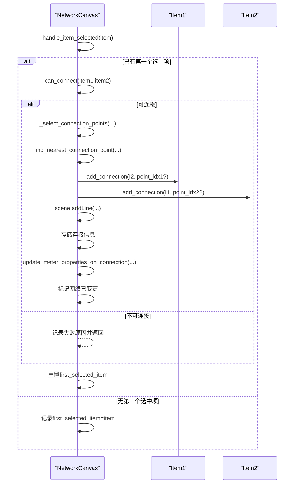
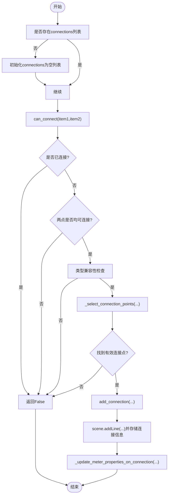
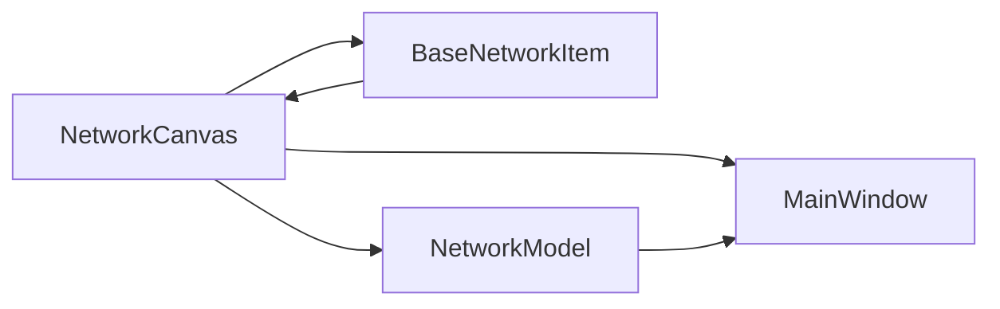

# 画布职责

<cite>
**本文引用的文件**
- [src/components/canvas.py](file://src/components/canvas.py)
- [src/components/network_items.py](file://src/components/network_items.py)
- [src/models/network_model.py](file://src/models/network_model.py)
- [src/components/main_window.py](file://src/components/main_window.py)
</cite>

## 目录
1. [简介](#简介)
2. [项目结构](#项目结构)
3. [核心组件](#核心组件)
4. [架构总览](#架构总览)
5. [详细组件分析](#详细组件分析)
6. [依赖分析](#依赖分析)
7. [性能考虑](#性能考虑)
8. [故障排查指南](#故障排查指南)
9. [结论](#结论)

## 简介
本文件聚焦于pp_tool中“网络画布类（NetworkCanvas）”的职责与实现，系统阐述其作为用户交互核心的定位：负责组件拖拽、连接创建、场景渲染与用户输入事件处理；解释其与“网络模型（NetworkModel）”“组件项（BaseNetworkItem及其派生类）”“主窗口（MainWindow）”的协作方式；并梳理其内部状态管理机制与关键方法（如create_component、connect_items、mousePressEvent等）的实现要点与边界条件。

## 项目结构
NetworkCanvas位于组件层，是画布与组件、模型、主窗口之间的桥梁：
- 画布层：NetworkCanvas负责场景管理、网格绘制、缩放平移、右键菜单、拖放创建组件、连接线渲染与状态维护
- 组件层：BaseNetworkItem及各派生类（BusItem、LineItem、TransformerItem、LoadItem、StorageItem、ChargerItem、ExternalGridItem、StaticGeneratorItem、MeterItem、SwitchItem）负责图形绘制、连接点与连接约束、属性与实时数据
- 模型层：NetworkModel负责将画布上的组件映射为pandapower网络模型，提供创建、运行潮流、保存/加载等能力
- 主窗口：MainWindow负责UI组织、菜单、属性面板联动、拓扑导入导出、诊断流程与仿真入口

图表来源
- [src/components/canvas.py](file://src/components/canvas.py#L16-L120)
- [src/components/network_items.py](file://src/components/network_items.py#L24-L120)
- [src/models/network_model.py](file://src/models/network_model.py#L1-L40)
- [src/components/main_window.py](file://src/components/main_window.py#L95-L140)

章节来源
- [src/components/canvas.py](file://src/components/canvas.py#L16-L120)
- [src/components/network_items.py](file://src/components/network_items.py#L24-L120)
- [src/models/network_model.py](file://src/models/network_model.py#L1-L40)
- [src/components/main_window.py](file://src/components/main_window.py#L95-L140)

## 核心组件
- NetworkCanvas：继承自QGraphicsView，承载场景（QGraphicsScene）、网格背景、拖放创建组件、连接创建与渲染、鼠标/滚轮/右键菜单事件处理、选择状态与信号、清空/适配视图等
- BaseNetworkItem及其派生类：定义组件的图形绘制、连接点、连接约束、属性、旋转与连接参数更新、删除与断开连接、右键菜单与双击改名等
- NetworkModel：将network_items映射为pandapower网络，提供创建各类元件、运行潮流、保存/加载、查询结果等
- MainWindow：组织UI、菜单、属性面板、拓扑导入导出、诊断线程与仿真入口，并与画布/模型交互

章节来源
- [src/components/canvas.py](file://src/components/canvas.py#L16-L120)
- [src/components/network_items.py](file://src/components/network_items.py#L24-L120)
- [src/models/network_model.py](file://src/models/network_model.py#L1-L40)
- [src/components/main_window.py](file://src/components/main_window.py#L95-L140)

## 架构总览
NetworkCanvas在整体架构中承担“用户交互与可视化”的中枢角色：
- 用户通过拖放将组件从组件板拖入画布，触发create_component，随后组件被加入场景并注册到全局network_items字典
- 用户选择组件后，通过handle_item_selected触发连接逻辑，can_connect进行类型与连接点约束检查，connect_items创建连接线并更新连接信息
- 连接关系变化会触发主窗口的网络有效性标记，便于后续诊断与仿真
- MainWindow负责菜单与属性面板联动，NetworkModel负责将画布拓扑转换为pandapower网络

图表来源
- [src/components/canvas.py](file://src/components/canvas.py#L156-L227)
- [src/components/canvas.py](file://src/components/canvas.py#L229-L254)
- [src/components/canvas.py](file://src/components/canvas.py#L341-L359)
- [src/components/canvas.py](file://src/components/canvas.py#L406-L495)
- [src/components/canvas.py](file://src/components/canvas.py#L596-L645)
- [src/models/network_model.py](file://src/models/network_model.py#L407-L582)

## 详细组件分析

### NetworkCanvas职责与公共接口
- 场景与渲染
  - 初始化场景、抗锯齿、框选模式、变换锚点、背景主题适配、网格绘制
  - 提供清空画布、适配视图、更新背景与滚动条样式等方法
- 组件创建与拖放
  - 支持拖放进入/移动/放置事件，根据mimeData文本识别组件类型，调用create_component在场景中创建并注册
  - 对外部电网组件创建进行限制（系统中仅允许一个）
- 连接管理
  - 选择状态跟踪与信号：selection_changed
  - 连接创建：can_connect（类型兼容性、连接点可用性、连接数限制）、connect_items（最近连接点选择、创建连接线、更新电表测量属性）、断开连接、删除选中项
  - 连接点选择：_select_connection_points（针对母线/线路/变压器的特殊映射）、find_nearest_connection_point（基于场景坐标与连接点集合）
- 事件处理
  - 鼠标事件：右键拖动平移、左键空白区域重置选中、双击改名（委托给组件）
  - 滚轮事件：缩放
  - 右键菜单：旋转、断开连接、删除、清空、缩放等
- 与主窗口协作
  - 通过selection_changed与属性面板联动
  - 连接关系变化时重置网络有效性标志，触发诊断流程

章节来源
- [src/components/canvas.py](file://src/components/canvas.py#L30-L68)
- [src/components/canvas.py](file://src/components/canvas.py#L115-L131)
- [src/components/canvas.py](file://src/components/canvas.py#L132-L155)
- [src/components/canvas.py](file://src/components/canvas.py#L156-L227)
- [src/components/canvas.py](file://src/components/canvas.py#L229-L254)
- [src/components/canvas.py](file://src/components/canvas.py#L341-L359)
- [src/components/canvas.py](file://src/components/canvas.py#L406-L495)
- [src/components/canvas.py](file://src/components/canvas.py#L596-L645)
- [src/components/canvas.py](file://src/components/canvas.py#L646-L714)
- [src/components/canvas.py](file://src/components/canvas.py#L715-L746)
- [src/components/canvas.py](file://src/components/canvas.py#L727-L800)
- [src/components/canvas.py](file://src/components/canvas.py#L801-L873)
- [src/components/canvas.py](file://src/components/canvas.py#L874-L953)
- [src/components/canvas.py](file://src/components/canvas.py#L1105-L1134)

### 连接创建流程（序列图）

图表来源
- [src/components/canvas.py](file://src/components/canvas.py#L229-L254)
- [src/components/canvas.py](file://src/components/canvas.py#L341-L359)
- [src/components/canvas.py](file://src/components/canvas.py#L406-L495)
- [src/components/canvas.py](file://src/components/canvas.py#L497-L561)
- [src/components/canvas.py](file://src/components/canvas.py#L596-L645)

### 连接点与连接约束（流程图）

图表来源
- [src/components/canvas.py](file://src/components/canvas.py#L341-L359)
- [src/components/canvas.py](file://src/components/canvas.py#L406-L495)
- [src/components/canvas.py](file://src/components/canvas.py#L497-L561)

### 与组件项（BaseNetworkItem）的关系
- 连接点与约束
  - BaseNetworkItem维护连接点集合与每个连接点的状态（占用/可连接），并提供add_connection/remove_connection/update_bus_parameter等方法
  - 不同组件类型有不同的连接约束（如母线无限制、线路/变压器两端、电表可连接多个但有特殊规则等）
- 旋转与连接点更新
  - 旋转后通过update_rotated_connection_points更新连接点，再调用update_connections更新连接线
- 删除与断开
  - delete_component先断开所有连接，再从network_items中移除对应元素并从场景移除

章节来源
- [src/components/network_items.py](file://src/components/network_items.py#L77-L120)
- [src/components/network_items.py](file://src/components/network_items.py#L327-L368)
- [src/components/network_items.py](file://src/components/network_items.py#L369-L549)
- [src/components/network_items.py](file://src/components/network_items.py#L641-L673)
- [src/components/network_items.py](file://src/components/network_items.py#L296-L326)

### 与网络模型（NetworkModel）的协作
- 从画布创建模型
  - NetworkModel.create_from_network_items遍历network_items，按母线→非电表→电表的顺序创建pandapower元件，并在完成后创建测量
- 电表测量属性自动更新
  - NetworkCanvas在连接完成后调用_update_meter_properties_on_connection，将电表的element_type、element、side、meas_type等属性写入MeterItem，确保与pandapower测量一致

章节来源
- [src/models/network_model.py](file://src/models/network_model.py#L407-L582)
- [src/components/canvas.py](file://src/components/canvas.py#L497-L561)

### 与主窗口（MainWindow）的协作
- 属性面板联动
  - 画布发出selection_changed，主窗口的属性面板订阅并更新显示
- 诊断与仿真入口
  - 主窗口在菜单中提供诊断与仿真模式，诊断前会基于画布的network_items创建NetworkModel并运行诊断线程
- 菜单与快捷键
  - 主窗口提供断开连接、删除所选、缩放、适应视图等操作，均委托画布实现

章节来源
- [src/components/main_window.py](file://src/components/main_window.py#L174-L179)
- [src/components/main_window.py](file://src/components/main_window.py#L274-L283)
- [src/components/main_window.py](file://src/components/main_window.py#L284-L298)
- [src/components/main_window.py](file://src/components/main_window.py#L345-L415)

## 依赖分析
- 画布对组件的依赖
  - 通过BaseNetworkItem的连接点与约束机制实现连接创建与断开
  - 通过组件的signals.itemSelected与场景选择变化信号联动
- 画布对模型的依赖
  - 通过NetworkModel.create_from_network_items将拓扑转为pandapower网络
- 画布对主窗口的依赖
  - 通过selection_changed与属性面板联动，通过network_is_valid标志参与诊断流程

图表来源
- [src/components/canvas.py](file://src/components/canvas.py#L16-L120)
- [src/components/network_items.py](file://src/components/network_items.py#L24-L120)
- [src/models/network_model.py](file://src/models/network_model.py#L1-L40)
- [src/components/main_window.py](file://src/components/main_window.py#L95-L140)

章节来源
- [src/components/canvas.py](file://src/components/canvas.py#L16-L120)
- [src/components/network_items.py](file://src/components/network_items.py#L24-L120)
- [src/models/network_model.py](file://src/models/network_model.py#L1-L40)
- [src/components/main_window.py](file://src/components/main_window.py#L95-L140)

## 性能考虑
- 场景规模与网格绘制
  - 网格线采用固定步长绘制，建议在大规模拓扑下适当增大网格步长或减少网格可见层级，避免过度绘制
- 连接线更新
  - 组件移动/旋转时需更新连接线，建议在批量操作时合并更新，减少重复调用
- 事件处理
  - 右键拖动平移时使用增量更新滚动条，避免频繁重排
- 诊断与仿真
  - 诊断线程与仿真窗口在主线程外运行，注意避免频繁重建NetworkModel导致的GC压力

[本节为通用指导，无需特定文件来源]

## 故障排查指南
- 连接失败
  - 检查can_connect返回值与日志输出，确认类型兼容性、连接点可用性与连接数限制
  - 若提示“没有可用的连接点”，检查组件连接点集合与旋转状态
- 外部电网重复创建
  - 画布对“external_grid”类型有唯一性限制，若出现警告，先删除已有外部电网再创建
- 电表测量属性未更新
  - 确认连接完成后是否触发_update_meter_properties_on_connection，检查element_type、element、side等映射逻辑
- 删除组件后仍残留连接
  - 确认delete_component是否先调用disconnect_all_connections，再从network_items移除
- 诊断未通过
  - 主窗口在诊断前会重置network_is_valid，若诊断失败，检查NetworkModel.create_from_network_items的返回值与日志

章节来源
- [src/components/canvas.py](file://src/components/canvas.py#L156-L227)
- [src/components/canvas.py](file://src/components/canvas.py#L341-L359)
- [src/components/canvas.py](file://src/components/canvas.py#L406-L495)
- [src/components/canvas.py](file://src/components/canvas.py#L497-L561)
- [src/components/network_items.py](file://src/components/network_items.py#L641-L673)
- [src/components/main_window.py](file://src/components/main_window.py#L345-L415)

## 结论
NetworkCanvas作为用户交互核心，承担了从组件创建、连接建立到场景渲染与事件响应的完整职责。它通过与BaseNetworkItem的连接点/约束机制协作，确保拓扑连接合法；通过与NetworkModel的映射关系，将图形拓扑转化为pandapower网络；并通过与MainWindow的信号/菜单联动，支撑属性面板、诊断与仿真流程。其内部状态管理（如connections、first_selected_item、主题适配、网格颜色）与关键方法（create_component、connect_items、can_connect、find_nearest_connection_point、mousePressEvent等）共同构成了稳定可靠的电网拓扑编辑体验。