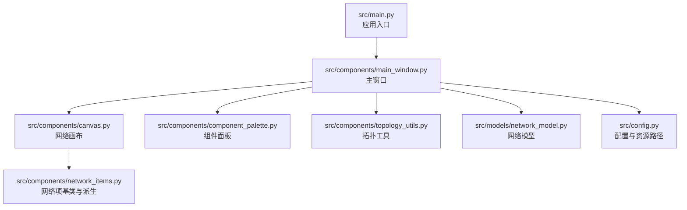
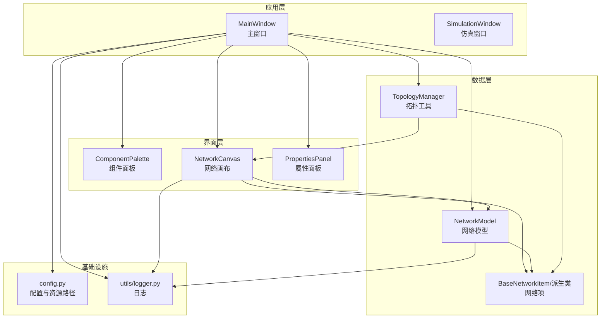
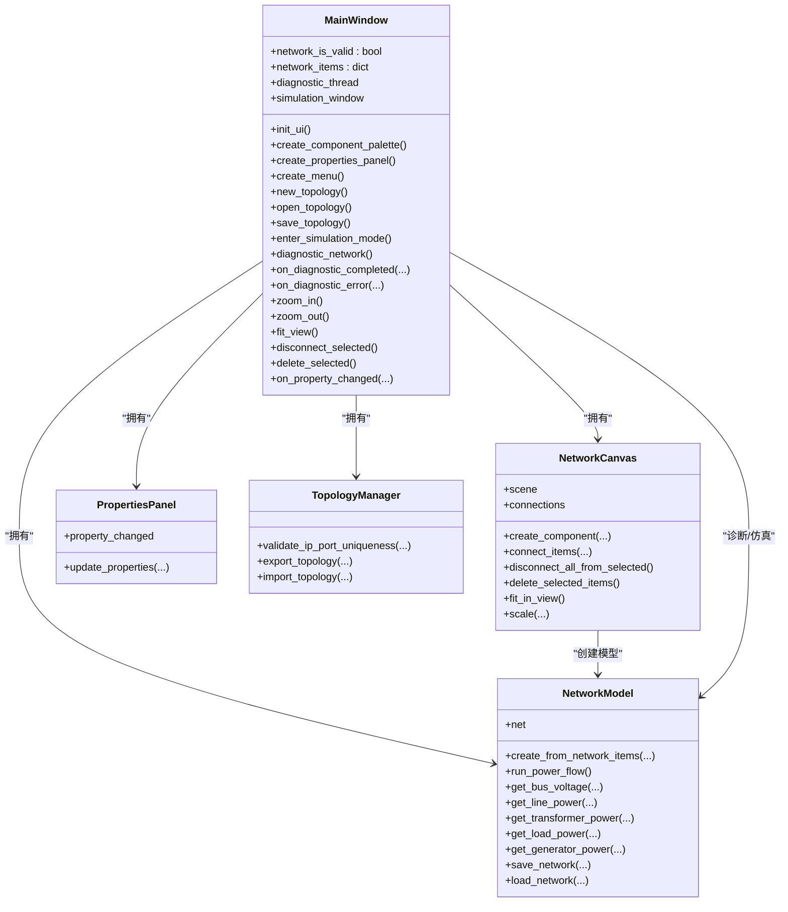
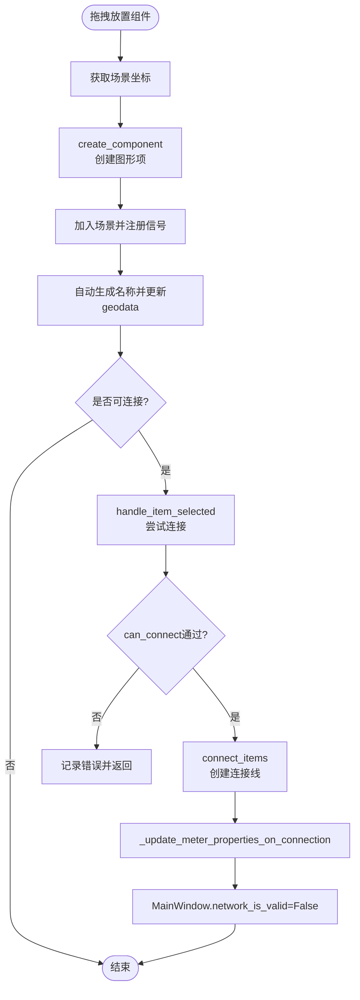
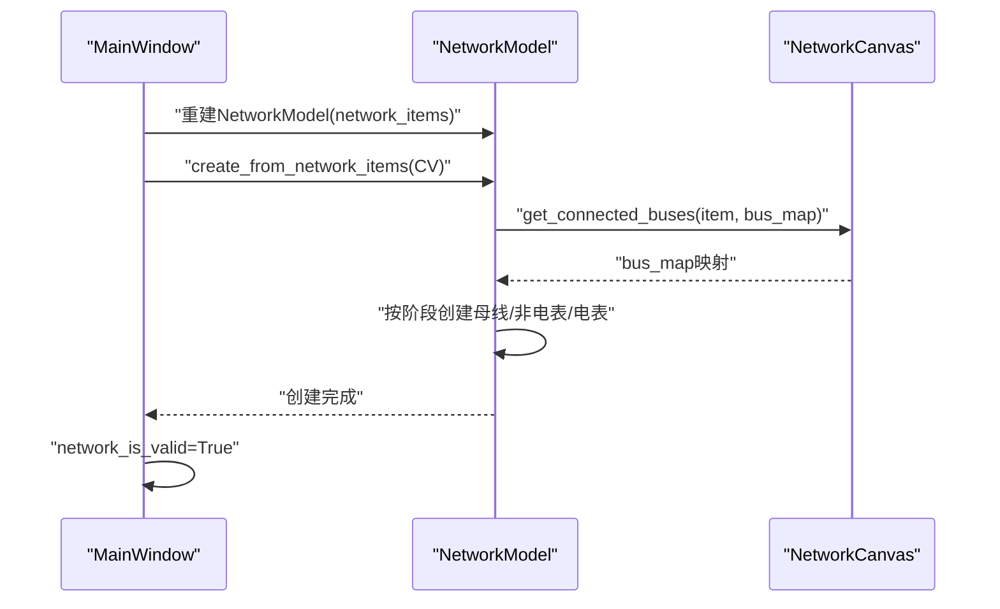
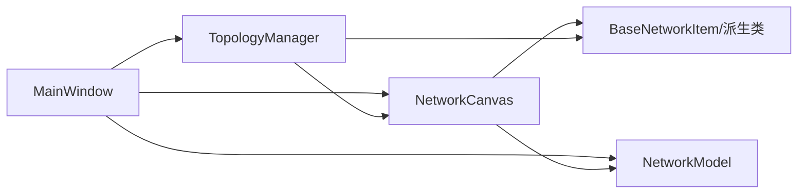
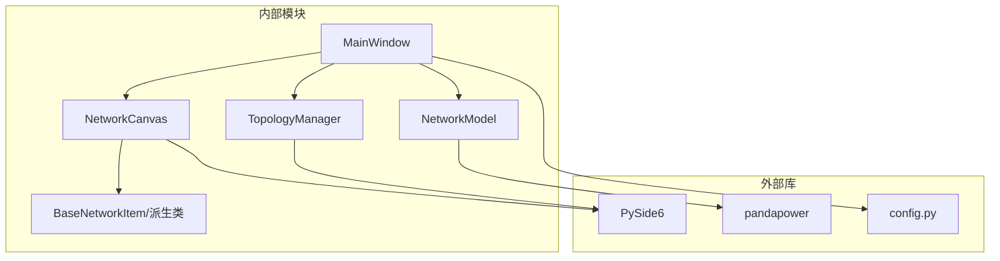

# 组件职责划分

<cite>
**本文引用的文件**
- [src/main.py](file://src/main.py)
- [src/components/main_window.py](file://src/components/main_window.py)
- [src/components/canvas.py](file://src/components/canvas.py)
- [src/components/component_palette.py](file://src/components/component_palette.py)
- [src/components/network_items.py](file://src/components/network_items.py)
- [src/components/topology_utils.py](file://src/components/topology_utils.py)
- [src/models/network_model.py](file://src/models/network_model.py)
- [src/config.py](file://src/config.py)
</cite>

## 目录
1. [简介](#简介)
2. [项目结构](#项目结构)
3. [核心组件](#核心组件)
4. [架构总览](#架构总览)
5. [详细组件分析](#详细组件分析)
6. [依赖关系分析](#依赖关系分析)
7. [性能考量](#性能考量)
8. [故障排查指南](#故障排查指南)
9. [结论](#结论)

## 简介
本文件聚焦pp_tool中三大核心组件的职责划分与协作关系：
- 主窗口类（MainWindow）：应用主控中心，负责UI布局、菜单管理、全局状态维护、仿真模式入口与网络诊断流程协调。
- 网络画布类（NetworkCanvas）：用户交互核心，处理组件拖拽、连接创建、场景渲染、右键菜单与缩放平移。
- 网络模型类（NetworkModel）：数据核心，封装pandapower网络的创建、仿真与结果查询，提供从图形项到pandapower模型的映射与持久化能力。

## 项目结构
pp_tool采用“组件-模型-工具”分层组织：
- components：UI与业务逻辑组件（主窗口、画布、组件面板、网络项、拓扑工具等）
- models：数据模型与仿真引擎（NetworkModel）
- utils：通用工具（logger、文件工具等）
- config：配置与资源路径管理
- 入口：main.py

图表来源
- [src/main.py](file://src/main.py#L1-L72)
- [src/components/main_window.py](file://src/components/main_window.py#L1-L120)
- [src/components/canvas.py](file://src/components/canvas.py#L1-L120)
- [src/components/component_palette.py](file://src/components/component_palette.py#L1-L168)
- [src/components/network_items.py](file://src/components/network_items.py#L1-L200)
- [src/components/topology_utils.py](file://src/components/topology_utils.py#L1-L200)
- [src/models/network_model.py](file://src/models/network_model.py#L1-L120)
- [src/config.py](file://src/config.py#L1-L120)

章节来源
- [src/main.py](file://src/main.py#L1-L72)
- [src/components/main_window.py](file://src/components/main_window.py#L95-L176)
- [src/components/canvas.py](file://src/components/canvas.py#L16-L120)
- [src/components/component_palette.py](file://src/components/component_palette.py#L1-L168)
- [src/components/topology_utils.py](file://src/components/topology_utils.py#L1-L120)
- [src/models/network_model.py](file://src/models/network_model.py#L1-L120)
- [src/config.py](file://src/config.py#L238-L279)

## 核心组件
- 主窗口类（MainWindow）
  - 职责：构建UI（组件面板、属性面板、菜单栏）、管理全局状态（网络有效性标志）、协调仿真模式与网络诊断流程、处理菜单命令（新建、打开、保存、缩放、断开连接、删除所选）。
  - 关键状态：network_is_valid（网络诊断有效性）、network_items（全局图形项字典）、diagnostic_thread（诊断线程）、simulation_window（仿真窗口）。
  - 关键接口：new_topology、open_topology、save_topology、enter_simulation_mode、diagnostic_network、zoom_in/out/fit_view、disconnect_selected/delete_selected。
- 网络画布类（NetworkCanvas）
  - 职责：承载场景、绘制网格、响应拖拽与右键菜单、创建组件、连接组件、更新属性面板、缩放与平移、主题颜色适配。
  - 关键状态：scene（QGraphicsScene）、connections（连接集合）、first_selected_item（首个选中项）、right_drag_active等。
  - 关键接口：create_component、can_connect/connect_items、find_nearest_connection_point、disconnect_all_from_selected、delete_selected_items、clear_canvas、fit_in_view、scale、wheelEvent、mousePressEvent/moveEvent/releaseEvent、contextMenuEvent。
- 网络模型类（NetworkModel）
  - 职责：封装pandapower网络创建、运行潮流、查询结果、保存/加载网络。
  - 关键状态：net（pandapower网络对象）、network_items（图形项映射）。
  - 关键接口：create_from_network_items（从图形项创建pandapower模型）、run_power_flow、get_*_power系列查询、save_network/load_network、各元件创建接口（create_bus/create_line/create_transformer/…/create_measurement）。

章节来源
- [src/components/main_window.py](file://src/components/main_window.py#L95-L176)
- [src/components/canvas.py](file://src/components/canvas.py#L16-L120)
- [src/models/network_model.py](file://src/models/network_model.py#L1-L120)

## 架构总览
pp_tool遵循“主窗口协调、画布交互、模型驱动”的分层架构。主窗口负责菜单与状态，画布负责用户交互与场景渲染，模型负责pandapower网络的创建与仿真。

图表来源
- [src/components/main_window.py](file://src/components/main_window.py#L118-L176)
- [src/components/canvas.py](file://src/components/canvas.py#L16-L120)
- [src/components/component_palette.py](file://src/components/component_palette.py#L1-L168)
- [src/components/topology_utils.py](file://src/components/topology_utils.py#L1-L120)
- [src/models/network_model.py](file://src/models/network_model.py#L1-L120)
- [src/config.py](file://src/config.py#L238-L279)

## 详细组件分析

### 主窗口类（MainWindow）
- 公共接口
  - UI初始化：init_ui、create_component_palette、create_properties_panel、create_menu
  - 菜单命令：new_topology、open_topology、save_topology、zoom_in/out/fit_view、disconnect_selected、delete_selected
  - 仿真与诊断：enter_simulation_mode、diagnostic_network、on_diagnostic_completed/on_diagnostic_error
  - 辅助：show_about_dialog、on_property_changed
- 内部状态管理
  - network_is_valid：网络诊断有效性标志，用于控制仿真模式进入
  - network_items：按类型聚合的图形项字典，供画布与模型共享
  - diagnostic_thread：诊断线程对象，跨UI与后台线程通信
  - simulation_window：仿真窗口实例
- 与其他组件协作
  - 与NetworkCanvas：设置中央画布、接收选择变化、触发缩放/清空/删除等操作
  - 与PropertiesPanel：绑定属性变更信号，联动刷新
  - 与TopologyManager：导入/导出拓扑、IP端口唯一性校验
  - 与NetworkModel：在诊断阶段重建模型、在仿真模式中创建仿真窗口
  - 与config：使用资源路径函数与条件编译宏

图表来源
- [src/components/main_window.py](file://src/components/main_window.py#L95-L176)
- [src/components/canvas.py](file://src/components/canvas.py#L16-L120)
- [src/components/topology_utils.py](file://src/components/topology_utils.py#L1-L120)
- [src/models/network_model.py](file://src/models/network_model.py#L1-L120)

章节来源
- [src/components/main_window.py](file://src/components/main_window.py#L95-L176)
- [src/components/main_window.py](file://src/components/main_window.py#L181-L273)
- [src/components/main_window.py](file://src/components/main_window.py#L274-L344)
- [src/components/main_window.py](file://src/components/main_window.py#L345-L466)
- [src/components/main_window.py](file://src/components/main_window.py#L467-L550)

### 网络画布类（NetworkCanvas）
- 公共接口
  - 场景与渲染：init_ui、draw_grid、get_grid_color/get_connection_line_color、update_background_color/update_scrollbar_styles
  - 拖拽与放置：dragEnterEvent/dragMoveEvent/dropEvent、create_component
  - 交互与选择：handle_item_selected、selection_changed信号、on_selection_changed
  - 连接逻辑：can_connect/connect_items/_select_connection_points/find_nearest_connection_point
  - 右键菜单与编辑：contextMenuEvent、disconnect_all_from_selected、delete_selected_items、clear_canvas
  - 视图控制：fit_in_view、scale、wheelEvent、mousePressEvent/moveEvent/releaseEvent
  - 电表自动属性：_update_meter_properties_on_connection、_determine_measurement_side
- 内部状态管理
  - scene：QGraphicsScene，承载所有图形项
  - connections：连接线与连接点信息集合
  - first_selected_item：首个选中项，用于双击连接
  - right_drag_active/last_pan_point/right_press_point/has_dragged：右键拖动状态
- 与其他组件协作
  - 与BaseNetworkItem及其派生类：创建图形项、连接点管理、属性更新
  - 与MainWindow：通过selection_changed与属性面板联动，触发网络诊断标志重置
  - 与NetworkModel：在诊断阶段通过create_from_network_items创建pandapower模型

图表来源
- [src/components/canvas.py](file://src/components/canvas.py#L132-L227)
- [src/components/canvas.py](file://src/components/canvas.py#L229-L359)
- [src/components/canvas.py](file://src/components/canvas.py#L406-L496)
- [src/components/canvas.py](file://src/components/canvas.py#L497-L595)

章节来源
- [src/components/canvas.py](file://src/components/canvas.py#L16-L120)
- [src/components/canvas.py](file://src/components/canvas.py#L132-L227)
- [src/components/canvas.py](file://src/components/canvas.py#L229-L359)
- [src/components/canvas.py](file://src/components/canvas.py#L406-L496)
- [src/components/canvas.py](file://src/components/canvas.py#L497-L595)
- [src/components/canvas.py](file://src/components/canvas.py#L646-L800)

### 网络模型类（NetworkModel）
- 公共接口
  - 创建：create_from_network_items（按母线、非电表、电表三阶段创建）
  - 仿真：run_power_flow
  - 查询：get_bus_voltage、get_line_power、get_transformer_power、get_load_power、get_generator_power
  - 持久化：save_network、load_network
  - 元件创建：create_bus、create_line、create_transformer、create_load、create_storage、create_charger、create_external_grid、create_static_generator、create_switch、create_measurement
- 内部状态管理
  - net：pandapower网络对象
  - network_items：图形项字典，用于create_from_network_items映射
- 与其他组件协作
  - 与NetworkCanvas：通过canvas.get_connected_buses获取母线映射，再创建pandapower元件
  - 与MainWindow：在诊断阶段由MainWindow重建NetworkModel并调用create_from_network_items

图表来源
- [src/components/main_window.py](file://src/components/main_window.py#L345-L415)
- [src/models/network_model.py](file://src/models/network_model.py#L407-L581)
- [src/components/canvas.py](file://src/components/canvas.py#L255-L271)

章节来源
- [src/models/network_model.py](file://src/models/network_model.py#L1-L120)
- [src/models/network_model.py](file://src/models/network_model.py#L407-L581)
- [src/models/network_model.py](file://src/models/network_model.py#L583-L710)

### 组件间调用关系图
- 主窗口与画布：主窗口持有画布，菜单命令直接调用画布方法；画布通过selection_changed与主窗口属性面板联动。
- 主窗口与模型：主窗口在诊断阶段重建NetworkModel并调用create_from_network_items；仿真模式入口处进行IP端口唯一性校验与网络有效性判断。
- 画布与网络项：画布创建BaseNetworkItem派生类，注册信号；连接逻辑依赖连接点与类型兼容性检查。
- 拓扑工具：TopologyManager负责导入导出与IP端口唯一性校验，被主窗口调用。

图表来源
- [src/components/main_window.py](file://src/components/main_window.py#L95-L176)
- [src/components/canvas.py](file://src/components/canvas.py#L16-L120)
- [src/components/topology_utils.py](file://src/components/topology_utils.py#L1-L120)
- [src/models/network_model.py](file://src/models/network_model.py#L1-L120)

章节来源
- [src/components/main_window.py](file://src/components/main_window.py#L95-L176)
- [src/components/canvas.py](file://src/components/canvas.py#L16-L120)
- [src/components/topology_utils.py](file://src/components/topology_utils.py#L1-L120)
- [src/models/network_model.py](file://src/models/network_model.py#L1-L120)

## 依赖关系分析
- 组件耦合
  - MainWindow与NetworkCanvas强耦合：主窗口持有画布实例，菜单命令直接调用画布方法。
  - MainWindow与NetworkModel弱耦合：通过诊断流程间接使用，避免直接耦合仿真细节。
  - NetworkCanvas与BaseNetworkItem：画布创建并管理图形项，图形项通过signals与画布交互。
- 外部依赖
  - pandapower：NetworkModel依赖pandapower进行网络创建与仿真。
  - PySide6：UI框架，画布、面板、菜单、对话框均基于PySide6。
  - 配置与资源：config提供资源路径与条件编译宏，影响功能开关与资源定位。

图表来源
- [src/components/main_window.py](file://src/components/main_window.py#L118-L176)
- [src/components/canvas.py](file://src/components/canvas.py#L16-L120)
- [src/models/network_model.py](file://src/models/network_model.py#L1-L120)
- [src/components/topology_utils.py](file://src/components/topology_utils.py#L1-L120)
- [src/config.py](file://src/config.py#L238-L279)

章节来源
- [src/components/main_window.py](file://src/components/main_window.py#L118-L176)
- [src/components/canvas.py](file://src/components/canvas.py#L16-L120)
- [src/models/network_model.py](file://src/models/network_model.py#L1-L120)
- [src/components/topology_utils.py](file://src/components/topology_utils.py#L1-L120)
- [src/config.py](file://src/config.py#L238-L279)

## 性能考量
- 画布渲染与网格绘制：网格线绘制在背景层，连接线颜色随主题动态选择，减少不必要的重绘。
- 连接点查找：find_nearest_connection_point对可用连接点计算距离，建议在大规模场景中限制连接点数量或采用空间索引优化。
- 诊断线程：使用Python原生threading模块执行pp.diagnostic，避免阻塞UI；通过信号传递进度与结果，注意断开信号槽避免内存泄漏。
- 模型重建：诊断阶段重建NetworkModel并调用create_from_network_items，建议在拓扑变化频繁时合并多次修改，减少重复创建。

## 故障排查指南
- 网络诊断失败
  - 现象：诊断完成后提示网络诊断发现若干问题或网络诊断通过。
  - 排查：确认network_is_valid标志是否被置为False；检查IP端口唯一性校验；查看诊断线程进度与错误信号。
  - 相关代码路径：[src/components/main_window.py](file://src/components/main_window.py#L345-L466)
- 连接失败
  - 现象：组件无法连接或连接点不可用。
  - 排查：检查can_connect与类型兼容性；确认连接点数量限制；查看连接点索引选择逻辑。
  - 相关代码路径：[src/components/canvas.py](file://src/components/canvas.py#L341-L359)、[src/components/canvas.py](file://src/components/canvas.py#L406-L496)
- 电表属性未更新
  - 现象：连接电表后属性未自动更新。
  - 排查：确认_update_meter_properties_on_connection逻辑是否执行；检查element_type与side推断。
  - 相关代码路径：[src/components/canvas.py](file://src/components/canvas.py#L497-L595)
- 仿真模式无法进入
  - 现象：提示网络诊断未通过或IP端口不唯一。
  - 排查：先执行diagnostic_network并通过；检查validate_ip_port_uniqueness返回值。
  - 相关代码路径：[src/components/main_window.py](file://src/components/main_window.py#L320-L344)、[src/components/topology_utils.py](file://src/components/topology_utils.py#L21-L98)

章节来源
- [src/components/main_window.py](file://src/components/main_window.py#L345-L466)
- [src/components/canvas.py](file://src/components/canvas.py#L341-L359)
- [src/components/canvas.py](file://src/components/canvas.py#L406-L496)
- [src/components/canvas.py](file://src/components/canvas.py#L497-L595)
- [src/components/topology_utils.py](file://src/components/topology_utils.py#L21-L98)

## 结论
pp_tool通过明确的职责划分实现了清晰的分层架构：主窗口负责全局控制与状态管理，网络画布负责用户交互与场景渲染，网络模型负责pandapower网络的创建与仿真。组件间通过信号与方法调用协同工作，配合拓扑工具与配置模块，形成完整的电网仿真与可视化流程。建议在后续迭代中进一步优化连接点查找性能与诊断线程的健壮性，并完善错误恢复与日志输出。