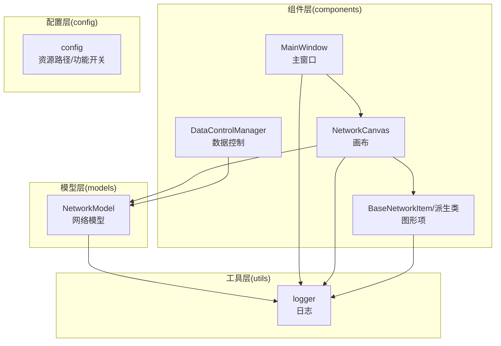
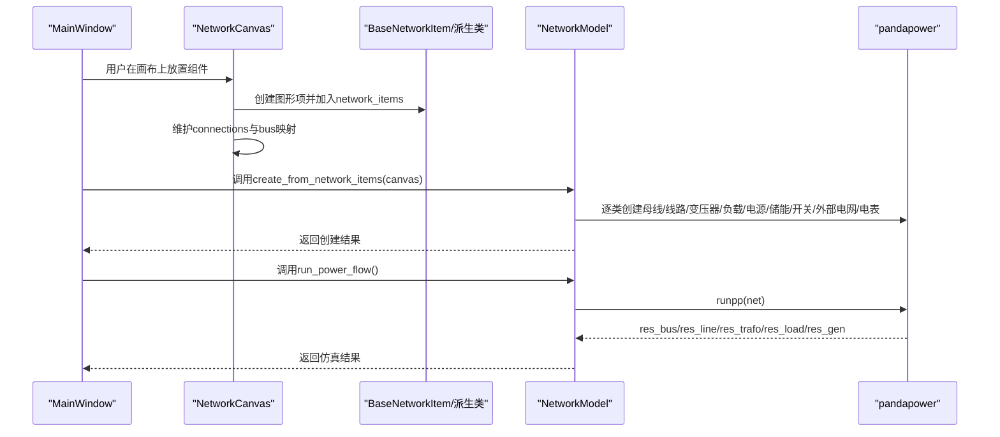
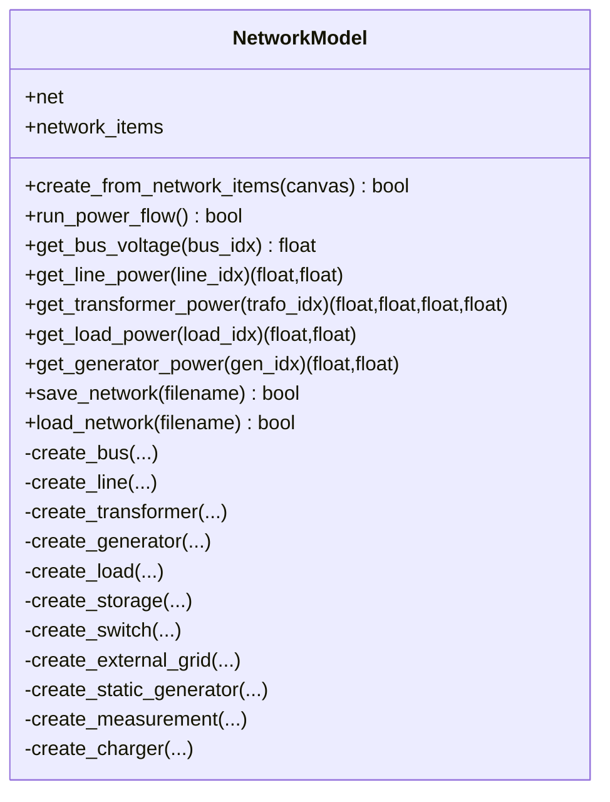
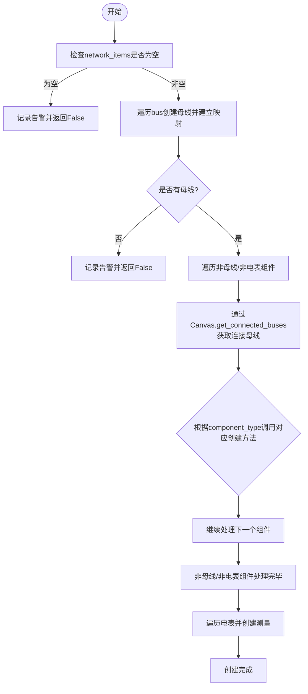
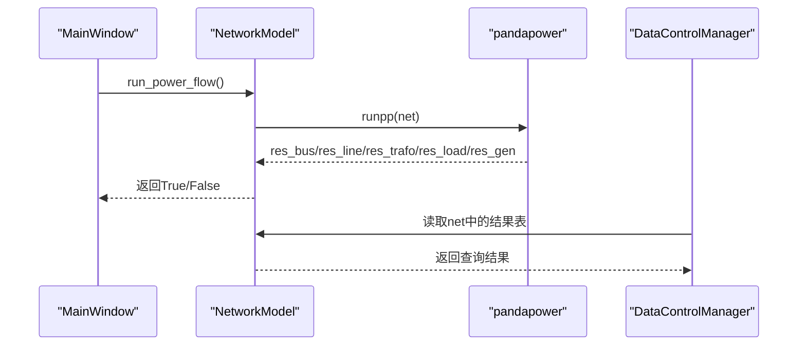
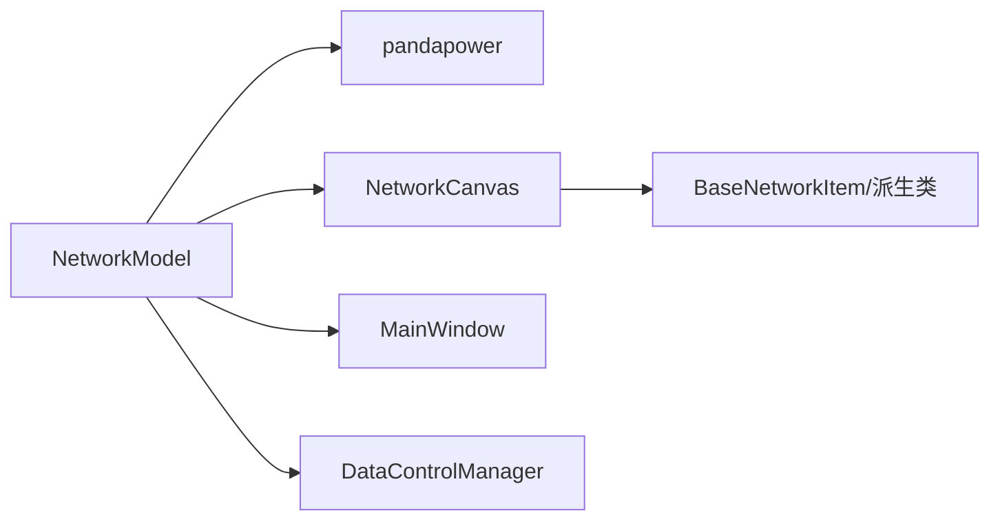

# 网络模型职责

<cite>
**本文引用的文件**
- [src/models/network_model.py](file://src/models/network_model.py)
- [src/components/canvas.py](file://src/components/canvas.py)
- [src/components/network_items.py](file://src/components/network_items.py)
- [src/components/main_window.py](file://src/components/main_window.py)
- [src/components/data_control.py](file://src/components/data_control.py)
</cite>

## 目录
1. [简介](#简介)
2. [项目结构](#项目结构)
3. [核心组件](#核心组件)
4. [架构总览](#架构总览)
5. [详细组件分析](#详细组件分析)
6. [依赖分析](#依赖分析)
7. [性能考虑](#性能考虑)
8. [故障排查指南](#故障排查指南)
9. [结论](#结论)

## 简介
本文件聚焦于pp_tool项目中的“网络模型类（NetworkModel）”，系统阐述其作为数据核心的职责与实现细节。NetworkModel负责：
- 将图形界面组件映射为pandapower网络元素，构建完整的电力网络拓扑；
- 提供潮流计算入口与结果查询能力；
- 管理网络模型的创建、保存与加载；
- 与Canvas、BaseNetworkItem等组件协作，保证从拓扑到仿真的闭环流程。

## 项目结构
pp_tool采用分层与按功能划分的组织方式：
- models：核心业务模型，NetworkModel位于此处；
- components：UI组件与交互逻辑，包含Canvas、BaseNetworkItem、主窗口等；
- utils：通用工具与日志；
- config/app_config：配置与条件编译开关。

图表来源
- [src/models/network_model.py](file://src/models/network_model.py#L1-L120)
- [src/components/canvas.py](file://src/components/canvas.py#L1-L120)
- [src/components/network_items.py](file://src/components/network_items.py#L1-L120)
- [src/components/main_window.py](file://src/components/main_window.py#L95-L170)
- [src/components/data_control.py](file://src/components/data_control.py#L1-L60)

章节来源
- [src/models/network_model.py](file://src/models/network_model.py#L1-L120)
- [src/components/canvas.py](file://src/components/canvas.py#L1-L120)
- [src/components/network_items.py](file://src/components/network_items.py#L1-L120)
- [src/components/main_window.py](file://src/components/main_window.py#L95-L170)

## 核心组件
NetworkModel是pp_tool的“数据核心”，承担以下职责：
- 封装pandapower网络的创建、仿真与结果查询；
- 从图形项集合（network_items）映射到pandapower元件；
- 提供运行潮流计算与查询各元件结果的方法；
- 提供网络模型的保存与加载能力。

关键接口概览（方法命名与职责）：
- create_from_network_items(canvas): 从图形项集合创建pandapower网络；
- run_power_flow(): 运行潮流计算；
- get_bus_voltage(bus_idx): 查询母线电压；
- get_line_power(line_idx): 查询线路功率；
- get_transformer_power(trafo_idx): 查询变压器功率；
- get_load_power(load_idx): 查询负载功率；
- get_generator_power(gen_idx): 查询发电机功率；
- save_network()/load_network(): 保存/加载网络模型。

章节来源
- [src/models/network_model.py](file://src/models/network_model.py#L407-L710)

## 架构总览
NetworkModel与UI组件的交互关系如下：
- MainWindow持有network_items与NetworkModel实例；
- Canvas负责图形项的创建、连接与属性更新；
- BaseNetworkItem及其派生类维护组件属性（含bus、hv_bus/lv_bus/from_bus/to_bus等）；
- NetworkModel依据network_items与Canvas提供的连接关系，创建pandapower网络；
- DataControlManager在仿真阶段读取NetworkModel中的结果并驱动UI控件。

图表来源
- [src/components/main_window.py](file://src/components/main_window.py#L345-L447)
- [src/components/canvas.py](file://src/components/canvas.py#L229-L360)
- [src/models/network_model.py](file://src/models/network_model.py#L407-L582)

章节来源
- [src/components/main_window.py](file://src/components/main_window.py#L345-L447)
- [src/components/canvas.py](file://src/components/canvas.py#L229-L360)
- [src/models/network_model.py](file://src/models/network_model.py#L407-L582)

## 详细组件分析

### NetworkModel类职责与实现要点
NetworkModel的核心职责是“将图形拓扑映射为pandapower网络并提供仿真查询”。其实现要点包括：
- 初始化：持有空的pandapower网络与图形项集合；
- 元件创建：针对母线、线路、变压器、负载、发电机、储能、开关、外部电网、静态发电机、电表分别提供创建方法；
- 创建流程：先创建母线，再创建与母线相连的组件（除电表外），最后创建电表，确保所有被测元件均已存在；
- 结果查询：基于pandapower结果表res_bus/res_line/res_trafo/res_load/res_gen提供查询；
- 保存/加载：基于pandapower的JSON序列化能力。

图表来源
- [src/models/network_model.py](file://src/models/network_model.py#L1-L710)

章节来源
- [src/models/network_model.py](file://src/models/network_model.py#L1-L710)

### 图形项到pandapower元素的映射机制
- Canvas在创建图形项时，将组件加入network_items（嵌套字典结构），并维护connections；
- BaseNetworkItem在连接建立时，根据连接点与组件类型更新properties中的bus/hv_bus/lv_bus/from_bus/to_bus等关键属性；
- NetworkModel在create_from_network_items中：
  - 先遍历bus，创建母线并建立图形项到pandapower母线索引的映射；
  - 再遍历非母线、非电表组件，通过Canvas.get_connected_buses(item, bus_map)获取连接母线，调用相应创建方法；
  - 最后创建电表，确保测量对象指向已存在的元件；
- create_charger与create_static_generator等方法在属性中支持功率因数模式与SN_MVA等参数，以适配不同仿真需求。

图表来源
- [src/models/network_model.py](file://src/models/network_model.py#L407-L582)
- [src/components/canvas.py](file://src/components/canvas.py#L255-L272)
- [src/components/network_items.py](file://src/components/network_items.py#L369-L549)

章节来源
- [src/models/network_model.py](file://src/models/network_model.py#L407-L582)
- [src/components/canvas.py](file://src/components/canvas.py#L255-L272)
- [src/components/network_items.py](file://src/components/network_items.py#L369-L549)

### 潮流计算与结果查询流程
- MainWindow在诊断完成后，进入仿真模式，调用NetworkModel.run_power_flow()；
- NetworkModel内部调用pandapower.runpp()，并在异常时记录错误；
- DataControlManager在仿真阶段读取NetworkModel.net中的结果表，更新UI控件（如储能、充电桩、电表、光伏、负载等）。

图表来源
- [src/models/network_model.py](file://src/models/network_model.py#L583-L610)
- [src/components/data_control.py](file://src/components/data_control.py#L296-L361)

章节来源
- [src/models/network_model.py](file://src/models/network_model.py#L583-L610)
- [src/components/data_control.py](file://src/components/data_control.py#L296-L361)

### 关键方法实现细节
- create_from_network_items(canvas)
  - 步骤：创建母线→创建非母线/非电表组件→创建电表；
  - 连接解析：通过Canvas.get_connected_buses(item, bus_map)获取母线索引；
  - 异常处理：捕获并记录错误，不影响整体流程继续。
- run_power_flow()
  - 调用pandapower.runpp()，返回布尔值表示成功与否；
  - 异常时记录错误日志。
- get_bus_voltage/get_line_power/get_transformer_power/get_load_power/get_generator_power
  - 基于pandapower结果表查询，返回对应值或None；
  - 包含空表与索引有效性检查。

章节来源
- [src/models/network_model.py](file://src/models/network_model.py#L407-L710)

### 内部状态管理机制
- net：pandapower网络实例，承载所有创建的元件与结果；
- network_items：全局图形项容器，按组件类型分组；
- component_map：注释掉的映射字段，原设计意图是记录图形项到pandapower索引的映射；
- 日志：统一通过logger记录创建、运行与错误信息，便于调试与审计。

章节来源
- [src/models/network_model.py](file://src/models/network_model.py#L1-L120)

## 依赖分析
- NetworkModel依赖pandapower创建与运行仿真；
- 与Canvas协作获取连接关系与bus映射；
- 与BaseNetworkItem协作获取组件属性（bus/hv_bus/lv_bus/from_bus/to_bus等）；
- 与MainWindow协作在诊断与仿真模式下协同工作；
- 与DataControlManager协作在仿真阶段读取结果并驱动UI。

图表来源
- [src/models/network_model.py](file://src/models/network_model.py#L1-L120)
- [src/components/canvas.py](file://src/components/canvas.py#L1-L120)
- [src/components/network_items.py](file://src/components/network_items.py#L1-L120)
- [src/components/main_window.py](file://src/components/main_window.py#L95-L170)
- [src/components/data_control.py](file://src/components/data_control.py#L1-L60)

章节来源
- [src/models/network_model.py](file://src/models/network_model.py#L1-L120)
- [src/components/canvas.py](file://src/components/canvas.py#L1-L120)
- [src/components/network_items.py](file://src/components/network_items.py#L1-L120)
- [src/components/main_window.py](file://src/components/main_window.py#L95-L170)
- [src/components/data_control.py](file://src/components/data_control.py#L1-L60)

## 性能考虑
- 创建流程按类型分步执行，避免重复扫描与不必要的查询；
- get_*系列查询方法在结果表为空时提前返回，减少无效IO；
- 保存/加载网络模型使用pandapower内置JSON序列化，适合中小规模网络；
- 若网络规模较大，建议：
  - 分批创建与查询；
  - 合理使用索引与缓存中间结果；
  - 控制日志级别以降低I/O开销。

## 故障排查指南
- 创建失败
  - 检查network_items是否为空或缺少母线；
  - 查看日志中“创建组件时出错”的记录，定位具体异常；
  - 确认Canvas的connections与bus映射是否正确。
- 潮流计算失败
  - 查看日志中“潮流计算失败”信息；
  - 确认网络拓扑是否满足pandapower要求（如外部电网唯一性、母线连接完整性等）。
- 结果查询为空
  - 确认run_power_flow()是否成功；
  - 检查索引是否存在于对应结果表中；
  - 确认查询方法的参数与索引一致。

章节来源
- [src/models/network_model.py](file://src/models/network_model.py#L407-L710)

## 结论
NetworkModel在pp_tool中扮演“数据核心”的角色，通过与Canvas、BaseNetworkItem、MainWindow与DataControlManager的紧密协作，实现了从图形拓扑到pandapower网络的完整映射与仿真闭环。其职责清晰、接口明确、错误处理完善，能够稳定支撑后续的仿真与可视化展示需求。