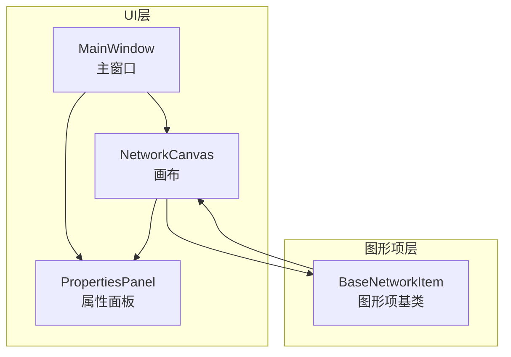
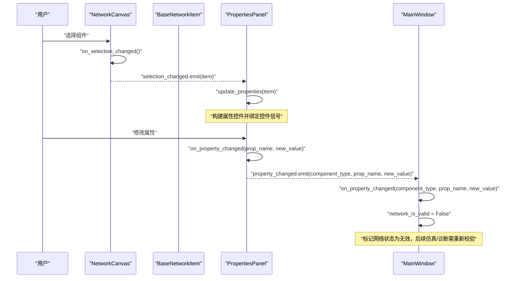

# 事件处理流程

<cite>
**本文引用的文件**
- [canvas.py](file://src/components/canvas.py)
- [properties_panel.py](file://src/components/properties_panel.py)
- [main_window.py](file://src/components/main_window.py)
- [network_items.py](file://src/components/network_items.py)
</cite>

## 目录
1. [简介](#简介)
2. [项目结构](#项目结构)
3. [核心组件](#核心组件)
4. [架构总览](#架构总览)
5. [详细组件分析](#详细组件分析)
6. [依赖分析](#依赖分析)
7. [性能考量](#性能考量)
8. [故障排查指南](#故障排查指南)
9. [结论](#结论)

## 简介
本文件围绕 pp_tool 中“组件通信”的完整事件处理流程展开，聚焦一次典型的用户交互周期：从画布（canvas.py）上的组件选择触发 selection_changed 信号，到属性面板（properties_panel.py）的 update_properties 槽函数刷新 UI，再到用户修改属性时 on_property_changed 方法发出 property_changed 信号，最终由主窗口（main_window.py）的 on_property_changed 方法处理并更新网络状态。文档将逐段说明数据流向、方法调用链与状态变更，并给出保证数据一致性与 UI 响应性的设计要点与可视化图示。

## 项目结构
- 三层 UI 组件：
  - 画布 NetworkCanvas：负责组件选择、连接、网格背景、右键菜单、缩放与状态栏更新。
  - 属性面板 PropertiesPanel：负责展示与编辑组件属性，发出属性变更信号。
  - 主窗口 MainWindow：负责装配画布与属性面板，建立信号-槽连接，处理属性变更并维护网络有效性标志。
- 图形项基类 BaseNetworkItem：负责组件选择变化时发出 itemSelected 信号，以及位置变化时更新连接线与属性面板联动。

图表来源
- [canvas.py](file://src/components/canvas.py#L1-L120)
- [properties_panel.py](file://src/components/properties_panel.py#L1-L60)
- [main_window.py](file://src/components/main_window.py#L118-L180)
- [network_items.py](file://src/components/network_items.py#L232-L258)

章节来源
- [canvas.py](file://src/components/canvas.py#L1-L120)
- [properties_panel.py](file://src/components/properties_panel.py#L1-L60)
- [main_window.py](file://src/components/main_window.py#L118-L180)
- [network_items.py](file://src/components/network_items.py#L232-L258)

## 核心组件
- NetworkCanvas（画布）
  - 关键信号：selection_changed（object）
  - 关键方法：on_selection_changed（由场景 selectionChanged 触发）、update_status_bar、handle_item_selected、connect_items、find_nearest_connection_point 等。
- PropertiesPanel（属性面板）
  - 关键信号：property_changed（str, str, object）
  - 关键方法：update_properties（item）、on_property_changed（prop_name, new_value）、create_property_widget、get_component_properties 等。
- MainWindow（主窗口）
  - 关键字段：network_is_valid（网络有效性标志）、network_items（全局组件字典）、properties_panel、canvas
  - 关键方法：init_ui（建立信号-槽连接）、on_property_changed（处理属性变更）、diagnostic_network（网络诊断）、enter_simulation_mode（仿真模式入口）等。
- BaseNetworkItem（图形项基类）
  - 关键信号：signals.itemSelected（object）
  - 关键方法：itemChange（在选中时发出 itemSelected）、update_connections（移动/旋转时更新连接线）、update_bus_parameter（更新 bus 参数）等。

章节来源
- [canvas.py](file://src/components/canvas.py#L1170-L1200)
- [properties_panel.py](file://src/components/properties_panel.py#L12-L20)
- [main_window.py](file://src/components/main_window.py#L118-L180)
- [network_items.py](file://src/components/network_items.py#L232-L258)

## 架构总览
下图展示了从用户在画布选择组件到主窗口处理属性变更的完整事件流，包括信号发射、槽函数接收与状态更新。

图表来源
- [canvas.py](file://src/components/canvas.py#L60-L62)
- [canvas.py](file://src/components/canvas.py#L1170-L1181)
- [properties_panel.py](file://src/components/properties_panel.py#L88-L117)
- [properties_panel.py](file://src/components/properties_panel.py#L335-L445)
- [main_window.py](file://src/components/main_window.py#L174-L179)
- [main_window.py](file://src/components/main_window.py#L299-L318)

## 详细组件分析

### 1) 画布选择事件：selection_changed 信号
- 用户在画布上选择组件时，场景 selectionChanged 信号被触发，画布 on_selection_changed 方法根据选中数量发出 selection_changed 信号：
  - 仅选中一个组件：发出该组件对象；
  - 多选或无选择：发出 None。
- 画布还负责：
  - 更新状态栏提示；
  - 处理组件拖动、旋转、删除、断开连接等操作；
  - 与图形项基类协作，通过 itemSelected 信号实现组件级选择联动。

章节来源
- [canvas.py](file://src/components/canvas.py#L60-L62)
- [canvas.py](file://src/components/canvas.py#L1170-L1181)
- [canvas.py](file://src/components/canvas.py#L1182-L1200)
- [network_items.py](file://src/components/network_items.py#L232-L235)

### 2) 属性面板刷新：update_properties 槽函数
- 主窗口在创建属性面板时，将画布的 selection_changed 信号连接到属性面板的 update_properties 槽函数：
  - 若 item 有效且包含 properties，清空并重建属性控件树；
  - 为不同属性类型创建对应的编辑控件（文本、数值、布尔、下拉等），并绑定各自的 on_property_changed 信号；
  - 对部分属性（如 bus、use_standard_type、use_power_factor 等）进行条件显示与动态刷新。
- 属性面板内部维护 current_item 与 property_widgets，确保 UI 与数据模型一致。

章节来源
- [main_window.py](file://src/components/main_window.py#L174-L179)
- [properties_panel.py](file://src/components/properties_panel.py#L88-L117)
- [properties_panel.py](file://src/components/properties_panel.py#L118-L231)
- [properties_panel.py](file://src/components/properties_panel.py#L250-L335)

### 3) 用户修改属性：on_property_changed 与 property_changed 信号
- 属性面板的控件在用户输入时调用 on_property_changed：
  - 执行属性合法性与唯一性校验（如 IP/端口冲突）；
  - 更新 current_item.properties 与相关字段（如名称同步、sn 同步、功率限制更新、Modbus 寄存器同步等）；
  - 对特定属性（如 use_standard_type、use_power_factor、protocol 等）触发属性面板的二次刷新；
  - 最终发出 property_changed 信号，携带 component_type、prop_name、new_value。
- 特殊处理：
  - 名称变更时同步更新图形项标签；
  - 线路/变压器的标准类型切换时避免重复发出信号；
  - Modbus 寄存器更新（针对 storage、charger、static_generator、meter 等）。

章节来源
- [properties_panel.py](file://src/components/properties_panel.py#L335-L445)
- [properties_panel.py](file://src/components/properties_panel.py#L446-L511)

### 4) 主窗口处理属性变更：on_property_changed
- 主窗口将属性面板的 property_changed 信号连接到自身的 on_property_changed：
  - 记录日志；
  - 将 network_is_valid 标记为 False，确保后续仿真/诊断需要重新校验；
  - 对名称变更触发画布场景更新，保证 UI 即时刷新。
- 仿真模式入口与网络诊断：
  - 进入仿真模式前会进行网络诊断与 IP/端口唯一性校验；
  - 诊断线程完成后根据结果更新 network_is_valid 并弹窗提示。

章节来源
- [main_window.py](file://src/components/main_window.py#L174-L179)
- [main_window.py](file://src/components/main_window.py#L299-L318)
- [main_window.py](file://src/components/main_window.py#L320-L344)
- [main_window.py](file://src/components/main_window.py#L345-L466)

### 5) 图形项选择联动：itemSelected 信号
- BaseNetworkItem 在 itemChange 中检测 ItemSelectedChange，发出 signals.itemSelected：
  - 画布 handle_item_selected 接收该信号，实现组件双击连接、连接点选择与连接逻辑；
  - 位置变化时，BaseNetworkItem 会尝试刷新属性面板显示并发出属性变更信号，确保 UI 与数据一致。

章节来源
- [network_items.py](file://src/components/network_items.py#L232-L235)
- [network_items.py](file://src/components/network_items.py#L236-L258)
- [canvas.py](file://src/components/canvas.py#L229-L254)

## 依赖分析
- 信号-槽耦合关系：
  - 画布 selectionChanged -> 属性面板 update_properties
  - 属性面板 propertyChanged -> 主窗口 on_property_changed
  - 图形项 itemSelected -> 画布 handle_item_selected
- 数据一致性保障：
  - 属性面板在 on_property_changed 中直接更新 current_item.properties，随后发出 property_changed，主窗口仅负责状态标记与后续流程，避免跨组件的重复写入。
  - 画布与图形项在位置变化时主动刷新属性面板，减少 UI 与模型之间的不一致。
- 可能的循环依赖：
  - 画布与属性面板通过信号解耦，主窗口仅作为协调者，未见直接循环依赖。
- 外部依赖：
  - 仿真模式依赖 pandapower 诊断接口；
  - Modbus 寄存器更新依赖主窗口持有的 modbus_manager 上下文。

图表来源
- [network_items.py](file://src/components/network_items.py#L232-L235)
- [canvas.py](file://src/components/canvas.py#L60-L62)
- [canvas.py](file://src/components/canvas.py#L229-L254)
- [properties_panel.py](file://src/components/properties_panel.py#L88-L117)
- [properties_panel.py](file://src/components/properties_panel.py#L335-L445)
- [main_window.py](file://src/components/main_window.py#L174-L179)
- [main_window.py](file://src/components/main_window.py#L299-L318)

章节来源
- [canvas.py](file://src/components/canvas.py#L60-L62)
- [properties_panel.py](file://src/components/properties_panel.py#L88-L117)
- [main_window.py](file://src/components/main_window.py#L174-L179)
- [network_items.py](file://src/components/network_items.py#L232-L235)

## 性能考量
- 信号发射频率控制：
  - 属性面板对频繁输入（如数值型控件）采用 valueChanged/textChanged 等信号，建议在 UI 层合并或节流，避免高频信号导致主窗口处理压力。
- UI 刷新策略：
  - 画布与图形项在位置变化时即时刷新属性面板，有助于降低延迟；但应避免在大量组件同时移动时重复刷新。
- 网络诊断与仿真：
  - 诊断线程在后台运行并通过进度对话框反馈，避免阻塞主线程；主窗口在诊断完成后统一更新网络状态标志位。

## 故障排查指南
- 选择变化未触发属性刷新
  - 检查主窗口是否正确连接 canvas.selection_changed -> properties_panel.update_properties。
  - 确认画布 on_selection_changed 是否按预期发出 selection_changed（仅选中一个组件时发出该对象，否则发出 None）。
- 属性修改后 UI 未更新
  - 检查属性面板 on_property_changed 是否成功更新 current_item.properties，并发出 property_changed。
  - 确认主窗口 on_property_changed 是否收到信号并将 network_is_valid 设为 False。
- IP/端口冲突
  - 属性面板在 on_property_changed 中对 ip/port 进行冲突检测，若冲突会回滚控件值并提示；请检查冲突组件是否为同一画布实例内的其他设备。
- 连接与 bus 参数不一致
  - 图形项在位置变化时会尝试刷新属性面板并发出属性变更；若 bus 参数未更新，检查 BaseNetworkItem.update_bus_parameter 与 update_connections 的调用链。

章节来源
- [main_window.py](file://src/components/main_window.py#L174-L179)
- [canvas.py](file://src/components/canvas.py#L1170-L1181)
- [properties_panel.py](file://src/components/properties_panel.py#L335-L445)
- [network_items.py](file://src/components/network_items.py#L236-L258)

## 结论
pp_tool 的组件通信采用清晰的信号-槽架构：画布负责选择与连接，属性面板负责 UI 刷新与属性变更，主窗口负责状态协调与后续流程。该设计在保证 UI 响应性的同时，通过严格的信号链路与状态标志位（network_is_valid）确保数据一致性，使用户交互周期具备良好的可追踪性与可维护性。