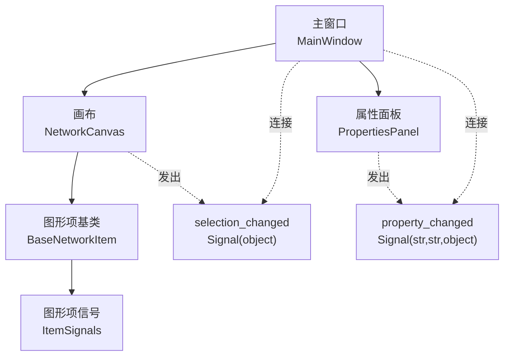
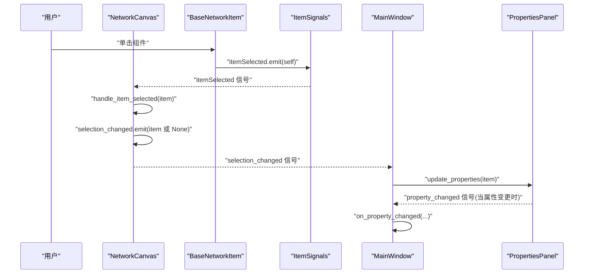
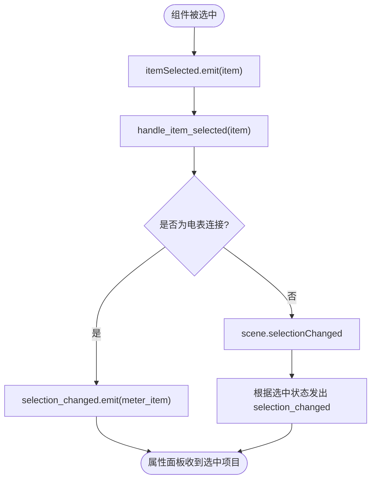
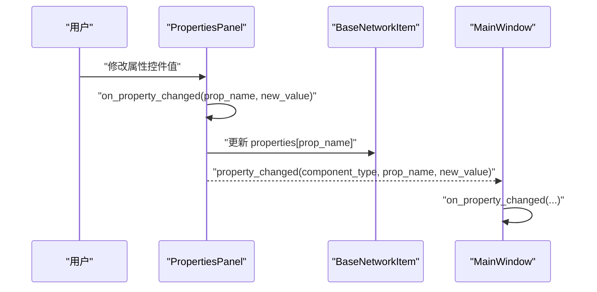
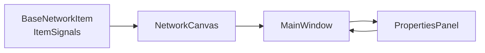

# 信号定义

<cite>
**本文引用的文件**
- [canvas.py](file://src/components/canvas.py)
- [properties_panel.py](file://src/components/properties_panel.py)
- [main_window.py](file://src/components/main_window.py)
- [network_items.py](file://src/components/network_items.py)
</cite>

## 目录
1. [简介](#简介)
2. [项目结构](#项目结构)
3. [核心组件](#核心组件)
4. [架构总览](#架构总览)
5. [详细组件分析](#详细组件分析)
6. [依赖分析](#依赖分析)
7. [性能考虑](#性能考虑)
8. [故障排查指南](#故障排查指南)
9. [结论](#结论)

## 简介
本文件聚焦于pp_tool中基于PySide6的信号定义机制，围绕两个关键信号展开：
- 画布组件中的 selection_changed = Signal(object)，用于通知当前选中项目的变更；
- 属性面板中的 property_changed = Signal(str, str, object)，用于在组件属性发生更改时发出，携带组件类型、属性名和新值。

我们将解释这些信号如何作为组件间通信的契约，确保类型安全与接口清晰，并给出实际代码示例路径与参数设计考量，说明其在松耦合架构中的重要作用。

## 项目结构
pp_tool采用分层与按功能模块组织的结构，其中与信号机制直接相关的模块包括：
- 画布组件：负责图形交互、选择状态与连接逻辑，并向外发出选择变更信号；
- 属性面板：负责展示与编辑组件属性，并向外发出属性变更信号；
- 主窗口：协调画布与属性面板之间的信号连接，维护网络状态标志位；
- 图形项基类：为具体组件提供统一的选中信号发射能力。

图表来源
- [main_window.py](file://src/components/main_window.py#L170-L180)
- [canvas.py](file://src/components/canvas.py#L16-L25)
- [properties_panel.py](file://src/components/properties_panel.py#L12-L20)
- [network_items.py](file://src/components/network_items.py#L19-L23)

章节来源
- [main_window.py](file://src/components/main_window.py#L170-L180)
- [canvas.py](file://src/components/canvas.py#L16-L25)
- [properties_panel.py](file://src/components/properties_panel.py#L12-L20)
- [network_items.py](file://src/components/network_items.py#L19-L23)

## 核心组件
- NetworkCanvas（画布）：定义 selection_changed 信号，用于通知当前选中项目的变化；在组件被选中、连接电表后等场景触发该信号。
- PropertiesPanel（属性面板）：定义 property_changed 信号，携带组件类型、属性名与新值；在属性编辑器控件值变化时发出。
- MainWindow（主窗口）：负责建立画布与属性面板之间的信号连接，并在属性变更时维护网络有效性标志。
- BaseNetworkItem（图形项基类）：定义 ItemSignals 并提供 itemSelected 信号，供画布捕获组件选中事件。

章节来源
- [canvas.py](file://src/components/canvas.py#L16-L25)
- [properties_panel.py](file://src/components/properties_panel.py#L12-L20)
- [main_window.py](file://src/components/main_window.py#L170-L180)
- [network_items.py](file://src/components/network_items.py#L19-L23)

## 架构总览
下面的序列图展示了“组件被选中 -> 画布发出选择变更信号 -> 主窗口连接到属性面板 -> 属性面板更新显示”的完整流程。

图表来源
- [network_items.py](file://src/components/network_items.py#L708-L728)
- [canvas.py](file://src/components/canvas.py#L229-L238)
- [canvas.py](file://src/components/canvas.py#L550-L561)
- [main_window.py](file://src/components/main_window.py#L170-L180)
- [properties_panel.py](file://src/components/properties_panel.py#L336-L445)

## 详细组件分析

### 画布中的 selection_changed 信号
- 定义位置：NetworkCanvas 类中定义 selection_changed = Signal(object)。
- 触发时机：
  - 组件被选中时，通过 item.signals.itemSelected 信号桥接到画布内部处理，随后发出 selection_changed；
  - 连接电表后，若电表被选中，会显式发出 selection_changed 以确保属性面板正确刷新；
  - 场景选择变化时，画布也会根据当前选中状态发出 selection_changed。
- 作用：通知属性面板当前选中项目，从而更新属性面板的显示与编辑控件。

图表来源
- [network_items.py](file://src/components/network_items.py#L708-L728)
- [canvas.py](file://src/components/canvas.py#L229-L238)
- [canvas.py](file://src/components/canvas.py#L550-L561)
- [canvas.py](file://src/components/canvas.py#L1170-L1180)

章节来源
- [canvas.py](file://src/components/canvas.py#L16-L25)
- [canvas.py](file://src/components/canvas.py#L229-L238)
- [canvas.py](file://src/components/canvas.py#L550-L561)
- [canvas.py](file://src/components/canvas.py#L1170-L1180)
- [network_items.py](file://src/components/network_items.py#L708-L728)

### 属性面板中的 property_changed 信号
- 定义位置：PropertiesPanel 类中定义 property_changed = Signal(str, str, object)。
- 触发条件：当属性编辑器控件（如 QLineEdit/QDoubleSpinBox/QComboBox/QCheckBox）的值发生变化时，on_property_changed 会更新组件属性并发出 property_changed。
- 参数设计：
  - 第一个 str：组件类型（component_type），便于订阅者区分不同组件类别；
  - 第二个 str：属性名（property_name），精确标识变更字段；
  - 第三个 object：新值（new_value），包含数值、布尔、枚举或字符串等任意类型。
- 作用：将属性变更事件广播给主窗口或其他订阅者，用于更新网络状态、同步Modbus寄存器、刷新UI等。

图表来源
- [properties_panel.py](file://src/components/properties_panel.py#L336-L445)
- [main_window.py](file://src/components/main_window.py#L299-L318)

章节来源
- [properties_panel.py](file://src/components/properties_panel.py#L12-L20)
- [properties_panel.py](file://src/components/properties_panel.py#L336-L445)
- [main_window.py](file://src/components/main_window.py#L299-L318)

### 信号作为组件间通信契约
- 类型安全：通过明确的信号签名（Signal(object)、Signal(str,str,object)）确保订阅者接收的数据类型一致，减少运行时错误。
- 接口清晰：信号命名与参数语义明确，便于理解与维护；主窗口集中连接画布与属性面板，形成稳定的通信契约。
- 松耦合：画布与属性面板通过信号解耦，彼此无需直接依赖对方实现细节；主窗口承担协调职责，降低模块间耦合度。

章节来源
- [canvas.py](file://src/components/canvas.py#L16-L25)
- [properties_panel.py](file://src/components/properties_panel.py#L12-L20)
- [main_window.py](file://src/components/main_window.py#L170-L180)

### 实际代码示例（路径）
- 画布定义与触发 selection_changed
  - 定义位置：[selection_changed 定义](file://src/components/canvas.py#L16-L25)
  - 触发位置1：[组件选中后发出](file://src/components/canvas.py#L550-L561)
  - 触发位置2：[场景选择变化发出](file://src/components/canvas.py#L1170-L1180)
- 属性面板定义与触发 property_changed
  - 定义位置：[property_changed 定义](file://src/components/properties_panel.py#L12-L20)
  - 触发位置：[on_property_changed 中 emit](file://src/components/properties_panel.py#L443-L445)
- 主窗口连接与处理
  - 连接画布到属性面板：[selection_changed -> update_properties](file://src/components/main_window.py#L174-L176)
  - 连接属性面板到主窗口：[property_changed -> on_property_changed](file://src/components/main_window.py#L177-L179)
  - 处理属性变更：[on_property_changed 实现](file://src/components/main_window.py#L299-L318)

章节来源
- [canvas.py](file://src/components/canvas.py#L16-L25)
- [canvas.py](file://src/components/canvas.py#L550-L561)
- [canvas.py](file://src/components/canvas.py#L1170-L1180)
- [properties_panel.py](file://src/components/properties_panel.py#L12-L20)
- [properties_panel.py](file://src/components/properties_panel.py#L443-L445)
- [main_window.py](file://src/components/main_window.py#L174-L179)
- [main_window.py](file://src/components/main_window.py#L299-L318)

## 依赖分析
- 画布依赖图形项基类提供的 itemSelected 信号，再将其桥接为 selection_changed；
- 属性面板依赖主窗口的属性变更处理逻辑，同时向主窗口发出 property_changed；
- 主窗口作为协调者，连接画布与属性面板，并维护网络有效性标志。

图表来源
- [network_items.py](file://src/components/network_items.py#L19-L23)
- [canvas.py](file://src/components/canvas.py#L229-L238)
- [main_window.py](file://src/components/main_window.py#L170-L180)
- [properties_panel.py](file://src/components/properties_panel.py#L336-L445)

章节来源
- [network_items.py](file://src/components/network_items.py#L19-L23)
- [canvas.py](file://src/components/canvas.py#L229-L238)
- [main_window.py](file://src/components/main_window.py#L170-L180)
- [properties_panel.py](file://src/components/properties_panel.py#L336-L445)

## 性能考虑
- 信号发射频率：属性面板在大量控件联动时可能频繁发出 property_changed，建议在批量更新时合并处理或节流，避免重复刷新与计算。
- 选择变更：画布在连接电表后主动发出 selection_changed，确保属性面板即时更新，但应避免在高频交互中重复触发相同项目。
- UI响应：主窗口在属性变更时更新网络有效性标志，建议在诊断或仿真入口处进行条件判断，减少不必要的重算。

## 故障排查指南
- 信号未触发
  - 检查图形项是否正确发出 itemSelected：[itemSelected.emit](file://src/components/network_items.py#L720-L728)
  - 检查画布是否连接到 itemSelected：[item.signals.itemSelected.connect](file://src/components/canvas.py#L220-L225)
  - 检查画布是否发出 selection_changed：[selection_changed.emit](file://src/components/canvas.py#L550-L561)
- 属性变更未传播
  - 检查属性面板 on_property_changed 是否更新组件属性并发出信号：[on_property_changed](file://src/components/properties_panel.py#L336-L445)
  - 检查主窗口是否连接 property_changed：[property_changed.connect](file://src/components/main_window.py#L177-L179)
- 网络有效性状态异常
  - 检查主窗口 on_property_changed 是否更新 network_is_valid：[on_property_changed](file://src/components/main_window.py#L299-L318)

章节来源
- [network_items.py](file://src/components/network_items.py#L708-L728)
- [canvas.py](file://src/components/canvas.py#L220-L225)
- [canvas.py](file://src/components/canvas.py#L550-L561)
- [properties_panel.py](file://src/components/properties_panel.py#L336-L445)
- [main_window.py](file://src/components/main_window.py#L177-L179)
- [main_window.py](file://src/components/main_window.py#L299-L318)

## 结论
pp_tool通过 PySide6 信号实现了清晰、稳定的组件间通信契约：
- selection_changed 提供了画布与属性面板之间的选择状态同步；
- property_changed 提供了属性编辑与主窗口处理之间的变更通知；
- 主窗口作为协调者，既连接画布也连接属性面板，保证了系统的松耦合与可维护性。

参数设计（组件类型、属性名、新值）确保了类型安全与接口清晰，使订阅者能够以一致的方式处理来自不同组件的变更事件。在高频交互场景中，建议结合节流与条件判断优化性能，以获得更流畅的用户体验。