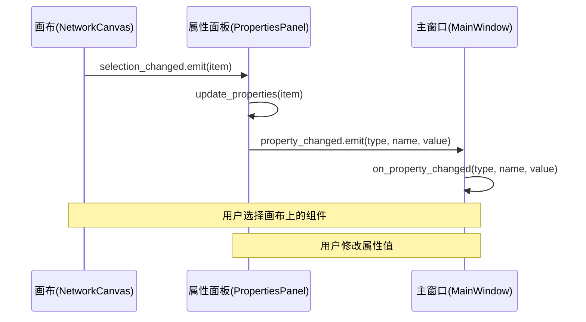
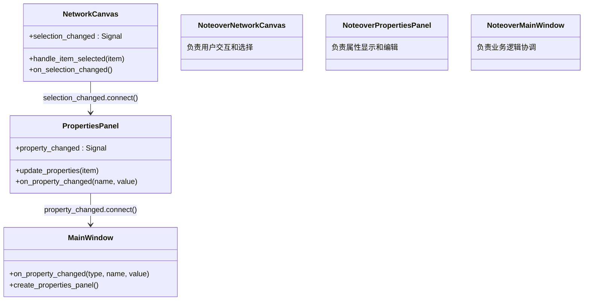

# 信号连接

<cite>
**本文档引用的文件**
- [main_window.py](file://src/components/main_window.py)
- [canvas.py](file://src/components/canvas.py)
- [properties_panel.py](file://src/components/properties_panel.py)
- [network_items.py](file://src/components/network_items.py)
</cite>

## 目录
1. [引言](#引言)
2. [信号连接机制概述](#信号连接机制概述)
3. [主窗口中的信号连接建立](#主窗口中的信号连接建立)
4. [连接生命周期管理](#连接生命周期管理)
5. [避免重复连接的策略](#避免重复连接的策略)
6. [关注点分离的设计原则](#关注点分离的设计原则)
7. [结论](#结论)

## 引言
在pp_tool项目中，信号与槽机制是实现组件间通信的核心。本文档详细说明了主窗口（main_window.py）中如何建立和管理信号连接，特别是画布选择变化与属性面板更新之间的连接，以及属性变化与主窗口处理函数之间的连接。

## 信号连接机制概述
pp_tool项目使用PySide6的信号与槽机制来实现组件间的松耦合通信。核心信号包括：
- `selection_changed`：当画布上的组件选择状态改变时发出
- `property_changed`：当属性面板中的属性值改变时发出

这些信号在组件初始化时建立连接，并在整个应用生命周期中保持有效，直到组件被销毁或连接被显式断开。

**Section sources**
- [main_window.py](file://src/components/main_window.py#L174-L178)
- [canvas.py](file://src/components/canvas.py#L20-L21)
- [properties_panel.py](file://src/components/properties_panel.py#L16-L17)

## 主窗口中的信号连接建立
在主窗口的`create_properties_panel`方法中，建立了两个关键的信号连接：

1. **画布选择变化连接到属性面板更新**：
```python
self.canvas.selection_changed.connect(self.properties_panel.update_properties)
```
当用户在画布上选择或取消选择组件时，`selection_changed`信号会触发`update_properties`方法，使属性面板显示当前选中组件的属性。

2. **属性面板变化连接到主窗口处理函数**：
```python
self.properties_panel.property_changed.connect(self.on_property_changed)
```
当用户在属性面板中修改组件属性时，`property_changed`信号会触发主窗口的`on_property_changed`方法，进行相应的业务逻辑处理。



**Diagram sources**
- [main_window.py](file://src/components/main_window.py#L174-L178)
- [canvas.py](file://src/components/canvas.py#L20-L21)
- [properties_panel.py](file://src/components/properties_panel.py#L16-L17)

**Section sources**
- [main_window.py](file://src/components/main_window.py#L174-L178)
- [canvas.py](file://src/components/canvas.py#L1172-L1180)
- [properties_panel.py](file://src/components/properties_panel.py#L88-L95)

## 连接生命周期管理
信号连接的生命周期与组件的生命周期紧密相关。在pp_tool项目中，连接的管理遵循以下原则：

1. **连接建立时机**：在`create_properties_panel`方法中，当属性面板和画布都已创建后立即建立连接。
2. **连接断开时机**：当组件被销毁时，PySide6会自动清理相关的信号连接。对于长生命周期的组件（如诊断线程），在不再需要时会显式断开连接并清理资源。

例如，在诊断功能中，每次启动新的诊断线程前，都会先停止并清理之前的线程及其信号连接：

```python
# 断开所有之前的信号连接
self.diagnostic_thread.progress_updated.disconnect()
self.diagnostic_thread.diagnostic_completed.disconnect()
self.diagnostic_thread.error_occurred.disconnect()
```

**Section sources**
- [main_window.py](file://src/components/main_window.py#L358-L367)
- [main_window.py](file://src/components/main_window.py#L437-L444)

## 避免重复连接的策略
pp_tool项目通过以下策略避免重复连接：

1. **单次连接原则**：信号连接只在组件初始化时建立一次，通常在`create_properties_panel`等创建方法中。
2. **连接状态检查**：在建立连接前，不进行显式的连接状态检查，而是依赖于组件的创建逻辑确保只创建一次。
3. **资源清理**：在创建新实例前，先清理旧实例及其连接，避免残留连接。

这种设计确保了信号连接的唯一性和可靠性，避免了因重复连接导致的信号被多次处理的问题。

**Section sources**
- [main_window.py](file://src/components/main_window.py#L358-L369)
- [main_window.py](file://src/components/main_window.py#L435-L447)

## 关注点分离的设计原则
pp_tool项目通过信号与槽机制实现了良好的关注点分离：

1. **画布组件**：负责用户交互和选择状态管理，通过`selection_changed`信号通知其他组件。
2. **属性面板**：负责属性显示和编辑，通过`property_changed`信号通知业务逻辑层。
3. **主窗口**：作为协调者，处理跨组件的业务逻辑，如网络状态管理。

这种设计使得各组件职责清晰，降低了耦合度，提高了代码的可维护性和可测试性。



**Diagram sources**
- [main_window.py](file://src/components/main_window.py#L174-L178)
- [canvas.py](file://src/components/canvas.py#L20-L21)
- [properties_panel.py](file://src/components/properties_panel.py#L16-L17)

**Section sources**
- [main_window.py](file://src/components/main_window.py#L299-L317)
- [properties_panel.py](file://src/components/properties_panel.py#L336-L445)
- [canvas.py](file://src/components/canvas.py#L229-L254)

## 结论
pp_tool项目中的信号与槽连接机制设计合理，通过在主窗口初始化时建立连接，实现了画布、属性面板和主窗口之间的有效通信。连接的生命周期管理得当，避免了内存泄漏和重复连接问题。这种基于信号与槽的松耦合设计，很好地实现了关注点分离，使得各组件职责清晰，代码结构更加模块化和可维护。