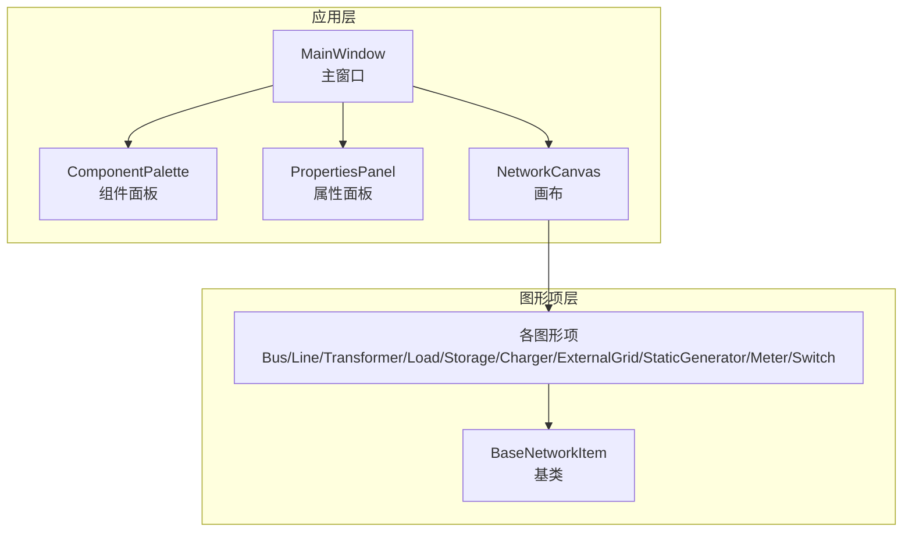
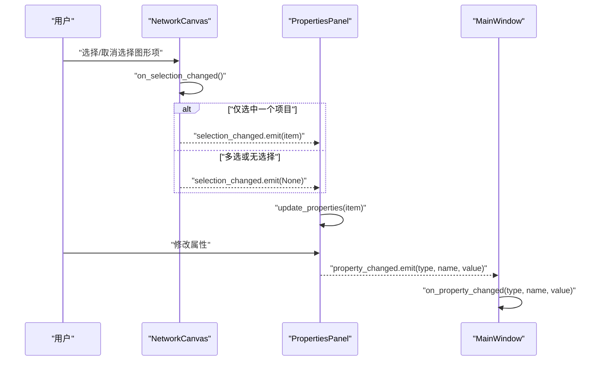
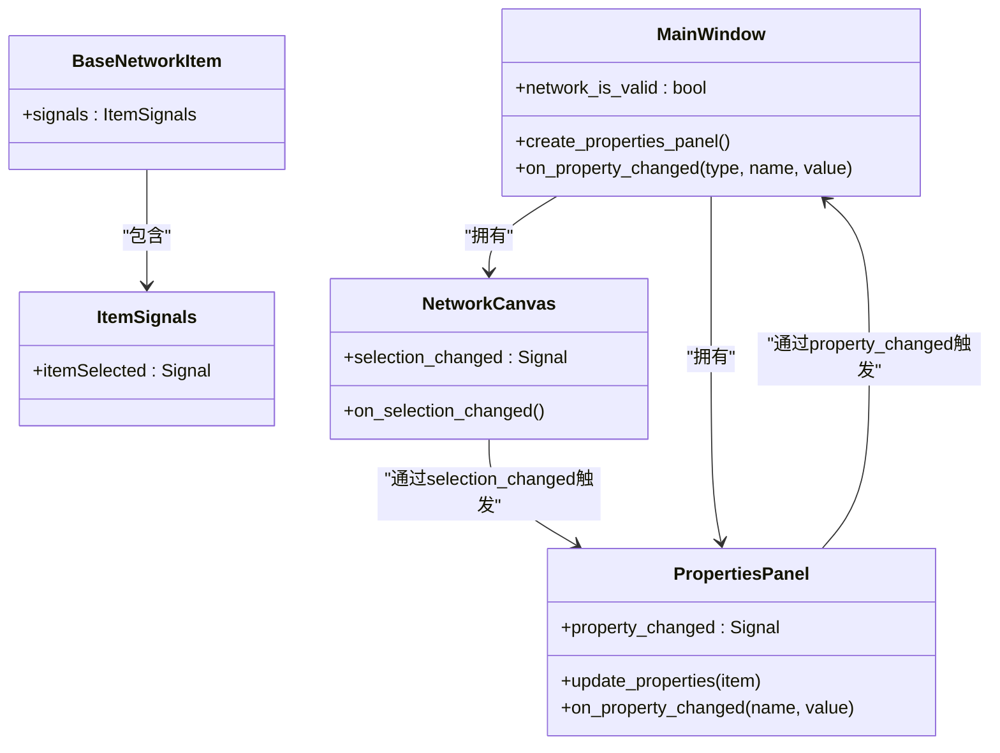

# 组件通信

<cite>
**本文引用的文件**
- [canvas.py](file://src/components/canvas.py)
- [properties_panel.py](file://src/components/properties_panel.py)
- [main_window.py](file://src/components/main_window.py)
- [network_items.py](file://src/components/network_items.py)
</cite>

## 目录
1. [简介](#简介)
2. [项目结构](#项目结构)
3. [核心组件](#核心组件)
4. [架构总览](#架构总览)
5. [详细组件分析](#详细组件分析)
6. [依赖关系分析](#依赖关系分析)
7. [性能考量](#性能考量)
8. [故障排查指南](#故障排查指南)
9. [结论](#结论)

## 简介
本文件聚焦于pp_tool的组件通信机制，围绕PySide6信号与槽（Signal/Slot）展开，系统阐述如下链路：
- 画布（NetworkCanvas）的selection_changed信号如何与属性面板（PropertiesPanel）的update_properties槽函数建立连接；
- 属性面板的property_changed信号如何被主窗口（MainWindow）的on_property_changed槽函数处理；
- 信号的定义、连接与触发关系；
- 该通信模式如何确保UI状态一致性；
- 松耦合设计的优势与潜在问题（如内存泄漏的预防）。

## 项目结构
pp_tool采用分层组件化设计，核心UI组件位于src/components目录：
- 主窗口：负责布局与信号桥接（连接画布与属性面板）
- 画布：承载图形项，负责选择变更与连接管理
- 属性面板：展示并编辑组件属性，向外发出属性变更信号
- 图形项：具体电网元件，参与连接与属性联动

图表来源
- [main_window.py](file://src/components/main_window.py#L159-L179)
- [canvas.py](file://src/components/canvas.py#L1172-L1200)
- [properties_panel.py](file://src/components/properties_panel.py#L12-L17)
- [network_items.py](file://src/components/network_items.py#L19-L23)

章节来源
- [main_window.py](file://src/components/main_window.py#L118-L179)
- [canvas.py](file://src/components/canvas.py#L1172-L1200)
- [properties_panel.py](file://src/components/properties_panel.py#L12-L17)
- [network_items.py](file://src/components/network_items.py#L19-L23)

## 核心组件
- NetworkCanvas（画布）
  - 定义selection_changed信号，用于通知当前选中图形项的变化
  - 在选择变化时发射信号，触发属性面板更新
- PropertiesPanel（属性面板）
  - 定义property_changed信号，用于向上游广播属性变更
  - 提供update_properties槽，用于根据当前选中图形项刷新UI
- MainWindow（主窗口）
  - 负责建立画布与属性面板之间的连接
  - 接收属性面板的属性变更信号，维护网络有效性标志

章节来源
- [canvas.py](file://src/components/canvas.py#L19-L21)
- [canvas.py](file://src/components/canvas.py#L1172-L1181)
- [properties_panel.py](file://src/components/properties_panel.py#L12-L17)
- [properties_panel.py](file://src/components/properties_panel.py#L88-L117)
- [main_window.py](file://src/components/main_window.py#L159-L179)
- [main_window.py](file://src/components/main_window.py#L299-L315)

## 架构总览
pp_tool的组件通信遵循“画布选择驱动属性面板更新，属性面板变更驱动主窗口处理”的单向传播模式。主窗口在创建属性面板时完成信号槽连接，形成稳定的事件链。

图表来源
- [canvas.py](file://src/components/canvas.py#L1172-L1181)
- [properties_panel.py](file://src/components/properties_panel.py#L88-L117)
- [main_window.py](file://src/components/main_window.py#L159-L179)
- [main_window.py](file://src/components/main_window.py#L299-L315)

## 详细组件分析

### 画布（NetworkCanvas）的selection_changed信号
- 信号定义
  - 在类级别定义selection_changed信号，用于向外广播当前选中图形项
  - 信号参数携带当前选中图形项或None（多选/无选择时）
- 触发时机
  - 画布内部在选择变化时调用on_selection_changed，依据选中数量决定发射参数
- 关键实现要点
  - 通过scene.selectionChanged连接到on_selection_changed，确保Qt选择变化事件被正确捕获
  - 电表连接后会主动触发一次selection_changed，保证属性面板即时刷新

章节来源
- [canvas.py](file://src/components/canvas.py#L19-L21)
- [canvas.py](file://src/components/canvas.py#L59-L62)
- [canvas.py](file://src/components/canvas.py#L1172-L1181)
- [canvas.py](file://src/components/canvas.py#L559-L561)

### 属性面板（PropertiesPanel）的update_properties槽与property_changed信号
- update_properties槽
  - 接收item参数，清空并重建属性控件树
  - 根据组件类型动态生成属性控件，绑定各自的changed/toggled信号到on_property_changed
- property_changed信号
  - 在on_property_changed中根据属性名与新值发出，携带组件类型、属性名与新值
  - 用于通知上游（主窗口）进行后续处理（如网络有效性标记、Modbus寄存器同步等）

章节来源
- [properties_panel.py](file://src/components/properties_panel.py#L88-L117)
- [properties_panel.py](file://src/components/properties_panel.py#L250-L335)
- [properties_panel.py](file://src/components/properties_panel.py#L336-L446)
- [properties_panel.py](file://src/components/properties_panel.py#L443-L446)

### 主窗口（MainWindow）的on_property_changed槽
- 职责
  - 接收属性变更信号，记录日志并标记网络状态为无效
  - 在名称属性变更时触发画布场景更新，确保显示同步
- 连接建立
  - 在创建属性面板时，将属性面板的property_changed信号连接到on_property_changed槽

章节来源
- [main_window.py](file://src/components/main_window.py#L159-L179)
- [main_window.py](file://src/components/main_window.py#L299-L315)

### 信号的定义、连接与触发关系
- 定义
  - 画布：selection_changed = Signal(object)
  - 属性面板：property_changed = Signal(str, str, object)
- 连接
  - 主窗口在创建属性面板时：
    - canvas.selection_changed.connect(properties_panel.update_properties)
    - properties_panel.property_changed.connect(main_window.on_property_changed)
- 触发
  - 画布选择变化 -> 发射selection_changed -> 属性面板刷新
  - 用户修改属性 -> 属性面板发射property_changed -> 主窗口处理

章节来源
- [canvas.py](file://src/components/canvas.py#L19-L21)
- [properties_panel.py](file://src/components/properties_panel.py#L12-L17)
- [main_window.py](file://src/components/main_window.py#L159-L179)

### UI状态一致性保障
- 单向传播：画布选择变化驱动属性面板更新，属性面板变更再驱动主窗口处理，避免循环依赖
- 即时刷新：电表连接后主动触发selection_changed，确保属性面板显示最新测量配置
- 网络有效性：主窗口在属性变更时将network_is_valid置为False，强制后续仿真前进行诊断

章节来源
- [canvas.py](file://src/components/canvas.py#L559-L561)
- [main_window.py](file://src/components/main_window.py#L299-L315)

### 松耦合设计优势与潜在问题
- 优势
  - 组件职责清晰：画布专注选择与连接，属性面板专注编辑，主窗口专注协调
  - 可扩展性强：新增图形项只需在属性面板中补充属性定义，无需改动主流程
  - 易测试：信号与槽解耦，便于单元测试与模拟
- 潜在问题与对策
  - 内存泄漏风险：长生命周期对象持有短生命周期对象的引用，或未断开信号连接
  - 对策
    - 使用Qt的父子关系管理生命周期（如MainWindow拥有Canvas与PropertiesPanel）
    - 在销毁或重建时显式断开信号连接（参考主窗口诊断线程的断连与置空）
    - 避免循环引用：确保信号连接方向单一，避免双向互连

章节来源
- [main_window.py](file://src/components/main_window.py#L357-L370)
- [main_window.py](file://src/components/main_window.py#L435-L447)
- [main_window.py](file://src/components/main_window.py#L453-L466)

## 依赖关系分析

图表来源
- [main_window.py](file://src/components/main_window.py#L118-L179)
- [canvas.py](file://src/components/canvas.py#L19-L21)
- [canvas.py](file://src/components/canvas.py#L1172-L1181)
- [properties_panel.py](file://src/components/properties_panel.py#L12-L17)
- [properties_panel.py](file://src/components/properties_panel.py#L88-L117)
- [network_items.py](file://src/components/network_items.py#L19-L23)

章节来源
- [main_window.py](file://src/components/main_window.py#L118-L179)
- [canvas.py](file://src/components/canvas.py#L19-L21)
- [properties_panel.py](file://src/components/properties_panel.py#L12-L17)
- [network_items.py](file://src/components/network_items.py#L19-L23)

## 性能考量
- 信号发射频率控制
  - 属性面板在on_property_changed中按需发射property_changed，避免频繁刷新
  - 画布在选择变化时仅在必要时发射selection_changed（单选/多选/无选择区分）
- UI更新优化
  - 属性面板按组件类型动态生成控件，减少无关控件的创建与布局
  - 画布在名称变更时触发场景更新，避免不必要的重绘
- 网络诊断
  - 主窗口在属性变更后标记网络状态为无效，避免在无效状态下进行仿真

章节来源
- [properties_panel.py](file://src/components/properties_panel.py#L336-L446)
- [canvas.py](file://src/components/canvas.py#L1172-L1181)
- [main_window.py](file://src/components/main_window.py#L299-L315)

## 故障排查指南
- 问题：属性面板不随画布选择变化而更新
  - 检查主窗口是否正确连接canvas.selection_changed到properties_panel.update_properties
  - 确认画布on_selection_changed是否被scene.selectionChanged触发
- 问题：属性变更未被主窗口感知
  - 检查主窗口是否连接properties_panel.property_changed到on_property_changed
  - 确认属性面板on_property_changed是否正确发射property_changed
- 问题：内存泄漏或崩溃
  - 确认诊断线程结束后断开所有信号连接并置空引用
  - 避免在槽函数中持有长生命周期对象的强引用

章节来源
- [main_window.py](file://src/components/main_window.py#L159-L179)
- [main_window.py](file://src/components/main_window.py#L357-L370)
- [main_window.py](file://src/components/main_window.py#L435-L447)
- [main_window.py](file://src/components/main_window.py#L453-L466)

## 结论
pp_tool通过PySide6信号与槽实现了清晰、稳定的组件通信机制：
- 画布选择变化驱动属性面板更新，属性面板变更驱动主窗口处理，形成单向、可预测的数据流
- 该模式确保UI状态一致性，同时具备良好的可扩展性与可维护性
- 通过父子关系与显式断连等实践，有效规避内存泄漏等潜在问题