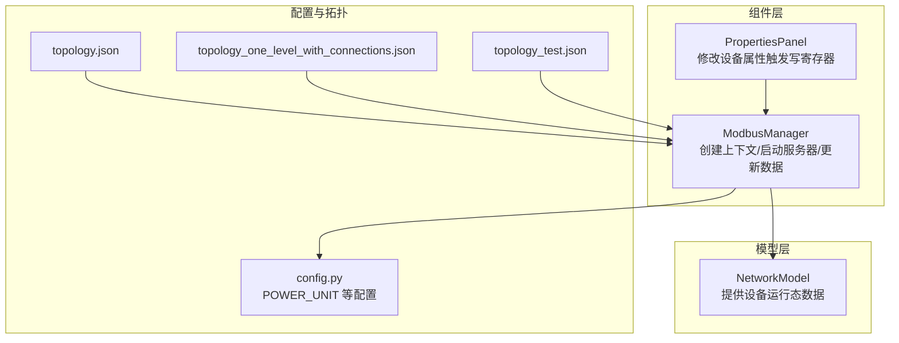
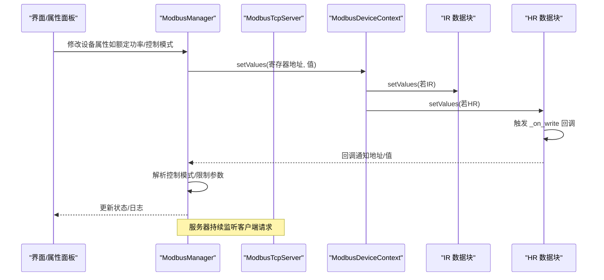
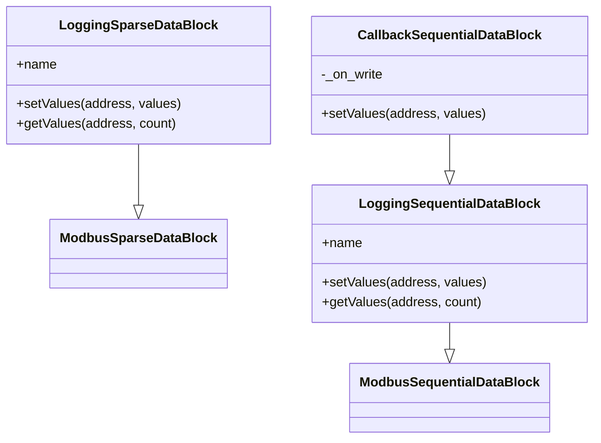
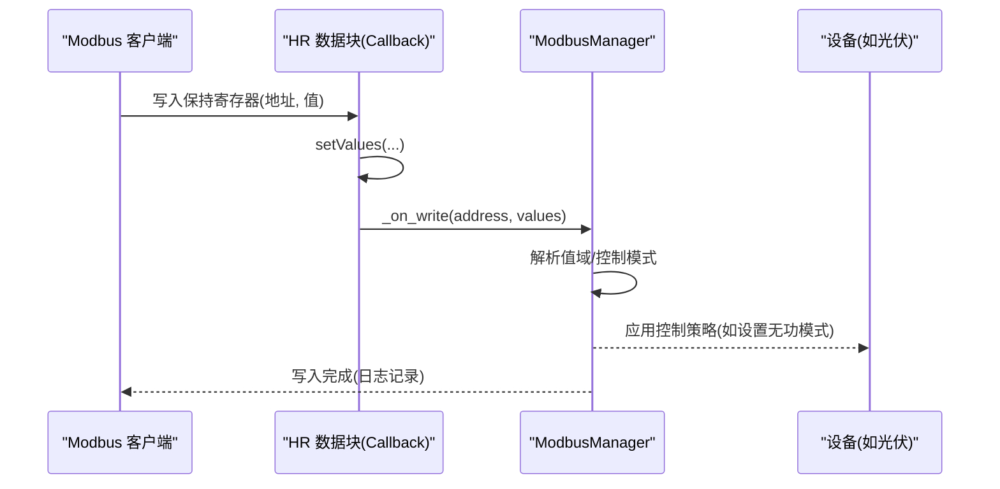
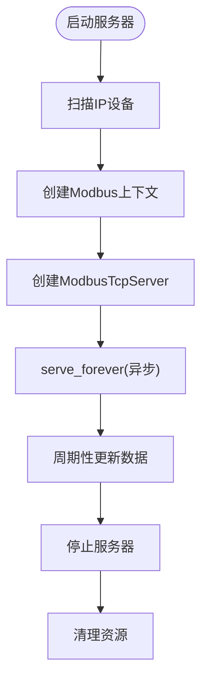
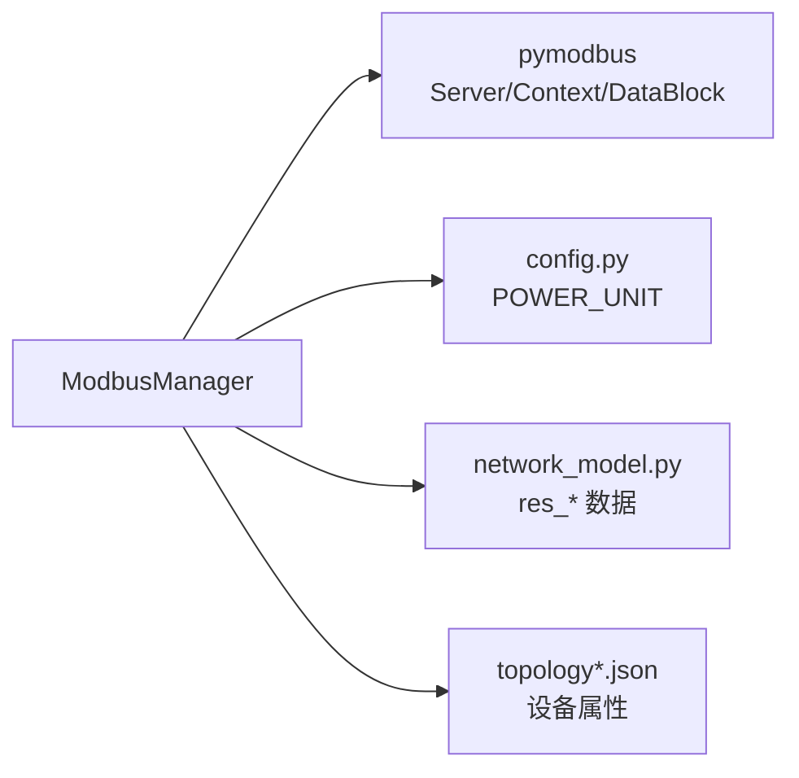

# Modbus上下文创建

<cite>
**本文引用的文件**
- [src/components/modbus_manager.py](file://src/components/modbus_manager.py)
- [src/config.py](file://src/config.py)
- [src/models/network_model.py](file://src/models/network_model.py)
- [src/components/properties_panel.py](file://src/components/properties_panel.py)
- [topology.json](file://topology.json)
- [topology_one_level_with_connections.json](file://topology_one_level_with_connections.json)
- [topology_test.json](file://topology_test.json)
</cite>

## 目录
1. [简介](#简介)
2. [项目结构](#项目结构)
3. [核心组件](#核心组件)
4. [架构总览](#架构总览)
5. [详细组件分析](#详细组件分析)
6. [依赖关系分析](#依赖关系分析)
7. [性能考量](#性能考量)
8. [故障排查指南](#故障排查指南)
9. [结论](#结论)
10. [附录](#附录)

## 简介
本文件围绕 ModbusManager 中的 create_modbus_context 及其私有方法（_create_sgen_context、_create_meter_context、_create_storage_context、_create_charger_context）展开，系统阐述如何针对不同设备类型（光伏、电表、储能、充电桩）构建定制化的 ModbusServerContext，覆盖输入寄存器（IR）与保持寄存器（HR）的地址分配、初始值设置、数据类型转换规则，以及 LoggingSequentialDataBlock 与 CallbackSequentialDataBlock 的封装机制。同时，解释通过 _on_write 回调实现写操作的业务逻辑联动，并给出各设备类型的寄存器映射表与示例（以光伏设备为例说明如何初始化额定功率、SN 码等关键参数）。

## 项目结构
ModbusManager 位于组件层，负责将网络模型中的设备数据映射到 Modbus 寄存器，提供 Modbus TCP 服务器的启动与数据更新能力。相关配置与拓扑数据来自配置文件与拓扑 JSON 文件，网络模型提供设备运行态数据。

图表来源
- [src/components/modbus_manager.py](file://src/components/modbus_manager.py#L1-L1284)
- [src/config.py](file://src/config.py#L1-L279)
- [src/models/network_model.py](file://src/models/network_model.py#L252-L284)
- [src/components/properties_panel.py](file://src/components/properties_panel.py#L485-L505)
- [topology.json](file://topology.json#L247-L313)
- [topology_one_level_with_connections.json](file://topology_one_level_with_connections.json#L477-L544)
- [topology_test.json](file://topology_test.json#L477-L544)

章节来源
- [src/components/modbus_manager.py](file://src/components/modbus_manager.py#L1-L1284)
- [src/config.py](file://src/config.py#L1-L279)

## 核心组件
- ModbusManager：负责扫描具有 IP 属性的设备、创建 Modbus 上下文、启动/停止 Modbus 服务器、周期性更新寄存器数据、收集写操作反馈。
- LoggingSequentialDataBlock/LoggingSparseDataBlock：在读写时记录日志，便于调试与审计。
- CallbackSequentialDataBlock：在写入时触发自定义回调，实现写操作的业务联动。
- ModbusServerContext/ModbusDeviceContext：封装设备的 IR/HR 数据块，对外暴露统一的读写接口。

章节来源
- [src/components/modbus_manager.py](file://src/components/modbus_manager.py#L1-L1284)

## 架构总览
ModbusManager 的核心流程：
- 设备扫描：从网络项中提取具有 IP 属性的设备，形成设备清单。
- 上下文创建：根据设备类型调用对应私有方法，构造 IR/HR 数据块并封装为 ModbusServerContext。
- 服务器启动：为每个设备创建 ModbusTcpServer，绑定上下文与设备标识。
- 数据更新：周期性从网络模型读取最新数据，写入对应寄存器。
- 写操作联动：通过 CallbackSequentialDataBlock 的 _on_write 回调，将写入行为转化为业务动作（如切换控制模式）。

图表来源
- [src/components/modbus_manager.py](file://src/components/modbus_manager.py#L1-L1284)

## 详细组件分析

### create_modbus_context 与私有方法设计
- create_modbus_context：根据设备类型分派到 _create_sgen_context/_create_meter_context/_create_storage_context/_create_charger_context 或默认上下文。
- _create_sgen_context：为静态发电机（光伏）创建上下文，包含 SN（4989-4996）、额定功率（5000）、今日/累计发电量（5002/5003-5004）、当前功率（5030-5031）、无功功率（5032-5033），以及保持寄存器（开关机、功率限制、百分比限制、无功补偿百分比、功率因数）。
- _create_meter_context：为电表创建上下文，包含当前功率、三相电压、三相电流、有功/无功电量、有功/无功功率等寄存器。
- _create_storage_context：为储能创建上下文，包含 SOC、最大充放电功率、剩余可放电容量、日/累计充放电量、三相电流、有功/视在功率、状态寄存器、并网/离网模式等。
- _create_charger_context：为充电桩创建上下文，包含当前功率、需求功率、额定功率、枪状态等寄存器。

章节来源
- [src/components/modbus_manager.py](file://src/components/modbus_manager.py#L121-L242)
- [src/components/modbus_manager.py](file://src/components/modbus_manager.py#L244-L421)

### LoggingSequentialDataBlock 与 CallbackSequentialDataBlock 的封装机制
- LoggingSequentialDataBlock：在 setValues/getValues 时记录读写日志，便于追踪 Modbus 交互。
- CallbackSequentialDataBlock：在 setValues 时调用 on_write 回调，将写操作传递给业务逻辑（如解析光伏无功控制模式）。

图表来源
- [src/components/modbus_manager.py](file://src/components/modbus_manager.py#L25-L68)

章节来源
- [src/components/modbus_manager.py](file://src/components/modbus_manager.py#L25-L68)

### 写操作的业务逻辑联动（_on_write）
- 光伏设备：在保持寄存器 5040（无功补偿百分比）或 5041（功率因数）写入时，解析值域并更新 q 控制模式（百分比/功率因数）。
- 储能/充电桩：通过 collect_*_modbus_data 读取保持寄存器中的功率设定、开关机、并网离网等控制信息，驱动设备行为。

图表来源
- [src/components/modbus_manager.py](file://src/components/modbus_manager.py#L1266-L1284)

章节来源
- [src/components/modbus_manager.py](file://src/components/modbus_manager.py#L1266-L1284)

### 各设备类型寄存器映射表

- 光伏（static_generator）
  - 输入寄存器 IR
    - 4989-4996：SN（每寄存器存放两个 ASCII 字符拼接）
    - 5000：额定功率（0.1kVA 单位）
    - 5002：今日发电量（kWh×10）
    - 5003-5004：总发电量（32 位，低 16 位 + 高 16 位）
    - 5030-5031：当前功率（32 位，低 16 位 + 高 16 位）
    - 5032-5033：无功功率（32 位，低 16 位 + 高 16 位）
  - 保持寄存器 HR
    - 5005：开关机（0=关机, 1=开机）
    - 5038：有功功率限制（kW）
    - 5007：有功功率百分比限制（0-100%）
    - 5040：无功补偿百分比（-1000 至 1000，表示 ±100%）
    - 5041：功率因数（-1000 至 1000，表示 -1.000 至 1.000）

- 电表（meter）
  - 输入寄存器 IR
    - 0：当前有功功率（kW×10，16 位）
    - 1-3：A/B/C 相电压（V×10，16 位）
    - 4-6：A/B/C 相电流（0.1A，16 位）
    - 7：有功上网电量（kWh×10，16 位）
    - 8：有功下网电量（kWh×10，16 位）
    - 9：组合有功总电能（kWh×10，16 位）
    - 20：无功功率（kvar×10，16 位）
    - 10：无功上网电量（kvarh×10，16 位）
    - 11：无功下网电量（kvarh×10，16 位）

- 储能（storage）
  - 输入寄存器 IR
    - 2：SOC（0.1%，0-10000 表示 0-100%）
    - 8：额定容量（kWh×10，16 位）
    - 9：PCS 数量（16 位）
    - 10：电池簇数量（16 位）
    - 11：电池簇容量（kWh×10，16 位）
    - 12：电池簇功率（kW×10，16 位）
    - 400：可用标志（1=可用，0=不可用）
    - 408：状态寄存器（bit9=并网，bit10=离网）
    - 409-411：A/B/C 相电压（V×10，16 位）
    - 412-414：A/B/C 相电流（0.1A，16 位）
    - 419：视在功率（kVA×10，16 位）
    - 420：有功功率（kW×10，16 位）
    - 426-429：日/累计充电量（32 位，低 16 位 + 高 16 位）
    - 430-431：日/累计放电量（32 位，低 16 位 + 高 16 位）
    - 432：PCS 工作模式（并网/离网）
    - 839：设备状态（停机/就绪/充电/放电/故障）
    - 5033：PCS 充放电状态（1=放电，2=充电）
    - 5095：并网/离网模式（1=离网，0=并网）
  - 保持寄存器 HR
    - 4：功率设定（kW，16 位）
    - 55：开关机控制（240=关机，243/245=开机）
    - 5095：并网/离网控制（1=离网，0=并网）

- 充电桩（charger）
  - 输入寄存器 IR
    - 0：当前有功功率（kW×10，16 位）
    - 1：状态（16 位）
    - 2：需求功率（kW×10，16 位）
    - 3：枪数量（16 位）
    - 4：额定功率（kW，16 位）
    - 100-103：枪1-4 状态（16 位）
  - 保持寄存器 HR
    - 0：功率限制（kW，16 位）

章节来源
- [src/components/modbus_manager.py](file://src/components/modbus_manager.py#L144-L242)
- [src/components/modbus_manager.py](file://src/components/modbus_manager.py#L244-L421)
- [src/components/modbus_manager.py](file://src/components/modbus_manager.py#L802-L926)
- [src/components/modbus_manager.py](file://src/components/modbus_manager.py#L927-L974)

### 数据类型转换规则与范围约束
- 功率单位转换：POWER_UNIT 由配置文件提供，通常为 1000（kW/MW）。功率值在写入前会乘以 POWER_UNIT，并按需乘以 10 或 100 以满足设备协议的精度要求。
- 32 位拆分：对于需要 32 位寄存器的数值（如总发电量、日/累计充放电量），拆分为低 16 位与高 16 位分别写入。
- 有符号/无符号处理：部分寄存器读取时会对 16 位值进行有符号扩展（>32767 视为负数），以适配设备协议。
- 范围限制：写入前对数值进行 16 位/32 位上限下限检查，防止越界。

章节来源
- [src/components/modbus_manager.py](file://src/components/modbus_manager.py#L724-L801)
- [src/components/modbus_manager.py](file://src/components/modbus_manager.py#L802-L926)
- [src/components/modbus_manager.py](file://src/components/modbus_manager.py#L927-L974)
- [src/config.py](file://src/config.py#L40-L60)

### 示例：为光伏设备初始化额定功率与 SN 码
- 步骤
  1) 通过 create_modbus_context 为静态发电机创建上下文。
  2) _create_sgen_context 初始化 IR/HR 寄存器初值。
  3) _write_pv_device_sn 将设备 SN 写入 IR 4989-4996（每寄存器两个字符），并将额定功率写入 IR 5000。
  4) 若设备属性包含 sn_mva，则按 POWER_UNIT 转换为 0.1kVA 单位写入。
- 注意
  - SN 写入采用每寄存器两个 ASCII 字符拼接的方式，长度限制为 16 字符。
  - 额定功率写入 IR 5000，单位为 0.1kVA。

章节来源
- [src/components/modbus_manager.py](file://src/components/modbus_manager.py#L144-L209)
- [src/components/modbus_manager.py](file://src/components/modbus_manager.py#L468-L505)
- [src/config.py](file://src/config.py#L40-L60)

### 服务器启动与数据更新流程
- 启动流程：scan_ip_devices → create_modbus_context → ModbusTcpServer → serve_forever（异步事件循环 + 线程隔离）。
- 更新流程：update_all_modbus_data → 根据设备类型调用 update_*_context → 从网络模型读取最新数据 → setValues 写入寄存器。
- 关闭流程：shutdown 服务器 → join 线程 → 清理资源与通信状态。

图表来源
- [src/components/modbus_manager.py](file://src/components/modbus_manager.py#L505-L657)
- [src/components/modbus_manager.py](file://src/components/modbus_manager.py#L1025-L1069)

章节来源
- [src/components/modbus_manager.py](file://src/components/modbus_manager.py#L505-L657)
- [src/components/modbus_manager.py](file://src/components/modbus_manager.py#L1025-L1069)

## 依赖关系分析
- ModbusManager 依赖 pymodbus 的 ModbusServerContext、ModbusDeviceContext、ModbusSequentialDataBlock、ModbusSparseDataBlock、ModbusTcpServer。
- 依赖配置 POWER_UNIT（来自 config.py）进行功率单位转换。
- 依赖网络模型（network_model.py）提供的设备运行态数据（如 res_sgen/res_storage/res_load/measurement）。
- 依赖拓扑 JSON（topology*.json）提供设备属性（如 sn_mva、p_mw、sn、ip、port 等）。

图表来源
- [src/components/modbus_manager.py](file://src/components/modbus_manager.py#L1-L1284)
- [src/config.py](file://src/config.py#L40-L60)
- [src/models/network_model.py](file://src/models/network_model.py#L252-L284)
- [topology.json](file://topology.json#L247-L313)

章节来源
- [src/components/modbus_manager.py](file://src/components/modbus_manager.py#L1-L1284)
- [src/config.py](file://src/config.py#L40-L60)
- [src/models/network_model.py](file://src/models/network_model.py#L252-L284)
- [topology.json](file://topology.json#L247-L313)

## 性能考量
- 数据块封装：使用 LoggingSequentialDataBlock/LoggingSparseDataBlock 记录读写日志，建议在生产环境适当降低日志级别，避免频繁 IO 影响性能。
- 32 位拆分：对长整型数据进行拆分写入，注意 setValues 的批量写入与原子性，避免跨寄存器竞争。
- 有符号扩展：对 16 位值进行有符号扩展时，尽量一次性完成，减少多次读取带来的开销。
- 事件循环与线程：服务器在独立线程中运行异步事件循环，避免阻塞主线程；更新数据时应避免长时间阻塞，必要时采用异步更新策略。

[本节为通用指导，无需具体文件引用]

## 故障排查指南
- 启动失败
  - 端口占用：捕获 OSError 并提示端口已被占用。
  - 服务器实例创建失败：等待事件循环准备超时，记录错误并清理。
- 写入失败
  - SN 写入：若设备未提供 sn 字段，跳过写入并记录警告。
  - 储能/充电桩初始化：异常时记录错误并返回 False，便于上层重试。
- 更新失败
  - 电表/光伏/储能/充电桩更新：捕获 KeyError/ValueError/Exception 并抛出明确错误信息，定位数据缺失或格式问题。
- 读取控制参数
  - 储能/充电桩：通过 collect_*_modbus_data 读取保持寄存器，若索引访问失败，返回 None 并记录错误。

章节来源
- [src/components/modbus_manager.py](file://src/components/modbus_manager.py#L596-L657)
- [src/components/modbus_manager.py](file://src/components/modbus_manager.py#L316-L375)
- [src/components/modbus_manager.py](file://src/components/modbus_manager.py#L658-L722)
- [src/components/modbus_manager.py](file://src/components/modbus_manager.py#L724-L801)
- [src/components/modbus_manager.py](file://src/components/modbus_manager.py#L802-L926)
- [src/components/modbus_manager.py](file://src/components/modbus_manager.py#L927-L974)
- [src/components/modbus_manager.py](file://src/components/modbus_manager.py#L1107-L1188)

## 结论
ModbusManager 通过 create_modbus_context 与一组私有方法，实现了对光伏、电表、储能、充电桩四类设备的定制化 Modbus 上下文构建。借助 LoggingSequentialDataBlock 与 CallbackSequentialDataBlock，系统在保证可观测性的同时，将写操作与业务逻辑紧密耦合。结合网络模型提供的实时数据与拓扑配置，ModbusManager 能够稳定地提供 Modbus TCP 服务，并支持动态更新与控制。

[本节为总结，无需具体文件引用]

## 附录

### 设备属性与寄存器初始化参考
- 光伏
  - 额定功率：IR 5000（0.1kVA 单位）
  - SN：IR 4989-4996（每寄存器两个字符）
- 储能
  - 额定功率/容量/簇参数：IR 4:8-9（低 16 位 + 高 16 位）
  - SN：IR 4:900-912（每寄存器两个字符）
- 充电桩
  - 额定功率：IR 4:4（kW 单位）
  - 枪状态：IR 4:100-103

章节来源
- [src/components/modbus_manager.py](file://src/components/modbus_manager.py#L316-L375)
- [src/components/modbus_manager.py](file://src/components/modbus_manager.py#L468-L505)
- [src/components/modbus_manager.py](file://src/components/modbus_manager.py#L423-L451)
- [src/components/properties_panel.py](file://src/components/properties_panel.py#L485-L505)