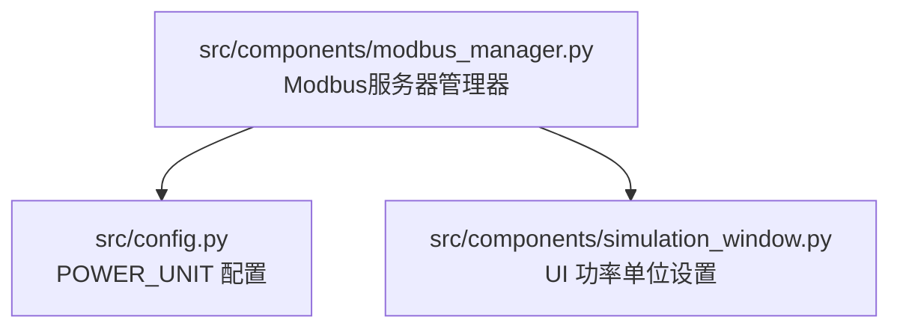
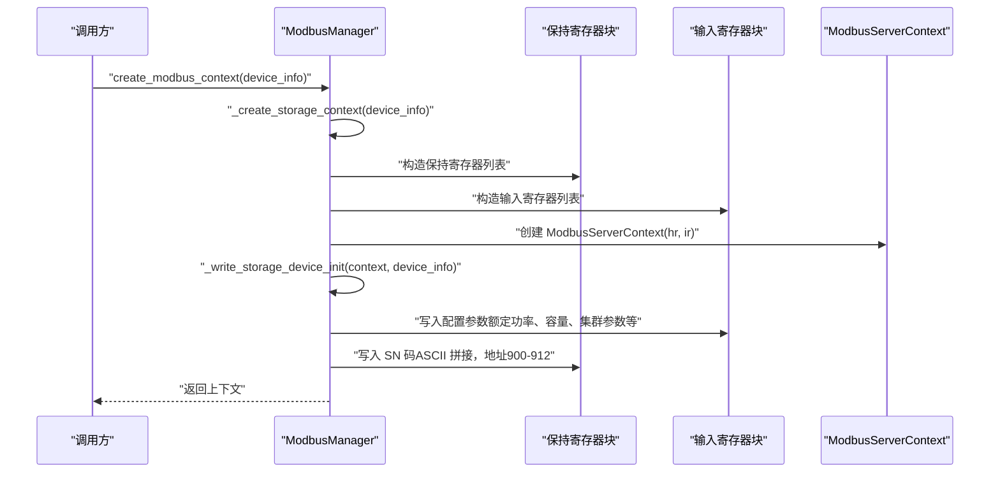
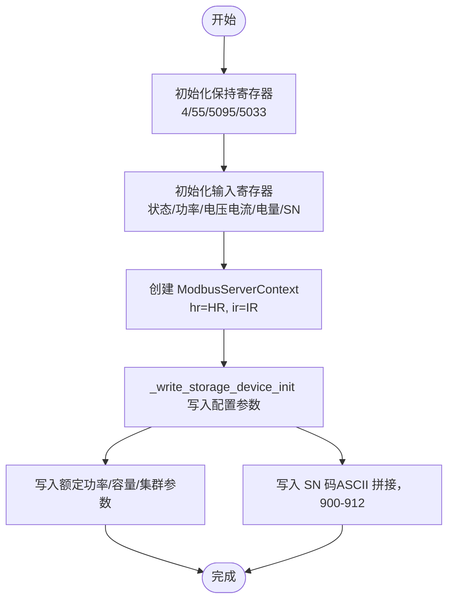
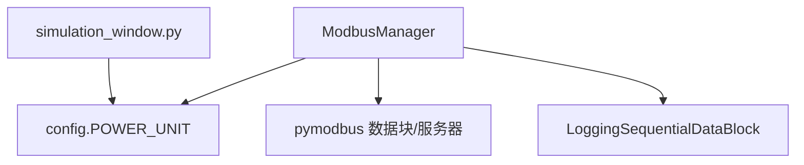

# 储能设备上下文创建

<cite>
**本文引用的文件**
- [modbus_manager.py](file://src/components/modbus_manager.py)
- [config.py](file://src/config.py)
- [simulation_window.py](file://src/components/simulation_window.py)
</cite>

## 目录
1. [简介](#简介)
2. [项目结构](#项目结构)
3. [核心组件](#核心组件)
4. [架构总览](#架构总览)
5. [详细组件分析](#详细组件分析)
6. [依赖关系分析](#依赖关系分析)
7. [性能考量](#性能考量)
8. [故障排查指南](#故障排查指南)
9. [结论](#结论)
10. [附录](#附录)

## 简介
本文件围绕储能设备的 Modbus 服务器上下文创建展开，重点解析以下内容：
- 如何通过 _create_storage_context 构建 ModbusServerContext，明确保持寄存器（HR）与输入寄存器（IR）的职责分工；
- _write_storage_device_init 如何将设备配置参数（如 sn_mva、max_e_mwh 等）写入对应寄存器；
- SN 码 ASCII 字符拼接规则（900-912）；
- 额定功率、容量等参数的单位转换（×POWER_UNIT）与数值范围校验；
- 提供完整的寄存器地址映射表与初始化流程说明。

## 项目结构
与本主题直接相关的文件位于 src/components 目录，其中 modbus_manager.py 是核心实现，config.py 提供 POWER_UNIT 单位配置，simulation_window.py 展示了 UI 中功率单位的来源与设置。

图表来源
- [modbus_manager.py](file://src/components/modbus_manager.py#L1-L120)
- [config.py](file://src/config.py#L40-L120)
- [simulation_window.py](file://src/components/simulation_window.py#L350-L387)

章节来源
- [modbus_manager.py](file://src/components/modbus_manager.py#L1-L120)
- [config.py](file://src/config.py#L40-L120)
- [simulation_window.py](file://src/components/simulation_window.py#L350-L387)

## 核心组件
- ModbusManager：负责为不同设备类型创建 Modbus 上下文，包括储能设备。
- _create_storage_context：为储能设备创建 HR/IR 数据块与 ModbusServerContext，并触发初始化写入。
- _write_storage_device_init：将设备配置参数写入输入寄存器，同时处理 SN 码拼接与范围校验。
- LoggingSequentialDataBlock：封装 ModbusSequentialDataBlock，记录读写日志。

章节来源
- [modbus_manager.py](file://src/components/modbus_manager.py#L121-L345)
- [modbus_manager.py](file://src/components/modbus_manager.py#L316-L376)

## 架构总览
下图展示了创建储能设备上下文的整体流程与组件交互。

图表来源
- [modbus_manager.py](file://src/components/modbus_manager.py#L121-L345)
- [modbus_manager.py](file://src/components/modbus_manager.py#L316-L376)

## 详细组件分析

### _create_storage_context：构建 ModbusServerContext
- 保持寄存器（HR）初始化要点
  - 寄存器 4：功率设定（kW，单位转换由写入阶段处理）
  - 寄存器 55：开关机控制（默认开机）
  - 寄存器 5095：PCS 并离网模式（1-离网，0-并网）
  - 寄存器 5033：PCS 充放电状态（1-放电，2-充电）
- 输入寄存器（IR）初始化要点
  - 状态与运行参数：SOC、最大充放电功率、剩余可放电容量、三相电压/电流、有功/视在功率、日累计与累计充放电量、状态映射寄存器等
  - SN 码寄存器：900-912，采用 ASCII 字符拼接写入
- 创建上下文
  - 使用 LoggingSequentialDataBlock 包装 HR/IR，便于日志追踪
  - 构造 ModbusServerContext，设备编号为 1

章节来源
- [modbus_manager.py](file://src/components/modbus_manager.py#L244-L315)

### _write_storage_device_init：写入配置参数与 SN 码
- 参数来源与单位转换
  - 额定功率（kW）：device_info.get('sn_mva') × POWER_UNIT × 10
  - 额定容量（kWh）：device_info.get('max_e_mwh') × POWER_UNIT
  - 电池簇容量/功率（kWh/kW）：device_info.get(...) × POWER_UNIT
  - PCS 数量、电池簇数量：device_info.get(..., 默认值)
- 数值范围校验
  - 所有参数均限制在 16 位寄存器范围（0-65535）
- 写入寄存器
  - 额定功率：写入地址 4:8 与 4:9（低 16 位与高 16 位）
  - 额定容量、PCS 数量、电池簇数量、电池簇容量、电池簇功率：分别写入对应地址
- SN 码 ASCII 拼接规则（地址 900-912）
  - 每两个 ASCII 字符组合为一个 16 位寄存器值：(ASCII 第一个字符 << 8) | ASCII 第二个字符
  - 从设备信息中读取 sn 字段，按每两位字符进行拼接并写入连续寄存器

章节来源
- [modbus_manager.py](file://src/components/modbus_manager.py#L316-L376)

### HR 与 IR 的职责分工
- 保持寄存器（HR）
  - 用于接收上位机下发的控制指令，如功率设定、开关机、并离网模式、充放电状态等
  - 示例：寄存器 4（功率）、55（开关机）、5095（并离网）、5033（充放电状态）
- 输入寄存器（IR）
  - 用于向客户端反馈设备状态与实时运行数据，如 SOC、功率、电压电流、容量、电量统计、状态映射等
  - 示例：寄存器 2（SOC）、8（最大充电功率）、9（最大放电功率）、12（剩余可放电容量）、400（可用状态）、408/409（状态映射）、412-414（三相电流）、420（有功功率）、426-431（日/累计充放电量）、839（状态寄存器）、900-912（SN 码）

章节来源
- [modbus_manager.py](file://src/components/modbus_manager.py#L244-L315)

### 单位转换与范围校验机制
- 单位转换
  - 额定功率与容量在写入前乘以 POWER_UNIT，确保与 UI 选择的功率单位一致
  - UI 中功率单位来源于 simulation_window.py 的下拉框，其系数来自 config.POWER_UNIT
- 数值范围校验
  - 所有写入值均限制在 0-65535（16 位无符号整数），防止越界

章节来源
- [modbus_manager.py](file://src/components/modbus_manager.py#L330-L343)
- [simulation_window.py](file://src/components/simulation_window.py#L350-L387)
- [config.py](file://src/config.py#L40-L120)

### 寄存器地址映射表（储能设备）
- 控制指令（HR）
  - 4：功率设定（kW，32 位拆分写入）
  - 55：开关机控制（布尔值）
  - 5095：PCS 并离网模式（1-离网，0-并网）
  - 5033：PCS 充放电状态（1-放电，2-充电）
- 状态与运行数据（IR）
  - 0：状态映射（0/1/2/3/4）
  - 2：SOC（千分比，0-1000）
  - 8：最大充电功率（kW）
  - 9：最大放电功率（kW）
  - 12：剩余可放电容量（kWh×10）
  - 39：额定容量（kWh）
  - 40：PCS 数量
  - 41：电池簇数量
  - 42：电池簇容量（kWh）
  - 43：电池簇功率（kW）
  - 400：可用状态（1 可用，0 不可用）
  - 408/409：状态映射（备用）
  - 412-414：三相电流（0.1A）
  - 419：视在功率（kVA）
  - 420：有功功率（kW）
  - 426-431：日/累计充放电量（kWh×10，32 位拆分）
  - 432：PCS 工作模式（bit9 并网，bit10 离网）
  - 839：状态寄存器（停机/就绪/充电/放电/故障）
  - 900-912：SN 码（ASCII 拼接，每寄存器两个字符）
- 并离网模式写入（IR）
  - 432：当前 PCS 工作模式（bit9/bit10）
  - 408：同 432（备用）
  - 5033：PCS 充放电状态（1-放电，2-充电）

章节来源
- [modbus_manager.py](file://src/components/modbus_manager.py#L244-L315)
- [modbus_manager.py](file://src/components/modbus_manager.py#L802-L926)

### 初始化流程（时序）

图表来源
- [modbus_manager.py](file://src/components/modbus_manager.py#L244-L315)
- [modbus_manager.py](file://src/components/modbus_manager.py#L316-L376)

## 依赖关系分析
- ModbusManager 依赖
  - config.POWER_UNIT：统一功率单位系数
  - pymodbus：Modbus 数据块与服务器框架
  - 自定义 LoggingSequentialDataBlock：记录读写日志
- UI 与配置
  - simulation_window.py 提供功率单位选择，影响 POWER_UNIT 的取值
- 关键耦合点
  - HR/IR 地址映射集中于 _create_storage_context 与 _write_storage_device_init
  - SN 码拼接规则与地址区间固定（900-912）

图表来源
- [modbus_manager.py](file://src/components/modbus_manager.py#L1-L120)
- [config.py](file://src/config.py#L40-L120)
- [simulation_window.py](file://src/components/simulation_window.py#L350-L387)

章节来源
- [modbus_manager.py](file://src/components/modbus_manager.py#L1-L120)
- [config.py](file://src/config.py#L40-L120)
- [simulation_window.py](file://src/components/simulation_window.py#L350-L387)

## 性能考量
- 数据块封装
  - LoggingSequentialDataBlock 在 setValues/getValues 时记录日志，便于调试但会带来少量开销
- 写入策略
  - 配置参数与 SN 码一次性写入，避免频繁 IO
  - 32 位数据拆分为两个 16 位寄存器写入，符合 Modbus 规范
- 范围校验
  - 16 位范围限制在构造阶段完成，减少运行期异常

[本节为通用建议，无需列出具体文件来源]

## 故障排查指南
- 启动服务器失败
  - 检查端口占用与权限问题（参考 start_modbus_server 的错误处理）
- 写入配置失败
  - 查看 _write_storage_device_init 的异常捕获与日志输出
  - 确认 device_info 中 sn_mva、max_e_mwh、pcs_num、battery_cluster_* 等字段存在且类型正确
- SN 码显示异常
  - 确认 sn 字符串长度与 ASCII 拼接逻辑（每两个字符写入一个寄存器）
  - 检查地址区间 900-912 是否被其他用途覆盖
- 参数越界
  - 额定功率/容量过大导致 16 位溢出，需调整 POWER_UNIT 或设备参数

章节来源
- [modbus_manager.py](file://src/components/modbus_manager.py#L505-L608)
- [modbus_manager.py](file://src/components/modbus_manager.py#L316-L376)

## 结论
- _create_storage_context 明确区分 HR/IR 的职责：HR 接收控制指令，IR 反馈状态与运行数据
- _write_storage_device_init 完成配置参数写入与 SN 码 ASCII 拼接，具备完善的单位转换与范围校验
- 寄存器映射清晰，初始化流程完整，便于维护与扩展

[本节为总结性内容，无需列出具体文件来源]

## 附录

### 寄存器地址映射表（简表）
- 控制指令（HR）
  - 4：功率设定（kW）
  - 55：开关机控制
  - 5095：PCS 并离网模式
  - 5033：PCS 充放电状态
- 状态与运行数据（IR）
  - 0/400/408/409：状态映射
  - 2：SOC（千分比）
  - 8/9：最大充电/放电功率（kW）
  - 12：剩余可放电容量（kWh×10）
  - 39：额定容量（kWh）
  - 40-43：PCS/电池簇数量与容量/功率
  - 412-414：三相电流（0.1A）
  - 419/420：视在/有功功率（kVA/kW）
  - 426-431：日/累计充放电量（kWh×10，32 位）
  - 432/5033：PCS 工作模式/充放电状态
  - 839：状态寄存器
  - 900-912：SN 码（ASCII 拼接）

章节来源
- [modbus_manager.py](file://src/components/modbus_manager.py#L244-L315)
- [modbus_manager.py](file://src/components/modbus_manager.py#L802-L926)