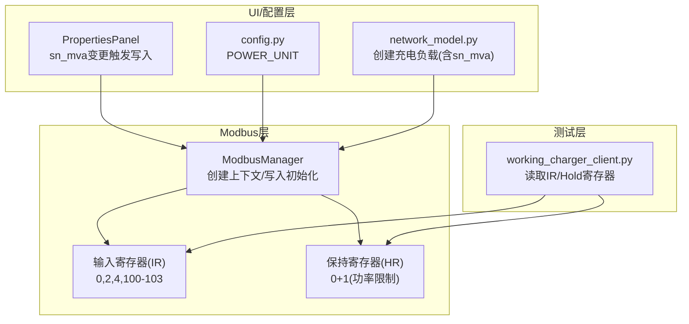
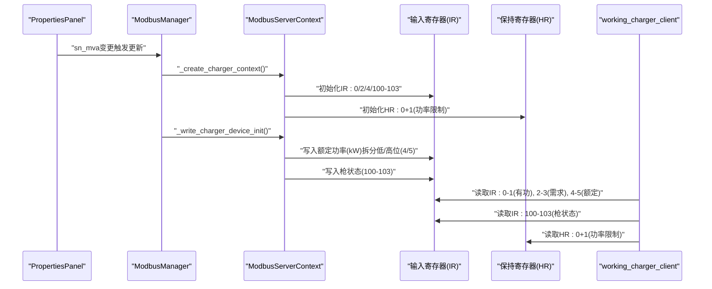
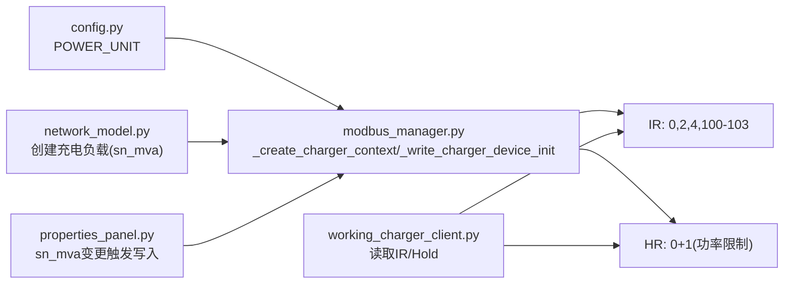

# 充电桩设备上下文创建

<cite>
**本文引用的文件**
- [modbus_manager.py](file://src/components/modbus_manager.py)
- [working_charger_client.py](file://tests/working_charger_client.py)
- [properties_panel.py](file://src/components/properties_panel.py)
- [config.py](file://src/config.py)
- [network_model.py](file://src/models/network_model.py)
</cite>

## 目录
1. [简介](#简介)
2. [项目结构](#项目结构)
3. [核心组件](#核心组件)
4. [架构总览](#架构总览)
5. [详细组件分析](#详细组件分析)
6. [依赖关系分析](#依赖关系分析)
7. [性能考量](#性能考量)
8. [故障排查指南](#故障排查指南)
9. [结论](#结论)
10. [附录](#附录)

## 简介
本文件系统性说明充电桩设备创建Modbus上下文的完整流程，重点覆盖：
- 输入寄存器(IR)的结构设计：有功功率(0)、需求功率(2)、额定功率(4)及四把充电枪状态(100-103)的地址分配与初始值。
- 写入设备初始化方法_write_charger_device_init如何将sn_mva配置转换为kW单位并拆分为高低位写入寄存器4-5。
- 充电桩状态初始化逻辑（枪状态1-4）及其在仿真中的意义。
- 保持寄存器中功率限制(0+1)的默认值0x7FFF的含义。
- 提供完整的数据模型与交互示例。

## 项目结构
围绕Modbus上下文创建与充电桩相关的关键文件如下：
- Modbus上下文创建与寄存器映射：src/components/modbus_manager.py
- 充电桩客户端读取示例：tests/working_charger_client.py
- 属性面板与sn_mva变更联动：src/components/properties_panel.py
- 功率单位配置：src/config.py
- 网络模型中充电负载创建（与sn_mva关联）：src/models/network_model.py

图表来源
- [modbus_manager.py](file://src/components/modbus_manager.py#L377-L451)
- [working_charger_client.py](file://tests/working_charger_client.py#L51-L108)
- [properties_panel.py](file://src/components/properties_panel.py#L446-L510)
- [config.py](file://src/config.py#L40-L120)
- [network_model.py](file://src/models/network_model.py#L280-L312)

章节来源
- [modbus_manager.py](file://src/components/modbus_manager.py#L377-L451)
- [working_charger_client.py](file://tests/working_charger_client.py#L51-L108)
- [properties_panel.py](file://src/components/properties_panel.py#L446-L510)
- [config.py](file://src/config.py#L40-L120)
- [network_model.py](file://src/models/network_model.py#L280-L312)

## 核心组件
- ModbusManager：负责为不同设备类型创建Modbus上下文，其中charger分支实现_create_charger_context与_write_charger_device_init。
- PropertiesPanel：当sn_mva变化时，触发_modbus寄存器更新逻辑，确保UI与Modbus数据一致。
- working_charger_client：演示如何读取IR/Hold寄存器，验证寄存器映射与单位换算。

章节来源
- [modbus_manager.py](file://src/components/modbus_manager.py#L121-L142)
- [properties_panel.py](file://src/components/properties_panel.py#L446-L510)
- [working_charger_client.py](file://tests/working_charger_client.py#L51-L108)

## 架构总览
下图展示充电桩Modbus上下文创建与初始化的关键步骤，以及客户端读取流程。

图表来源
- [modbus_manager.py](file://src/components/modbus_manager.py#L377-L451)
- [working_charger_client.py](file://tests/working_charger_client.py#L51-L108)

## 详细组件分析

### _create_charger_context 方法：为充电桩创建Modbus上下文
- 输入寄存器(IR)结构设计
  - 有功功率：地址0(低16位)+1(高16位)，单位kW，32位无符号整数；客户端读取时按协议约定拼接。
  - 需求功率：地址2(低16位)+3(高16位)，单位kW，32位无符号整数。
  - 额定功率：地址4(低16位)+5(高16位)，单位kW，32位无符号整数。
  - 枪状态：地址100-103，每个地址对应一把枪的状态值（初始值分别为1、2、3、4）。
- 保持寄存器(HR)结构设计
  - 地址0+1：功率限制，初始默认值为0x7FFF。
- 上下文构建
  - 使用LoggingSequentialDataBlock包装IR/HR，便于日志记录写入/读取。
  - 创建ModbusDeviceContext并放入ModbusServerContext，设备ID为1。

章节来源
- [modbus_manager.py](file://src/components/modbus_manager.py#L377-L416)

### _write_charger_device_init 方法：写入设备初始化数据
- 额定功率写入
  - 将device_info中的sn_mva按POWER_UNIT转换为kW，再拆分为低16位与高16位，分别写入IR地址4与IR地址5。
- 枪状态写入
  - 分别写入IR地址100-103，初始值为1、2、3、4，代表四把充电枪的初始状态。
- 返回值
  - 成功返回True，异常或数据缺失返回False。

章节来源
- [modbus_manager.py](file://src/components/modbus_manager.py#L423-L451)

### 读取与交互示例
- 客户端读取
  - 读取IR地址0-1：有功功率（低/高位拼接）。
  - 读取IR地址2-3：需求功率（低/高位拼接）。
  - 读取IR地址4-5：额定功率（低/高位拼接）。
  - 读取IR地址100-103：四把枪状态。
  - 读取HR地址0+1：功率限制。
- 单次读取示例
  - 读取IR地址0-5共6个寄存器，得到有功/需求/额定功率。
  - 读取IR地址100-103共4个寄存器，得到枪状态。
  - 读取HR地址0+1得到功率限制。

章节来源
- [working_charger_client.py](file://tests/working_charger_client.py#L51-L108)

### 数据模型与单位换算
- 功率单位换算
  - sn_mva到kW：sn_mva × POWER_UNIT。
  - POWER_UNIT来自配置文件，可在UI中调整。
- 32位寄存器拆分
  - 低16位：sn_mva × POWER_UNIT & 0xFFFF
  - 高16位：(sn_mva × POWER_UNIT) >> 16
- 客户端拼接
  - 有功/需求/额定功率均按“低16位 + 高16位”拼接为32位整数。

章节来源
- [modbus_manager.py](file://src/components/modbus_manager.py#L423-L451)
- [config.py](file://src/config.py#L40-L120)
- [working_charger_client.py](file://tests/working_charger_client.py#L62-L84)

### 充电桩状态初始化逻辑与仿真意义
- 初始化逻辑
  - IR地址100-103初始值分别为1、2、3、4，表示四把枪的初始状态。
- 仿真意义
  - 该初始化值用于模拟设备上电后的默认状态，便于客户端与仿真系统在启动阶段获得一致的枪状态。
  - 若后续需要修改枪状态，可通过写入IR地址100-103实现。

章节来源
- [modbus_manager.py](file://src/components/modbus_manager.py#L388-L403)

### 保持寄存器功率限制默认值0x7FFF的含义
- 默认值0x7FFF（十进制32767）在本项目中作为功率限制的占位值，通常表示“未设置或最大限制”。
- 客户端读取HR地址0+1时，若为0x7FFF，应视为未设置或采用设备允许的最大功率限制。
- 若需要设置限制，可通过写入HR地址0+1实现。

章节来源
- [modbus_manager.py](file://src/components/modbus_manager.py#L400-L403)

### 属性面板与Modbus寄存器联动
- 当sn_mva发生变化时，PropertiesPanel会调用_modbus寄存器更新逻辑，将新值转换为kW并写入IR地址4（低16位），并在需要时写入IR地址5（高16位）。
- 该联动确保UI配置与Modbus数据保持一致，便于仿真与测试。

章节来源
- [properties_panel.py](file://src/components/properties_panel.py#L446-L510)

## 依赖关系分析
- ModbusManager依赖
  - config.py中的POWER_UNIT用于sn_mva到kW的换算。
  - network_model.py中的充电负载创建逻辑与sn_mva相关，间接影响Modbus上下文初始化。
- working_charger_client依赖
  - 依赖Modbus协议读取IR/Hold寄存器，验证寄存器映射与单位换算。

图表来源
- [modbus_manager.py](file://src/components/modbus_manager.py#L377-L451)
- [properties_panel.py](file://src/components/properties_panel.py#L446-L510)
- [config.py](file://src/config.py#L40-L120)
- [network_model.py](file://src/models/network_model.py#L280-L312)
- [working_charger_client.py](file://tests/working_charger_client.py#L51-L108)

## 性能考量
- 寄存器数量与更新频率
  - 充电桩上下文仅使用少量寄存器（IR约100-103，HR约0+1），更新频率较低，对性能影响可忽略。
- 单次写入与批量读取
  - 客户端建议批量读取IR/Hold寄存器，减少网络往返次数。
- 单位换算与拆分
  - sn_mva到kW的换算与高低位拆分均为常数时间复杂度，开销极小。

## 故障排查指南
- 读取不到额定功率
  - 检查IR地址4/5是否正确写入（低/高位）。
  - 确认sn_mva是否在UI中正确设置，且已触发_modbus寄存器更新。
- 枪状态异常
  - 确认IR地址100-103是否被正确写入。
  - 若需修改状态，通过写入IR地址100-103实现。
- 功率限制无效
  - 检查HR地址0+1是否被写入有效值，避免使用默认0x7FFF。
- 单位换算错误
  - 确认POWER_UNIT配置是否符合预期，sn_mva到kW的换算是否正确。

章节来源
- [modbus_manager.py](file://src/components/modbus_manager.py#L423-L451)
- [properties_panel.py](file://src/components/properties_panel.py#L446-L510)
- [working_charger_client.py](file://tests/working_charger_client.py#L62-L84)

## 结论
- 充电桩Modbus上下文通过_create_charger_context与_write_charger_device_init完成初始化，寄存器映射清晰、默认值合理。
- sn_mva到kW的换算与高低位拆分在初始化与属性变更时均得到保障，确保仿真与实测一致性。
- 保持寄存器功率限制默认值0x7FFF体现了“未设置”的语义，实际使用中应按需写入有效值。
- 客户端读取示例验证了IR/Hold寄存器的正确性，便于进一步扩展与调试。

## 附录
- 寄存器映射速查
  - IR：0(有功功率低/高)、2(需求功率低/高)、4(额定功率低/高)、100-103(枪状态)
  - HR：0+1(功率限制)
- 单位换算速查
  - sn_mva → kW：乘以POWER_UNIT
  - 32位拆分：低16位与高16位分别写入相邻寄存器