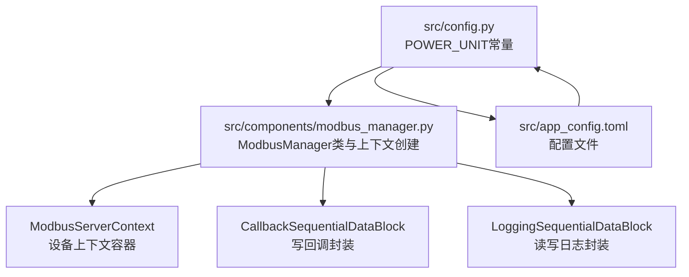
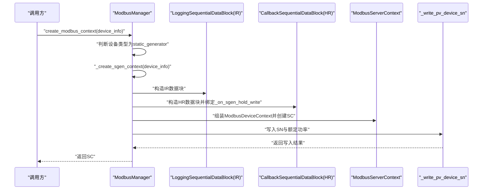
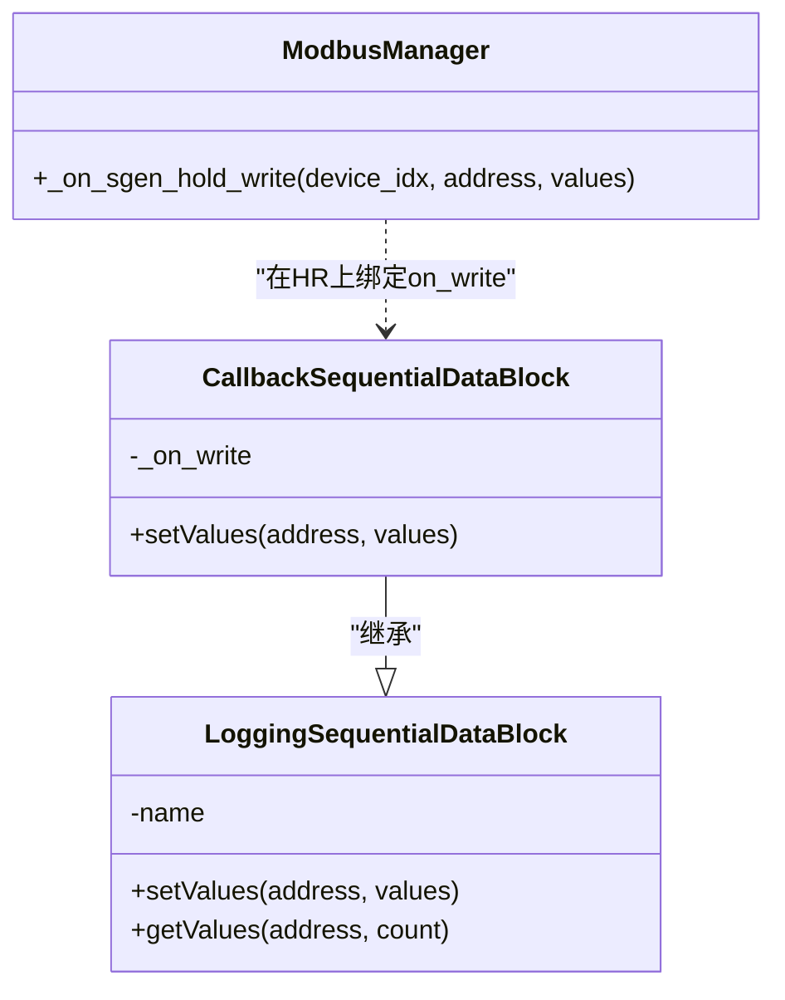
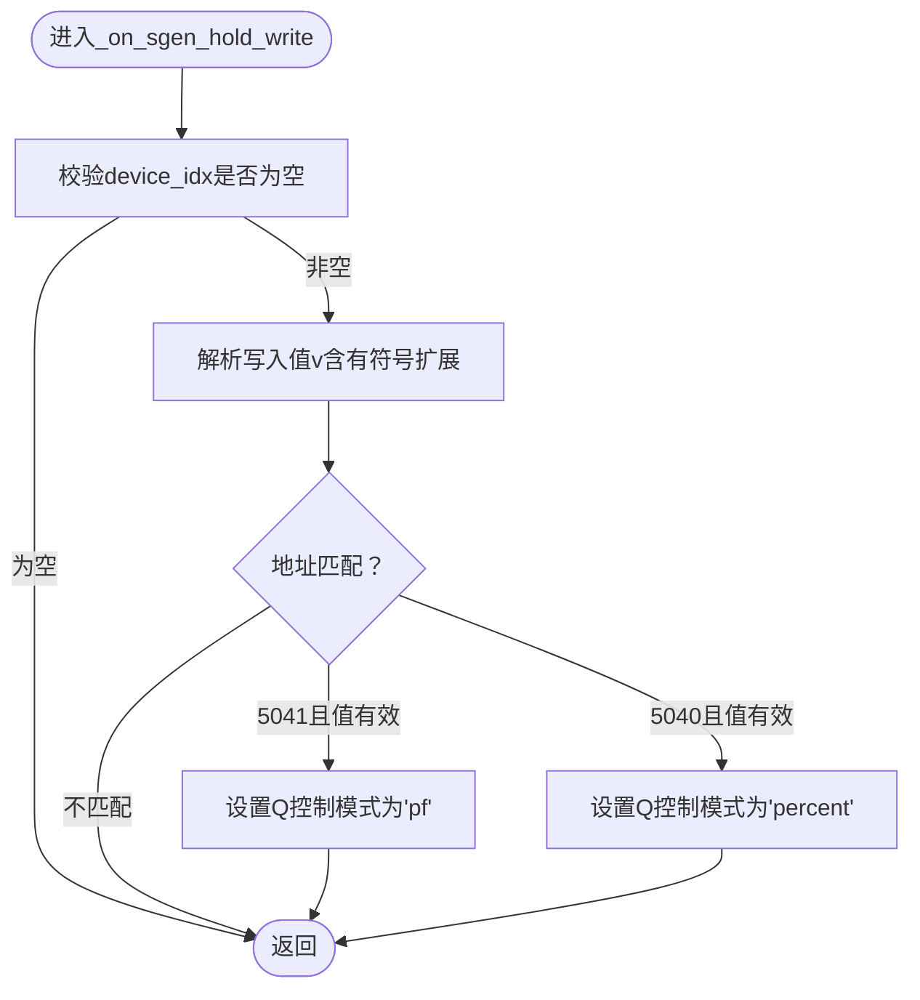
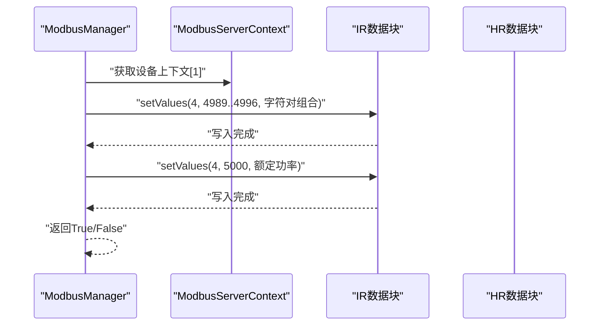
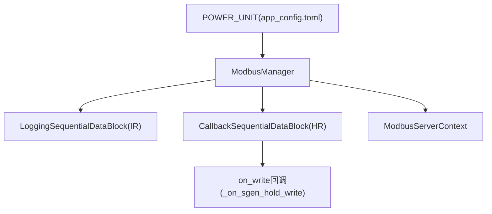

# 光伏设备上下文创建

<cite>
**本文引用的文件**
- [modbus_manager.py](file://src/components/modbus_manager.py)
- [config.py](file://src/config.py)
- [app_config.toml](file://src/app_config.toml)
</cite>

## 目录
1. [简介](#简介)
2. [项目结构](#项目结构)
3. [核心组件](#核心组件)
4. [架构总览](#架构总览)
5. [详细组件分析](#详细组件分析)
6. [依赖关系分析](#依赖关系分析)
7. [性能考量](#性能考量)
8. [故障排查指南](#故障排查指南)
9. [结论](#结论)

## 简介
本文件围绕_mod_create_sgen_context方法（即_modbus_manager.py中的_create_sgen_context）如何为光伏设备构建ModbusServerContext进行深入解析，重点说明：
- 输入寄存器(IR)与保持寄存器(HR)的地址分配策略
- 关键参数映射规则：SN码(4989-4996)、额定功率(5000)、今日发电量(5002)、总发电量(5003-5004)、当前功率(5030-5031)、无功功率(5032-5033)
- CallbackSequentialDataBlock的封装机制及其_on_sgen_hold_write回调函数的业务联动逻辑
- 通过_write_pv_device_sn方法将设备SN写入寄存器，并验证额定功率的初始化过程
- 完整寄存器映射表及数据类型转换规则

## 项目结构
与本主题直接相关的文件位于src/components目录下的modbus_manager.py，其中包含ModbusManager类及其上下文创建逻辑；config.py与app_config.toml提供POWER_UNIT等系统级配置。

图表来源
- [modbus_manager.py](file://src/components/modbus_manager.py#L143-L209)
- [config.py](file://src/config.py#L40-L45)
- [app_config.toml](file://src/app_config.toml#L11-L12)

章节来源
- [modbus_manager.py](file://src/components/modbus_manager.py#L143-L209)
- [config.py](file://src/config.py#L40-L45)
- [app_config.toml](file://src/app_config.toml#L11-L12)

## 核心组件
- ModbusManager：负责创建各类设备的Modbus上下文，其中静态发电机(static_generator)对应光伏设备。
- CallbackSequentialDataBlock：在LoggingSequentialDataBlock基础上增加写回调(on_write)，用于触发_on_sgen_hold_write。
- LoggingSequentialDataBlock：记录读写日志，便于调试与审计。
- ModbusServerContext/ModbusDeviceContext：承载设备的IR/HR数据块，形成最终的服务器上下文。

章节来源
- [modbus_manager.py](file://src/components/modbus_manager.py#L25-L68)
- [modbus_manager.py](file://src/components/modbus_manager.py#L143-L209)

## 架构总览
_modbus_manager.py中的_create_sgen_context流程如下：
- 初始化IR/HR寄存器数组（长度6000），预置部分地址值
- 构造CallbackSequentialDataBlock作为HR，绑定_on_sgen_hold_write回调
- 构造LoggingSequentialDataBlock作为IR
- 组装ModbusDeviceContext并创建ModbusServerContext
- 调用_write_pv_device_sn写入SN与额定功率，再返回上下文

图表来源
- [modbus_manager.py](file://src/components/modbus_manager.py#L121-L142)
- [modbus_manager.py](file://src/components/modbus_manager.py#L143-L209)
- [modbus_manager.py](file://src/components/modbus_manager.py#L467-L504)

章节来源
- [modbus_manager.py](file://src/components/modbus_manager.py#L121-L142)
- [modbus_manager.py](file://src/components/modbus_manager.py#L143-L209)
- [modbus_manager.py](file://src/components/modbus_manager.py#L467-L504)

## 详细组件分析

### 1) 寄存器地址分配策略与映射规则
_create_sgen_context中对IR/HR寄存器进行了集中初始化，采用“偏移+1”的方式定位目标地址，便于与Modbus协议地址对齐。IR侧主要承载运行态数据，HR侧承载控制/设定数据。

- IR侧关键地址
  - 4989-4996：SN码（每寄存器存放两个ASCII字符，共16字符）
  - 5000：额定功率（kVA，0.1kVA为单位）
  - 5002：今日发电量（kWh×10）
  - 5003-5004：总发电量（32位，低16位+高16位）
  - 5030-5031：当前有功功率（32位，低16位+高16位）
  - 5032-5033：当前无功功率（32位，低16位+高16位）

- HR侧关键地址
  - 5005：开关机控制（0=关机，1=开机）
  - 5038：有功功率限制（kW）
  - 5007：有功功率百分比限制（0-100%）
  - 5040：无功补偿百分比（0-100%，或负值表示反向）
  - 5041：功率因数（0-10000，0表示未设置；正负值区分超前/滞后）

- 数据类型与范围
  - 16位寄存器：0-65535（无符号）或-32768到32767（有符号）
  - 32位寄存器：拆分为低16位与高16位连续地址写入
  - 特殊值：0x7FFF用于功率限制的默认最大值

- 地址偏移说明
  - 代码中使用“地址+1”进行定位，表明底层数据块以1为起始地址，与Modbus协议常见0基地址不同，需在上层读写时注意转换。

章节来源
- [modbus_manager.py](file://src/components/modbus_manager.py#L143-L209)
- [modbus_manager.py](file://src/components/modbus_manager.py#L724-L800)

### 2) CallbackSequentialDataBlock封装机制
- 基类：LoggingSequentialDataBlock在setValues/getValues前后记录日志，便于追踪读写行为。
- 派生类：CallbackSequentialDataBlock在setValues后调用on_write回调，将地址与值传递给外部处理函数。
- 在_create_sgen_context中，HR数据块绑定_on_sgen_hold_write，实现对HR写入的业务联动。

图表来源
- [modbus_manager.py](file://src/components/modbus_manager.py#L25-L68)
- [modbus_manager.py](file://src/components/modbus_manager.py#L143-L209)
- [modbus_manager.py](file://src/components/modbus_manager.py#L1265-L1282)

章节来源
- [modbus_manager.py](file://src/components/modbus_manager.py#L25-L68)
- [modbus_manager.py](file://src/components/modbus_manager.py#L143-L209)
- [modbus_manager.py](file://src/components/modbus_manager.py#L1265-L1282)

### 3) _on_sgen_hold_write回调函数的业务联动逻辑
该回调在HR写入发生时触发，依据写入地址与值进行控制模式切换：
- 当写入5041（功率因数）且值满足范围时，切换Q控制模式为“功率因数模式”
- 当写入5040（无功补偿百分比）且值满足范围时，切换Q控制模式为“无功补偿百分比模式”

图表来源
- [modbus_manager.py](file://src/components/modbus_manager.py#L1265-L1282)

章节来源
- [modbus_manager.py](file://src/components/modbus_manager.py#L1265-L1282)

### 4) _write_pv_device_sn写入流程与额定功率初始化
_write_pv_device_sn负责：
- 校验设备SN是否存在
- 将SN按每寄存器两个字符的方式写入IR的4989-4996区间
- 写入额定功率至IR的5000地址（单位：0.1kVA，由sn_mva与POWER_UNIT共同决定）

图表来源
- [modbus_manager.py](file://src/components/modbus_manager.py#L467-L504)

章节来源
- [modbus_manager.py](file://src/components/modbus_manager.py#L467-L504)

### 5) 数据类型转换与范围约束
- 功率与能量转换
  - 当前功率：MW→W→写入32位（低16位+高16位）
  - 今日/总发电量：kWh→Wh→写入32位（低16位+高16位）
  - 额定功率：kVA（0.1kVA为单位），由sn_mva与POWER_UNIT计算
- 有符号与无符号处理
  - 对于HR写入值，若超过32767则视为有符号扩展（减去65536）
  - 无功功率允许负值，范围限制在32位有符号范围内
- 单位与精度
  - 电压、电流、功率等均按配置POWER_UNIT进行换算
  - 电能量以kWh×10形式存储，便于显示与采集

章节来源
- [modbus_manager.py](file://src/components/modbus_manager.py#L724-L800)
- [modbus_manager.py](file://src/components/modbus_manager.py#L467-L504)
- [config.py](file://src/config.py#L40-L45)
- [app_config.toml](file://src/app_config.toml#L11-L12)

## 依赖关系分析
- ModbusManager依赖pymodbus的数据块与上下文类，构造IR/HR数据块并装配为ModbusServerContext
- 回调链路：HR写入→CallbackSequentialDataBlock.setValues→on_write→_on_sgen_hold_write
- 配置依赖：POWER_UNIT来自app_config.toml，影响功率/能量的换算

图表来源
- [modbus_manager.py](file://src/components/modbus_manager.py#L143-L209)
- [modbus_manager.py](file://src/components/modbus_manager.py#L1265-L1282)
- [app_config.toml](file://src/app_config.toml#L11-L12)

章节来源
- [modbus_manager.py](file://src/components/modbus_manager.py#L143-L209)
- [modbus_manager.py](file://src/components/modbus_manager.py#L1265-L1282)
- [app_config.toml](file://src/app_config.toml#L11-L12)

## 性能考量
- 寄存器数组长度固定为6000，IR/HR各占一部分，避免频繁扩容
- 写入操作通过setValues批量写入，减少多次调用开销
- 回调仅在HR写入时触发，避免对IR读取造成额外负担
- 更新光伏数据时采用缓存思路（通过network_items直接定位设备），降低查找成本

章节来源
- [modbus_manager.py](file://src/components/modbus_manager.py#L143-L209)
- [modbus_manager.py](file://src/components/modbus_manager.py#L724-L800)

## 故障排查指南
- 启动失败
  - 端口占用：检查端口是否被占用，必要时更换端口
  - 服务器线程未退出：确认stop_modbus_server流程正确执行
- 上下文创建失败
  - SN缺失：_write_pv_device_sn会返回False，需检查设备信息中的sn字段
  - 写入异常：查看日志中写入失败的异常信息
- 数据不一致
  - 确认POWER_UNIT配置正确，避免功率/能量换算偏差
  - 检查HR写入值是否符合范围要求（如5040/5041的取值范围）

章节来源
- [modbus_manager.py](file://src/components/modbus_manager.py#L505-L607)
- [modbus_manager.py](file://src/components/modbus_manager.py#L467-L504)
- [app_config.toml](file://src/app_config.toml#L11-L12)

## 结论
_modbus_manager.py中的_create_sgen_context为光伏设备提供了标准化的Modbus上下文构建方案，通过IR/HR分离承载运行态数据与控制命令，结合CallbackSequentialDataBlock的写回调机制，实现了对HR写入的业务联动。_write_pv_device_sn负责SN与额定功率的初始化写入，配合POWER_UNIT配置确保了数据换算的一致性。整体设计清晰、职责明确，便于维护与扩展。