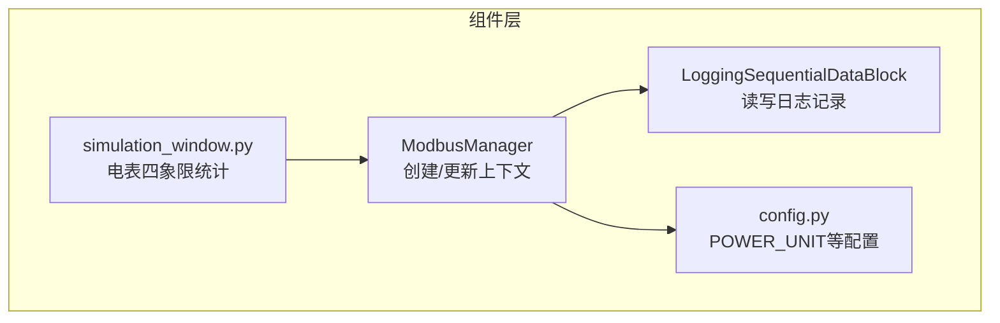
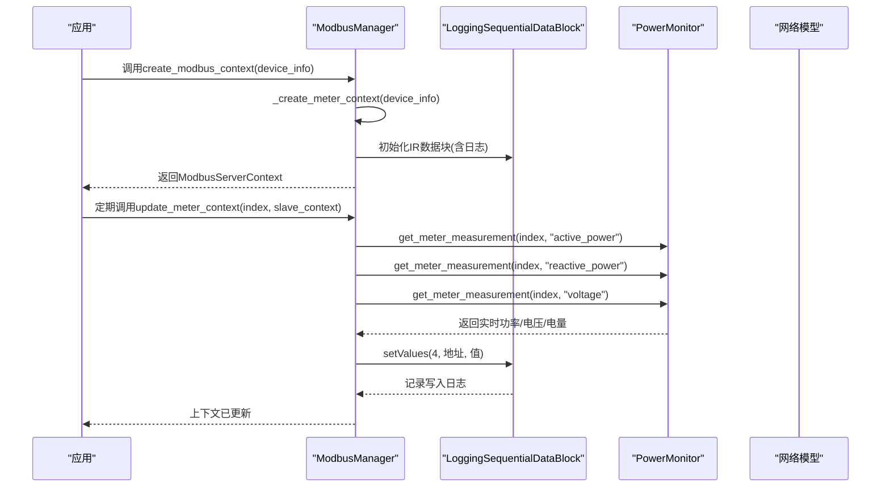
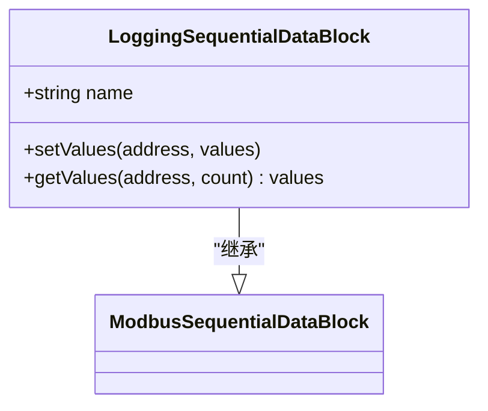
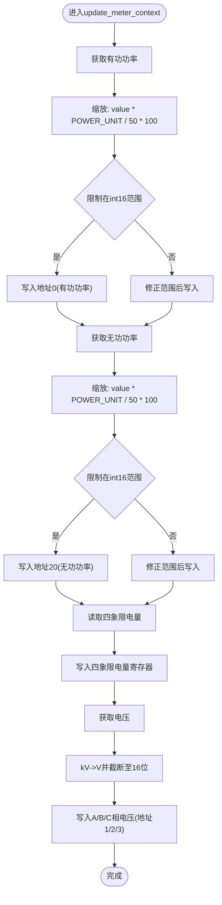
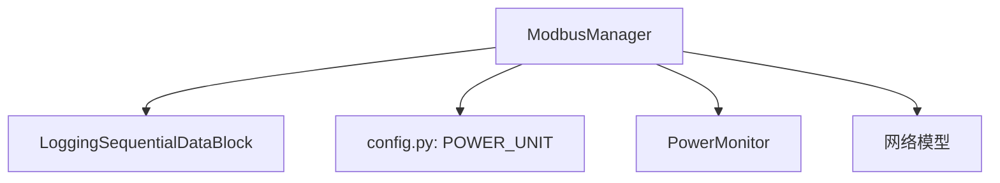

# 电表设备上下文创建

<cite>
**本文引用的文件**
- [modbus_manager.py](file://src/components/modbus_manager.py)
- [config.py](file://src/config.py)
- [simulation_window.py](file://src/components/simulation_window.py)
</cite>

## 目录
1. [简介](#简介)
2. [项目结构](#项目结构)
3. [核心组件](#核心组件)
4. [架构总览](#架构总览)
5. [详细组件分析](#详细组件分析)
6. [依赖关系分析](#依赖关系分析)
7. [性能考量](#性能考量)
8. [故障排查指南](#故障排查指南)
9. [结论](#结论)
10. [附录](#附录)

## 简介
本文件围绕电表设备的Modbus上下文创建与动态更新进行深入解析，重点覆盖以下内容：
- _create_meter_context方法如何为电表设备构建Modbus上下文，包括输入寄存器(IR)的地址布局与初始值设定。
- LoggingSequentialDataBlock的日志记录机制及其在读写操作中的应用。
- update_meter_context方法如何动态刷新功率、电压与电量数据，并解释数据缩放因子(POWER_UNIT/50*100)的计算逻辑。
- 提供完整的寄存器配置示例，帮助读者快速理解各寄存器的用途与数值范围。

## 项目结构
与电表上下文创建直接相关的代码位于组件层，主要涉及Modbus服务器管理器与配置模块：
- Modbus服务器管理器负责创建不同设备类型的上下文，其中电表上下文由_create_meter_context负责。
- 配置模块提供POWER_UNIT等关键参数，影响功率/电量等数值的缩放与转换。
- 模拟窗口中对电表数据的采集与统计逻辑，体现了电表四象限电量的维护方式。

**图表来源**
- [modbus_manager.py](file://src/components/modbus_manager.py#L25-L41)
- [config.py](file://src/config.py#L40-L45)
- [simulation_window.py](file://src/components/simulation_window.py#L2044-L2098)

**章节来源**
- [modbus_manager.py](file://src/components/modbus_manager.py#L25-L41)
- [config.py](file://src/config.py#L40-L45)

## 核心组件
- ModbusManager：负责为静态发电机、电表、储能、充电桩等设备创建Modbus上下文；电表上下文由_create_meter_context创建。
- LoggingSequentialDataBlock：在读取与写入时输出日志，便于调试与审计。
- POWER_UNIT：来自配置模块，用于功率/电量等数值的缩放转换。

**章节来源**
- [modbus_manager.py](file://src/components/modbus_manager.py#L25-L41)
- [config.py](file://src/config.py#L40-L45)

## 架构总览
电表上下文创建与更新的整体流程如下：
- 创建阶段：_create_meter_context为电表设备初始化输入寄存器数组，并封装为LoggingSequentialDataBlock，再组合为ModbusDeviceContext与ModbusServerContext。
- 运行阶段：update_meter_context周期性从PowerMonitor获取实时功率/电压/电量数据，结合POWER_UNIT与缩放因子进行转换，写入对应寄存器地址。

**图表来源**
- [modbus_manager.py](file://src/components/modbus_manager.py#L121-L142)
- [modbus_manager.py](file://src/components/modbus_manager.py#L211-L242)
- [modbus_manager.py](file://src/components/modbus_manager.py#L658-L722)

## 详细组件分析

### 1) _create_meter_context：电表上下文创建
- 输入寄存器(IR)布局与初始值
  - 地址0：有功功率（16位）
  - 地址1：A相电压（16位）
  - 地址2：B相电压（16位）
  - 地址3：C相电压（16位）
  - 地址4：A相电流（16位，原始值为高位）
  - 地址5：B相电流（16位，原始值为高位）
  - 地址6：C相电流（16位，原始值为高位）
  - 地址7：有功上网电量（16位）
  - 地址8：有功下网电量（16位）
  - 地址9：组合有功总电能（16位）
  - 地址10-14：无功/有功四象限电量（16位/32位）
  - 地址20：无功功率（16位）

- 关键实现要点
  - 使用LoggingSequentialDataBlock包装IR数组，便于读写日志记录。
  - 仅创建IR，未设置HR（保持寄存器），因此电表侧不暴露写入能力。
  - 通过常量METER_REG_*定义四象限电量与无功功率的寄存器偏移。

- 寄存器配置示例（地址与含义）
  - 0：有功功率（16位）
  - 1：A相电压（16位）
  - 2：B相电压（16位）
  - 3：C相电压（16位）
  - 4：A相电流（16位）
  - 5：B相电流（16位）
  - 6：C相电流（16位）
  - 7：有功上网电量（16位）
  - 8：有功下网电量（16位）
  - 9：组合有功总电能（16位）
  - 10：无功上网电量（16位）
  - 11：无功下网电量（16位）
  - 20：无功功率（16位）

- 说明
  - 该方法仅初始化IR数组与上下文，不进行数据写入；实际数据由update_meter_context周期性刷新。

**章节来源**
- [modbus_manager.py](file://src/components/modbus_manager.py#L211-L242)
- [modbus_manager.py](file://src/components/modbus_manager.py#L18-L24)

### 2) LoggingSequentialDataBlock：日志记录机制
- 作用
  - 在getValues与setValues时输出读写日志，便于追踪Modbus交互。
- 行为
  - 读取：记录地址、数量与返回值。
  - 写入：记录地址与写入值。
- 应用
  - 电表IR使用LoggingSequentialDataBlock，确保每次读写都被记录。

**图表来源**
- [modbus_manager.py](file://src/components/modbus_manager.py#L25-L41)

**章节来源**
- [modbus_manager.py](file://src/components/modbus_manager.py#L25-L41)

### 3) update_meter_context：动态更新功率、电压与电量
- 更新内容
  - 有功功率（地址0，16位）
  - 无功功率（地址20，16位）
  - 有功/无功四象限电量（地址7/8/10/11，16位；地址11-12/13-14为32位）
  - A/B/C相电压（地址1/2/3，16位）
- 数据来源
  - 从PowerMonitor获取实时测量值（active_power、reactive_power、voltage）。
- 数据缩放与转换
  - 有功/无功功率：raw = value × POWER_UNIT / 50 × 100，限制在int16范围后写入。
  - 电量：四象限电量按mwh/mvarh乘以POWER_UNIT/50并截断至16位。
  - 电压：kV转V后写入16位寄存器。
- 电压与电流的特殊说明
  - 电流寄存器在_create_meter_context中设置了高位值，但update_meter_context未更新这些寄存器；若需同步，应在update_meter_context中补充写入。

**图表来源**
- [modbus_manager.py](file://src/components/modbus_manager.py#L658-L722)
- [modbus_manager.py](file://src/components/modbus_manager.py#L18-L24)

**章节来源**
- [modbus_manager.py](file://src/components/modbus_manager.py#L658-L722)

### 4) 电表四象限电量统计与写入
- 四象限电量来源
  - 电表对象的active_export_mwh、active_import_mwh、reactive_export_mvarh、reactive_import_mvarh。
- 写入策略
  - 将电量按POWER_UNIT/50缩放后写入对应寄存器（16位）。
- 与模拟窗口的关系
  - 模拟窗口会根据功率方向累计四象限电量，确保与寄存器值一致。

**章节来源**
- [modbus_manager.py](file://src/components/modbus_manager.py#L692-L702)
- [simulation_window.py](file://src/components/simulation_window.py#L2044-L2098)

## 依赖关系分析
- ModbusManager依赖LoggingSequentialDataBlock实现IR日志记录。
- ModbusManager依赖config.py中的POWER_UNIT进行数值缩放。
- ModbusManager依赖PowerMonitor获取实时测量值。
- ModbusManager依赖网络模型中的电表数据进行四象限电量统计。

**图表来源**
- [modbus_manager.py](file://src/components/modbus_manager.py#L25-L41)
- [config.py](file://src/config.py#L40-L45)

**章节来源**
- [modbus_manager.py](file://src/components/modbus_manager.py#L25-L41)
- [config.py](file://src/config.py#L40-L45)

## 性能考量
- 读写日志：LoggingSequentialDataBlock在每次读写都会产生日志，建议在生产环境中控制日志级别，避免频繁I/O影响性能。
- 数据转换：update_meter_context对每个寄存器都进行缩放与范围限制，建议在高频更新场景中合并写入或减少不必要的寄存器写入。
- 电压与电流：若电流寄存器未在update_meter_context中更新，可能导致上位机读取到旧值，建议补充电流寄存器的写入逻辑。

[本节为一般性指导，无需具体文件分析]

## 故障排查指南
- 读写日志定位
  - 通过LoggingSequentialDataBlock输出的读写日志定位异常地址与值。
- 功率/电量异常
  - 检查POWER_UNIT配置是否正确，确认缩放因子与寄存器位宽匹配。
  - 核对update_meter_context中是否有遗漏的寄存器写入（如电流寄存器）。
- 电压值异常
  - 确认电压值从kV到V的转换逻辑与寄存器位宽限制。

**章节来源**
- [modbus_manager.py](file://src/components/modbus_manager.py#L25-L41)
- [modbus_manager.py](file://src/components/modbus_manager.py#L658-L722)

## 结论
- _create_meter_context为电表设备提供了清晰的IR布局与初始值，配合LoggingSequentialDataBlock实现了良好的读写审计。
- update_meter_context通过PowerMonitor提供的实时数据，结合POWER_UNIT与缩放因子，将功率、电压与电量写入对应寄存器。
- 若需完整同步电流寄存器，建议在update_meter_context中补充电流写入逻辑；同时注意日志开销与寄存器位宽限制。

[本节为总结性内容，无需具体文件分析]

## 附录

### A. 寄存器配置示例（地址与含义）
- 0：有功功率（16位）
- 1：A相电压（16位）
- 2：B相电压（16位）
- 3：C相电压（16位）
- 4：A相电流（16位）
- 5：B相电流（16位）
- 6：C相电流（16位）
- 7：有功上网电量（16位）
- 8：有功下网电量（16位）
- 9：组合有功总电能（16位）
- 10：无功上网电量（16位）
- 11：无功下网电量（16位）
- 20：无功功率（16位）

**章节来源**
- [modbus_manager.py](file://src/components/modbus_manager.py#L211-L242)
- [modbus_manager.py](file://src/components/modbus_manager.py#L18-L24)

### B. 数据缩放因子说明
- 有功/无功功率：value × POWER_UNIT / 50 × 100，限制在int16范围后写入。
- 电量：mwh/mvarh × POWER_UNIT / 50，截断至16位。
- 电压：kV × 1000 → V，截断至16位。

**章节来源**
- [modbus_manager.py](file://src/components/modbus_manager.py#L677-L718)
- [config.py](file://src/config.py#L40-L45)