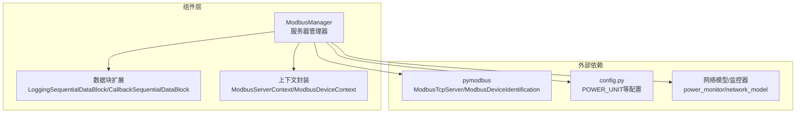
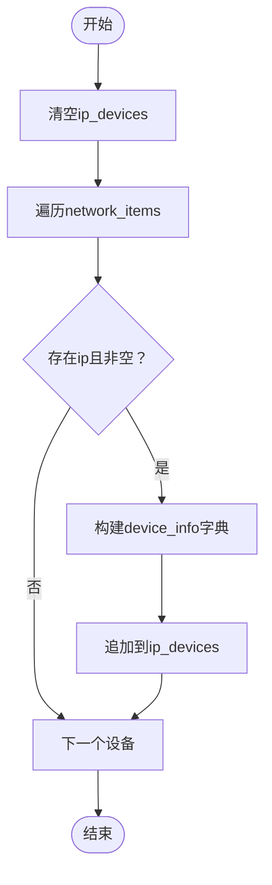
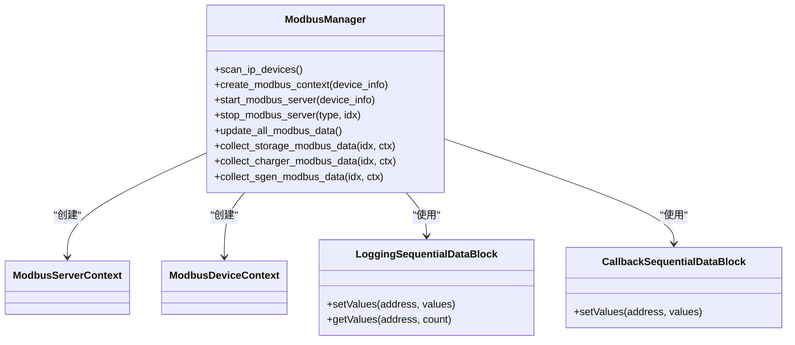
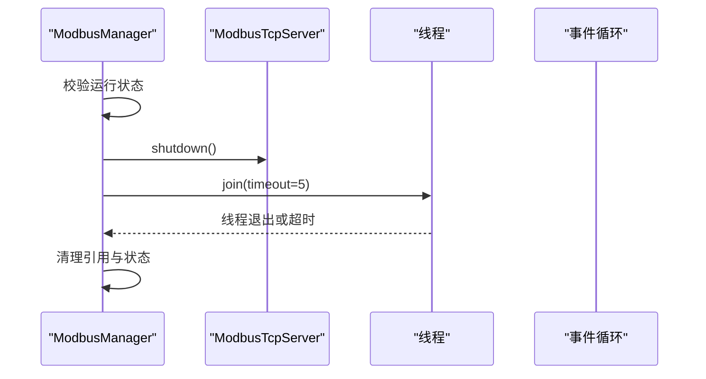
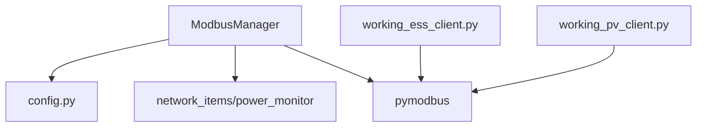

# Modbus服务器管理

<cite>
**本文引用的文件**
- [src/components/modbus_manager.py](file://src/components/modbus_manager.py)
- [src/config.py](file://src/config.py)
- [tests/working_ess_client.py](file://tests/working_ess_client.py)
- [tests/working_pv_client.py](file://tests/working_pv_client.py)
</cite>

## 目录
1. [简介](#简介)
2. [项目结构](#项目结构)
3. [核心组件](#核心组件)
4. [架构总览](#架构总览)
5. [详细组件分析](#详细组件分析)
6. [依赖关系分析](#依赖关系分析)
7. [性能考量](#性能考量)
8. [故障排查指南](#故障排查指南)
9. [结论](#结论)
10. [附录](#附录)

## 简介
本文件面向pp_tool项目中的ModbusManager类，系统化梳理其服务器管理能力，包括：
- 如何通过scan_ip_devices扫描网络中具备IP配置的设备（储能、光伏、电表、充电桩），并为每个设备生成独立的Modbus TCP服务器。
- start_modbus_server如何在独立线程中启动异步ModbusTcpServer，避免阻塞主线程，并优雅处理端口占用等异常。
- stop_modbus_server如何优雅关闭服务器并清理资源。
- ModbusServerContext、ModbusDeviceContext、ModbusSequentialDataBlock等pymodbus核心组件的使用方式与定制化扩展（LoggingSequentialDataBlock、CallbackSequentialDataBlock）。
- 提供可直接定位到代码位置的“代码级示例”路径，便于快速上手。

## 项目结构
ModbusManager位于src/components/modbus_manager.py，负责：
- 设备扫描与上下文创建
- 服务器启动与停止
- 数据更新与采集
- 资源清理与状态跟踪



图表来源
- [src/components/modbus_manager.py](file://src/components/modbus_manager.py#L1-L120)
- [src/config.py](file://src/config.py#L40-L120)

章节来源
- [src/components/modbus_manager.py](file://src/components/modbus_manager.py#L1-L120)
- [src/config.py](file://src/config.py#L40-L120)

## 核心组件
- ModbusManager：统一管理设备扫描、上下文创建、服务器生命周期、数据更新与采集。
- LoggingSequentialDataBlock/LoggingSparseDataBlock：带日志记录的Modbus数据块，便于调试与审计。
- CallbackSequentialDataBlock：在写操作时触发回调，用于响应设备控制命令（如光伏无功补偿模式切换）。
- ModbusServerContext/ModbusDeviceContext：pymodbus上下文封装，按设备类型定制寄存器布局与读写行为。
- ModbusTcpServer：异步TCP服务器，由ModbusManager在独立线程中启动。

章节来源
- [src/components/modbus_manager.py](file://src/components/modbus_manager.py#L1-L120)
- [src/components/modbus_manager.py](file://src/components/modbus_manager.py#L121-L243)
- [src/components/modbus_manager.py](file://src/components/modbus_manager.py#L505-L657)

## 架构总览
ModbusManager围绕“设备扫描—上下文创建—服务器启动—数据更新—服务器停止”的闭环工作流展开，采用异步事件循环与独立线程隔离，确保主线程不被阻塞。

```mermaid
sequenceDiagram
participant UI as "调用方"
participant MM as "ModbusManager"
participant CTX as "ModbusServerContext"
participant Srv as "ModbusTcpServer"
participant Th as "线程"
participant Loop as "事件循环"
UI->>MM : 调用 start_modbus_server(device_info)
MM->>MM : create_modbus_context(device_info)
MM->>CTX : 构建设备上下文(按类型定制)
MM->>Srv : 创建ModbusTcpServer(context, identity, address)
MM->>Th : 在独立线程中运行
Th->>Loop : 新建事件循环
Loop->>Srv : serve_forever()
Srv-->>UI : 服务器监听中
Note over MM,Srv : 端口占用等异常在启动阶段捕获
```

图表来源
- [src/components/modbus_manager.py](file://src/components/modbus_manager.py#L505-L657)

章节来源
- [src/components/modbus_manager.py](file://src/components/modbus_manager.py#L505-L657)

## 详细组件分析

### 设备扫描：scan_ip_devices
- 功能：遍历全局网络项，筛选具备“ip”属性的设备，生成设备信息列表（含类型、索引、名称、端口、额定功率等）。
- 输出：self.ip_devices，用于后续批量启动服务器。



图表来源
- [src/components/modbus_manager.py](file://src/components/modbus_manager.py#L84-L119)

章节来源
- [src/components/modbus_manager.py](file://src/components/modbus_manager.py#L84-L119)

### 上下文创建：create_modbus_context 与设备专用上下文
- 根据设备类型（static_generator/meter/storage/charger）创建定制化Modbus上下文：
  - static_generator：光伏上下文，包含输入寄存器（如SN、今日/总发电量、当前功率、无功功率）与保持寄存器（如开关机、功率限制、无功补偿百分比、功率因数）。
  - meter：电表上下文，包含电压、电流、有功/无功功率、有功/无功电量等。
  - storage：储能上下文，包含SOC、额定容量、最大充放电功率、日/累计电量、三相电流、有功功率、PCS工作模式（并网/离网）、充放电状态等。
  - charger：充电桩上下文，包含有功功率、需求功率、额定功率、枪状态等。
- 数据块扩展：
  - LoggingSequentialDataBlock/LoggingSparseDataBlock：在读写时记录日志，便于调试。
  - CallbackSequentialDataBlock：写入回调用于响应控制命令（如光伏无功补偿模式切换）。



图表来源
- [src/components/modbus_manager.py](file://src/components/modbus_manager.py#L121-L243)
- [src/components/modbus_manager.py](file://src/components/modbus_manager.py#L244-L422)
- [src/components/modbus_manager.py](file://src/components/modbus_manager.py#L423-L504)

章节来源
- [src/components/modbus_manager.py](file://src/components/modbus_manager.py#L121-L243)
- [src/components/modbus_manager.py](file://src/components/modbus_manager.py#L244-L422)
- [src/components/modbus_manager.py](file://src/components/modbus_manager.py#L423-L504)

### 服务器启动：start_modbus_server
- 关键流程：
  - 校验设备是否已在运行，避免重复启动。
  - 创建Modbus上下文与设备标识（VendorName/ProductCode/ProductName/ModelName/MajorMinorRevision）。
  - 在独立线程中创建事件循环，构造ModbusTcpServer并调用serve_forever，避免阻塞主线程。
  - 使用Event等待服务器实例创建完成，记录线程与服务器引用，更新运行状态。
  - 异常处理：捕获OSError（如端口占用），记录日志并清理上下文引用。
- 端口占用处理：当OSError错误码为端口占用时，记录告警并返回失败。

```mermaid
sequenceDiagram
participant MM as "ModbusManager"
participant Th as "线程"
participant Loop as "事件循环"
participant Srv as "ModbusTcpServer"
MM->>MM : 校验重复启动
MM->>MM : create_modbus_context()
MM->>Th : 启动独立线程
Th->>Loop : new_event_loop()
Loop->>Srv : ModbusTcpServer(context, identity, address)
Loop->>Srv : serve_forever()
Srv-->>MM : 服务器已启动
Note over MM,Srv : 若端口占用，捕获OSError并清理
```

图表来源
- [src/components/modbus_manager.py](file://src/components/modbus_manager.py#L505-L657)

章节来源
- [src/components/modbus_manager.py](file://src/components/modbus_manager.py#L505-L657)

### 服务器停止：stop_modbus_server
- 关键流程：
  - 校验设备是否在运行，若不在则返回失败。
  - 获取服务器实例与线程，调用服务器shutdown进行优雅关闭。
  - 等待线程退出（最多5秒），若超时记录告警。
  - 清理运行状态、服务器引用与上下文引用，更新设备通信状态为False。
- 注意：stop_modbus_server会主动关闭服务器，避免资源泄漏。



图表来源
- [src/components/modbus_manager.py](file://src/components/modbus_manager.py#L609-L657)

章节来源
- [src/components/modbus_manager.py](file://src/components/modbus_manager.py#L609-L657)

### 数据更新与采集
- update_all_modbus_data：遍历ip_devices，按设备类型调用对应更新函数（电表、光伏、储能、充电桩），将网络模型中的实时数据写入Modbus上下文。
- update_meter_context/update_sgen_context/update_storage_context/update_charger_context：针对不同设备类型，将功率、电量、状态、参数等写入对应寄存器。
- collect_*_modbus_data：从保持寄存器读取控制命令（如功率限制、开关机、并网/离网、无功补偿模式等），用于上层控制逻辑。

章节来源
- [src/components/modbus_manager.py](file://src/components/modbus_manager.py#L658-L800)
- [src/components/modbus_manager.py](file://src/components/modbus_manager.py#L800-L975)
- [src/components/modbus_manager.py](file://src/components/modbus_manager.py#L1025-L1162)
- [src/components/modbus_manager.py](file://src/components/modbus_manager.py#L1163-L1284)

### 实际操作示例（代码级路径）
以下示例均提供“代码级示例”路径，便于直接定位到实现位置：
- 为一个储能设备启动其专用Modbus服务器
  - 路径：[start_modbus_server](file://src/components/modbus_manager.py#L505-L657)
  - 步骤要点：先scan_ip_devices获取设备信息，再调用start_modbus_server，注意端口占用异常处理。
- 为一个光伏设备启动其专用Modbus服务器
  - 路径：[start_modbus_server](file://src/components/modbus_manager.py#L505-L657)
  - 上下文创建：[create_modbus_context/_create_sgen_context](file://src/components/modbus_manager.py#L121-L243)
- 优雅关闭服务器并清理资源
  - 路径：[stop_modbus_server](file://src/components/modbus_manager.py#L609-L657)
- 处理端口占用异常
  - 路径：[start_modbus_server异常分支](file://src/components/modbus_manager.py#L596-L607)
- 读取/写入设备控制命令（如光伏无功补偿百分比）
  - 路径：[collect_sgen_modbus_data/_on_sgen_hold_write](file://src/components/modbus_manager.py#L1190-L1284)

章节来源
- [src/components/modbus_manager.py](file://src/components/modbus_manager.py#L505-L657)
- [src/components/modbus_manager.py](file://src/components/modbus_manager.py#L1190-L1284)

## 依赖关系分析
- 内部依赖
  - ModbusManager依赖config.py中的POWER_UNIT进行功率单位换算。
  - ModbusManager依赖network_items与power_monitor获取设备状态与实时测量值。
- 外部依赖
  - pymodbus：ModbusTcpServer、ModbusDeviceIdentification、ModbusServerContext、ModbusDeviceContext、ModbusSequentialDataBlock/ModbusSparseDataBlock。
- 测试验证
  - working_ess_client.py与working_pv_client.py展示了多设备端口连接、寄存器读取与控制命令写入的实际用法，可用于验证ModbusManager输出的一致性。



图表来源
- [src/components/modbus_manager.py](file://src/components/modbus_manager.py#L1-L120)
- [src/config.py](file://src/config.py#L40-L120)
- [tests/working_ess_client.py](file://tests/working_ess_client.py#L1-L120)
- [tests/working_pv_client.py](file://tests/working_pv_client.py#L1-L120)

章节来源
- [src/components/modbus_manager.py](file://src/components/modbus_manager.py#L1-L120)
- [src/config.py](file://src/config.py#L40-L120)
- [tests/working_ess_client.py](file://tests/working_ess_client.py#L1-L120)
- [tests/working_pv_client.py](file://tests/working_pv_client.py#L1-L120)

## 性能考量
- 异步事件循环与独立线程：服务器在独立线程中运行，避免阻塞主线程，适合多设备并发场景。
- 数据块日志：LoggingSequentialDataBlock/LoggingSparseDataBlock在读写时记录日志，便于调试，但在高并发场景建议适度降低日志级别或关闭。
- 寄存器更新策略：update_all_modbus_data按需更新，避免对未运行设备进行无效操作。
- 资源清理：stop_all_modbus_servers与cleanup确保在异常情况下也能释放资源，防止内存泄漏。

[本节为通用指导，无需列出具体文件来源]

## 故障排查指南
- 端口占用
  - 现象：启动服务器时报错，提示端口已被占用。
  - 排查：确认目标端口是否被其他进程占用；修改设备端口或释放占用进程。
  - 参考路径：[start_modbus_server异常处理](file://src/components/modbus_manager.py#L596-L607)
- 服务器未运行
  - 现象：stop_modbus_server返回失败，提示设备未运行。
  - 排查：确认设备是否已启动；检查running_services与modbus_servers状态。
  - 参考路径：[stop_modbus_server校验逻辑](file://src/components/modbus_manager.py#L609-L630)
- 数据未更新
  - 现象：客户端读取到的数据未随仿真变化。
  - 排查：确认update_all_modbus_data是否被周期性调用；检查设备类型匹配与索引有效性。
  - 参考路径：[update_all_modbus_data](file://src/components/modbus_manager.py#L1025-L1069)
- 控制命令未生效
  - 现象：写入保持寄存器后设备未响应。
  - 排查：确认写入地址与数值范围；检查CallbackSequentialDataBlock回调是否触发。
  - 参考路径：[CallbackSequentialDataBlock/_on_sgen_hold_write](file://src/components/modbus_manager.py#L57-L68)

章节来源
- [src/components/modbus_manager.py](file://src/components/modbus_manager.py#L596-L607)
- [src/components/modbus_manager.py](file://src/components/modbus_manager.py#L609-L630)
- [src/components/modbus_manager.py](file://src/components/modbus_manager.py#L1025-L1069)
- [src/components/modbus_manager.py](file://src/components/modbus_manager.py#L57-L68)

## 结论
ModbusManager通过“设备扫描—上下文定制—异步服务器—数据更新—优雅关闭”的完整链路，实现了对多种设备类型的Modbus服务器管理。其关键优势在于：
- 以设备类型为维度的上下文定制，满足不同设备的寄存器布局与控制语义。
- 通过独立线程与事件循环隔离，保证主线程稳定。
- 完善的异常处理与资源清理，提升系统可靠性。
- 提供丰富的采集与控制接口，便于上层业务集成。

[本节为总结性内容，无需列出具体文件来源]

## 附录
- 代码级示例路径清单
  - 设备扫描：[scan_ip_devices](file://src/components/modbus_manager.py#L84-L119)
  - 上下文创建（光伏）：[create_modbus_context/_create_sgen_context](file://src/components/modbus_manager.py#L121-L243)
  - 上下文创建（电表）：[create_modbus_context/_create_meter_context](file://src/components/modbus_manager.py#L211-L242)
  - 上下文创建（储能）：[create_modbus_context/_create_storage_context](file://src/components/modbus_manager.py#L244-L315)
  - 上下文创建（充电桩）：[create_modbus_context/_create_charger_context](file://src/components/modbus_manager.py#L377-L422)
  - 服务器启动：[start_modbus_server](file://src/components/modbus_manager.py#L505-L657)
  - 服务器停止：[stop_modbus_server](file://src/components/modbus_manager.py#L609-L657)
  - 数据更新（电表/光伏/储能/充电桩）：[update_*_context](file://src/components/modbus_manager.py#L658-L975)
  - 数据采集（控制命令）：[collect_*_modbus_data](file://src/components/modbus_manager.py#L1071-L1284)
  - 端口占用异常处理：[start_modbus_server异常分支](file://src/components/modbus_manager.py#L596-L607)
  - 功率单位配置：[config.py POWER_UNIT](file://src/config.py#L40-L120)
  - 测试客户端（多储能/多光伏）：[working_ess_client.py](file://tests/working_ess_client.py#L1-L271), [working_pv_client.py](file://tests/working_pv_client.py#L1-L161)