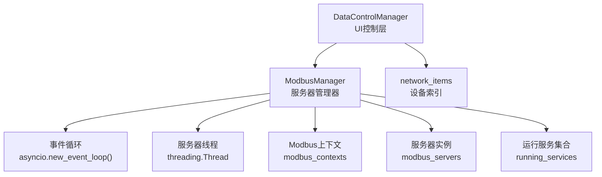
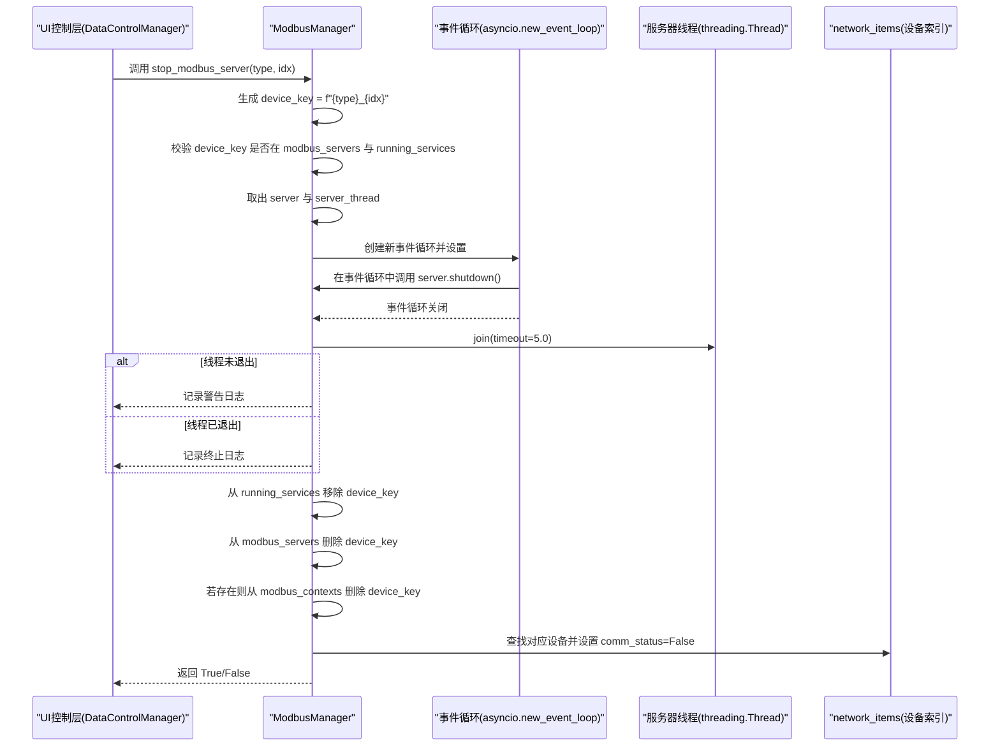
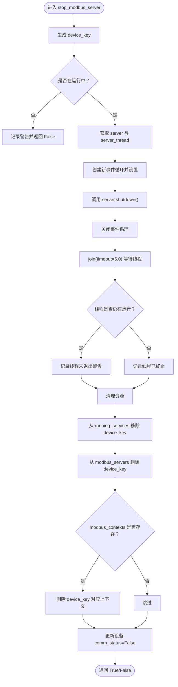
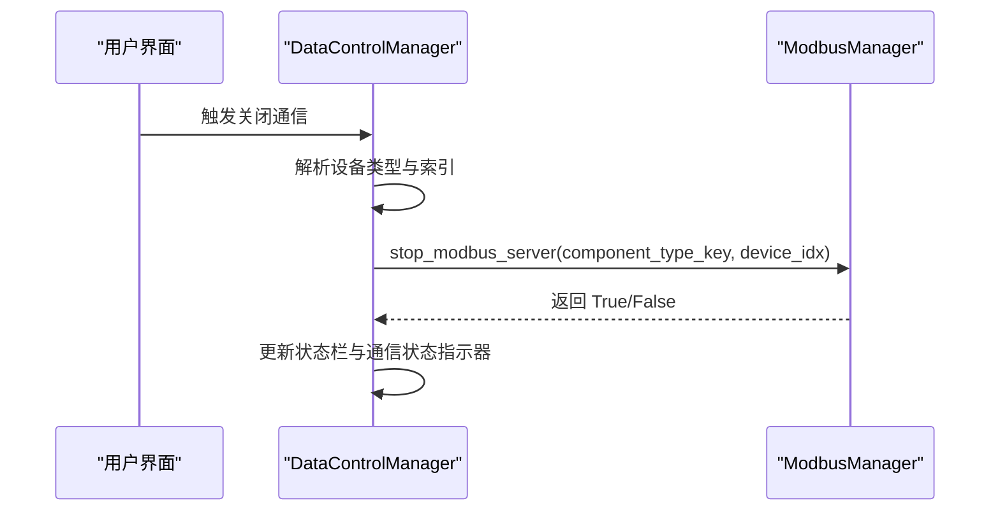
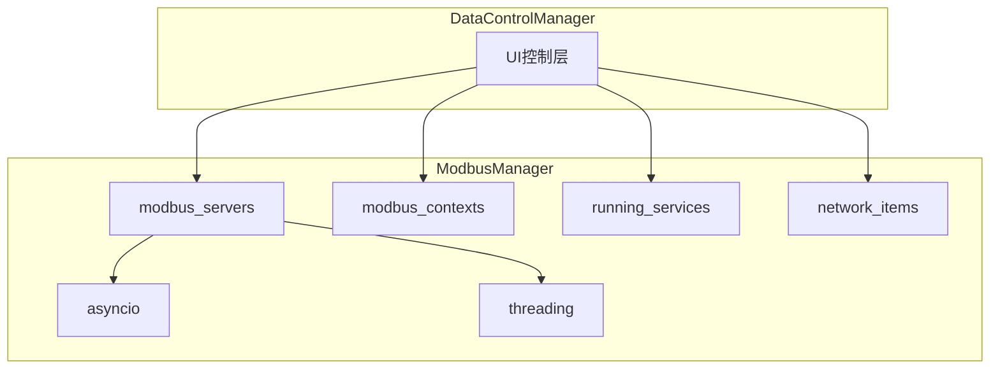

# 服务器停止流程

<cite>
**本文引用的文件**
- [src/components/modbus_manager.py](file://src/components/modbus_manager.py)
- [src/components/data_control.py](file://src/components/data_control.py)
- [tests/working_pv_client.py](file://tests/working_pv_client.py)
</cite>

## 目录
1. [简介](#简介)
2. [项目结构](#项目结构)
3. [核心组件](#核心组件)
4. [架构总览](#架构总览)
5. [详细组件分析](#详细组件分析)
6. [依赖关系分析](#依赖关系分析)
7. [性能考量](#性能考量)
8. [故障排查指南](#故障排查指南)
9. [结论](#结论)

## 简介
本文件围绕 ModbusManager 中 stop_modbus_server 方法的完整执行流程展开，重点说明：
- 如何通过设备类型与索引定位到正确的服务器实例；
- 使用 asyncio.new_event_loop() 创建新的事件循环来调用服务器的异步 shutdown() 实现优雅关闭；
- 线程清理机制：join(timeout=5.0) 等待服务器线程终止及未正常退出的警告处理；
- 停止过程中的资源释放：从 modbus_servers 字典删除服务器引用、从 modbus_contexts 清除上下文、从 running_services 移除服务标识；
- 服务器停止后设备通信状态（comm_status）的同步更新机制；
- 提供安全停止一个光伏设备 Modbus 服务并验证其状态的实践建议。

## 项目结构
与“服务器停止流程”直接相关的文件与职责如下：
- src/components/modbus_manager.py：实现 ModbusManager 类，包含 start_modbus_server 与 stop_modbus_server 等关键方法；维护 modbus_servers、modbus_contexts、running_services 三个核心集合；负责设备上下文创建与通信状态更新。
- src/components/data_control.py：UI 控制层，封装了设备启停通信的入口，其中 on_device_power_off 调用 stop_modbus_server 并更新 UI 通信状态指示器。
- tests/working_pv_client.py：测试脚本，演示如何连接并读取多个光伏设备的 Modbus 数据，可用于验证停止后通信状态变化。

图表来源
- [src/components/modbus_manager.py](file://src/components/modbus_manager.py#L609-L656)
- [src/components/data_control.py](file://src/components/data_control.py#L105-L159)

章节来源
- [src/components/modbus_manager.py](file://src/components/modbus_manager.py#L609-L656)
- [src/components/data_control.py](file://src/components/data_control.py#L105-L159)

## 核心组件
- ModbusManager：统一管理各设备类型的 Modbus 服务器生命周期，负责上下文创建、服务器启动与停止、运行状态跟踪与通信状态更新。
- DataControlManager：面向 UI 的控制层，封装设备启停通信的调用与状态指示器更新。
- 测试客户端 MultiPVClient：用于验证服务器停止后的通信状态变化。

章节来源
- [src/components/modbus_manager.py](file://src/components/modbus_manager.py#L609-L656)
- [src/components/data_control.py](file://src/components/data_control.py#L105-L159)
- [tests/working_pv_client.py](file://tests/working_pv_client.py#L1-L161)

## 架构总览
下图展示了 stop_modbus_server 的关键交互路径：定位服务器实例、在新事件循环中优雅关闭、等待线程退出、清理资源并更新设备通信状态。

图表来源
- [src/components/modbus_manager.py](file://src/components/modbus_manager.py#L609-L656)
- [src/components/data_control.py](file://src/components/data_control.py#L130-L153)

章节来源
- [src/components/modbus_manager.py](file://src/components/modbus_manager.py#L609-L656)
- [src/components/data_control.py](file://src/components/data_control.py#L130-L153)

## 详细组件分析

### stop_modbus_server 方法执行流程详解
- 定位服务器实例
  - 通过 device_type 与 device_idx 组合生成 device_key；
  - 校验 device_key 是否同时存在于 modbus_servers 与 running_services，若不存在则直接返回 False 并记录警告。
- 优雅关闭服务器
  - 从 modbus_servers 中取出 server 与 server_thread；
  - 使用 asyncio.new_event_loop() 创建新的事件循环，设置为当前事件循环；
  - 在事件循环中调用 server.shutdown()，实现异步服务器的优雅关闭；
  - 关闭事件循环。
- 线程清理与超时等待
  - 使用 server_thread.join(timeout=5.0) 等待线程结束；
  - 若线程仍存活，记录警告日志；否则记录终止日志。
- 资源释放
  - 从 running_services 中移除 device_key；
  - 从 modbus_servers 中删除 device_key；
  - 若 device_key 存在于 modbus_contexts，则一并删除。
- 设备通信状态同步更新
  - 通过传入的 device_type 与 device_idx 直接在 network_items 中查找对应设备；
  - 若设备存在且具备 comm_status 属性，则将其置为 False，并记录调试日志。

图表来源
- [src/components/modbus_manager.py](file://src/components/modbus_manager.py#L609-L656)

章节来源
- [src/components/modbus_manager.py](file://src/components/modbus_manager.py#L609-L656)

### 与 UI 控制层的集成
- DataControlManager.on_device_power_off 调用 stop_modbus_server，并根据返回结果更新状态栏与通信状态指示器；
- 该方法会将前端设备类型映射为内部组件类型键名（如 'sgen' -> 'static_generator'），然后调用 stop_modbus_server。

图表来源
- [src/components/data_control.py](file://src/components/data_control.py#L105-L159)
- [src/components/modbus_manager.py](file://src/components/modbus_manager.py#L609-L656)

章节来源
- [src/components/data_control.py](file://src/components/data_control.py#L105-L159)

### 服务器启动与停止的对比要点
- 启动时在独立线程中创建事件循环并运行 ModbusTcpServer.serve_forever()，并在事件循环中调用 server.shutdown() 实现优雅关闭；
- 停止时同样在新事件循环中调用 server.shutdown()，确保与启动时一致的优雅关闭语义；
- 启动与停止均通过 modbus_servers、modbus_contexts、running_services 三个集合进行资源管理与状态跟踪。

章节来源
- [src/components/modbus_manager.py](file://src/components/modbus_manager.py#L505-L608)
- [src/components/modbus_manager.py](file://src/components/modbus_manager.py#L609-L656)

### 光伏设备通信状态验证建议
- 停止前：使用 MultiPVClient 连接并读取若干光伏设备端口，确认通信正常；
- 停止后：再次尝试读取或连接，预期出现连接失败或读取异常；
- UI 验证：在 DataControlManager 中查看通信状态指示器是否由“已连接”变为“未连接”。

章节来源
- [tests/working_pv_client.py](file://tests/working_pv_client.py#L1-L161)
- [src/components/data_control.py](file://src/components/data_control.py#L238-L295)

## 依赖关系分析
- ModbusManager 依赖：
  - asyncio：用于创建与运行事件循环；
  - threading：用于启动服务器线程与 join 等待；
  - network_items：用于定位设备并更新 comm_status；
  - modbus_contexts、modbus_servers、running_services：用于资源管理与状态跟踪。
- DataControlManager 依赖 ModbusManager 提供的启停接口，并负责 UI 状态反馈。

图表来源
- [src/components/modbus_manager.py](file://src/components/modbus_manager.py#L68-L120)
- [src/components/data_control.py](file://src/components/data_control.py#L105-L159)

章节来源
- [src/components/modbus_manager.py](file://src/components/modbus_manager.py#L68-L120)
- [src/components/data_control.py](file://src/components/data_control.py#L105-L159)

## 性能考量
- 事件循环创建成本：每次停止都创建新的事件循环，属于轻量开销；但频繁启停时建议评估是否可复用事件循环（需谨慎处理跨线程共享问题）。
- join 超时：timeout=5.0 秒的等待时间可避免长时间阻塞，但过短可能导致误报“未退出”，过长影响 UI 响应；可根据部署环境调整。
- 资源清理：及时从 running_services、modbus_servers、modbus_contexts 中移除引用，避免内存泄漏与悬挂引用。

## 故障排查指南
- 设备未运行
  - 现象：返回 False 并记录警告；
  - 排查：确认 device_key 是否存在于 running_services 与 modbus_servers。
- 服务器线程未退出
  - 现象：记录“服务器线程未正常退出”警告；
  - 排查：检查服务器 shutdown 是否被正确调用，确认事件循环已关闭；必要时延长 join 超时或检查外部阻塞。
- 通信状态未更新
  - 现象：UI 仍显示“已连接”；
  - 排查：确认 device_type 与 device_idx 映射正确，network_items 中设备存在且具备 comm_status 属性。
- 资源未释放
  - 现象：多次启停后内存增长或句柄泄露；
  - 排查：确认 stop_modbus_server 中已从 running_services、modbus_servers、modbus_contexts 移除对应项。

章节来源
- [src/components/modbus_manager.py](file://src/components/modbus_manager.py#L609-L656)
- [src/components/data_control.py](file://src/components/data_control.py#L130-L153)

## 结论
stop_modbus_server 通过“设备类型+索引”定位服务器实例，使用独立事件循环调用 server.shutdown() 实现优雅关闭，并结合线程 join 与资源清理，最终同步更新设备通信状态。配合 DataControlManager 的 UI 反馈与 MultiPVClient 的通信验证，可形成一套可靠的服务器启停闭环。建议在生产环境中关注 join 超时与资源清理的健壮性，确保系统稳定运行。