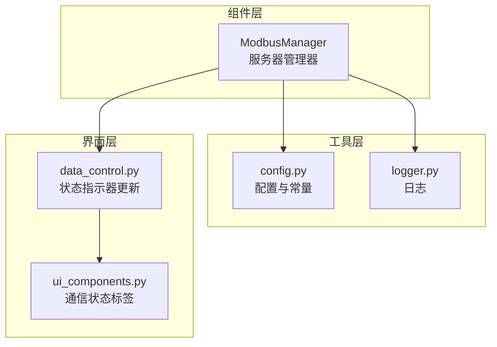
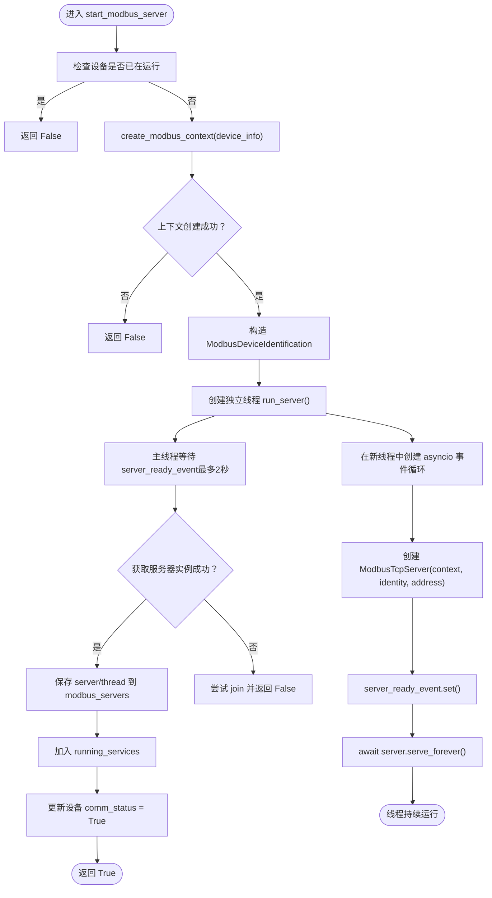
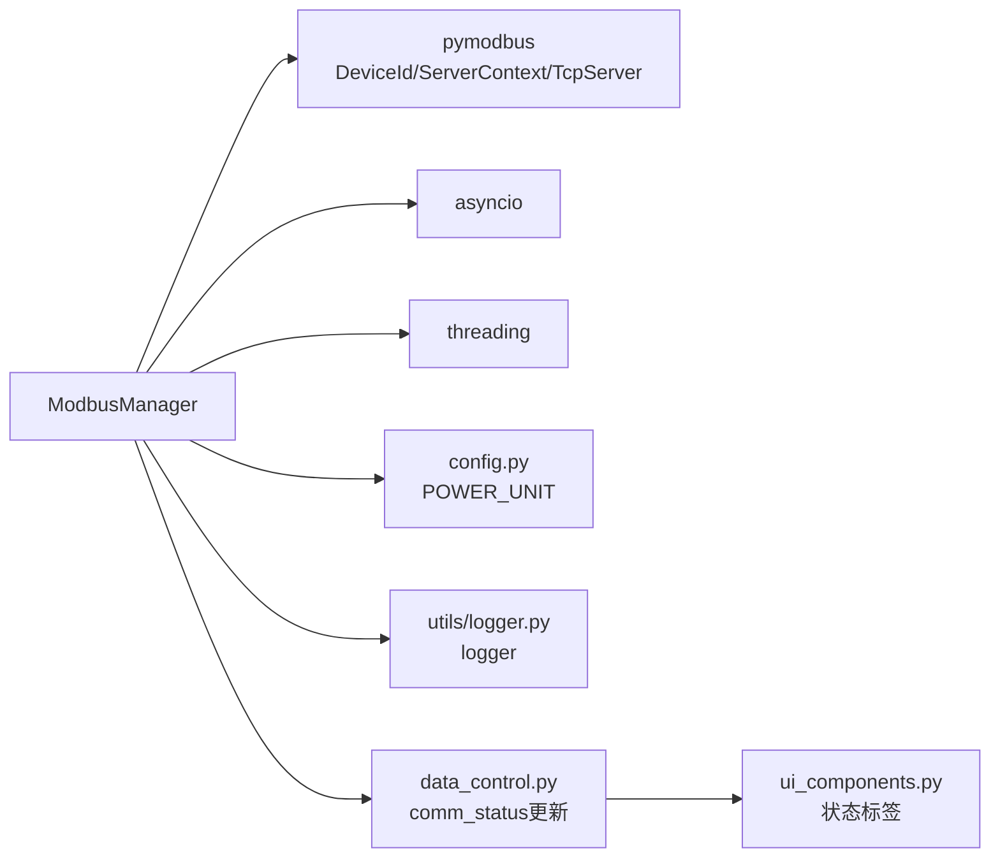

# 服务器启动流程

<cite>
**本文引用的文件**
- [modbus_manager.py](file://src/components/modbus_manager.py)
- [config.py](file://src/config.py)
- [logger.py](file://src/utils/logger.py)
- [data_control.py](file://src/components/data_control.py)
- [ui_components.py](file://src/components/ui_components.py)
</cite>

## 目录
1. [简介](#简介)
2. [项目结构](#项目结构)
3. [核心组件](#核心组件)
4. [架构总览](#架构总览)
5. [详细组件分析](#详细组件分析)
6. [依赖关系分析](#依赖关系分析)
7. [性能考量](#性能考量)
8. [故障排查指南](#故障排查指南)
9. [结论](#结论)
10. [附录](#附录)

## 简介
本文件围绕 ModbusManager 中的 start_modbus_server 方法，系统梳理其完整执行流程，包括：
- 如何通过 scan_ip_devices 识别可启动的设备；
- 如何创建 Modbus 数据上下文（ModbusServerContext）并初始化设备寄存器映射；
- 在独立线程中创建 asyncio 事件循环以避免阻塞 GUI 主线程；
- server_ready_event 事件对象如何确保线程安全地传递服务器实例；
- ModbusDeviceIdentification 设备标识的配置；
- 对端口占用（OSError 10048）等异常的捕获与处理策略；
- 服务器状态（running_services）与设备通信状态（comm_status）的同步更新机制；
- 提供安全启动储能设备 Modbus 服务并验证其状态的操作建议。

## 项目结构
本项目采用“组件化 + 层次化”的组织方式，Modbus 管理器位于组件层，配置与日志位于工具层，UI 控件与状态显示位于界面层。ModbusManager 作为核心控制器，负责设备发现、上下文构建、服务器启动与停止、状态同步与数据更新。



图表来源
- [modbus_manager.py](file://src/components/modbus_manager.py#L1-L120)
- [config.py](file://src/config.py#L1-L120)
- [logger.py](file://src/utils/logger.py#L1-L108)
- [data_control.py](file://src/components/data_control.py#L252-L285)
- [ui_components.py](file://src/components/ui_components.py#L237-L258)

章节来源
- [modbus_manager.py](file://src/components/modbus_manager.py#L1-L120)
- [config.py](file://src/config.py#L1-L120)
- [logger.py](file://src/utils/logger.py#L1-L108)
- [data_control.py](file://src/components/data_control.py#L252-L285)
- [ui_components.py](file://src/components/ui_components.py#L237-L258)

## 核心组件
- ModbusManager：负责设备扫描、上下文创建、服务器启动/停止、状态同步与数据更新。
- ModbusServerContext：封装设备的寄存器映射与数据块，按设备类型定制。
- ModbusDeviceIdentification：配置设备标识信息（厂商、产品代码、型号、版本等）。
- asyncio + threading：在独立线程中运行事件循环，避免阻塞 GUI 主线程。
- server_ready_event：线程间同步事件，确保主线程在服务器实例可用后再继续。
- running_services：跟踪运行中的服务集合；设备项的 comm_status：反映设备通信状态。

章节来源
- [modbus_manager.py](file://src/components/modbus_manager.py#L505-L608)
- [modbus_manager.py](file://src/components/modbus_manager.py#L121-L243)
- [modbus_manager.py](file://src/components/modbus_manager.py#L521-L594)

## 架构总览
下图展示了 start_modbus_server 的整体调用链与线程交互：

```mermaid
sequenceDiagram
participant Caller as "调用方"
participant MM as "ModbusManager"
participant CTX as "ModbusServerContext"
participant ID as "ModbusDeviceIdentification"
participant TH as "线程(Thread)"
participant EV as "server_ready_event"
participant LOOP as "asyncio事件循环"
participant SVR as "ModbusTcpServer"
Caller->>MM : 调用 start_modbus_server(device_info)
MM->>MM : scan_ip_devices()如需批量启动
MM->>CTX : create_modbus_context(device_info)
MM->>ID : 构造设备标识
MM->>TH : 创建并启动线程(run_server)
TH->>LOOP : new_event_loop()/set_event_loop()
TH->>SVR : 在事件循环中创建 ModbusTcpServer(context, identity, address)
TH->>EV : set() 通知主线程
TH->>SVR : await server.serve_forever()
Caller->>EV : wait(timeout=2.0)
EV-->>Caller : 服务器实例可用
Caller->>MM : 继续保存 server/thread 并加入 running_services
MM->>MM : 更新设备 comm_status = True
MM-->>Caller : 返回 True
```

图表来源
- [modbus_manager.py](file://src/components/modbus_manager.py#L505-L608)
- [modbus_manager.py](file://src/components/modbus_manager.py#L521-L594)

## 详细组件分析

### start_modbus_server 完整执行流程
- 设备去重与校验：若设备已在运行或已注册，直接返回 False。
- 上下文创建：调用 create_modbus_context 为设备类型定制寄存器映射，返回 ModbusServerContext。
- 设备标识：构造 ModbusDeviceIdentification，填充厂商、产品代码、产品名称、型号、主次版本等。
- 线程与事件循环：
  - 在独立线程中创建 asyncio 事件循环；
  - 在事件循环内创建 ModbusTcpServer，绑定 context、identity 与 address；
  - 通过 server_ready_event.set() 通知主线程；
  - 事件循环中 await server.serve_forever() 保持服务运行。
- 主线程同步：等待 server_ready_event（最多 2 秒），获取线程中的服务器实例，保存至 modbus_servers，并加入 running_services。
- 状态更新：尝试将对应设备项的 comm_status 设为 True。
- 异常处理：捕获 OSError（含端口占用 10048）、其他异常，必要时回滚 running_services 与 modbus_contexts。



图表来源
- [modbus_manager.py](file://src/components/modbus_manager.py#L505-L608)
- [modbus_manager.py](file://src/components/modbus_manager.py#L521-L594)

章节来源
- [modbus_manager.py](file://src/components/modbus_manager.py#L505-L608)

### scan_ip_devices：可启动设备识别
- 遍历全局 network_items，筛选具备 ip 属性且非空的设备；
- 生成 device_info 字典，包含 type、index、name、sn、ip、port、功率与容量等；
- 清空并重建 ip_devices 列表，便于后续批量启动。

章节来源
- [modbus_manager.py](file://src/components/modbus_manager.py#L84-L119)

### create_modbus_context 与设备寄存器映射
- 根据设备类型（static_generator/meter/storage/charger/default）创建定制上下文；
- 每类设备均使用 ModbusSequentialDataBlock 或 SparseDataBlock 组织寄存器映射；
- 通过 LoggingSequentialDataBlock/CallbackSequentialDataBlock 记录读写日志与回调处理；
- 部分设备在上下文中写入初始配置（如光伏 SN、储能额定参数、充电桩额定功率与枪状态）。

章节来源
- [modbus_manager.py](file://src/components/modbus_manager.py#L121-L243)
- [modbus_manager.py](file://src/components/modbus_manager.py#L244-L315)
- [modbus_manager.py](file://src/components/modbus_manager.py#L316-L451)
- [modbus_manager.py](file://src/components/modbus_manager.py#L452-L467)

### ModbusDeviceIdentification 配置
- 设置 VendorName、ProductCode、ProductName、ModelName、MajorMinorRevision；
- 用于客户端查询设备标识时返回标准信息。

章节来源
- [modbus_manager.py](file://src/components/modbus_manager.py#L521-L527)

### 线程与 asyncio 事件循环隔离
- 在独立线程中创建并设置 asyncio 事件循环；
- 在事件循环中创建 ModbusTcpServer 并启动 serve_forever；
- 使用 server_ready_event 在线程内创建完成后通知主线程；
- 主线程仅在获取到服务器实例后才继续后续保存与状态更新。

章节来源
- [modbus_manager.py](file://src/components/modbus_manager.py#L528-L594)

### 端口占用与异常处理策略
- 捕获 OSError：若 errno 为 10048（端口已被占用），记录警告并返回 False；
- 其他异常：记录错误，移除 running_services 中的设备键，删除对应上下文，返回 False。

章节来源
- [modbus_manager.py](file://src/components/modbus_manager.py#L596-L607)

### 服务器状态与设备通信状态同步
- running_services：以设备键（type_index）为单位维护运行中的服务集合；
- stop_modbus_server：优雅关闭服务器（调用 server.shutdown），等待线程结束，清理集合与上下文，并将设备 comm_status 设为 False；
- start_modbus_server：成功启动后将设备 comm_status 设为 True；
- UI 层通过 data_control.py 读取设备项的 comm_status 并更新界面标签。

章节来源
- [modbus_manager.py](file://src/components/modbus_manager.py#L596-L656)
- [modbus_manager.py](file://src/components/modbus_manager.py#L1081-L1102)
- [data_control.py](file://src/components/data_control.py#L252-L285)
- [ui_components.py](file://src/components/ui_components.py#L237-L258)

## 依赖关系分析
- ModbusManager 依赖：
  - pymodbus 的 ModbusDeviceIdentification、ModbusServerContext、ModbusTcpServer；
  - asyncio 与 threading；
  - config.py 的 POWER_UNIT；
  - utils/logger.py 的 logger；
  - UI 层 data_control.py 与 ui_components.py 的状态显示。



图表来源
- [modbus_manager.py](file://src/components/modbus_manager.py#L1-L40)
- [config.py](file://src/config.py#L41-L50)
- [logger.py](file://src/utils/logger.py#L1-L108)
- [data_control.py](file://src/components/data_control.py#L252-L285)
- [ui_components.py](file://src/components/ui_components.py#L237-L258)

章节来源
- [modbus_manager.py](file://src/components/modbus_manager.py#L1-L40)
- [config.py](file://src/config.py#L41-L50)
- [logger.py](file://src/utils/logger.py#L1-L108)
- [data_control.py](file://src/components/data_control.py#L252-L285)
- [ui_components.py](file://src/components/ui_components.py#L237-L258)

## 性能考量
- 独立线程 + 事件循环：避免阻塞 GUI 主线程，保证界面响应；
- 事件循环在新线程中创建，避免跨线程共享异步对象带来的问题；
- server_ready_event 采用超时等待，防止主线程无限期阻塞；
- 上下文按设备类型定制，寄存器映射集中初始化，减少重复开销；
- 停止服务器时优雅关闭（shutdown），并等待线程退出，避免资源泄漏。

[本节为通用性能讨论，无需列出具体文件来源]

## 故障排查指南
- 端口占用（OSError 10048）：
  - 现象：启动失败并记录警告；
  - 处理：更换端口或关闭占用进程后重试。
- 服务器实例未创建：
  - 现象：等待 server_ready_event 超时，返回 False；
  - 处理：检查地址合法性、权限与防火墙设置。
- 设备通信状态未更新：
  - 现象：UI 显示未连接；
  - 处理：确认设备项存在 comm_status 属性，检查 start_modbus_server 是否成功返回 True。
- 停止服务器后仍显示连接：
  - 现象：comm_status 未变为 False；
  - 处理：确认 stop_modbus_server 是否执行，线程是否正常退出。

章节来源
- [modbus_manager.py](file://src/components/modbus_manager.py#L596-L607)
- [modbus_manager.py](file://src/components/modbus_manager.py#L609-L656)
- [data_control.py](file://src/components/data_control.py#L252-L285)

## 结论
start_modbus_server 通过“设备扫描 + 上下文定制 + 线程事件循环 + 事件同步 + 状态更新”的完整流程，实现了在不阻塞 GUI 的前提下稳定启动 Modbus 服务器。其对异常（尤其是端口占用）的处理与对 running_services、comm_status 的同步更新，确保了系统的可观测性与可维护性。针对储能设备，可通过 scan_ip_devices 识别并调用 start_modbus_server 完成启动，随后通过 UI 状态标签与 data_control 的 comm_status 读取进行验证。

[本节为总结性内容，无需列出具体文件来源]

## 附录

### 安全启动储能设备 Modbus 服务的操作步骤
- 准备设备拓扑：确保网络项包含静态属性（ip、port、sn_mva、max_e_mwh 等），并在 UI 中正确配置。
- 扫描设备：调用 scan_ip_devices，确认返回的 ip_devices 包含目标储能设备。
- 启动服务：调用 start_modbus_server(device_info)，等待返回 True 表示启动成功。
- 验证状态：
  - 通过 data_control 的状态指示器读取设备项的 comm_status；
  - 查看 UI 中通信状态标签的颜色与文本变化；
  - 若失败，查看日志定位端口占用或其他异常。

章节来源
- [modbus_manager.py](file://src/components/modbus_manager.py#L84-L119)
- [modbus_manager.py](file://src/components/modbus_manager.py#L505-L608)
- [data_control.py](file://src/components/data_control.py#L252-L285)
- [ui_components.py](file://src/components/ui_components.py#L237-L258)