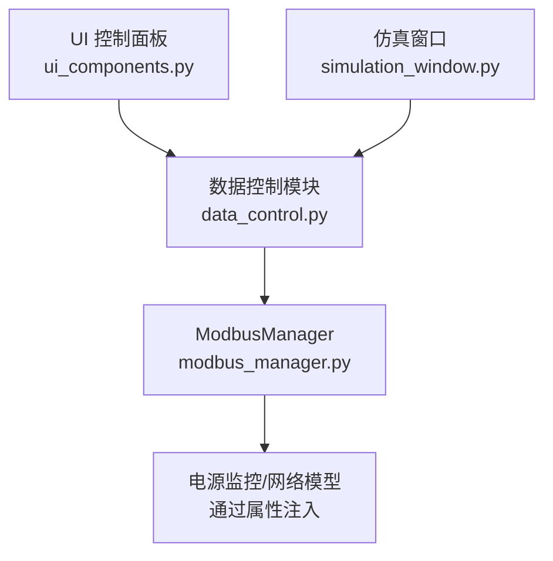
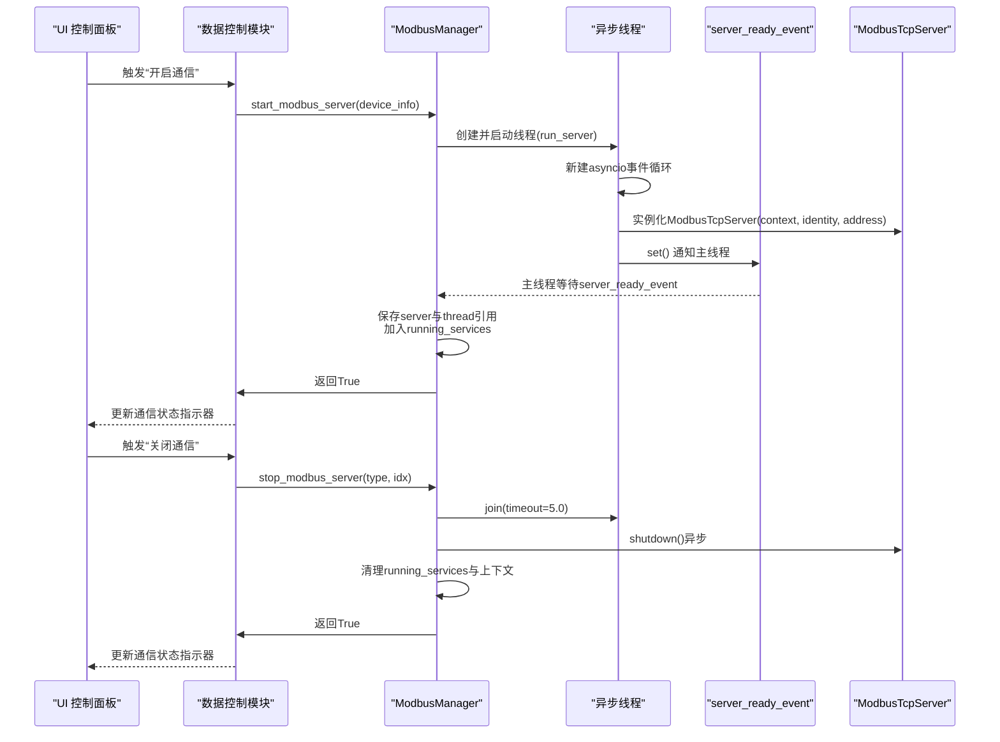
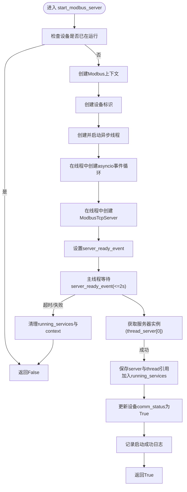
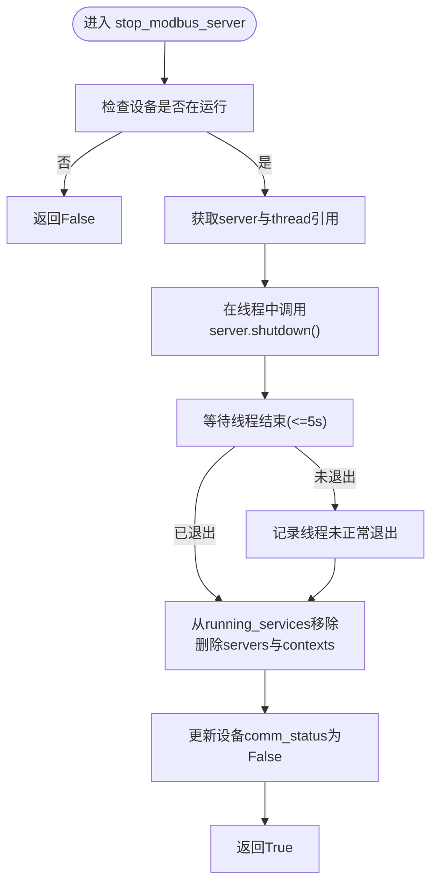
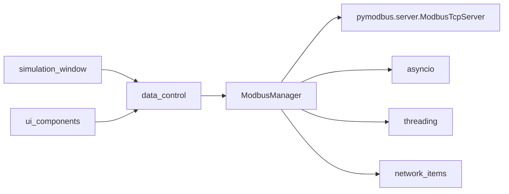

# 服务器生命周期管理

<cite>
**本文引用的文件**
- [src/components/modbus_manager.py](file://src/components/modbus_manager.py)
- [src/components/data_control.py](file://src/components/data_control.py)
- [src/components/ui_components.py](file://src/components/ui_components.py)
- [src/components/simulation_window.py](file://src/components/simulation_window.py)
</cite>

## 目录
1. [简介](#简介)
2. [项目结构](#项目结构)
3. [核心组件](#核心组件)
4. [架构总览](#架构总览)
5. [详细组件分析](#详细组件分析)
6. [依赖关系分析](#依赖关系分析)
7. [性能考量](#性能考量)
8. [故障排查指南](#故障排查指南)
9. [结论](#结论)
10. [附录](#附录)

## 简介
本文件聚焦于ModbusManager中start_modbus_server与stop_modbus_server两个关键方法的实现细节，系统阐述其如何在独立线程中创建asyncio事件循环并实例化ModbusTcpServer以避免阻塞GUI主线程；如何通过server_ready_event确保线程安全地传递服务器实例；如何优雅地通过异步shutdown()关闭服务器并正确清理线程与上下文引用；以及如何处理端口占用（OSError 10048）等异常，同时同步更新服务器状态（running_services）与通信状态（comm_status）。最后提供安全启动与停止储能设备Modbus服务的操作示例路径。

## 项目结构
ModbusManager位于组件层，负责管理多种设备类型的Modbus服务器（电表、储能、光伏、充电桩），并与GUI控制面板、数据监控模块协同工作。关键交互点包括：
- GUI控制面板：提供“开启/关闭通信”按钮，触发data_control对ModbusManager的调用
- data_control：封装设备通信控制逻辑，调用ModbusManager的start_modbus_server与stop_modbus_server
- simulation_window：批量启动/停止所有设备通信
- ui_components：定义通信状态指示器与按钮布局

图表来源
- [src/components/ui_components.py](file://src/components/ui_components.py#L237-L553)
- [src/components/data_control.py](file://src/components/data_control.py#L61-L153)
- [src/components/modbus_manager.py](file://src/components/modbus_manager.py#L505-L657)
- [src/components/simulation_window.py](file://src/components/simulation_window.py#L1931-L1964)

章节来源
- [src/components/modbus_manager.py](file://src/components/modbus_manager.py#L505-L657)
- [src/components/data_control.py](file://src/components/data_control.py#L61-L153)
- [src/components/ui_components.py](file://src/components/ui_components.py#L237-L553)
- [src/components/simulation_window.py](file://src/components/simulation_window.py#L1931-L1964)

## 核心组件
- ModbusManager：负责扫描IP设备、创建上下文、启动/停止服务器、维护running_services集合、更新设备comm_status、批量控制与清理
- data_control：封装设备通信控制，负责调用ModbusManager并更新UI状态指示器
- ui_components：定义通信状态标签与按钮布局
- simulation_window：批量启动/停止所有设备通信

章节来源
- [src/components/modbus_manager.py](file://src/components/modbus_manager.py#L505-L657)
- [src/components/data_control.py](file://src/components/data_control.py#L61-L153)
- [src/components/ui_components.py](file://src/components/ui_components.py#L237-L553)
- [src/components/simulation_window.py](file://src/components/simulation_window.py#L1931-L1964)

## 架构总览
下图展示了start_modbus_server与stop_modbus_server在GUI线程与异步线程之间的协作流程，以及server_ready_event与running_services的同步机制。

图表来源
- [src/components/modbus_manager.py](file://src/components/modbus_manager.py#L505-L657)
- [src/components/data_control.py](file://src/components/data_control.py#L61-L153)

## 详细组件分析

### start_modbus_server：线程化事件循环与服务器实例传递
- 独立线程与事件循环
  - 在独立线程中创建并设置新的asyncio事件循环，避免与GUI主线程共享异步对象
  - 在事件循环中异步创建ModbusTcpServer，随后await server.serve_forever()进入事件循环
- 线程安全的实例传递
  - 使用threading.Event（server_ready_event）在线程内部创建服务器后通知主线程
  - 使用可变容器thread_server[0]在线程内保存服务器引用，主线程通过wait(timeout=2.0)等待后获取
- 服务器状态与通信状态同步
  - 成功启动后将device_key加入running_services集合
  - 通过network_items定位设备项，更新其comm_status为True
- 异常处理
  - 捕获OSError，针对端口占用（errno 10048）给出明确警告
  - 其他异常记录错误并回滚running_services与modbus_contexts

图表来源
- [src/components/modbus_manager.py](file://src/components/modbus_manager.py#L505-L607)

章节来源
- [src/components/modbus_manager.py](file://src/components/modbus_manager.py#L505-L607)

### stop_modbus_server：优雅关闭与资源清理
- 优雅关闭
  - 在独立线程中创建事件循环，调用server.shutdown()进行异步优雅关闭
- 线程终止与资源清理
  - 等待线程join(timeout=5.0)，若仍存活则记录警告
  - 从running_services移除device_key，删除modbus_servers与modbus_contexts中的对应项
- 通信状态同步
  - 通过network_items定位设备项，将其comm_status置为False

图表来源
- [src/components/modbus_manager.py](file://src/components/modbus_manager.py#L609-L656)

章节来源
- [src/components/modbus_manager.py](file://src/components/modbus_manager.py#L609-L656)

### 端口占用（OSError 10048）异常处理策略
- 在start_modbus_server中捕获OSError
  - 若errno为10048，记录端口占用警告并返回False
  - 其他OSError与通用异常记录错误并回滚running_services与modbus_contexts
- GUI层面的预防
  - properties_panel在修改IP/端口时会检测冲突并提示用户，降低端口占用概率

章节来源
- [src/components/modbus_manager.py](file://src/components/modbus_manager.py#L596-L607)
- [src/components/properties_panel.py](file://src/components/properties_panel.py#L342-L388)

### 服务器状态与通信状态同步机制
- running_services
  - 启动成功后加入device_key；停止后从集合中移除
  - 提供get_running_services与is_service_running用于查询
- comm_status
  - 启动成功后将设备项的comm_status置为True
  - 停止后置为False
- GUI联动
  - data_control根据设备comm_status更新通信状态指示器
  - ui_components定义通信状态标签样式与布局

章节来源
- [src/components/modbus_manager.py](file://src/components/modbus_manager.py#L70-L102)
- [src/components/modbus_manager.py](file://src/components/modbus_manager.py#L1081-L1102)
- [src/components/data_control.py](file://src/components/data_control.py#L228-L285)
- [src/components/ui_components.py](file://src/components/ui_components.py#L237-L553)

## 依赖关系分析
- ModbusManager依赖
  - pymodbus.server.ModbusTcpServer：提供TCP服务器实现
  - asyncio：提供事件循环与异步I/O
  - threading：提供线程与Event用于跨线程同步
  - network_items：设备项集合，用于定位设备并更新comm_status
- GUI集成
  - data_control通过按钮事件调用ModbusManager
  - simulation_window批量控制所有设备通信
  - ui_components提供通信状态标签与按钮布局

图表来源
- [src/components/modbus_manager.py](file://src/components/modbus_manager.py#L505-L657)
- [src/components/data_control.py](file://src/components/data_control.py#L61-L153)
- [src/components/ui_components.py](file://src/components/ui_components.py#L237-L553)
- [src/components/simulation_window.py](file://src/components/simulation_window.py#L1931-L1964)

章节来源
- [src/components/modbus_manager.py](file://src/components/modbus_manager.py#L505-L657)
- [src/components/data_control.py](file://src/components/data_control.py#L61-L153)
- [src/components/ui_components.py](file://src/components/ui_components.py#L237-L553)
- [src/components/simulation_window.py](file://src/components/simulation_window.py#L1931-L1964)

## 性能考量
- 事件循环隔离：在独立线程中创建事件循环，避免与GUI主线程共享异步对象，降低阻塞风险
- server_ready_event：通过轻量级Event实现线程间同步，避免轮询带来的CPU开销
- 资源清理：stop_modbus_server在优雅关闭后及时清理running_services与上下文，防止内存泄漏
- 批量控制：simulation_window提供批量启动/停止，减少多次GUI交互成本

## 故障排查指南
- 端口占用（OSError 10048）
  - 现象：启动失败并记录端口占用警告
  - 排查：确认目标IP:Port是否被其他进程占用；修改设备属性中的端口
  - 预防：在properties_panel中修改IP/端口时注意冲突提示
- 服务器未正常退出
  - 现象：stop_modbus_server记录线程未正常退出警告
  - 排查：检查是否有长时间阻塞的客户端连接；确认shutdown()执行路径
- 通信状态未更新
  - 现象：UI通信状态标签颜色未变化
  - 排查：确认设备项存在comm_status属性；检查data_control的_update_comm_status_indicator逻辑

章节来源
- [src/components/modbus_manager.py](file://src/components/modbus_manager.py#L596-L607)
- [src/components/modbus_manager.py](file://src/components/modbus_manager.py#L622-L633)
- [src/components/data_control.py](file://src/components/data_control.py#L228-L285)
- [src/components/properties_panel.py](file://src/components/properties_panel.py#L342-L388)

## 结论
ModbusManager通过在独立线程中运行asyncio事件循环与ModbusTcpServer，结合server_ready_event实现线程安全的服务器实例传递，既保证了GUI的流畅性，又实现了优雅的服务器生命周期管理。通过running_services与comm_status的同步更新，配合GUI的状态指示器，形成了完整的设备通信可视化闭环。异常处理策略覆盖常见端口占用问题，确保系统稳定性。

## 附录

### 安全启动与停止储能设备Modbus服务的操作示例（步骤路径）
- 启动储能设备通信
  1) 在UI控制面板点击“开启通信”按钮
  2) data_control构建device_info（包含type='storage'、index、name、ip、port、sn_mva、max_e_mwh等）
  3) 调用ModbusManager.start_modbus_server(device_info)
  4) 启动成功后更新设备comm_status为True，UI通信状态指示器变为已连接
  - 参考路径
    - [src/components/ui_components.py](file://src/components/ui_components.py#L536-L553)
    - [src/components/data_control.py](file://src/components/data_control.py#L61-L103)
    - [src/components/modbus_manager.py](file://src/components/modbus_manager.py#L505-L607)

- 停止储能设备通信
  1) 在UI控制面板点击“关闭通信”按钮
  2) data_control调用ModbusManager.stop_modbus_server('storage', device_idx)
  3) 优雅关闭服务器并等待线程退出，清理running_services与上下文
  4) 更新设备comm_status为False，UI通信状态指示器变为未连接
  - 参考路径
    - [src/components/data_control.py](file://src/components/data_control.py#L131-L153)
    - [src/components/modbus_manager.py](file://src/components/modbus_manager.py#L609-L656)