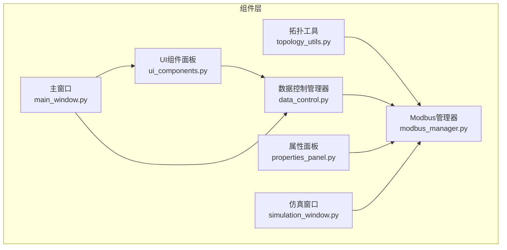
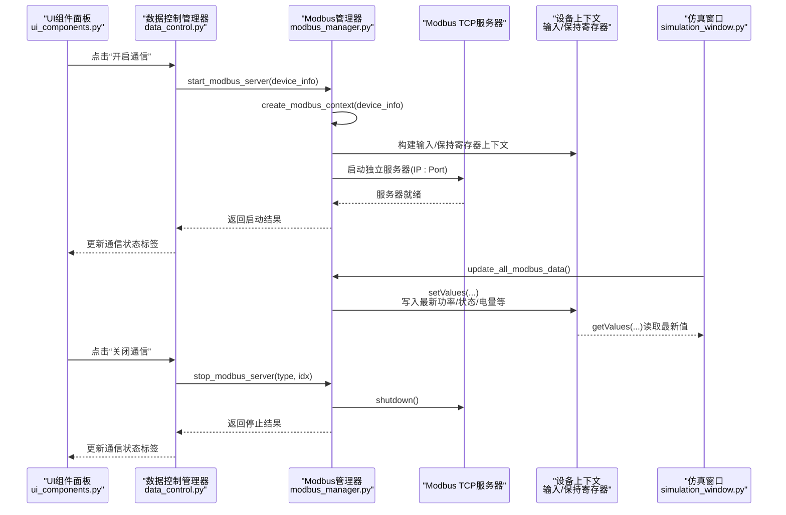
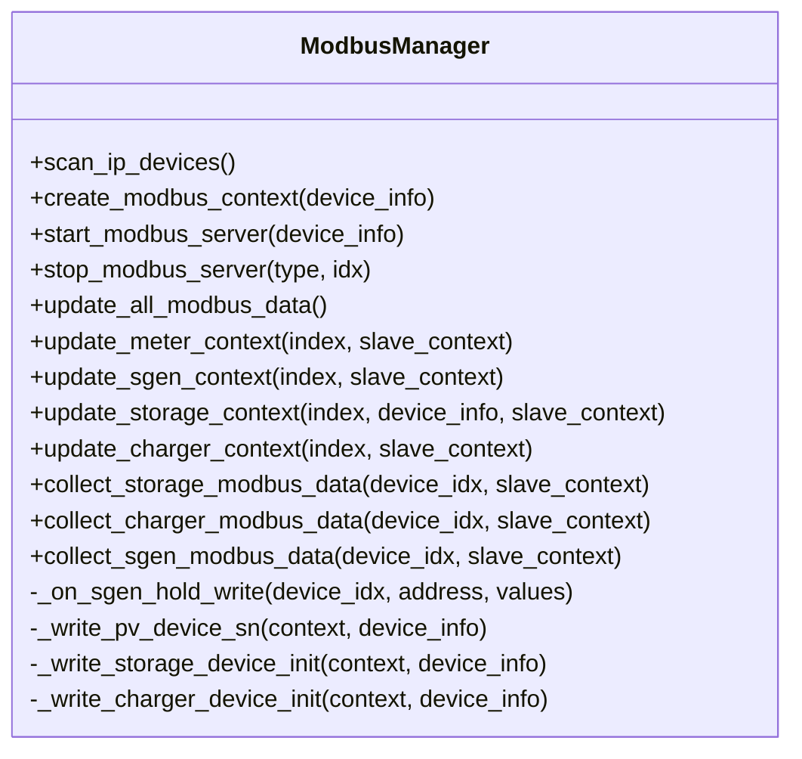
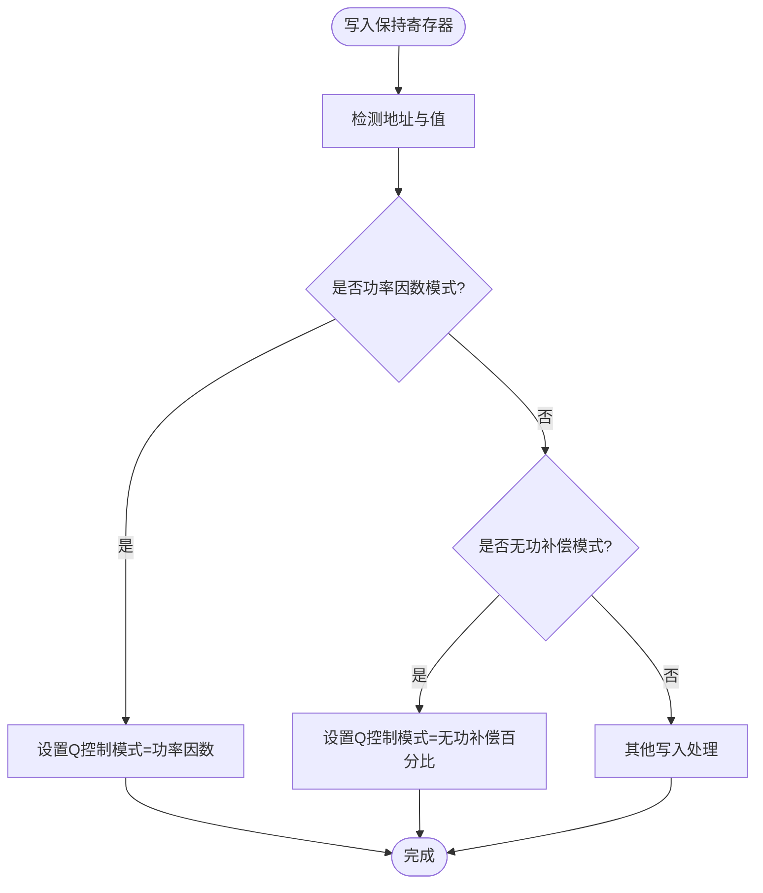
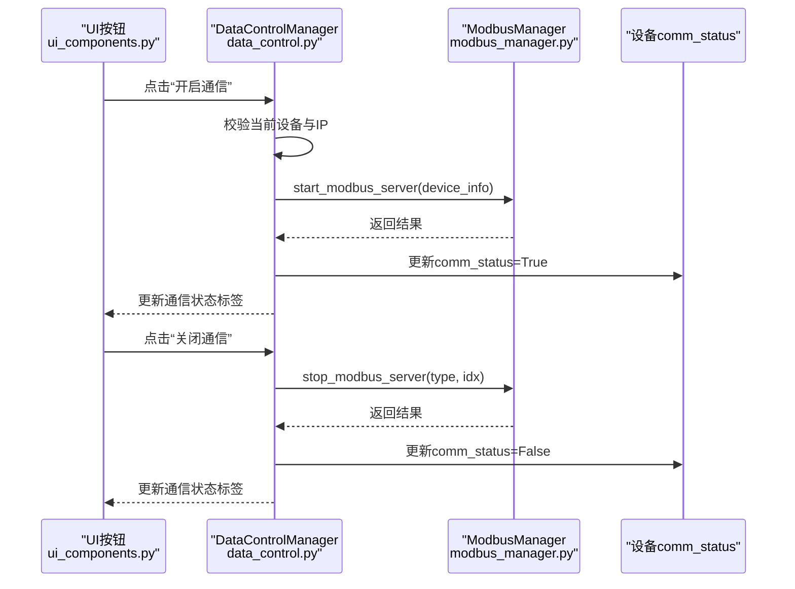
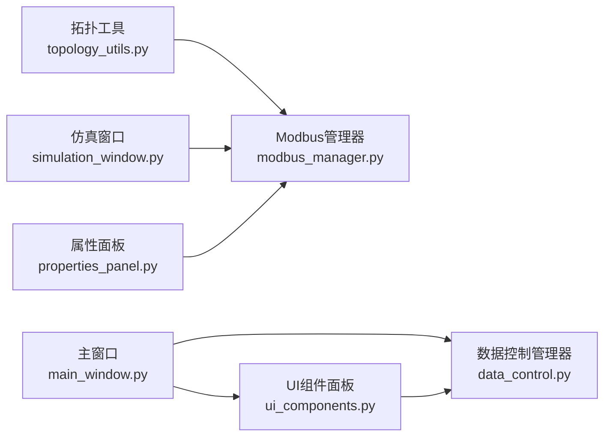

# Modbus通信

<cite>
**本文引用的文件**
- [modbus_manager.py](file://src/components/modbus_manager.py)
- [data_control.py](file://src/components/data_control.py)
- [ui_components.py](file://src/components/ui_components.py)
- [topology_utils.py](file://src/components/topology_utils.py)
- [simulation_window.py](file://src/components/simulation_window.py)
- [properties_panel.py](file://src/components/properties_panel.py)
- [main_window.py](file://src/components/main_window.py)
</cite>

## 目录
1. [简介](#简介)
2. [项目结构](#项目结构)
3. [核心组件](#核心组件)
4. [架构总览](#架构总览)
5. [详细组件分析](#详细组件分析)
6. [依赖关系分析](#依赖关系分析)
7. [性能考量](#性能考量)
8. [故障排查指南](#故障排查指南)
9. [结论](#结论)
10. [附录](#附录)

## 简介
本文件系统性记录pp_tool的Modbus通信功能，重点围绕以下目标展开：
- 说明Modbus管理器如何为每个具有IP和端口配置的设备（如储能、光伏、充电桩、电表）启动独立的Modbus TCP服务器。
- 解释不同设备类型的寄存器映射规则。
- 说明如何通过回调函数实现寄存器写入时的逻辑处理（如更新储能功率）。
- 说明数据控制管理器如何提供UI按钮来开启/关闭设备通信，并同步通信状态指示器。

## 项目结构
pp_tool采用“组件化+模块化”的组织方式，Modbus相关能力集中在components子目录中，UI交互在ui_components与data_control中体现，设备属性与拓扑在topology_utils中管理。

图表来源
- [modbus_manager.py](file://src/components/modbus_manager.py#L1-L120)
- [data_control.py](file://src/components/data_control.py#L1-L120)
- [ui_components.py](file://src/components/ui_components.py#L237-L559)
- [topology_utils.py](file://src/components/topology_utils.py#L37-L63)
- [simulation_window.py](file://src/components/simulation_window.py#L2037-L2232)
- [properties_panel.py](file://src/components/properties_panel.py#L485-L505)
- [main_window.py](file://src/components/main_window.py#L1-L200)

章节来源
- [modbus_manager.py](file://src/components/modbus_manager.py#L1-L120)
- [data_control.py](file://src/components/data_control.py#L1-L120)
- [ui_components.py](file://src/components/ui_components.py#L237-L559)
- [topology_utils.py](file://src/components/topology_utils.py#L37-L63)
- [simulation_window.py](file://src/components/simulation_window.py#L2037-L2232)
- [properties_panel.py](file://src/components/properties_panel.py#L485-L505)
- [main_window.py](file://src/components/main_window.py#L1-L200)

## 核心组件
- Modbus管理器（ModbusManager）
  - 负责扫描具有IP属性的设备、为每类设备创建专用Modbus上下文、启动/停止独立的Modbus TCP服务器、周期性更新各设备寄存器数据、收集来自客户端的写入请求并触发业务逻辑。
- 数据控制管理器（DataControlManager）
  - 提供UI按钮“开启通信/关闭通信”，封装设备通信开关流程，更新通信状态指示器，联动设备属性面板与仿真窗口。
- UI组件面板（ui_components.py）
  - 为各类设备（光伏、储能、电表等）提供通信状态标签与按钮，绑定到DataControlManager的事件处理。
- 拓扑工具（topology_utils.py）
  - 从场景元素提取设备的IP与端口，用于识别可启动Modbus服务的设备集合。
- 仿真窗口（simulation_window.py）
  - 与Modbus管理器配合，驱动设备功率与状态的实时更新，支撑寄存器数据的动态刷新。
- 属性面板（properties_panel.py）
  - 通过修改设备属性（如额定功率），直接写入对应设备的Modbus寄存器，实现参数下发。

章节来源
- [modbus_manager.py](file://src/components/modbus_manager.py#L1-L120)
- [data_control.py](file://src/components/data_control.py#L1-L120)
- [ui_components.py](file://src/components/ui_components.py#L237-L559)
- [topology_utils.py](file://src/components/topology_utils.py#L37-L63)
- [simulation_window.py](file://src/components/simulation_window.py#L2037-L2232)
- [properties_panel.py](file://src/components/properties_panel.py#L485-L505)

## 架构总览
Modbus通信的端到端流程如下：
- 设备属性（IP/端口/额定功率等）来源于拓扑与属性面板。
- Modbus管理器扫描设备并为每台设备创建独立上下文（含输入/保持寄存器）。
- 启动独立的Modbus TCP服务器，监听对应IP:Port。
- UI通过DataControlManager发起“开启/关闭通信”操作，更新通信状态标签。
- 仿真窗口周期性调用Modbus管理器更新各设备寄存器数据。
- 客户端写入保持寄存器时，回调函数触发业务逻辑（如设置储能功率、控制光伏功率因数/无功补偿模式等）。

图表来源
- [ui_components.py](file://src/components/ui_components.py#L237-L559)
- [data_control.py](file://src/components/data_control.py#L1-L120)
- [modbus_manager.py](file://src/components/modbus_manager.py#L505-L657)
- [simulation_window.py](file://src/components/simulation_window.py#L2037-L2232)

## 详细组件分析

### Modbus管理器（ModbusManager）
- 扫描设备与上下文创建
  - 通过扫描全局网络项，筛选具备IP属性的设备，构建device_info并调用create_modbus_context按设备类型创建专用上下文。
  - 支持静态生成器（光伏）、电表、储能、充电桩等类型，每种类型定义不同的寄存器布局与默认值。
- 服务器生命周期管理
  - start_modbus_server：在线程中创建异步服务器实例，避免阻塞主线程；启动后更新设备comm_status为True。
  - stop_modbus_server：优雅关闭服务器并清理资源，同时将comm_status置为False。
  - start_all_modbus_servers/stop_all_modbus_servers/cleanup：批量管理与资源回收。
- 寄存器更新策略
  - update_all_modbus_data：遍历运行中的设备，按类型调用update_*_context，将仿真窗口采集的实时数据写入对应寄存器。
  - update_meter_context/update_sgen_context/update_storage_context/update_charger_context：针对不同设备类型，将功率、电量、状态、并网/离网等信息写入寄存器。
- 回调与写入处理
  - 为保持寄存器设置回调（CallbackSequentialDataBlock），在写入时触发_on_sgen_hold_write，解析功率因数/无功补偿模式等控制命令。
  - 收集来自客户端的写入：collect_storage_modbus_data/collect_charger_modbus_data/collect_sgen_modbus_data，读取功率设定、开关机、功率限制、百分比限制、功率因数等。
- 初始化写入
  - _write_pv_device_sn/_write_storage_device_init/_write_charger_device_init：在上下文创建后，将设备SN、额定功率等参数写入寄存器，确保客户端可读取。

图表来源
- [modbus_manager.py](file://src/components/modbus_manager.py#L1-L1284)

章节来源
- [modbus_manager.py](file://src/components/modbus_manager.py#L1-L1284)

### 设备类型寄存器映射规则
- 光伏（static_generator）
  - 输入寄存器：今日发电量、总发电量（32位）、当前功率（32位）、无功功率（32位）等。
  - 保持寄存器：开关机控制、有功功率限制、有功功率百分比限制、无功补偿百分比、功率因数等。
  - 初始化：写入SN（4989-4996）与额定功率（5000）。
- 电表（meter）
  - 输入寄存器：当前功率、三相电压、三相电流、有功/无功电量（含上网/下网）等。
- 储能（storage）
  - 输入寄存器：SOC、剩余容量、三相电流、有功/视在功率、日/累计充放电量、状态寄存器、PCS工作模式（bit9/10）等。
  - 保持寄存器：功率设定（kW）、开关机控制、并网/离网控制等。
  - 初始化：写入额定功率（高位/低位）、PCS数量、簇数量、簇容量/功率、SN等。
- 充电桩（charger）
  - 输入寄存器：当前有功功率、状态、需求功率（最大需求）、枪状态等。
  - 保持寄存器：功率限制等。
  - 初始化：写入额定功率（32位低位/高位）与枪状态。

章节来源
- [modbus_manager.py](file://src/components/modbus_manager.py#L144-L504)
- [modbus_manager.py](file://src/components/modbus_manager.py#L505-L657)
- [modbus_manager.py](file://src/components/modbus_manager.py#L658-L1089)
- [modbus_manager.py](file://src/components/modbus_manager.py#L1090-L1284)

### 回调函数与写入逻辑处理
- 光伏写入回调
  - 通过CallbackSequentialDataBlock在写入保持寄存器时触发_on_sgen_hold_write，解析功率因数与无功补偿百分比写入，从而切换控制模式。
- 储能写入收集
  - collect_storage_modbus_data读取功率设定、开关机、并网离网指令，结合仿真窗口逻辑更新设备状态与功率。
- 充电桩写入收集
  - collect_charger_modbus_data读取功率限制，用于约束需求功率。

图表来源
- [modbus_manager.py](file://src/components/modbus_manager.py#L1266-L1284)

章节来源
- [modbus_manager.py](file://src/components/modbus_manager.py#L1266-L1284)

### 数据控制管理器（DataControlManager）与UI按钮
- UI按钮
  - 在ui_components中为各设备类型创建“开启通信/关闭通信”按钮，并绑定到DataControlManager的on_device_power_on/on_device_power_off。
- 通信状态指示器
  - _update_comm_status_indicator根据设备的comm_status属性更新标签颜色与文字，直观反映通信状态。
- 设备通信开关流程
  - on_device_power_on：校验当前选中设备、构造device_info、检查IP、调用ModbusManager启动服务器并提示。
  - on_device_power_off：校验设备、调用ModbusManager停止服务器并提示。
- 与仿真窗口联动
  - 仿真窗口在运行时周期性调用ModbusManager的update_all_modbus_data，确保寄存器数据实时更新。

图表来源
- [ui_components.py](file://src/components/ui_components.py#L237-L559)
- [data_control.py](file://src/components/data_control.py#L1-L160)
- [modbus_manager.py](file://src/components/modbus_manager.py#L505-L657)

章节来源
- [ui_components.py](file://src/components/ui_components.py#L237-L559)
- [data_control.py](file://src/components/data_control.py#L1-L160)
- [modbus_manager.py](file://src/components/modbus_manager.py#L505-L657)

### 通过代码示例实现设备通信与参数下发
以下为“代码级示例路径”，展示如何通过现有接口完成常见任务（不直接粘贴代码）：
- 为一个储能设备创建其专用Modbus上下文并写入额定功率与SN
  - 步骤：调用create_modbus_context(device_info)创建上下文；随后调用_write_storage_device_init(context, device_info)写入额定功率与SN。
  - 示例路径参考：
    - [modbus_manager.py](file://src/components/modbus_manager.py#L121-L143)
    - [modbus_manager.py](file://src/components/modbus_manager.py#L316-L376)
- 为一个光伏设备写入SN与额定功率
  - 步骤：调用_create_sgen_context(device_info)创建上下文；随后调用_write_pv_device_sn(context, device_info)写入SN与额定功率。
  - 示例路径参考：
    - [modbus_manager.py](file://src/components/modbus_manager.py#L144-L209)
    - [modbus_manager.py](file://src/components/modbus_manager.py#L468-L504)
- 通过属性面板修改额定功率并写入对应寄存器
  - 步骤：在属性面板中修改设备属性（如sn_mva），触发属性面板写入逻辑，调用setValues写入对应寄存器。
  - 示例路径参考：
    - [properties_panel.py](file://src/components/properties_panel.py#L485-L505)

章节来源
- [modbus_manager.py](file://src/components/modbus_manager.py#L121-L209)
- [modbus_manager.py](file://src/components/modbus_manager.py#L316-L376)
- [modbus_manager.py](file://src/components/modbus_manager.py#L468-L504)
- [properties_panel.py](file://src/components/properties_panel.py#L485-L505)

## 依赖关系分析
- Modbus管理器依赖
  - 拓扑工具：从场景元素提取IP/端口，决定哪些设备可启动服务器。
  - 仿真窗口：提供实时功率/电量/状态数据，驱动update_*_context写入寄存器。
  - 主窗口：承载UI组件与数据控制管理器，提供事件入口。
- UI与控制
  - ui_components创建通信状态标签与按钮；data_control管理按钮点击事件与状态更新。
- 属性面板
  - properties_panel在用户修改设备属性时，直接写入Modbus寄存器，实现参数下发。

图表来源
- [topology_utils.py](file://src/components/topology_utils.py#L37-L63)
- [modbus_manager.py](file://src/components/modbus_manager.py#L1-L120)
- [simulation_window.py](file://src/components/simulation_window.py#L2037-L2232)
- [main_window.py](file://src/components/main_window.py#L1-L200)
- [ui_components.py](file://src/components/ui_components.py#L237-L559)
- [data_control.py](file://src/components/data_control.py#L1-L160)
- [properties_panel.py](file://src/components/properties_panel.py#L485-L505)

章节来源
- [topology_utils.py](file://src/components/topology_utils.py#L37-L63)
- [modbus_manager.py](file://src/components/modbus_manager.py#L1-L120)
- [simulation_window.py](file://src/components/simulation_window.py#L2037-L2232)
- [main_window.py](file://src/components/main_window.py#L1-L200)
- [ui_components.py](file://src/components/ui_components.py#L237-L559)
- [data_control.py](file://src/components/data_control.py#L1-L160)
- [properties_panel.py](file://src/components/properties_panel.py#L485-L505)

## 性能考量
- 异步与线程
  - 服务器在独立线程中运行，避免阻塞主线程；通过事件循环启动服务器，保证异步I/O效率。
- 寄存器更新频率
  - update_all_modbus_data按需更新，仅对运行中的设备上下文进行写入，降低CPU与内存压力。
- 数据范围与精度
  - 对功率、电量等数值进行范围限制与单位换算（如kW/MW、0.1kW/0.1kvar等），确保寄存器值稳定可靠。
- 批量管理
  - start_all_modbus_servers/stop_all_modbus_servers/cleanup提供批量启动/停止与资源回收，便于大规模设备管理。

[本节为通用建议，无需具体文件引用]

## 故障排查指南
- 启动失败（端口占用）
  - 现象：启动服务器时报错，提示端口已被占用。
  - 排查：确认同一IP:Port是否已有服务器运行；更换端口或停止旧服务。
  - 参考路径：
    - [modbus_manager.py](file://src/components/modbus_manager.py#L596-L607)
- 通信状态未更新
  - 现象：点击按钮后通信状态标签未变化。
  - 排查：确认设备是否具备有效IP；检查DataControlManager的_update_comm_status_indicator是否被调用；确认设备的comm_status属性是否更新。
  - 参考路径：
    - [data_control.py](file://src/components/data_control.py#L81-L104)
    - [data_control.py](file://src/components/data_control.py#L238-L295)
- 寄存器未更新
  - 现象：客户端读取不到最新数据。
  - 排查：确认update_all_modbus_data是否被周期性调用；检查设备是否仍在运行；核对设备类型分支是否匹配。
  - 参考路径：
    - [modbus_manager.py](file://src/components/modbus_manager.py#L1025-L1069)
- 写入无效
  - 现象：写入保持寄存器后未生效。
  - 排查：确认回调函数_on_sgen_hold_write是否被触发；检查写入地址与值范围；核对collect_*_modbus_data读取逻辑。
  - 参考路径：
    - [modbus_manager.py](file://src/components/modbus_manager.py#L1266-L1284)
    - [modbus_manager.py](file://src/components/modbus_manager.py#L1107-L1188)

章节来源
- [modbus_manager.py](file://src/components/modbus_manager.py#L596-L607)
- [modbus_manager.py](file://src/components/modbus_manager.py#L1025-L1069)
- [modbus_manager.py](file://src/components/modbus_manager.py#L1107-L1188)
- [modbus_manager.py](file://src/components/modbus_manager.py#L1266-L1284)
- [data_control.py](file://src/components/data_control.py#L81-L104)
- [data_control.py](file://src/components/data_control.py#L238-L295)

## 结论
pp_tool的Modbus通信体系以ModbusManager为核心，实现了对多种设备类型的独立Modbus TCP服务器管理、寄存器映射与实时数据更新，并通过DataControlManager与UI组件形成闭环的设备通信控制体验。回调机制与参数下发路径完善，既满足客户端读取需求，也支持写入控制命令，为仿真与调试提供了稳定可靠的通信基础。

[本节为总结，无需具体文件引用]

## 附录
- 常见问题速查
  - 如何查看某设备的通信状态？在UI面板中查看对应设备的“通信状态”标签。
  - 如何批量启动/停止所有设备的通信？使用DataControlManager提供的批量接口。
  - 如何修改设备的额定功率并下发到寄存器？在属性面板中修改sn_mva，系统会自动写入对应寄存器。

[本节为补充说明，无需具体文件引用]