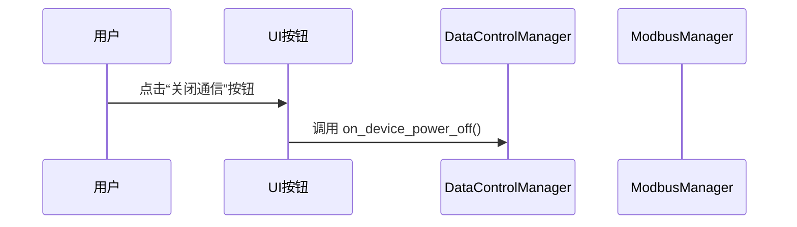
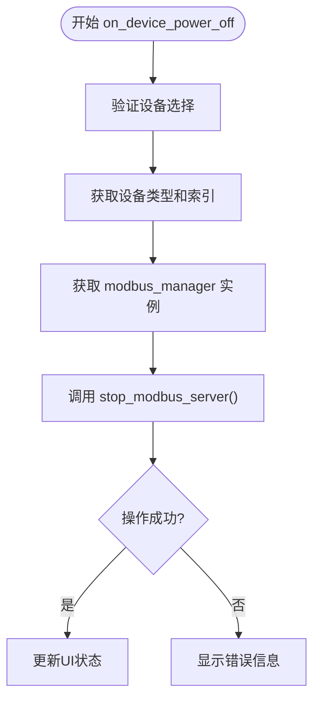
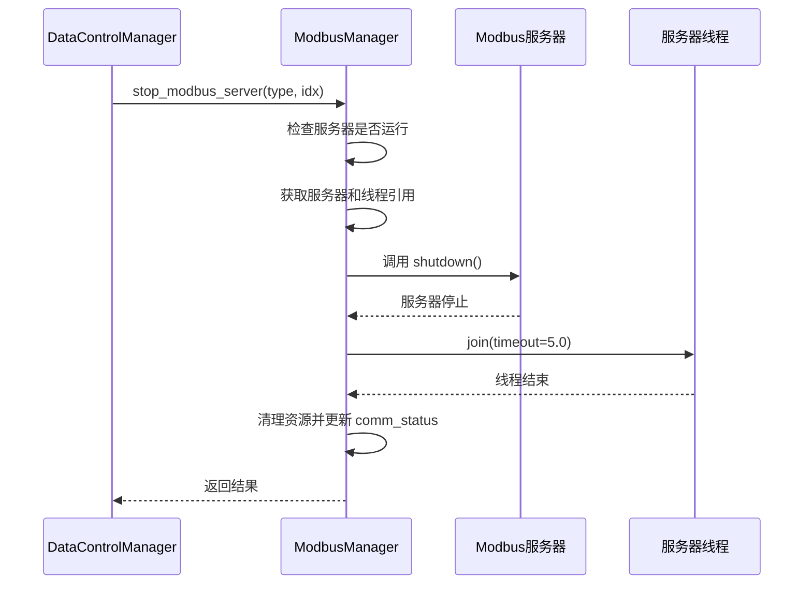
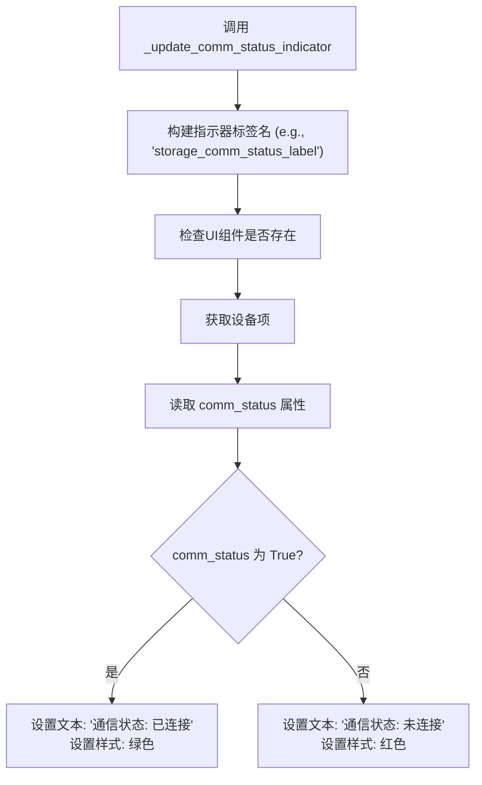

# 关闭设备通信

<cite>
**本文档引用的文件**   
- [data_control.py](file://src/components/data_control.py)
- [modbus_manager.py](file://src/components/modbus_manager.py)
- [ui_components.py](file://src/components/ui_components.py)
- [simulation_window.py](file://src/components/simulation_window.py)
</cite>

## 目录
1. [功能概述](#功能概述)
2. [核心组件分析](#核心组件分析)
3. [流程详解](#流程详解)
4. [代码级流程示例](#代码级流程示例)
5. [结论](#结论)

## 功能概述
pp_tool工具提供了一个用户界面（UI）按钮，允许用户关闭特定设备（如储能、光伏、电表、充电桩）的Modbus通信。当用户点击“关闭通信”按钮时，系统会执行一系列操作，最终停止与该设备相关的Modbus服务器。此功能的核心在于`DataControlManager`类的`on_device_power_off`方法，它负责协调整个关闭流程，包括获取`ModbusManager`实例、调用其`stop_modbus_server`方法、更新设备的通信状态以及刷新UI上的状态指示器。

**Section sources**
- [ui_components.py](file://src/components/ui_components.py#L548)
- [data_control.py](file://src/components/data_control.py#L105)

## 核心组件分析

### DataControlManager 类
`DataControlManager`类是处理UI与底层通信逻辑之间交互的管理器。其`on_device_power_off`方法是关闭通信功能的入口点。

**Section sources**
- [data_control.py](file://src/components/data_control.py#L12)

### ModbusManager 类
`ModbusManager`类负责管理所有设备的Modbus服务器实例。它维护着一个服务器实例的字典（`modbus_servers`），并提供了`stop_modbus_server`方法来优雅地停止指定设备的服务器。

**Section sources**
- [modbus_manager.py](file://src/components/modbus_manager.py#L69)

## 流程详解

### 1. UI按钮触发
用户在UI上点击“关闭通信”按钮。该按钮的点击事件（`clicked` signal）被连接到`DataControlManager`实例的`on_device_power_off`方法。



**Diagram sources**
- [ui_components.py](file://src/components/ui_components.py#L548)
- [data_control.py](file://src/components/data_control.py#L105)

### 2. 执行 on_device_power_off 方法
`on_device_power_off`方法开始执行，其主要步骤如下：

1.  **设备选择验证**：首先检查`parent_window`是否具有`current_component_type`和`current_component_idx`属性，以确认用户已选择一个设备。如果未选择，会弹出警告并返回。
2.  **获取设备信息**：从`parent_window`获取当前设备的类型（如'storage'）和索引。
3.  **获取 ModbusManager 实例**：通过`getattr(self.parent_window, 'modbus_manager', None)`从父窗口获取`ModbusManager`的实例。如果实例不存在，会记录警告并返回。
4.  **调用停止服务器方法**：调用`modbus_manager.stop_modbus_server(component_type_key, device_idx)`方法，传入设备类型键（如'storage'）和设备索引，以停止指定的Modbus服务器。



**Diagram sources**
- [data_control.py](file://src/components/data_control.py#L105-L138)

### 3. 执行 stop_modbus_server 方法
`ModbusManager`的`stop_modbus_server`方法负责实际的服务器停止操作。

1.  **检查服务器状态**：根据`device_type`和`device_idx`构建`device_key`，并检查该设备的服务器是否正在运行（存在于`modbus_servers`和`running_services`中）。如果未运行，则记录警告并返回`False`。
2.  **获取服务器和线程引用**：从`modbus_servers`字典中获取该设备的服务器实例和运行它的线程。
3.  **停止异步服务器**：创建一个新的`asyncio`事件循环，并在其中调用服务器实例的`shutdown()`方法，以优雅地关闭服务器。
4.  **等待线程结束**：调用`server_thread.join(timeout=5.0)`等待服务器线程结束，确保资源被正确释放。
5.  **清理资源**：从`running_services`集合中移除`device_key`，并从`modbus_servers`和`modbus_contexts`字典中删除对应的条目。
6.  **更新设备通信状态**：在`network_items`中找到对应的设备项，并将其`comm_status`属性设置为`False`。
7.  **返回结果**：如果所有步骤成功，返回`True`；否则，在捕获异常后返回`False`。



**Diagram sources**
- [modbus_manager.py](file://src/components/modbus_manager.py#L609-L653)

### 4. 更新UI状态
无论`stop_modbus_server`调用成功与否，`on_device_power_off`方法都会调用`_update_comm_status_indicator`方法来刷新UI。

1.  **确定状态指示器**：根据设备类型（如'storage'）查找对应的UI标签（如`storage_comm_status_label`）。
2.  **获取设备通信状态**：从`network_items`中获取设备项，并读取其`comm_status`属性。
3.  **更新UI**：根据`comm_status`的值，更新状态指示器的文本和样式。如果为`False`，则显示“通信状态: 未连接”并设置为红色。



**Diagram sources**
- [data_control.py](file://src/components/data_control.py#L238-L292)

## 代码级流程示例
以下是用户点击“关闭通信”按钮到Modbus服务器被成功终止的完整代码级流程：

1.  **UI事件触发**：
    ```python
    # 在 ui_components.py 中，按钮点击事件连接到 on_device_power_off
    storage_power_off_button.clicked.connect(self.parent_window.data_control_manager.on_device_power_off)
    ```

2.  **进入 on_device_power_off 方法**：
    ```python
    # 在 data_control.py 中，方法开始执行
    def on_device_power_off(self):
        # ... (验证和日志记录)
        
        # 获取 modbus_manager 实例
        modbus_manager = getattr(self.parent_window, 'modbus_manager', None)
        
        # 调用 stop_modbus_server 方法
        result = modbus_manager.stop_modbus_server(component_type_key, device_idx)
    ```

3.  **执行 stop_modbus_server 方法**：
    ```python
    # 在 modbus_manager.py 中，停止服务器
    def stop_modbus_server(self, device_type, device_idx):
        device_key = f"{device_type}_{device_idx}"
        # ... (检查服务器状态)
        
        # 停止异步服务器
        loop = asyncio.new_event_loop()
        asyncio.set_event_loop(loop)
        loop.run_until_complete(server.shutdown())  # 关键：优雅关闭
        loop.close()
        
        # 等待线程结束
        server_thread.join(timeout=5.0)
        
        # 清理资源
        self.running_services.discard(device_key)
        del self.modbus_servers[device_key]
        if device_key in self.modbus_contexts:
            del self.modbus_contexts[device_key]
        
        # 更新设备的 comm_status 属性
        if device_type in self.network_items and device_idx in self.network_items[device_type]:
            device_item = self.network_items[device_type][device_idx]
            if hasattr(device_item, 'comm_status'):
                device_item.comm_status = False # 关键：更新状态
        
        return True
    ```

4.  **返回并更新UI**：
    ```python
    # 回到 on_device_power_off 方法
    if result:
        # ... (显示成功信息)
        
        # 刷新UI上的通信状态指示器
        self._update_comm_status_indicator(device_type, device_idx) # 关键：刷新UI
    ```

**Section sources**
- [ui_components.py](file://src/components/ui_components.py#L548)
- [data_control.py](file://src/components/data_control.py#L105-L148)
- [modbus_manager.py](file://src/components/modbus_manager.py#L609-L648)

## 结论
pp_tool中通过UI按钮关闭设备通信的功能是一个设计良好的、分层的流程。`DataControlManager`作为协调者，负责处理UI事件并调用`ModbusManager`。`ModbusManager`则负责底层的服务器管理，能够优雅地停止异步服务器并清理资源。最后，通过更新设备的`comm_status`属性并调用`_update_comm_status_indicator`方法，实现了UI状态的实时同步。整个流程清晰、健壮，并包含了完善的错误处理和用户反馈机制。