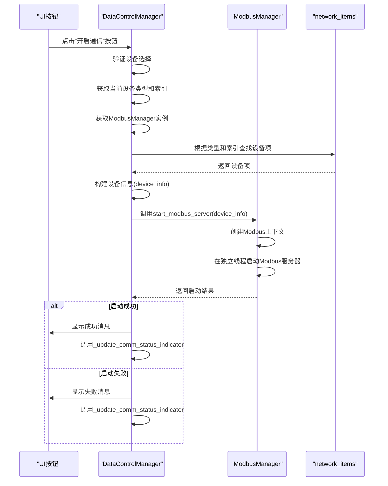
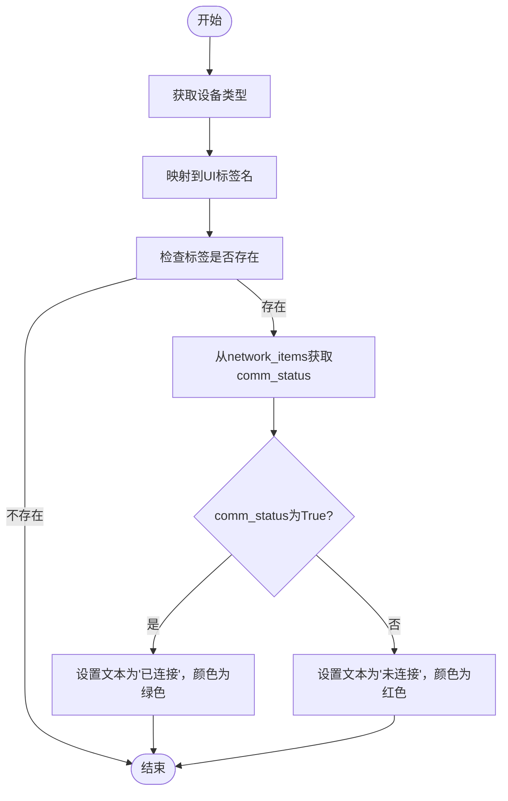

# 开启设备通信

<cite>
**本文档引用的文件**   
- [data_control.py](file://src/components/data_control.py)
- [modbus_manager.py](file://src/components/modbus_manager.py)
- [network_items.py](file://src/components/network_items.py)
- [ui_components.py](file://src/components/ui_components.py)
- [main_window.py](file://src/components/main_window.py)
- [simulation_window.py](file://src/components/simulation_window.py)
</cite>

## 目录
1. [功能概述](#功能概述)
2. [核心组件分析](#核心组件分析)
3. [UI与Modbus通信流程](#ui与modbus通信流程)
4. [设备通信状态指示器](#设备通信状态指示器)
5. [全局通信控制](#全局通信控制)

## 功能概述
本功能实现了用户通过图形用户界面（UI）上的按钮来开启特定设备（如储能、光伏、电表、充电桩）的Modbus通信。当用户在UI上点击“开启通信”按钮时，系统会通过`DataControlManager`类作为桥梁，调用`ModbusManager`来启动一个Modbus服务器，从而建立与设备的通信连接。该过程涉及从`network_items`中获取设备的IP地址、端口号等配置信息，并在通信成功开启后更新UI上的状态指示器。

## 核心组件分析

`DataControlManager`类是实现UI与Modbus通信功能的核心组件，它作为UI与`ModbusManager`之间的桥梁，负责处理用户通过UI发出的开启通信请求。

**Section sources**
- [data_control.py](file://src/components/data_control.py#L29-L104)

## UI与Modbus通信流程

当用户在UI上点击“开启通信”按钮时，系统内部的调用流程如下：

1.  **UI事件触发**：UI上的“开启通信”按钮（如`sgen_power_on_button`）被点击，触发其`clicked`信号。
2.  **调用控制方法**：该信号连接到`DataControlManager`实例的`on_device_power_on`方法。
3.  **获取设备信息**：`on_device_power_on`方法首先检查是否有设备被选中，并从`parent_window`中获取当前设备的类型（`current_component_type`）和索引（`current_component_idx`）。
4.  **获取Modbus管理器**：通过`getattr(self.parent_window, 'modbus_manager', None)`获取`ModbusManager`实例。
5.  **构建设备信息**：从全局的`network_items`字典中，根据设备类型和索引获取设备项（`device_item`），并从中提取IP、端口、额定功率等配置信息，构建成一个`device_info`字典。
6.  **启动Modbus服务器**：调用`modbus_manager.start_modbus_server(device_info)`方法，传入包含设备配置的`device_info`字典。
7.  **更新UI状态**：根据`start_modbus_server`方法的返回结果，使用`QMessageBox`显示成功或失败的提示信息，并调用`_update_comm_status_indicator`方法更新UI上的通信状态指示器。

**Diagram sources**
- [data_control.py](file://src/components/data_control.py#L29-L104)
- [modbus_manager.py](file://src/components/modbus_manager.py#L505-L595)

## 设备通信状态指示器

在成功开启或关闭通信后，系统会调用`_update_comm_status_indicator`方法来更新UI上对应设备的通信状态指示器。

该方法的工作流程如下：
1.  根据传入的`device_type`（如'sgen'、'storage'），通过`indicator_map`映射到UI上对应的标签名称（如'sgen_comm_status_label'）。
2.  检查该标签是否存在于`parent_window`中。
3.  从`network_items`中获取对应的设备项，并读取其`comm_status`属性（该属性在`start_modbus_server`或`stop_modbus_server`方法中被更新）。
4.  根据`comm_status`的布尔值，更新标签的文本和样式：
    *   **已连接**：文本显示为“通信状态: 已连接”，颜色为绿色。
    *   **未连接**：文本显示为“通信状态: 未连接”，颜色为红色。

**Diagram sources**
- [data_control.py](file://src/components/data_control.py#L238-L295)

## 全局通信控制

除了单个设备的通信控制，系统还提供了“开启所有设备通信”和“关闭所有设备通信”的全局控制功能。

*   **开启所有设备通信**：在`SimulationWindow`类中，`power_on_all_devices`方法会调用`modbus_manager.start_all_modbus_servers()`，批量启动所有配置了IP地址的设备的Modbus服务器。
*   **关闭所有设备通信**：`power_off_all_devices`方法会调用`modbus_manager.stop_all_modbus_servers()`，停止所有正在运行的Modbus服务器。

这些全局控制按钮位于UI的“仿真控制”面板中，为用户提供了便捷的一键式操作。

**Section sources**
- [simulation_window.py](file://src/components/simulation_window.py#L1921-L1978)
- [ui_components.py](file://src/components/ui_components.py#L127-L136)