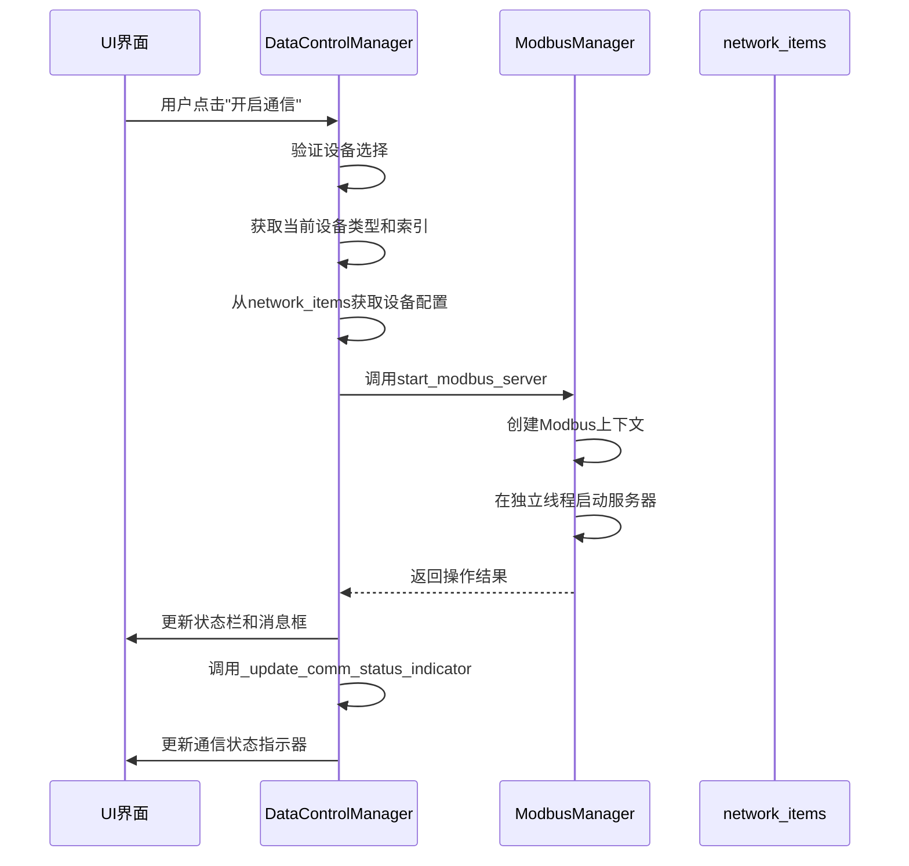
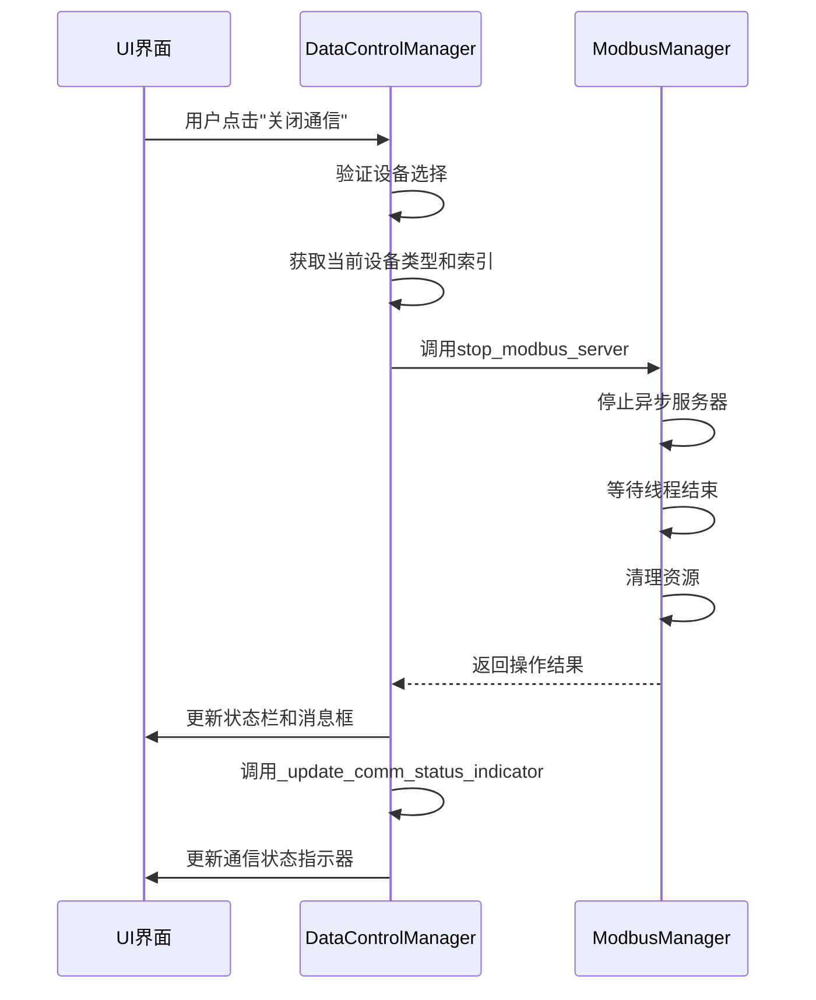
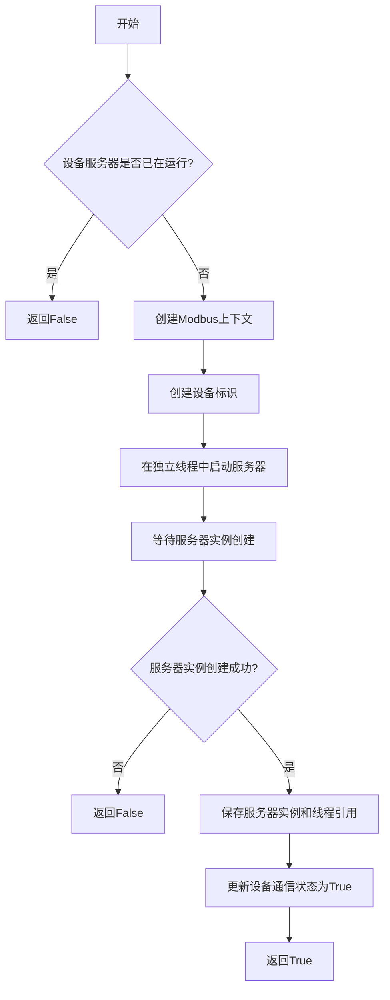
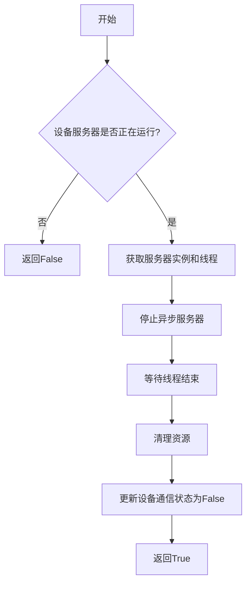
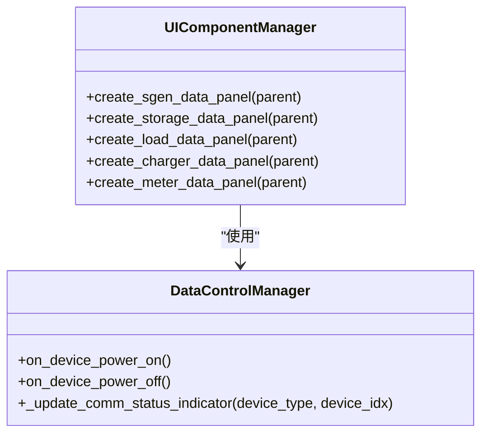
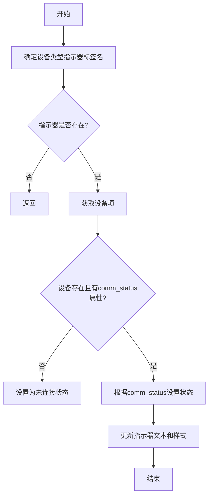

# 设备通信控制

<cite>
**Referenced Files in This Document**   
- [data_control.py](file://src/components/data_control.py)
- [modbus_manager.py](file://src/components/modbus_manager.py)
- [network_items.py](file://src/components/network_items.py)
- [ui_components.py](file://src/components/ui_components.py)
- [simulation_window.py](file://src/components/simulation_window.py)
</cite>

## 目录
1. [简介](#简介)
2. [核心功能分析](#核心功能分析)
3. [DataControlManager类通信控制方法](#datacontrolmanager类通信控制方法)
4. [ModbusManager通信服务管理](#modbusmanager通信服务管理)
5. [UI组件与通信状态指示器](#ui组件与通信状态指示器)
6. [设备通信控制流程](#设备通信控制流程)
7. [实际操作示例](#实际操作示例)
8. [结论](#结论)

## 简介
本文档全面记录pp_tool中通过UI按钮控制设备通信的功能。详细说明DataControlManager类的on_device_power_on和on_device_power_off方法如何作为UI与ModbusManager之间的桥梁，实现用户通过点击按钮开启或关闭特定设备（如储能、光伏、电表、充电桩）的Modbus通信。文档阐述这些方法如何从network_items中获取设备的IP、端口等配置信息，并调用ModbusManager的start_modbus_server和stop_modbus_server方法。同时，解释_update_comm_status_indicator方法如何根据设备的comm_status属性实时更新UI上的通信状态指示器。

**Section sources**
- [data_control.py](file://src/components/data_control.py#L1-L800)
- [modbus_manager.py](file://src/components/modbus_manager.py#L1-L800)

## 核心功能分析
pp_tool工具通过UI按钮实现对储能、光伏、电表、充电桩等设备的Modbus通信控制。用户在UI界面上选择特定设备后，点击"开启通信"或"关闭通信"按钮，系统会通过DataControlManager类作为中介，调用ModbusManager的相关方法来启动或停止设备的Modbus服务器。整个过程涉及UI事件处理、设备信息获取、Modbus服务管理以及通信状态的实时更新。

**Section sources**
- [data_control.py](file://src/components/data_control.py#L1-L800)
- [modbus_manager.py](file://src/components/modbus_manager.py#L1-L800)
- [ui_components.py](file://src/components/ui_components.py#L1-L800)

## DataControlManager类通信控制方法

### on_device_power_on方法
`on_device_power_on`方法负责控制当前设备开启Modbus通信。该方法首先验证用户是否已选择设备，然后从父窗口获取当前设备类型和索引。接着，它通过`parent_window`获取`modbus_manager`实例，并从`network_items`中获取设备的详细配置信息，包括IP地址、端口号、设备名称等。

如果设备缺少IP地址，系统会显示警告信息并阻止通信开启。当所有必要信息都齐全后，该方法调用`modbus_manager.start_modbus_server(device_info)`来启动Modbus服务器。根据操作结果，系统会更新状态栏信息、显示相应的消息框，并调用`_update_comm_status_indicator`方法更新UI上的通信状态指示器。



**Diagram sources**
- [data_control.py](file://src/components/data_control.py#L29-L95)
- [modbus_manager.py](file://src/components/modbus_manager.py#L505-L594)

**Section sources**
- [data_control.py](file://src/components/data_control.py#L29-L95)

### on_device_power_off方法
`on_device_power_off`方法负责控制当前设备关闭Modbus通信。与开启通信类似，该方法首先验证设备选择状态，然后获取设备类型和索引。它通过`component_type_map`将设备类型映射到内部使用的键名，并获取`modbus_manager`实例。

该方法调用`modbus_manager.stop_modbus_server(component_type_key, device_idx)`来停止Modbus服务器。操作完成后，系统会根据结果更新状态栏信息、显示相应的消息框，并调用`_update_comm_status_indicator`方法更新UI上的通信状态指示器。



**Diagram sources**
- [data_control.py](file://src/components/data_control.py#L105-L149)
- [modbus_manager.py](file://src/components/modbus_manager.py#L609-L652)

**Section sources**
- [data_control.py](file://src/components/data_control.py#L105-L149)

## ModbusManager通信服务管理

### start_modbus_server方法
`start_modbus_server`方法负责启动Modbus TCP服务器。该方法首先检查指定设备的服务器是否已在运行，如果已运行则返回False。然后，它调用`create_modbus_context(device_info)`创建Modbus数据上下文，该上下文根据设备类型（光伏、电表、储能、充电桩）定制不同的寄存器映射。

系统在独立线程中启动服务器以避免阻塞主线程。通过创建事件循环和异步服务器实例，确保服务器能够持续运行。启动成功后，系统会更新设备的`comm_status`属性为True，并保存服务器实例和线程引用。



**Diagram sources**
- [modbus_manager.py](file://src/components/modbus_manager.py#L505-L594)

**Section sources**
- [modbus_manager.py](file://src/components/modbus_manager.py#L505-L594)

### stop_modbus_server方法
`stop_modbus_server`方法负责关闭Modbus服务器并终止相关线程。该方法首先检查指定设备的服务器是否正在运行，如果未运行则返回False。然后，它获取服务器实例和线程引用，通过调用服务器的`shutdown`方法优雅地关闭异步服务器。

系统会等待线程结束，最多等待5秒。清理资源后，系统会更新设备的`comm_status`属性为False，并从管理器中移除相关引用。



**Diagram sources**
- [modbus_manager.py](file://src/components/modbus_manager.py#L609-L652)

**Section sources**
- [modbus_manager.py](file://src/components/modbus_manager.py#L609-L652)

## UI组件与通信状态指示器

### UI组件布局
UI界面为每种设备类型（光伏、储能、负载、充电桩、电表）提供了独立的控制面板。每个面板都包含"开启通信"和"关闭通信"按钮，这些按钮通过`data_control_manager.on_device_power_on`和`data_control_manager.on_device_power_off`方法连接到相应的事件处理函数。



**Diagram sources**
- [ui_components.py](file://src/components/ui_components.py#L222-L732)
- [data_control.py](file://src/components/data_control.py#L29-L149)

### 通信状态指示器
`_update_comm_status_indicator`方法负责根据设备的`comm_status`属性实时更新UI上的通信状态指示器。该方法通过`indicator_map`确定对应设备类型的指示器标签名，然后从`network_items`中获取设备项并检查其`comm_status`属性。

根据通信状态，该方法会更新指示器的文本和样式：已连接状态显示为绿色"通信状态: 已连接"，未连接状态显示为红色"通信状态: 未连接"。



**Diagram sources**
- [data_control.py](file://src/components/data_control.py#L238-L292)
- [ui_components.py](file://src/components/ui_components.py#L249-L251)

**Section sources**
- [data_control.py](file://src/components/data_control.py#L238-L292)

## 设备通信控制流程
设备通信控制的整体流程从用户在UI界面上选择设备并点击"开启通信"按钮开始。UI事件触发DataControlManager的on_device_power_on方法，该方法从network_items中获取设备的IP、端口等配置信息，并调用ModbusManager的start_modbus_server方法。

ModbusManager根据设备类型创建相应的Modbus上下文，包括输入寄存器和保持寄存器，并在独立线程中启动Modbus TCP服务器。服务器启动成功后，系统会更新设备的comm_status属性为True，并通过_update_comm_status_indicator方法实时更新UI上的通信状态指示器。

当用户点击"关闭通信"按钮时，流程类似，但调用的是stop_modbus_server方法。该方法会优雅地关闭服务器，终止相关线程，并将设备的comm_status属性更新为False。

```mermaid
graph TD
A[用户选择设备] --> B[点击"开启通信"]
B --> C[DataControlManager.on_device_power_on]
C --> D[从network_items获取设备配置]
D --> E[调用ModbusManager.start_modbus_server]
E --> F[创建Modbus上下文]
F --> G[启动Modbus服务器]
G --> H[更新comm_status为True]
H --> I[更新UI通信状态指示器]
I --> J[通信开启成功]
K[用户点击"关闭通信"] --> L[DataControlManager.on_device_power_off]
L --> M[调用ModbusManager.stop_modbus_server]
M --> N[停止Modbus服务器]
N --> O[更新comm_status为False]
O --> P[更新UI通信状态指示器]
P --> Q[通信关闭成功]
```

**Diagram sources**
- [data_control.py](file://src/components/data_control.py#L29-L149)
- [modbus_manager.py](file://src/components/modbus_manager.py#L505-L652)

**Section sources**
- [data_control.py](file://src/components/data_control.py#L29-L149)
- [modbus_manager.py](file://src/components/modbus_manager.py#L505-L652)

## 实际操作示例
当用户在UI上点击"开启通信"按钮后，系统内部的处理流程如下：

1. UI界面触发DataControlManager的on_device_power_on方法
2. 系统验证用户已选择设备，并获取当前设备类型和索引
3. 从network_items中获取光伏设备的配置信息，包括IP地址、端口号、设备名称等
4. 调用ModbusManager的start_modbus_server方法，传入设备信息
5. ModbusManager创建光伏设备专用的Modbus上下文，包括输入寄存器和保持寄存器
6. 在独立线程中启动Modbus TCP服务器，监听指定IP和端口
7. 服务器启动成功后，更新设备的comm_status属性为True
8. 调用_update_comm_status_indicator方法，将UI上的通信状态指示器更新为"已连接"
9. 显示成功消息，告知用户光伏设备已开启通信

此流程确保了用户可以通过简单的UI操作实现对设备Modbus通信的控制，同时系统能够实时反馈通信状态。

**Section sources**
- [data_control.py](file://src/components/data_control.py#L29-L95)
- [modbus_manager.py](file://src/components/modbus_manager.py#L505-L594)
- [ui_components.py](file://src/components/ui_components.py#L256-L258)

## 结论
pp_tool通过DataControlManager类作为UI与ModbusManager之间的桥梁，实现了对储能、光伏、电表、充电桩等设备的Modbus通信控制。用户可以通过UI按钮轻松开启或关闭设备通信，系统会自动处理底层的Modbus服务器管理，并实时更新通信状态指示器。这种设计模式将UI逻辑与通信管理逻辑分离，提高了代码的可维护性和扩展性。