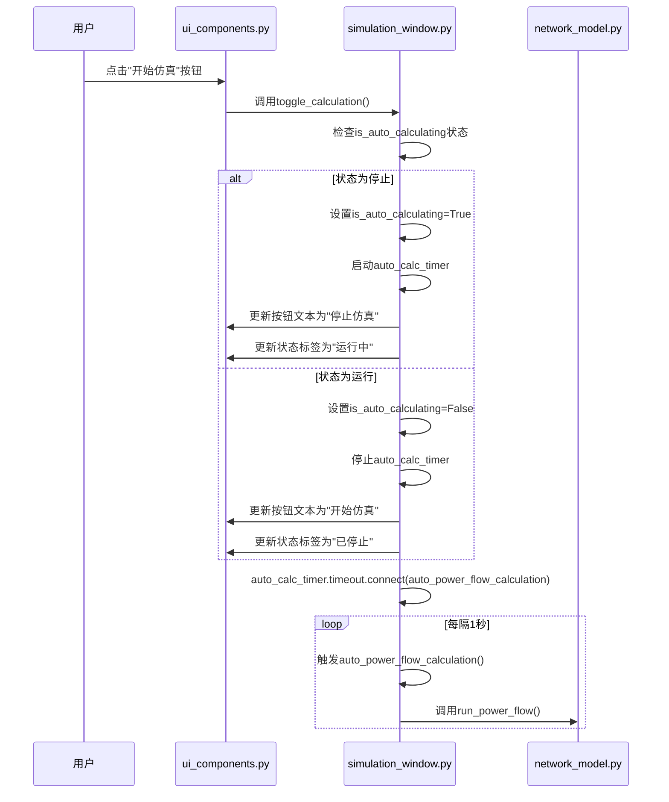
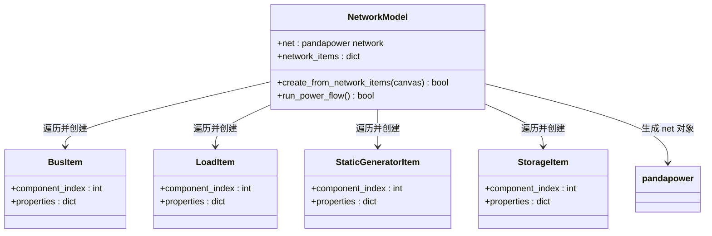
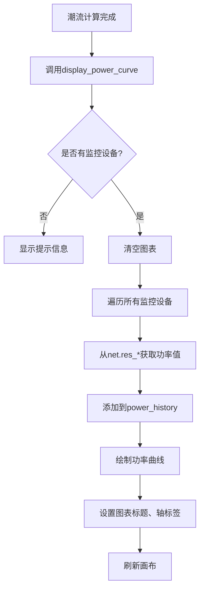

# 仿真分析

<cite>
**本文档引用的文件**   
- [simulation_window.py](file://src/components/simulation_window.py)
- [network_model.py](file://src/models/network_model.py)
- [power_monitor.py](file://src/components/power_monitor.py)
- [canvas.py](file://src/components/canvas.py)
- [ui_components.py](file://src/components/ui_components.py)
- [main_window.py](file://src/components/main_window.py)
</cite>

## 目录
1. [仿真窗口与自动计算机制](#仿真窗口与自动计算机制)
2. [网络模型与拓扑转换](#网络模型与拓扑转换)
3. [仿真结果的UI展示](#仿真结果的ui展示)
4. [代码级示例：潮流计算与错误处理](#代码级示例潮流计算与错误处理)

## 仿真窗口与自动计算机制

`simulation_window.py` 文件是仿真功能的核心，它继承自 `QMainWindow`，负责管理整个仿真界面的生命周期和交互逻辑。该窗口通过 `auto_calc_timer` 定时器实现了自动潮流计算的定时器机制。当用户点击“开始仿真”按钮时，`toggle_calculation` 方法被触发，它会根据当前状态启动或停止定时器。



**Diagram sources**
- [simulation_window.py](file://src/components/simulation_window.py#L69-L70)
- [simulation_window.py](file://src/components/simulation_window.py#L106-L114)
- [simulation_window.py](file://src/components/simulation_window.py#L1400-L1408)

**Section sources**
- [simulation_window.py](file://src/components/simulation_window.py#L34-L2604)

## 网络模型与拓扑转换

`network_model.py` 文件定义了 `NetworkModel` 类，它是连接图形化拓扑与 `pandapower` 计算引擎的桥梁。该类的核心方法是 `create_from_network_items`，它接收一个 `canvas` 对象，遍历画布上的所有图形组件，并将它们转换为 `pandapower` 的网络对象。

转换过程分为三个阶段：
1.  **创建母线 (Bus)**：首先遍历所有 `bus` 类型的组件，调用 `create_bus` 方法，将每个 `BusItem` 转换为 `pandapower` 的母线对象。
2.  **创建连接设备**：然后遍历除母线和电表外的所有其他设备（如负载、光伏、储能等）。对于每个设备，通过 `canvas.get_connected_buses` 方法找到其连接的母线索引，再调用相应的 `create_load`、`create_static_generator` 等方法创建设备。
3.  **创建电表 (Measurement)**：最后创建电表设备，确保所有被测量的元件都已存在于网络中。



**Diagram sources**
- [network_model.py](file://src/models/network_model.py#L14-L579)
- [canvas.py](file://src/components/canvas.py#L255-L271)

**Section sources**
- [network_model.py](file://src/models/network_model.py#L1-L710)

## 仿真结果的UI展示

仿真结果通过 `power_monitor.py` 模块在UI上进行展示。`PowerMonitor` 类负责收集、存储和可视化所有监控设备的功率数据。当潮流计算完成后，`display_power_curve` 方法会被调用，它会从 `network_model.net` 的结果数据框（如 `res_load`, `res_sgen`）中提取各设备的功率值，并在中央的 `matplotlib` 图表中绘制功率曲线。

用户可以通过设备树选择设备，并勾选“监控当前设备”复选框来将设备添加到监控列表。`PowerMonitor` 会维护一个 `monitored_devices` 集合和一个 `power_history` 字典，用于存储历史数据。图表会根据时间动态更新，展示设备功率随时间的变化。



**Diagram sources**
- [power_monitor.py](file://src/components/power_monitor.py#L188-L355)
- [simulation_window.py](file://src/components/simulation_window.py#L92-L93)

**Section sources**
- [power_monitor.py](file://src/components/power_monitor.py#L1-L784)

## 代码级示例：潮流计算与错误处理

以下是通过代码调用 `pandapower` 的 `runpp` 函数执行潮流计算并处理收敛失败情况的示例。此逻辑主要在 `network_model.py` 中实现。

```python
def run_power_flow(self):
    """运行潮流计算
        
    Returns:
        bool: 计算是否成功
    """
    try:
        pp.runpp(self.net)
        logger.info("潮流计算完成")
        return True
    except Exception as e:
        logger.error(f"潮流计算失败: {str(e)}")
        return False
```

**Section sources**
- [network_model.py](file://src/models/network_model.py#L583-L596)