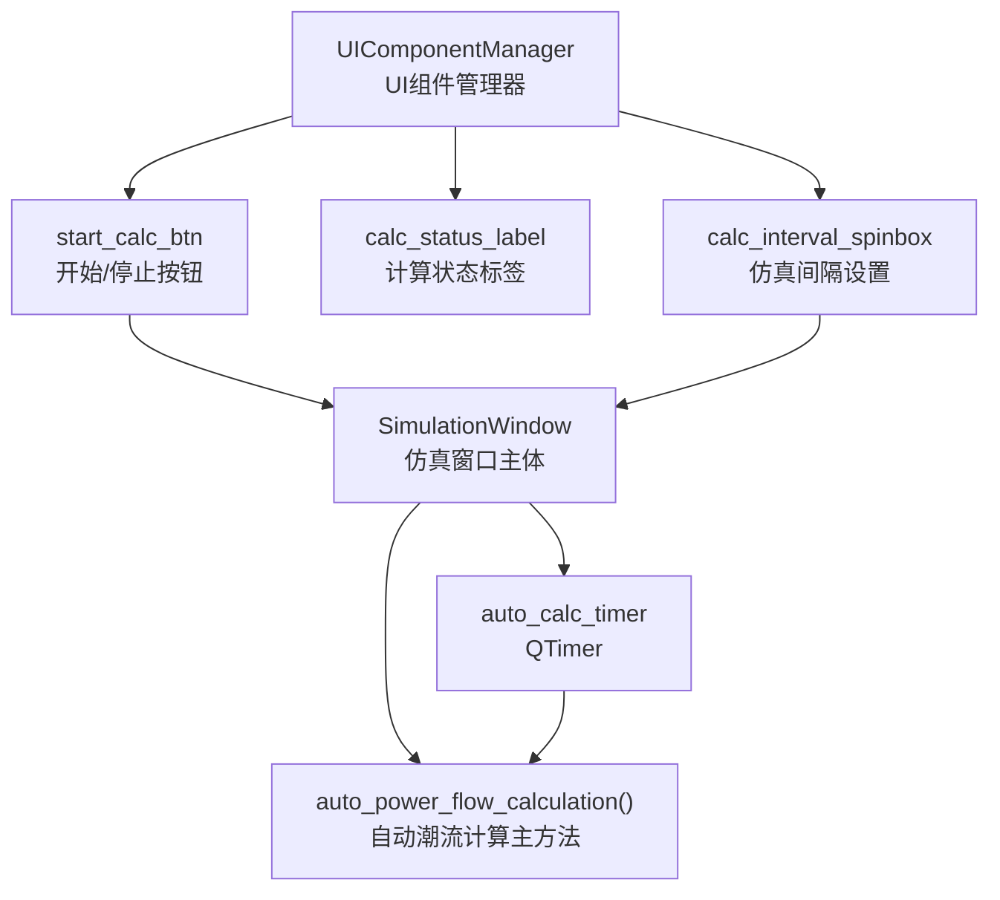
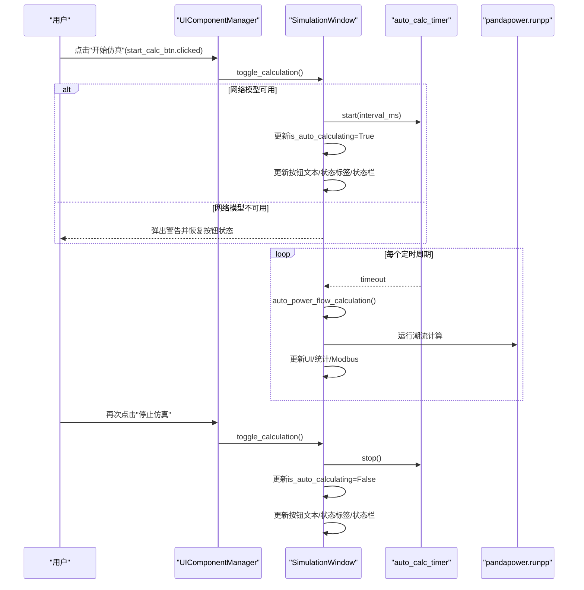
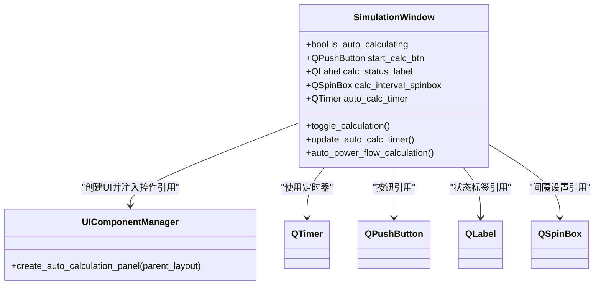
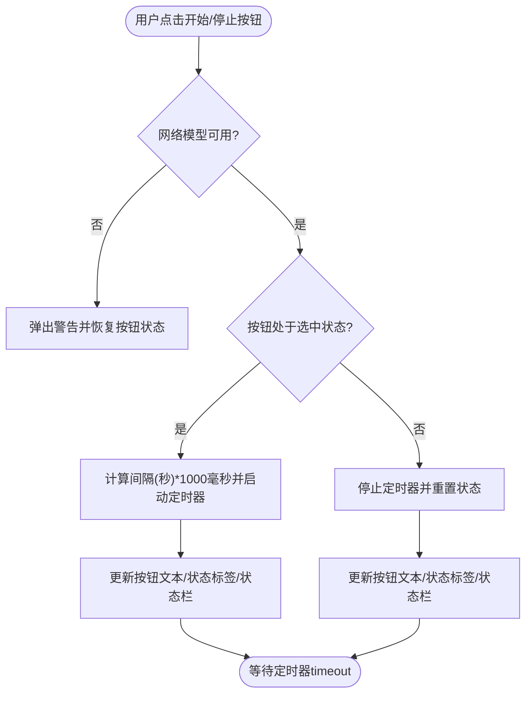
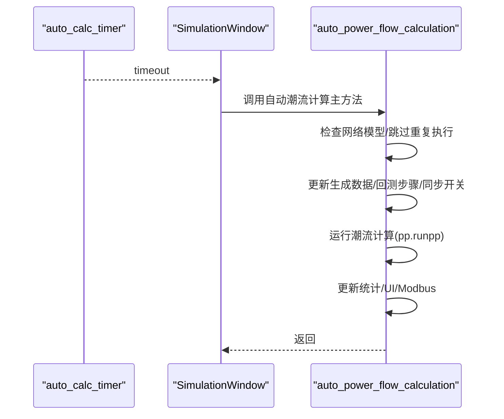
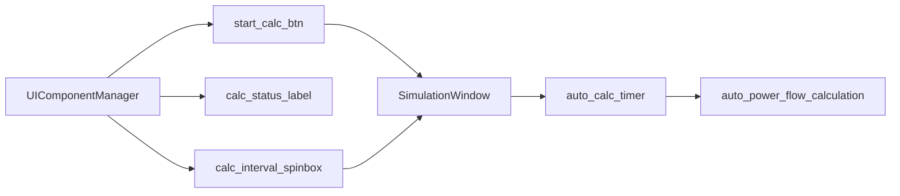

# 仿真控制

<cite>
**本文引用的文件**
- [simulation_window.py](file://src/components/simulation_window.py)
- [ui_components.py](file://src/components/ui_components.py)
</cite>

## 目录
1. [简介](#简介)
2. [项目结构](#项目结构)
3. [核心组件](#核心组件)
4. [架构总览](#架构总览)
5. [详细组件分析](#详细组件分析)
6. [依赖关系分析](#依赖关系分析)
7. [性能考量](#性能考量)
8. [故障排查指南](#故障排查指南)
9. [结论](#结论)

## 简介
本文件聚焦于pp_tool中“仿真控制”功能的实现，围绕SimulationWindow类与QTimer定时器机制展开，系统性说明：
- auto_calc_timer的初始化与timeout信号绑定auto_power_flow_calculation的实现细节
- 手动触发仿真计算的UI逻辑：开始/停止仿真按钮的状态切换、计算状态标签的更新
- 如何通过start_calc_btn的clicked信号触发仿真流程
- 提供代码片段路径，帮助读者定位关键实现位置

## 项目结构
仿真控制功能主要分布在两个模块：
- SimulationWindow：仿真窗口主体，包含定时器、自动计算主流程、UI状态管理等
- UIComponentManager：负责创建设备树面板与“仿真控制”面板，包括开始/停止按钮、状态标签、仿真间隔设置等

**图示来源**
- [simulation_window.py](file://src/components/simulation_window.py#L68-L71)
- [simulation_window.py](file://src/components/simulation_window.py#L1895-L1921)
- [ui_components.py](file://src/components/ui_components.py#L107-L155)

**章节来源**
- [simulation_window.py](file://src/components/simulation_window.py#L68-L71)
- [ui_components.py](file://src/components/ui_components.py#L107-L155)

## 核心组件
- SimulationWindow：负责仿真窗口生命周期、定时器管理、自动计算主流程、UI状态更新、Modbus通信控制等
- UIComponentManager：负责创建设备树面板与“仿真控制”面板，包括按钮、状态标签、间隔设置等

关键实现要点：
- auto_calc_timer在SimulationWindow构造函数中创建并绑定timeout到auto_power_flow_calculation
- toggle_calculation处理开始/停止按钮逻辑，更新按钮文本、状态标签与状态栏消息
- update_auto_calc_timer在间隔变更时动态调整定时器

**章节来源**
- [simulation_window.py](file://src/components/simulation_window.py#L68-L71)
- [simulation_window.py](file://src/components/simulation_window.py#L1882-L1921)
- [ui_components.py](file://src/components/ui_components.py#L107-L155)

## 架构总览
仿真控制的总体流程如下：
- 用户在“仿真控制”面板点击“开始仿真”，触发toggle_calculation
- 若网络模型可用，启动auto_calc_timer，设置is_auto_calculating为True，并更新UI状态
- 定时器timeout信号触发auto_power_flow_calculation，执行潮流计算与数据更新
- 用户可随时点击“停止仿真”，停止定时器并恢复UI状态

**图示来源**
- [ui_components.py](file://src/components/ui_components.py#L117-L120)
- [simulation_window.py](file://src/components/simulation_window.py#L1895-L1921)
- [simulation_window.py](file://src/components/simulation_window.py#L2526-L2601)

## 详细组件分析

### SimulationWindow类与QTimer定时器机制
- auto_calc_timer初始化与绑定
  - 在构造函数中创建QTimer实例，并将timeout信号连接到auto_power_flow_calculation
  - 初始is_auto_calculating为False，默认不自动启动
  - 参考路径：[simulation_window.py](file://src/components/simulation_window.py#L68-L71)，[simulation_window.py](file://src/components/simulation_window.py#L104-L114)

- auto_power_flow_calculation自动计算主流程
  - 每个定时周期内执行：检查网络模型、跳过重复计算、更新生成数据、回测步骤、同步开关状态、运行潮流计算、更新统计与UI、更新Modbus数据
  - 包含异常处理与finally重置计算状态标志，避免重复执行
  - 参考路径：[simulation_window.py](file://src/components/simulation_window.py#L2526-L2601)

- update_auto_calc_timer动态调整定时器
  - 当is_auto_calculating为True时，先stop再以新间隔start，保证立即生效
  - 参考路径：[simulation_window.py](file://src/components/simulation_window.py#L1882-L1894)

- toggle_calculation手动启停逻辑
  - 开始仿真：计算interval_ms并start，更新按钮文本、状态标签、状态栏消息，记录日志
  - 停止仿真：stop并重置状态，恢复按钮文本与状态标签
  - 参考路径：[simulation_window.py](file://src/components/simulation_window.py#L1895-L1921)

**图示来源**
- [simulation_window.py](file://src/components/simulation_window.py#L68-L71)
- [simulation_window.py](file://src/components/simulation_window.py#L1882-L1921)
- [ui_components.py](file://src/components/ui_components.py#L107-L155)

**章节来源**
- [simulation_window.py](file://src/components/simulation_window.py#L68-L71)
- [simulation_window.py](file://src/components/simulation_window.py#L1882-L1921)
- [simulation_window.py](file://src/components/simulation_window.py#L2526-L2601)
- [ui_components.py](file://src/components/ui_components.py#L107-L155)

### 手动触发仿真计算的UI逻辑
- 开始/停止仿真按钮
  - start_calc_btn为可切换按钮，初始未选中；点击后进入toggle_calculation
  - 参考路径：[ui_components.py](file://src/components/ui_components.py#L117-L120)

- 计算状态标签
  - calc_status_label用于显示“仿真状态: 运行中/已停止”
  - 参考路径：[ui_components.py](file://src/components/ui_components.py#L139-L140)

- 仿真间隔设置
  - calc_interval_spinbox范围1-60秒，valueChanged连接update_auto_calc_timer
  - 参考路径：[ui_components.py](file://src/components/ui_components.py#L144-L151)

- UI状态更新流程
  - 开始仿真：按钮文本改为“停止仿真”，状态标签改为“运行中”，状态栏提示“仿真已启动”
  - 停止仿真：按钮文本改为“开始仿真”，状态标签改为“已停止”，状态栏提示“仿真已停止”
  - 参考路径：[simulation_window.py](file://src/components/simulation_window.py#L1895-L1921)

**图示来源**
- [simulation_window.py](file://src/components/simulation_window.py#L1895-L1921)
- [ui_components.py](file://src/components/ui_components.py#L117-L151)

**章节来源**
- [ui_components.py](file://src/components/ui_components.py#L117-L151)
- [simulation_window.py](file://src/components/simulation_window.py#L1895-L1921)

### 定时器timeout到自动计算的调用链
- 定时器初始化与绑定
  - 参考路径：[simulation_window.py](file://src/components/simulation_window.py#L68-L71)

- timeout触发auto_power_flow_calculation
  - 参考路径：[simulation_window.py](file://src/components/simulation_window.py#L2526-L2601)

- 定时器间隔动态调整
  - 参考路径：[simulation_window.py](file://src/components/simulation_window.py#L1882-L1894)

**图示来源**
- [simulation_window.py](file://src/components/simulation_window.py#L68-L71)
- [simulation_window.py](file://src/components/simulation_window.py#L2526-L2601)
- [simulation_window.py](file://src/components/simulation_window.py#L1882-L1894)

**章节来源**
- [simulation_window.py](file://src/components/simulation_window.py#L68-L71)
- [simulation_window.py](file://src/components/simulation_window.py#L1882-L1894)
- [simulation_window.py](file://src/components/simulation_window.py#L2526-L2601)

## 依赖关系分析
- 组件耦合
  - SimulationWindow依赖QTimer、pandapower、PowerMonitor、ModbusManager、DataControlManager等
  - UIComponentManager负责创建并注入start_calc_btn、calc_status_label、calc_interval_spinbox等控件引用
- 信号与槽
  - start_calc_btn.clicked -> toggle_calculation
  - calc_interval_spinbox.valueChanged -> update_auto_calc_timer
  - auto_calc_timer.timeout -> auto_power_flow_calculation

**图示来源**
- [ui_components.py](file://src/components/ui_components.py#L107-L155)
- [simulation_window.py](file://src/components/simulation_window.py#L68-L71)
- [simulation_window.py](file://src/components/simulation_window.py#L1882-L1921)

**章节来源**
- [ui_components.py](file://src/components/ui_components.py#L107-L155)
- [simulation_window.py](file://src/components/simulation_window.py#L68-L71)
- [simulation_window.py](file://src/components/simulation_window.py#L1882-L1921)

## 性能考量
- 防重复执行：auto_power_flow_calculation内部使用_is_calculating标志，若上一次计算尚未完成则直接返回，避免密集计算导致的资源争用
- 智能UI更新：通过计数器控制设备树与功率曲线的更新频率，降低UI刷新开销
- 批处理更新：批量更新生成数据、Modbus参数与统计数据，减少多次I/O与计算
- 定时器动态调整：update_auto_calc_timer在运行中时先stop再start，确保新间隔立即生效

**章节来源**
- [simulation_window.py](file://src/components/simulation_window.py#L2526-L2601)
- [simulation_window.py](file://src/components/simulation_window.py#L1882-L1894)

## 故障排查指南
- 现象：点击“开始仿真”无效或按钮状态异常
  - 检查网络模型是否可用；若不可用，toggle_calculation会弹出警告并恢复按钮状态
  - 参考路径：[simulation_window.py](file://src/components/simulation_window.py#L1895-L1921)

- 现象：定时器未按预期停止
  - 确认stop_calc_btn是否正确调用toggle_calculation；确认is_auto_calculating状态
  - 参考路径：[simulation_window.py](file://src/components/simulation_window.py#L1913-L1921)

- 现象：仿真间隔更改后未生效
  - 确认update_auto_calc_timer在运行中时会先stop再start；检查calc_interval_spinbox的valueChanged连接
  - 参考路径：[simulation_window.py](file://src/components/simulation_window.py#L1882-L1894)，[ui_components.py](file://src/components/ui_components.py#L144-L151)

- 现象：自动计算过程中UI卡顿
  - 检查_is_calculating标志是否正确设置；确认智能UI更新策略是否生效
  - 参考路径：[simulation_window.py](file://src/components/simulation_window.py#L2526-L2601)

**章节来源**
- [simulation_window.py](file://src/components/simulation_window.py#L1882-L1921)
- [simulation_window.py](file://src/components/simulation_window.py#L1882-L1894)
- [simulation_window.py](file://src/components/simulation_window.py#L2526-L2601)
- [ui_components.py](file://src/components/ui_components.py#L144-L151)

## 结论
- SimulationWindow通过QTimer实现了稳定的自动潮流计算循环，auto_calc_timer在构造时即完成初始化与绑定
- toggle_calculation与update_auto_calc_timer共同提供了灵活的手动启停与动态间隔调整能力
- UIComponentManager负责创建并注入关键控件，形成清晰的信号-槽连接，确保用户交互顺畅
- auto_power_flow_calculation内部采用防重复执行、批处理与智能UI更新等策略，兼顾性能与稳定性