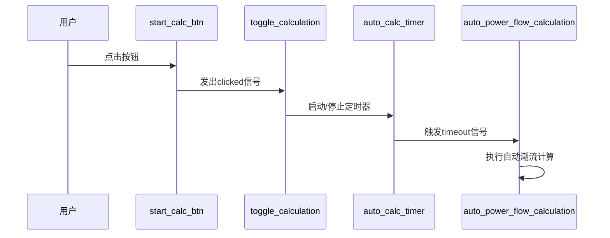
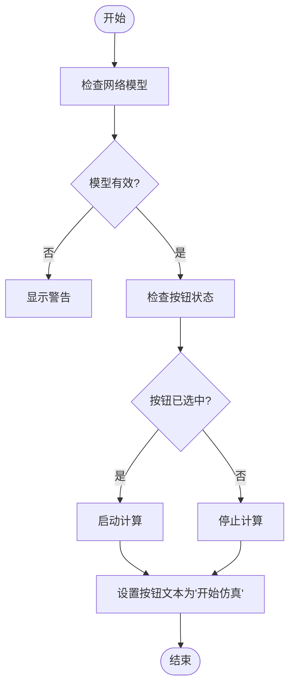
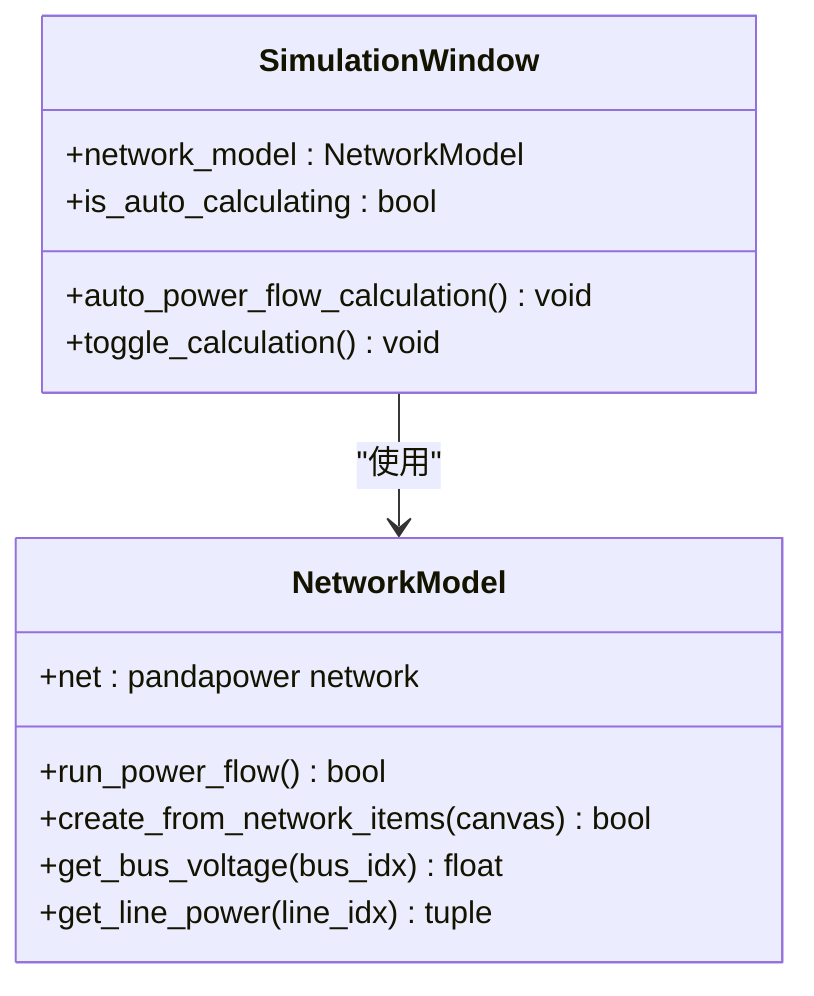

# 手动仿真控制

<cite>
**本文档引用的文件**   
- [simulation_window.py](file://src/components/simulation_window.py)
- [network_model.py](file://src/models/network_model.py)
- [ui_components.py](file://src/components/ui_components.py)
</cite>

## 目录
1. [引言](#引言)
2. [信号槽机制分析](#信号槽机制分析)
3. [按钮状态切换逻辑](#按钮状态切换逻辑)
4. [仿真状态标签更新](#仿真状态标签更新)
5. [手动潮流计算实现](#手动潮流计算实现)
6. [用户交互与UI同步](#用户交互与ui同步)

## 引言
本文档详细记录pp_tool中手动仿真控制功能的实现。重点分析SimulationWindow类中start_calc_btn按钮的信号槽机制，包括clicked信号如何触发on_start_auto_calculation方法。文档将解释按钮状态切换逻辑（文本在'开始仿真'和'停止仿真'之间切换）以及calc_status_label标签的动态更新机制。同时，说明手动触发单次潮流计算的实现方式，包括如何调用network_model的run_power_flow方法并处理计算结果。通过代码示例，展示用户交互事件如何转化为仿真控制指令，并描述相关UI元素的状态同步过程。

## 信号槽机制分析
在pp_tool的仿真控制功能中，信号槽机制是实现用户交互与系统响应的核心。该机制通过PySide6的信号与槽系统，将用户界面操作与后台计算逻辑紧密连接。

在SimulationWindow类的初始化过程中，通过UIComponentManager创建了自动计算控制面板，其中包含了关键的start_calc_btn按钮。该按钮的clicked信号通过connect方法与toggle_calculation槽函数建立了连接。当用户点击按钮时，clicked信号被触发，系统自动调用toggle_calculation方法，从而启动或停止仿真过程。

**Diagram sources**
- [ui_components.py](file://src/components/ui_components.py#L116-L121)
- [simulation_window.py](file://src/components/simulation_window.py#L1895-L1921)

**Section sources**
- [ui_components.py](file://src/components/ui_components.py#L107-L156)
- [simulation_window.py](file://src/components/simulation_window.py#L1895-L1921)

## 按钮状态切换逻辑
start_calc_btn按钮的状态切换逻辑实现了仿真控制的直观交互。按钮采用可检查（checkable）模式，通过其checked状态来区分"开始仿真"和"停止仿真"两种模式。

当按钮被点击时，toggle_calculation方法首先检查网络模型的可用性。如果网络模型存在，根据按钮的checked状态决定执行启动或停止操作。当checked为True时，系统启动自动计算；当checked为False时，系统停止自动计算。

按钮的文本显示会根据当前状态动态更新：当处于启动状态时，按钮文本显示为"停止仿真"；当处于停止状态时，按钮文本显示为"开始仿真"。这种直观的文本变化为用户提供了清晰的操作反馈。

**Diagram sources**
- [simulation_window.py](file://src/components/simulation_window.py#L1895-L1921)

**Section sources**
- [simulation_window.py](file://src/components/simulation_window.py#L1895-L1921)

## 仿真状态标签更新
calc_status_label标签用于实时显示仿真系统的当前状态，为用户提供即时的视觉反馈。该标签的更新与按钮状态切换同步进行，确保用户界面的一致性。

当用户启动仿真时，除了更新按钮文本外，系统还会将calc_status_label的文本更新为"仿真状态: 运行中"，同时在状态栏显示"仿真已启动"的消息。相反，当用户停止仿真时，标签文本会更新为"仿真状态: 已停止"，状态栏显示"仿真已停止"。

这种多层级的状态反馈机制增强了用户体验，使用户能够从多个位置获取系统状态信息。标签的更新是即时的，与按钮操作同步完成，避免了状态不一致的问题。

**Section sources**
- [simulation_window.py](file://src/components/simulation_window.py#L1895-L1921)

## 手动潮流计算实现
手动潮流计算功能通过调用network_model的run_power_flow方法实现。该方法封装了pandapower库的潮流计算功能，为上层应用提供了简洁的接口。

在SimulationWindow类中，auto_power_flow_calculation方法作为自动计算的主循环，定期调用run_power_flow方法执行潮流计算。该方法首先检查网络模型的可用性，然后执行计算，并根据计算结果更新UI状态。

当计算成功时，系统更新状态栏显示"潮流计算成功"；当计算失败时，捕获异常并显示错误信息。计算结果被用于更新功率曲线、设备状态等UI元素，形成完整的计算-反馈循环。

**Diagram sources**
- [network_model.py](file://src/models/network_model.py#L583-L596)
- [simulation_window.py](file://src/components/simulation_window.py#L2527-L2599)

**Section sources**
- [network_model.py](file://src/models/network_model.py#L583-L596)
- [simulation_window.py](file://src/components/simulation_window.py#L2527-L2599)

## 用户交互与UI同步
用户交互与UI同步是手动仿真控制功能的关键。系统通过一系列协调的更新操作，确保所有UI元素与当前仿真状态保持一致。

当用户点击"开始仿真"按钮时，系统执行以下同步操作：启动自动计算定时器、更新按钮文本为"停止仿真"、更新状态标签为"运行中"、在状态栏显示启动消息。这些操作几乎同时发生，为用户提供流畅的交互体验。

在自动计算过程中，系统定期更新设备树状态、功率曲线和各设备面板的实时数据。这种批量更新策略优化了性能，避免了频繁的UI刷新。当计算完成时，所有相关UI元素都会根据最新的计算结果进行更新，形成完整的闭环控制。

**Section sources**
- [simulation_window.py](file://src/components/simulation_window.py#L2527-L2599)
- [ui_components.py](file://src/components/ui_components.py#L107-L156)